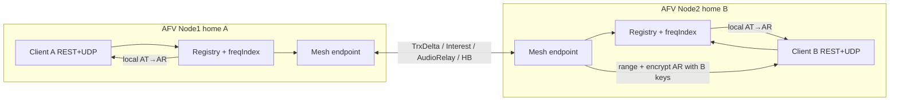

# AFV Multi-Node Mesh (PR-10 / KD-17)

| Field | Value |
|-------|--------|
| **Title** | AFV multi-node mesh — directory sync + AT frame relay |
| **Author** | openfsd design (implementer-ready) |
| **Date** | 2026-07-28 |
| **Status** | Draft (rev 3 — hard testing bar + residual review) |
| **Parent** | `docs/design/afv-server.md` (Clustering, KD-8/9/16/17, PR-10) |
| **Contract** | `docs/design/afv-mesh-implementer-prompt.md` |

---

## Overview

P0 openfsd AFV is a single-node REST + UDP CryptoDTO voice service (`internal/afv`). Multi-region or multi-host voice requires two or more AFV processes to hear each other without shipping client AEAD keys off-node and without putting Opus into rqlite.

This design specifies an **AFV-only mesh** under `internal/afv/` (not `internal/cluster`) that:

1. Keeps each voice client **sticky** on one home node (REST session create + UDP bind stay local).
2. Syncs a **remote transceiver directory** via `TrxSnapshot` / `TrxDelta` / `SessionLeave`.
3. Relays **opaque Opus + TX radio geometry** (`AudioRelay`) only to peers that advertised **Interest**.
4. On the remote node, runs the **existing local range model** and encrypts **AR** with that node’s **local** session keys only.

**Hard invariants:** AEAD keys never leave the home node. Opus never goes through rqlite/SQLite. `pkg/afvprotocol` remains pure wire (no mesh I/O). `internal/afv` must not import `internal/cluster`.

---

## Background & Motivation

### Current state (P0)

| Component | Path | Role |
|-----------|------|------|
| Wire (CryptoDTO, AT/AR/H/HA) | `pkg/afvprotocol/**` | Pure parse/serialize/AEAD |
| Session registry | `internal/afv/registry.go` | Tag/callsign/CID maps + single `RWMutex` |
| Freq spatial index | `internal/afv/index.go` | `freqHz → geo.CellKey → []trxRef` |
| Router | `internal/afv/router.go` | `routeAT` — local bound RX only |
| UDP path | `internal/afv/udp.go` | Decrypt AT → `routeAT` → encrypt AR → `WriteTo` |
| REST | `internal/afv/api.go` | auth, callsign POST/DELETE, transceivers POST |
| Config stubs | `internal/afv/config.go` | `AFV_CLUSTER_*` fields exist; **unused** |
| Process | `cmd/openfsd` `-afv` | Sibling-cancel with FSD/web |

Local A2A is proven (`TestUDPHAandA2A` in `api_test.go`, `TestRouteAT_A2A` in `router_test.go`). There is no cross-node path today: two AFV processes with clients on each never exchange radio state or audio.

### Pain points without mesh

- Multi-host deployments force all voice onto one node or break A2A across LB shards.
- Putting sessions/Opus in rqlite would add Raft latency and leak crypto material into the control plane.
- Reusing `internal/cluster` would violate the AFV import allowlist and mix high-rate voice with FSD claim/directory semantics (KD-8).

### Why this model

Sticky home + directory + AT relay (KD-9) preserves:

- Correct per-client AEAD (keys minted on home only).
- Existing range/router code path for **local** RX (no second range algorithm).
- Failure isolation: mesh death does not tear down local UDP sessions.

---

## Goals & Non-Goals

### Goals (PR-10)

1. Config-gated mesh (`AFV_CLUSTER_ENABLED=false` → identical P0 behavior).
2. Length-prefixed mesh frames (KD-17) with Hello/Heartbeat/Trx*/SessionLeave/AudioRelay/Interest.
3. **Memory mesh** two-node e2e (in-process) under `go test -race ./internal/afv/...` — **merge acceptance bar**.
4. Correct Interest coverage (max hearable TX range on frequency), `isATC` on AudioRelay, Interest dirty on UDP bind, post-Hello Snapshot+Interest sequence.
5. Non-blocking AudioRelay enqueue; **drop-oldest** at depth 256.
6. Interest filter so AudioRelay is not a full mesh flood.
7. Fail-closed auth and startup validation.
8. Ops note: sticky LB required; keys home-local.
9. **TCP transport** (`mesh_tcp.go`) is **best-effort in the same PR / cut line for PR-10b** — does **not** block merge if memory e2e + framing + wiring are green.
10. **Hard testing bar** (product owner): near-100% unit coverage of mesh modules (≥95% new mesh files; frame codecs ≥98%); deep MemoryMesh real-world e2e list in Testing Plan is **mandatory for merge**, not aspirational.
11. **Production cluster without TCP:** if `AFV_CLUSTER_ENABLED=true` and TCP mesh is not built in this binary, startup **fails closed** with a clear error — never no-op, never auto-MemoryMesh in production.

### Non-goals

| Non-goal | Notes |
|----------|--------|
| Global callsign claim / multi-region uniqueness | Dual-login possible across nodes; document |
| Dynamic peer discovery / membership | Static `AFV_CLUSTER_PEERS` only |
| Opus or sessions in rqlite/SQLite | Ephemeral memory only |
| Import `internal/cluster` / server / session / postoffice / web | Hard fail in `scripts/check-import-graph.sh` |
| CryptoDTO client wire changes | Client protocol frozen |
| ATIS / terrain / boring-web station UI | Separate tracks |
| Production multi-region ops claims | Beyond 2-node e2e + sticky LB note |
| Cross-coupling XC (PR-9) | Mesh **must** carry `isXC` for future use; if XC absent, route primary only and never XC-again on `isXC` |

---

## Proposed Design

### High-level architecture



```text
Client A ──REST+UDP──► AFV Node1 (home A)
                          │ local AT→AR for local RX
                          │ mesh: TrxDelta / Interest / AudioRelay
                          ▼
                       AFV Node2 (home B)
                          │ range model local only
Client B ◄──UDP AR───────┘ encrypt with B's ClientRxKey
```

### Data flow: cross-node A2A

```mermaid
sequenceDiagram
  participant A as Client A (node1)
  participant N1 as AFV Node1
  participant Mesh as AFV mesh
  participant N2 as AFV Node2
  participant B as Client B (node2)

  Note over N1,N2: Sessions created locally; TrxDelta + Interest exchanged
  A->>N1: UDP AT (encrypted with A's keys)
  N1->>N1: Decrypt AT; routeAT local
  N1->>Mesh: Enqueue AudioRelay (opaque Opus + TX geometry)
  Mesh->>N2: AudioRelay frame
  N2->>N2: Synthetic TX; route against local bound sessions
  N2->>B: UDP AR (encrypted with B's ClientRxKey)
```

### Package and file layout

All mesh code lives in package `afv` (no new importable subpackage — keeps Agents.md / import-graph simple).

```text
internal/afv/
  mesh.go            # Mesh interface, shared types, Server hooks, interest helpers
  mesh_frame.go      # Frame encode/decode + payload codecs
  mesh_frame_test.go # Goldens per type; oversized reject
  mesh_memory.go     # MemoryHub + MemoryMesh (tests / in-process)
  mesh_memory_test.go
  mesh_tcp.go        # TCP listen/dial, Hello, queues, HB (best-effort; not merge-blocking)
  mesh_tcp_test.go   # Optional localhost; thin OK if present
  mesh_queue_test.go # Drop-oldest unit
  mesh_interest_test.go # Interest radius, bind-dirty, cap priority
  mesh_e2e_test.go   # Two-node memory A2A in/out of range + ATC radius
  mesh_config.go     # Optional: ValidateClusterConfig + peer parse
                     # (or keep in config.go / mesh.go)

  # Existing integration touchpoints (minimal edits):
  config.go          # Already has AFV_CLUSTER_*; add Validate
  server.go          # Run: start mesh sibling; inject Mesh into Server
  bootstrap.go       # Fail startup if cluster enabled + invalid config
  registry.go        # Hooks after create/remove/trx update; remote dir store
  reaper.go          # SessionLeave on reap
  router.go          # routeRemoteAT or routeSyntheticTX for inbound relay
  udp.go             # handleAudioTx → enqueue AudioRelay
  api.go             # After create/delete/trx → mesh publish
```

**Do not** add mesh types to `pkg/afvprotocol`.

### Conceptual mirror of `internal/cluster` (do not import)

| FSD cluster idea | AFV mesh analogue |
|------------------|-------------------|
| `EncodeFrame` / `DecodeFrame` | Same framing shape; **own copy** in `mesh_frame.go` |
| Outbound peer queues | **Voice** depth 256 drop-oldest (AudioRelay); **control** depth 64 drop-oldest (Snapshot/Delta/Leave/Interest/HB); writer prioritizes control |
| Hello + static PSK + peer allowlist | Same trust root and Hello payload shape; comparison upgraded to **constant-time** (FSD uses `!=`) |
| Interest summary | `(freqHz, cellKey)` sets, not AABB boxes |
| MemoryHub | `afv.MemoryHub` for two-node tests |
| Callsign claim / OwnerNode | **Not implemented** |

---

## Key Decisions

| ID | Decision | Rationale |
|----|----------|-----------|
| **M-1** | Separate AFV mesh under `internal/afv`; zero imports of `internal/cluster` | KD-8; import graph; rate/failure domains |
| **M-2** | Sticky home + directory + AT relay; keys never on mesh | KD-9; correct crypto |
| **M-3** | Hello auth = **constant-time compare of shared PSK** (not HMAC-SHA256) | Same trust root + Hello payload shape as FSD mesh; comparison **upgraded** to constant-time (FSD uses non-CT `!=`); fail-closed; OQ-8 closed for PR-10 |
| **M-4** | Payload codec = **length-prefixed binary** (u16 strings, BE integers, IEEE-754 f64 as BE u64 bits), not msgpack/JSON | Avoids pulling msgpack into mesh; independent of client DTOs; easy goldens |
| **M-5** | Interest = set of `(freqHz, CellKey)`; rate ≤ 2 Hz; cap 4096; coverage = **max hearable TX range on that frequency** (not RX `IsATC`) | Sender filters by TX cell; pilot RX must advertise ATC-class radius on non-UNICOM or cross-node ATC mute |
| **M-6** | Outbound: depth **256** voice queue **drop-oldest AudioRelay**; separate small control queue (or reserved slots) so TrxDelta/Interest are not starved by voice | Never block `handleAudioTx`; avoid stale directory from drop-newest control |
| **M-7** | Remote directory is **not** merged into local `freqIndex` used by `routeAT` for local clients | Local route stays pure; remote path is separate synthetic route |
| **M-8** | Inbound AudioRelay runs **local range only** against **local bound** sessions using **`AudioRelay.IsATC`** (wire field) | Same math as P0; encrypt with local keys; no dir lookup required for class |
| **M-9** | Peer death after 15s without HB → purge remote dir entries + peer Interest for that peer; local sessions untouched; on reconnect re-run post-Hello sequence | Conservative fail-closed |
| **M-10** | At most **4 remote peers** per node (`len(AFV_CLUSTER_PEERS) ≤ 4` → ≤5-node static mesh) | First-cut caution; fan-out cost scales with remotes |
| **M-11** | **Merge accept = memory mesh e2e + framing + wiring + hard Testing Plan bar**; TCP best-effort same PR / cut to PR-10b. **Without TCP in-tree:** `ENABLED=true` fails startup with clear error | Aligns parent PR-10; no half-enable; Interest correctness before TCP polish |
| **M-12** | Carry `isATC` + `isXC` on AudioRelay; if `isXC`, never XC-again | Range class correct without dir; future PR-9 safety |
| **M-13** | Dual-login across nodes allowed; no cluster claim | Explicit non-goal |
| **M-14** | Deadlock: never hold registry/index/remote-dir lock across mesh send or UDP `WriteTo` | KD-16 |
| **M-15** | Interest dirty on **successful first BindUDP** only (not every UDP touch), trx update, and session leave/reap | Client order: POST trx unbound → first UDP binds; avoid per-packet dirty |
| **M-16** | Post-Hello (and every re-auth): send TrxSnapshot then Interest (even if empty); apply peer frames as they arrive | Cold-join / reconnect A2A must not depend on fixed sleeps alone |
| **M-17** | MemoryMesh applies Interest **synchronously** before `PublishInterest` returns; e2e uses `PeerWants` / `InterestedPeers` as barrier | No sleep-only e2e; simplest observation API |
| **M-18** | Hard testing/coverage bar is **merge-blocking** (see Testing Plan) | Product owner mandate: near-100% mesh unit + deep real-world e2e |

### Hello auth scheme (normative — M-3)

**Chosen: constant-time PSK compare**, not HMAC-nonce.

**Trust root and payload shape** match FSD mesh Hello (`nodeID` + PSK strings). FSD compares with non-constant-time `psk != cfg.PSK`; AFV **upgrades** comparison to constant-time. Do not claim byte-identical security properties with FSD—only the same operational trust model (static peers + shared secret on a private network).

**Hello payload (binary):**

```text
HelloPayload =
  [u16 BE len][nodeID UTF-8]
  [u16 BE len][psk UTF-8]
```

**Rules:**

1. First frame on a TCP connection **must** be type Hello. Any other type → close.
2. Both sides send Hello immediately after dial/accept (mutual).
3. Verify `subtle.ConstantTimeCompare([]byte(localPSK), []byte(peerPSK)) == 1` **and** equal length (if lengths differ, compare against dummy and reject — avoid early length leak in logs; always log only “hello auth failed”).
4. Peer `nodeID` must be in static allowlist (`AFV_CLUSTER_PEERS` + self) and ≠ self.
5. Memory mesh may skip Hello on the wire but still requires matching PSK in constructor config when “auth” mode is tested; production path always Hello.

**Why not HMAC for first cut:** Nonce bookkeeping adds reconnect races without material threat-model gain under the static-peer + shared-secret trust root. HMAC can be a PR-10b upgrade without changing type numbers (extend Hello payload with nonce+mac fields if needed).

**Document in code:** package comment on `mesh_frame.go` / Hello encoder.

---

## Mesh framing (KD-17)

### Wire

```text
Frame = [u32 BE length][u8 type][payload]
length = 1 + len(payload)   // type byte included
max payload = 1 MiB (MaxMeshPayload = 1 << 20)
max total after length word = 1 + MaxMeshPayload
```

Mirror `internal/cluster.EncodeFrame` / `DecodeFrame` logic **locally** (do not call cluster).

```go
// mesh_frame.go
const (
	MeshTypeHello       byte = 1
	MeshTypeHeartbeat   byte = 2
	MeshTypeTrxSnapshot byte = 10
	MeshTypeTrxDelta    byte = 11
	MeshTypeSessionLeave byte = 12
	MeshTypeAudioRelay  byte = 20
	MeshTypeInterest    byte = 30

	MaxMeshPayload = 1 << 20
)

type MeshFrame struct {
	Type    byte
	Payload []byte
}

func EncodeMeshFrame(w io.Writer, typ byte, payload []byte) error
func DecodeMeshFrame(r io.Reader) (MeshFrame, error) // rejects oversize / n==0
```

### Frame type payloads

All multi-byte integers **big-endian**. Strings: `u16 len + bytes` (max 1024 for nodeID/callsign/tag fields). Binary blobs: `u32 len + bytes`.

**Float encoding (normative):** lat/lon/alt fields marked `f64` are IEEE-754 **binary64**, encoded as the **big-endian `uint64` bit pattern** of `math.Float64bits(v)` (decode with `math.Float64frombits`). Local helpers `encodeF64` / `decodeF64` (copy pattern from FSD cluster; **do not import** `internal/cluster`).

#### Type 1 — Hello

See M-3 above.

#### Type 2 — Heartbeat

```text
HeartbeatPayload = [u64 BE unix_ms]   // sender wall clock; optional diagnostics only
```

Empty payload also accepted (liveness only).

#### Type 10 — TrxSnapshot

Full remote directory **for the origin node** (sender’s local sessions’ radios). **Required** after every successful Hello / re-auth (see post-Hello sequence).

```text
TrxSnapshot =
  [u16 BE len][originNodeID]
  [u32 BE nSessions]
  repeated SessionBlock:
    [u16][callsign]
    [u16][channelTag]          // informational for logs; not a crypto secret
    [u8 isATC]
    [u16 nTrx]
    repeated Trx:
      [u16 id][u32 freqHz][f64 lat][f64 lon][f64 altM]
```

**No keys.** **Normative leave key: callsign (upper) + originNode**. ChannelTag is informational only.

#### Type 11 — TrxDelta

Incremental upsert for one session’s transceiver list (replace-all for that callsign on origin).

```text
TrxDelta =
  [u16][originNodeID]
  [u16][callsign]
  [u8 isATC]
  [u16 nTrx]
  repeated Trx (same as snapshot)
```

Empty `nTrx` means “session still present but no radios” (still indexed as empty).

**When published:** only after a successful local `UpdateTransceivers` (not on bare create). See Integration §3.

#### Type 12 — SessionLeave

```text
SessionLeave =
  [u16][originNodeID]
  [u16][callsign]
```

Receiver deletes remote dir entry for `(originNode, callsign)`.

#### Type 20 — AudioRelay

```text
AudioRelay =
  [u16][originNodeID]
  [u16][callsign]              // original speaker
  [u32][audioSeq]              // AT SequenceCounter
  [u8 lastPacket]              // 0/1
  [u8 isATC]                   // 0/1; session-level TX class (M-12) — required for range
  [u8 isXC]                    // 0/1; PR-9 loop guard
  [u32][audioLen][audioBytes]  // opaque Opus
  [u16 nTx]
  repeated TxRadio:
    [u16 txID][u32 freqHz][f64 lat][f64 lon][f64 altM]
```

**`isATC` normative source (home node):** copy from the **local `VoiceSession.IsATC`** at TX time (set by `UpdateTransceivers` via `IsATC(callsign, len(fullSessionTrxList))` — **not** `len(AT.Transceivers)` / `len(TxRadios)` alone). Remote node must use `AudioRelay.IsATC` in `routeSyntheticTX` and **must not** recompute class from callsign + `nTx` on the relay.

**Forbidden fields:** ClientTxKey, ClientRxKey, ChannelTag keys, JWT, passwords.

Max audio bytes: clamp to `min(AFV_MAX_DATAGRAM, 8192)` class size (e.g. reject/drop if `audioLen > 8192`).

#### Type 30 — Interest

```text
Interest =
  [u16][nodeID]
  [u32 nEntries]
  repeated Entry:
    [u32 freqHz][i32 iLat][i32 iLon]   // geo.CellKey components
```

Receiver replaces entire interest set for that `nodeID`.

---

## Concrete Go interfaces

```go
// mesh.go — core surface used by Server / Registry hooks

// Mesh is the AFV inter-node fabric. Implementations: MemoryMesh, TCPMesh.
// All publish methods must be non-blocking w.r.t. the UDP hot path
// (enqueue or drop; never hold registry locks while calling these from hooks
// that still hold locks — call after unlock).
type Mesh interface {
	Start(ctx context.Context) error
	Stop() error
	NodeID() string

	// Directory publish (local → peers).
	PublishTrxSnapshot()                         // build from local registry snapshot
	PublishTrxDelta(callsign string, isATC bool, trxs []Transceiver)
	PublishSessionLeave(callsign string)

	// Voice relay (local → interested peers only).
	// audio must be a private copy; Mesh must not retain caller's buffer
	// after EnqueueAudioRelay returns.
	EnqueueAudioRelay(relay AudioRelay) // non-blocking; drop-oldest per peer

	// Interest (local RX need → peers).
	PublishInterest(entries []InterestEntry)

	// PeerInterest reports whether peer wants this freq/cell (for TX fan-out).
	PeerWants(peerID string, freqHz uint32, cell geo.CellKey) bool
	// InterestedPeers returns peer IDs that want any of the given keys.
	InterestedPeers(keys []FreqCell) []string

	// Callbacks registered before Start.
	OnAudioRelay(fn func(fromNode string, r AudioRelay))
	OnPeerDead(fn func(nodeID string))
}

// Interest observation for e2e (M-17):
// MemoryMesh applies peer Interest updates synchronously inside the
// delivery path such that after peer.PublishInterest returns, the local
// mesh's PeerWants / InterestedPeers already reflect the new set.
// E2E MUST wait using PeerWants/InterestedPeers (poll with short timeout)
// or an optional test helper WaitPeerInterest(peerID, pred) — not sleep-only.
// TCPMesh may apply Interest on the read loop asynchronously; production
// does not need WaitPeerInterest. OnInterest callback is optional and not
// required on the Mesh interface for PR-10 if MemoryMesh is synchronous.

type FreqCell struct {
	FreqHz uint32
	Cell   geo.CellKey
}

type InterestEntry struct {
	FreqHz uint32
	ILat   int32
	ILon   int32
}

type AudioRelay struct {
	OriginNode      string
	Callsign        string
	SequenceCounter uint32
	LastPacket      bool
	IsATC           bool // session-level TX class; required for ClassifyRange on remote
	IsXC            bool
	Audio           []byte
	TxRadios        []RelayTxRadio
}

type RelayTxRadio struct {
	TxID     uint16
	FreqHz   uint32
	LatDeg   float64
	LonDeg   float64
	HeightM  float64
}

// Remote directory (per-node view of peers' radios) — owned by Server,
// updated by mesh inbound handlers. NOT load-bearing for range class
// (isATC is on AudioRelay). Required for: peer-death purge bookkeeping,
// optional debug/ops; may be used later for UI. Implement fully enough
// that ApplySnapshot/Delta/Leave/RemoveNode are correct under race tests.
type RemoteDirectory interface {
	ApplySnapshot(origin string, sessions []RemoteSession)
	ApplyDelta(origin, callsign string, isATC bool, trxs []Transceiver)
	ApplyLeave(origin, callsign string)
	RemoveNode(origin string)
}

type RemoteSession struct {
	Callsign string
	IsATC    bool
	Trxs     []Transceiver
}
```

### Memory mesh

```go
// mesh_memory.go
type MemoryHub struct { /* map[nodeID]*MemoryMesh; optional delay */ }

type MemoryMesh struct {
	// implements Mesh
	// delivers frames via direct method calls / channels (no TCP)
	// voiceCh 256 + ctrlCh 64 drop-oldest so both queue paths are testable
	// Interest apply is synchronous (M-17): after PublishInterest returns,
	// peer.PeerWants already sees the update
}
```

**Test construction pattern:**

```go
hub := NewMemoryHub()
m1, _ := NewMemoryMesh(hub, MeshConfig{NodeID: "n1", PSK: "x", PeerIDs: []string{"n1","n2"}})
m2, _ := NewMemoryMesh(hub, MeshConfig{NodeID: "n2", PSK: "x", PeerIDs: []string{"n1","n2"}})
// attach to two Servers via SetMesh; e2e waits on m2.PeerWants("n1", freq, cell)
```

### TCP mesh

```go
// mesh_tcp.go
type TCPMeshConfig struct {
	NodeID     string
	ListenAddr string
	Peers      []MeshPeerAddr // id + host:port; exclude self
	PSK        string
	// HeartbeatInterval default 2s
	// PeerDeathAfter default 15s
	// OutboundQueue  default 256
	// MaxPeers       default 4
	Logger *slog.Logger
}

// Dial rule (avoid double TCP): only dial peers with NodeID > self (string compare),
// same as internal/cluster/tcp_mesh.go. Accept path handles the reverse.
// MaxPeers: at most 4 remote peers (len(Peers) ≤ 4).
```

**per-peer queues (normative — M-6):**

```go
type peerConn struct {
	nodeID   string
	conn     net.Conn
	voiceCh  chan meshJob // cap 256 — AudioRelay only; drop-oldest
	ctrlCh   chan meshJob // cap 64  — Snapshot/Delta/Leave/Interest/HB
	lastHB   time.Time
	stop     chan struct{}
}

// Writer drains ctrlCh with priority over voiceCh when both non-empty
// (or fair-interleave ctrl first each loop). Never block UDP callers:
//
// EnqueueAudioRelay: non-blocking on voiceCh; if full, drop oldest voice
// job then push (drop-oldest). Copy payload before enqueue.
//
// Enqueue control: non-blocking on ctrlCh; if full, drop-oldest control
// (not drop-newest) so a stuck stream of TrxDeltas still eventually
// delivers the latest after Snapshot resync on reconnect. On control
// drop: atomic counter + slog.Debug; reconnect path re-sends Snapshot+Interest.
//
// Single writer goroutine performs TCP Write; no registry locks held.
```

**MemoryMesh:** same queue semantics for AudioRelay (depth 256 drop-oldest) so unit tests exercise drop path without TCP.

---

## Integration points (existing code)

### 1. Config validation (`config.go` / `bootstrap.go`)

```go
func (c *Config) ValidateCluster() error {
	if !c.ClusterEnabled {
		return nil
	}
	if strings.TrimSpace(c.ClusterNodeID) == "" {
		return fmt.Errorf("AFV_CLUSTER_NODE_ID required when AFV_CLUSTER_ENABLED=true")
	}
	if strings.TrimSpace(c.ClusterListen) == "" {
		return fmt.Errorf("AFV_CLUSTER_LISTEN required when AFV_CLUSTER_ENABLED=true")
	}
	if strings.TrimSpace(c.ClusterPSK) == "" {
		return fmt.Errorf("AFV_CLUSTER_PSK required when AFV_CLUSTER_ENABLED=true")
	}
	peers, err := parseClusterPeers(c.ClusterPeers) // "id=host:port,id2=host:port2"
	if err != nil {
		return err
	}
	if len(peers) == 0 {
		return fmt.Errorf("AFV_CLUSTER_PEERS required when AFV_CLUSTER_ENABLED=true")
	}
	if len(peers) > 4 {
		return fmt.Errorf("AFV_CLUSTER_PEERS: max 4 remote peers, got %d", len(peers))
	}
	// self must not appear as peer; peer ids unique; addrs non-empty
	return nil
}
```

**Peer cap wording (M-10):** `AFV_CLUSTER_PEERS` lists **remote** peers only. `len(peers) ≤ 4` means **at most 4 remote peers per node** (a static mesh of **≤ 5 processes** including self). Not “4 total nodes.”

**`NewDefault` / production cluster enablement (normative — M-11):**

| Situation | Behavior |
|-----------|----------|
| `ClusterEnabled=false` | No mesh; P0 only |
| `ClusterEnabled=true` + `ValidateCluster` fails | **Fail startup** with clear field errors — no silent no-op |
| `ClusterEnabled=true` + valid config + **TCPMesh built** (best-effort PR-10 or PR-10b) | Construct `TCPMesh`, attach to Server, Run starts mesh sibling |
| `ClusterEnabled=true` + valid config + **TCP not in this binary** | **Fail startup** with e.g. `AFV_CLUSTER_ENABLED=true but AFV mesh TCP is not built in this binary (use tests with SetMesh(MemoryMesh) or enable PR-10b TCP)` |

**Never:** silently ignore `ENABLED=true`; never wire production `NewDefault` to `MemoryMesh`; never install a no-op mesh that pretends cluster is on.

**Tests only:** `New` + `SetMesh(MemoryMesh)` exercises the full data path without env/TCP.

Optional knobs (hardcoded constants first cut unless env already exists):

| Knob | Default |
|------|---------|
| Heartbeat interval | 2s |
| Peer death | 15s |
| Voice outbound queue | 256 (drop-oldest AudioRelay) |
| Control outbound queue | 64 (drop-oldest control) |
| Interest max entries | 4096 |
| Interest min interval | 500ms (≤ 2 Hz) |
| Max **remote** peers | 4 |

### 2. `Server` fields and `Run` (`server.go`)

```go
type Server struct {
	// ... existing ...
	mesh   Mesh            // nil when cluster disabled
	remote *remoteDir      // peer transceiver view; nil if no mesh
}

// New / test helper:
func (s *Server) SetMesh(m Mesh) // tests inject MemoryMesh before Run
```

**`Run` lifecycle (sibling-cancel pattern):**

```text
runCtx, cancel := WithCancel(ctx)
errCh capacity 4  // was 3: HTTP, UDP, reaper, [mesh]

if s.mesh != nil:
  register callbacks (OnAudioRelay → s.handleMeshAudioRelay;
                      OnPeerDead → purge remote dir + peer Interest + slog)
  wg+go: Start mesh; wait ctx; Stop mesh; errCh

// wait for all; cancel siblings on first error
```

`NewDefault` when `ClusterEnabled`: construct mesh transport from config and set on Server **before** return (or lazy in Run). Tests use `New` + `SetMesh(MemoryMesh)`.

**UDP vs mesh race:** mesh and UDP start concurrently. `handleMeshAudioRelay` must load `s.udpConn` under `udpMu` (copy pointer). If `udpConn == nil` (UDP not up yet), **drop the relay silently** — do not buffer. E2E waits until both nodes report non-empty `LocalUDPAddr()` before sending AT.

### 3. Session create / replace / delete (`api.go` + `registry.go`)

| Event | After local success (**locks released**) |
|-------|------------------------------------------|
| `CreateOrReplace` (new) | **No** TrxDelta until first successful `UpdateTransceivers` |
| `CreateOrReplace` (replace) | Collect leave for old session under Lock; unlock; `PublishSessionLeave(callsign)`; no Delta until next trx POST |
| `Remove` / DELETE callsign | `PublishSessionLeave(callsign)` after unlock |
| `UpdateTransceivers` | `PublishTrxDelta(callsign, sess.IsATC, trxs)` + **mark interest dirty** |
| **Successful first `BindUDP`** (newly bound) | **mark interest dirty** (M-15) — required even if trx already posted while unbound |
| `Reap` removes | Collect callsigns under Lock; unlock; Leave each + mark interest dirty |

**Normative:** no Delta on bare create; Leave on replace/remove/reap only; first Delta after first successful `UpdateTransceivers`.

**Interest dirty flag** set on: transceiver update, **first bind only**, session leave/reap. Interest publisher goroutine (or mesh loop) recomputes ≤ 2 Hz and publishes full replace.

**First-bind detection (normative — M-15):** Live `BindUDP` returns `(bound, ok)` with `(true, true)` for both first bind and same-addr re-touch (`registry.go`). Implementers **must** distinguish first bind — pick **one**:

| Option | Approach |
|--------|----------|
| **(a) Preferred** | Change `BindUDP` to return `firstBind bool` (or a small result struct: `bound, first, ok`) set only on the `!sess.Bound` → bind branch |
| **(b) Acceptable** | Under Lock before bind path completes: if transitioning `!Bound` → `Bound`, append to a `firstBinds []string` list; unlock; mark interest dirty for those callsigns only. Or fire `onFirstBind(callsign)` **after unlock** only from that branch |

**Forbidden:** marking interest dirty on every successful UDP packet / every re-touch. Tests assert dirty (or Interest republish) **once per session first bind**, not per heartbeat.

### 4. Interest advertisement (normative — M-5 / M-15)

**When:** only **Bound** sessions with non-empty transceiver lists contribute (unbound sessions cannot RX on UDP). After first bind, dirty→recompute must include them **without** requiring a second trx POST.

**Coverage radius (critical):** Interest is a **pre-filter on the sender** using the **TX** radio’s `(freqHz, CellKey(txLat,txLon))`. Local `routeAT` uses the **transmitter’s** class (`ClassifyRange(freq, tx.IsATC)`). Therefore each local RX radio must advertise cells out to the **maximum range at which any legal TX on that frequency could still be heard by this RX** — **not** the local session’s own `IsATC` alone.

```text
// Normative interestMaxRangeNM(freqHz) — max hearable TX class on frequency
func interestMaxRangeNM(cfg *Config, freqHz uint32) float64 {
	if freqHz == FrequencyUnicomHz {
		return cfg.MaxRangeNM(RangeClassUnicom) // UNICOM class fixed by freq
	}
	// Non-UNICOM: pilot TX uses Default; ATC TX uses ATC.
	// Advertise the larger so ATC → pilot cross-node is not filtered out.
	return max(cfg.MaxRangeNM(RangeClassDefault), cfg.MaxRangeNM(RangeClassATC))
}

for each local session with Bound && Transceivers:
  for each trx:
    maxM := NMToMeters(interestMaxRangeNM(cfg, trx.Frequency))
    min,max := geo.BoundingBox([trx.LatDeg, trx.LonDeg], maxM)
    keys := geo.CellCover(min, max, geo.DefaultGridCellDeg, nil)
    for k in keys:
      add InterestEntry{trx.Frequency, k.ILat, k.ILon}
```

**Do not** call `ClassifyRange(freq, localSession.IsATC)` for Interest radius.

**Cap policy when `|entries| > 4096` (parent KD-17 “drop coarsest”):**

1. **Priority keep:** all cells that contain a **local radio position** (the radio’s own `CellKey`) — never drop these first.
2. **Expand rings:** retain cells by increasing Chebyshev distance (in cell indices) from any local radio cell, then by `(freq, iLat, iLon)` for stability, until 4096.
3. If still over (pathological): continue ring drop from outside in (“coarsest” / farthest first).
4. On any truncate: `slog.Warn` with counts; atomic counter.

**Non-normative fallback:** pure sort-by-`(freq,iLat,iLon)` lowest-keys truncate is **forbidden** as the only algorithm (biases geography).

**Publish** full replace Interest to all peers (not delta).

### 5. Outbound AudioRelay (`udp.go` `handleAudioTx`)

After local `routeAT` + AR delivery (unchanged):

```go
if s.mesh == nil {
	return
}
// Snapshot IsATC + TX radio geometry under a short Registry RLock (or take
// during routeAT while already locked). Concurrent UpdateTransceivers must
// not tear the slice mid-read. Do NOT hold the lock across EnqueueAudioRelay.
isATC, radios := s.reg.snapshotTXForMesh(sess, at.Transceivers) // RLock; copy
audioCopy := append([]byte(nil), at.Audio...)
relay := AudioRelay{
	OriginNode:      s.mesh.NodeID(),
	Callsign:        sess.Callsign,
	SequenceCounter: at.SequenceCounter,
	LastPacket:      at.LastPacket,
	IsATC:           isATC, // session-level snapshot; not len(at.Transceivers)
	IsXC:            false, // until PR-9
	Audio:           audioCopy,
	TxRadios:        radios,
}
// Enqueue is non-blocking; Mesh filters peers by Interest intersection
// of each TxRadio's freq + CellKey(lat,lon)
s.mesh.EnqueueAudioRelay(relay)
```

**KD-16:** resolve `IsATC` + TX geometry under short `RLock` (or reuse fields copied during `routeAT`); unlock; then `EnqueueAudioRelay`. Never hold registry lock across mesh enqueue/send.

**Peer filter inside Mesh.EnqueueAudioRelay:**

```text
for each peer with live conn:
  for each TxRadio:
    ck := CellKey(lat, lon)
    if PeerWants(peer, freq, ck): enqueue copy to peer; break
```

If no peer wants any TX radio: drop silently (**no flood** — even if peer Interest is empty).

### 6. Inbound AudioRelay → local AR

```go
func (s *Server) handleMeshAudioRelay(fromNode string, r AudioRelay) {
	// 1. Ignore if fromNode not authenticated (TCP path already gated).
	// 2. If r.IsXC: treat as primary synthetic TX only; do not XC-again.
	// 3. Copy udpConn under udpMu; if nil → drop silently (UDP not ready).
	// 4. routeSyntheticTX(r.Callsign, r.IsATC, r.TxRadios)  // IsATC from wire
	// 5. Skip if no local bound recipients.
	// 6. Build AR{Callsign: r.Callsign, SequenceCounter: r.SequenceCounter,
	//    Audio: r.Audio, LastPacket: r.LastPacket, Transceivers: matched RX}
	// 7. Encrypt with recipient ClientRxKey; WriteTo outside locks.
}
```

**New router helper** (prefer pure registry method):

```go
// routeSyntheticTX routes as if a remote transmitter at the given radios
// sent audio. Does not require a local *VoiceSession for the TX.
// isATC is the remote session class from AudioRelay.IsATC — used exactly
// like tx.IsATC in routeAT: ClassifyRange(radio.FreqHz, isATC).
// Callsign is only for AR labeling; skip local recipients with callsignMatch
// (dual-login guard). Do NOT recompute IsATC from callsign or len(radios).
func (r *Registry) routeSyntheticTX(callsign string, isATC bool, radios []RelayTxRadio) []routeRecipient
```

Reuse `ClassifyRange`, `candidates`, `DistanceRatio`, bound-only checks from `routeAT`.

### 7. Remote directory role + post-Hello sequence

**Remote directory role (after M-12):**

| Use | Required? |
|-----|-----------|
| Range class (`isATC`) | **No** — carried on AudioRelay |
| Audio geometry | **No** — carried on AudioRelay `TxRadios` |
| Peer-death purge bookkeeping / debug | **Yes** — implement Apply* / RemoveNode correctly |
| Future UI | Optional |

Do not stub `remoteDir` as a no-op if peer-death tests assert purge; keep it race-safe and complete for Snapshot/Delta/Leave.

**Normative connect / re-auth sequence (M-16)** — after mutual Hello succeeds (TCP) or peer link established (MemoryMesh Start):

```text
1. Send TrxSnapshot of local sessions (may be empty).
2. Send current Interest (may be empty — still send).
3. Apply peer Snapshot / Interest / Delta / Leave as they arrive (any order OK after step 1–2 outbound).
```

Same sequence on **every** re-auth after reconnect. On peer death: `RemoveNode(peerID)` + clear that peer’s Interest map entry; **do not** tear down local sessions. When the peer returns, re-run steps 1–2.

MemoryMesh e2e **must wait via `PeerWants` / `InterestedPeers`** after remote `PublishInterest` (M-17 synchronous apply), not only fixed `time.Sleep`.

### 8. Reaper and leave hooks (single normative pattern)

**Normative leave pattern (all paths — M-14):**

```text
// Inside public methods that may remove sessions (Lock held):
leaves := []string{}
// ... for each removed session via removeLocked (no mesh calls inside removeLocked):
leaves = append(leaves, sess.CallsignKey)
// Unlock
for _, cs := range leaves {
  mesh.PublishSessionLeave(cs)  // if mesh != nil
}
if len(leaves) > 0 {
  markInterestDirty()
}
```

Applies to: `Remove`, `Reap` / `ReapWithLeaves`, and **`CreateOrReplace` replace** (old session torn down under Lock).

**Do not** invoke mesh publish from `removeLocked`. Prefer returning leaves from `Reap` **or** collecting in the public method; optional `onSessionRemoved` callback is fine **only if** invoked after unlock with the collected list (not from under Lock).

---

## API / Interface Changes

### Client-visible API

**None.** REST and CryptoDTO unchanged. `PostCallsignResponse.addressIpV4` remains **this node’s** `AFV_UDP_ADVERTISE_IPV4`.

### Internal API

| Surface | Change |
|---------|--------|
| `Config.ValidateCluster` | New |
| `Server.mesh` / `SetMesh` | New |
| `Mesh` interface | New |
| `Registry.routeSyntheticTX(callsign, isATC, radios)` | New — `isATC` from AudioRelay wire |
| `Registry` leave collect-then-publish | Normative pattern (after unlock) |
| `BindUDP` → interest dirty | New side effect when mesh enabled |
| `AudioRelay.IsATC` | Wire + Go field |
| `interestMaxRangeNM` | New helper |

### Env

| Env | Role | Required if enabled |
|-----|------|---------------------|
| `AFV_CLUSTER_ENABLED` | default false | — |
| `AFV_CLUSTER_NODE_ID` | stable node id | yes |
| `AFV_CLUSTER_LISTEN` | mesh TCP listen | yes (TCP mode) |
| `AFV_CLUSTER_PEERS` | `id=host:port,...` | yes (≥1 peer) |
| `AFV_CLUSTER_PSK` | shared Hello secret | yes |

Memory-mesh tests set fields in-process without env.

---

## Data Model Changes

**None for SQLite/rqlite.** All mesh state is process-local memory:

| Structure | Lifetime |
|-----------|----------|
| Local `Registry` / sessions / keys | Process |
| `remoteDir` peer radios | Process; purged on peer death |
| Peer interest maps | Process |
| Outbound queues | Process |

No migrations. No Opus blobs in DB.

---

## Alternatives Considered

### A1. Extend `internal/cluster` with Opus frames

| Pros | Cons |
|------|------|
| One mesh ops surface | Violates import allowlist; pollutes claim/directory; different interest model; AFV would import cluster |
| | High-rate voice vs FSD gnet coupling risk |

**Verdict:** Rejected (KD-8).

### A2. Opus / sessions in rqlite

| Pros | Cons |
|------|------|
| Shared state “for free” | Raft latency kills real-time; keys in DB; not sticky crypto |

**Verdict:** Rejected (KD-9).

### A3. Full client redirect / anycast UDP without mesh

| Pros | Cons |
|------|------|
| No mesh code | Breaks sticky keys; NAT; LB must terminate CryptoDTO |

**Verdict:** Rejected for multi-node A2A.

### A4. HMAC-SHA256 Hello (PSK, nodeID\|\|nonce)

| Pros | Cons |
|------|------|
| Slightly stronger Hello | Extra state; reconnect races; overkill vs static PSK trust root |

**Verdict:** Deferred. Constant-time PSK compare for PR-10 (M-3). Same trust root/payload shape as FSD; AFV comparison is CT-upgraded vs FSD's non-CT `!=`.

### A5. Flood AudioRelay to all peers (no Interest)

| Pros | Cons |
|------|------|
| Simpler | Bandwidth waste; scales poorly even at 2–4 peers with dense traffic |

**Verdict:** Rejected for default path; Interest is mandatory.

### A6. Merge remote radios into local `freqIndex`

| Pros | Cons |
|------|------|
| Single routeAT path | Risk of treating remote as local RX; dual-login confusion; would need origin tags in every ref |

**Verdict:** Rejected for first cut (M-7). Relay carries geometry; local index stays local.

---

## Security & Privacy Considerations

| Threat | Mitigation |
|--------|------------|
| Unauthenticated peer injects AudioRelay | Hello required; fail-closed; allowlist node IDs |
| PSK brute force on Hello | Private network assumption; constant-time compare; rate not critical first cut |
| AEAD key exfiltration via mesh | Keys never encoded; tests assert no key-sized fields; code review |
| Oversized frame DoS | Max 1 MiB payload; reject and close conn |
| Amplification via mesh | Interest filter; queue drop-oldest; max **4 remote** peers |
| Dual-login callsign on two nodes | Documented; local skip if same callsign bound locally on receive |
| Sticky LB bypass (client hits wrong node) | Ops: REST sticky; each node advertises own UDP only — client cannot use foreign keys on wrong UDP |
| ChannelTag on snapshot | Not an AEAD key; leave keyed by callsign+origin |

**Trust root:** operators who know `AFV_CLUSTER_PSK` and are listed in `AFV_CLUSTER_PEERS` — same operational model as FSD mesh PSK (static allowlist + shared secret).

---

## Observability

| Signal | Mechanism (PR-10 minimum) |
|--------|---------------------------|
| Mesh up / peer connected | `slog.Info` on Hello success |
| Hello auth fail | `slog.Warn` without PSK content |
| Peer death | `slog.Warn` + remote dir purge |
| AudioRelay drop (queue full) | atomic counter + periodic `slog.Debug` (avoid per-packet spam) |
| Control-frame drop (ctrl queue full) | atomic counter + `slog.Debug`; Snapshot+Interest resync on reconnect |
| Interest size / truncate | Debug on publish; **Warn** when cap truncates |
| Metrics | Optional PR-10b: counters for relay in/out/drop, control drop, peer RTT |

No new metric system required for acceptance.

---

## Rollout Plan

1. **Default off:** `AFV_CLUSTER_ENABLED=false` — zero behavior change.
2. **Dev/test:** Memory mesh only via `SetMesh` in unit/e2e tests (no production MemoryMesh).
3. **Staging two-node multi-host:** requires **TCP mesh** (best-effort in PR-10 **or** PR-10b). Enable cluster env + sticky LB (or per-node hostnames); verify A2A. **Not available** if TCP is cut and `ENABLED=true` fails closed at startup.
4. **Rollback:** set `AFV_CLUSTER_ENABLED=false` or stop mesh peers; clients continue local voice; no DB rollback.

### Ops note (sticky LB)

> Each AFV node mints unique ChannelTag + AEAD keys and advertises **its own** `AFV_UDP_ADVERTISE_IPV4`. Clients must use the same node for REST session create and UDP for the life of that session. Load balancers must stick by CID, cookie, or use per-node DNS — **not** round-robin REST across nodes for a single session. Mesh does **not** replace sticky affinity. Keys never leave the home node; cross-node audio is re-encrypted at the listener’s home.

---

## Testing Plan

**This section is a hard implementer bar (M-18). Failing any mandatory row blocks merge.** Soft “nice to have” language does not apply.

### Mandatory coverage floors (product owner)

| Scope | Bar | Enforcement |
|-------|-----|-------------|
| New mesh unit modules (`mesh_frame.go` codecs/helpers) | **≥98%** statements (same spirit as pure wire packages) | PR: `go test -coverprofile` on package or file-scoped check in PR notes / script |
| Interest helpers, cap, `interestMaxRangeNM`, `PeerWants` | **≥95%** | Same |
| Voice + control queues (drop-oldest, counters) | **≥95%** | Same |
| `remoteDir` (Snapshot/Delta/Leave/RemoveNode) | **≥90%** | Same |
| Mesh inbound handlers (`handleMeshAudioRelay`, Hello path if TCP) | High table-driven coverage; nil `udpConn`, empty Interest | Same |
| `routeSyntheticTX` | Full ATC vs pilot / dual-login skip cases | Same |
| `ValidateCluster` / fail-closed startup | All missing-field paths | Same |
| Overall `internal/afv` | **Must not regress below CI soft floor 80%**; new mesh code should **trend ≥85–95%** as above | `bash scripts/check-coverage.sh 80` |
| Race | `go test -race ./internal/afv/...` **green** | CI / local |

Run (merge gate):

```bash
go test -race ./internal/afv/... ./pkg/afvprotocol/...
bash scripts/check-coverage.sh 80
bash scripts/check-import-graph.sh
bash scripts/check-hygiene.sh
gofmt -l .   # clean on touched files
go build -o openfsd ./cmd/openfsd
```

### Layer bar (normative summary)

| Layer | Bar |
|-------|-----|
| `mesh_frame.go` codecs | Table-driven goldens **+ edges**; ≥98% on encode/decode helpers |
| Interest / cap / `interestMaxRangeNM` | ≥95%; tests 11–12 + truncate priority + rate ≤2 Hz |
| Queues | Voice **and** control drop-oldest units + counters |
| `remoteDir` | Snapshot/Delta/Leave/RemoveNode; race tests; ≥90% |
| Mesh handlers | Table-driven; nil `udpConn`; empty Interest no-flood; keys never on mesh |
| Memory e2e | Full case list below (bidirectional, range, ATC, death, reconnect, …) |
| Race | `-race` green; leave + trx + AT + reap paths exercised under race |

### Mandatory unit / integration tests

| # | Test | File (suggested) | Merge |
|---|------|------------------|-------|
| 1 | Frame encode/decode golden for Hello, Heartbeat, TrxDelta, TrxSnapshot, SessionLeave, AudioRelay (**incl. isATC**), Interest | `mesh_frame_test.go` | **Required** |
| 2 | Reject payload > 1 MiB; reject `n==0` length | `mesh_frame_test.go` | **Required** |
| 2b | Frame edges: empty Snapshot; empty Interest; empty `nTrx` Delta; `audioLen` > 8192 drop/reject; Hello first-frame not type 1 (TCP/unit); oversize string fields | `mesh_frame_test.go` | **Required** |
| 3 | Memory two-node **protocol-level** clients: REST auth + callsign + trx + UDP H bind + AT → AR in range | `mesh_e2e_test.go` | **Required** |
| 3b | **Bidirectional A2A:** A→B and B→A both deliver AR | `mesh_e2e_test.go` | **Required** |
| 4 | Out of range → no AR | `mesh_e2e_test.go` | **Required** |
| 5 | Keys never on mesh: AudioRelay encode has no key-sized fields; inspect payload bytes / struct fields | `mesh_frame_test.go` | **Required** |
| 6 | Voice queue drop-oldest under backpressure (fill 256, push more) | `mesh_queue_test.go` | **Required** |
| 6b | **Control** queue drop-oldest under backpressure + counter | `mesh_queue_test.go` | **Required** |
| 7 | Cluster disabled: existing `TestUDPHAandA2A` and P0 suite still pass | (existing) | **Required** |
| 8 | `ValidateCluster` fails without node/listen/PSK/peers; `ENABLED=true` without TCP fails closed (when TCP cut) | `mesh_config_test.go` / bootstrap | **Required** |
| 9 | Peer death purges remote dir + peer Interest; **local sessions still alive** | `mesh_memory_test.go` | **Required** |
| 10 | TCP Hello wrong PSK reject (only if TCP in PR) | `mesh_tcp_test.go` | Optional |
| 11 | Interest covers **ATC-class radius** for pilot RX on non-UNICOM | `mesh_interest_test.go` | **Required** |
| 11b | Cap truncate **keeps local radio cells** (priority policy) | `mesh_interest_test.go` | **Required** |
| 12 | Bind-then-interest: trx unbound → first bind → Interest / PeerWants **without** second trx POST; dirty **once** per first bind | `mesh_interest_test.go` | **Required** |
| 13 | `routeSyntheticTX` ATC vs pilot max range (~100 NM) | `router_test.go` | **Required** |
| 13b | Dual-login same callsign: synthetic path skips local recipient with matching callsign | unit | **Required** |
| 13c | `isXC=true`: primary route only; never XC-again (unit stub OK if XC not implemented) | unit | **Required** |
| 14 | No AudioRelay flood when peer Interest empty | `mesh_memory_test.go` | **Required** |
| 15 | Reconnect: death while sessions live → no AR; re-link Snapshot+Interest → `PeerWants` barrier → A2A works | e2e / memory | **Required** |
| 16 | ATC TX → pilot RX cross-node beyond Default, inside ATC | `mesh_e2e_test.go` | **Required** |
| 17 | Race: concurrent AT + reap + trx update + leave under `-race` | registry/mesh | **Required** |
| 18 | AR preserves **SequenceCounter** and **LastPacket** from AT across mesh | e2e or unit | **Required** |
| 19 | Hello CT-compare / length-mismatch reject (unit on Hello payload verify) | `mesh_frame_test.go` or tcp | **Required** |
| 20 | Interest publish rate ≤ ~2 Hz under rapid dirty storm | `mesh_interest_test.go` | **Required** |

### Mandatory deep MemoryMesh e2e construction

```text
// Two Servers, two MemoryMesh on one hub, separate or shared mem DB as needed.
// Protocol-level clients (pattern from api_test.go TestUDPHAandA2A):
//   auth → POST callsign → POST trx → UDP H bind → AT/AR
// Force each client's UDP to its home LocalUDPAddr().
// Wait until LocalUDPAddr() non-empty on BOTH nodes.
// After bind+trx: wait until peer.PeerWants(localNode, freq, txCell) (M-17),
//   not sleep-only (timeout poll OK).

Case A  — In range A→B and B→A (bidirectional), same freq, close geometry.
Case B  — Out of range → no AR either direction.
Case C  — ATC TX (~100 NM) → pilot RX AR; pilot TX same distance → no AR.
Case D  — Peer death mid-session: remote dir purged; local still H/AT locally;
          no cross-node AR until reconnect + Snapshot/Interest + PeerWants.
Case E  — Keys never appear on captured AudioRelay frames.
Case F  — Empty peer Interest → zero cross-node AR (no flood).
```

TCP multi-host is **not** required for merge.

---

## Acceptance (merge checklist — hard)

Implementer **must** tick all before merge. This is the product-owner gate for PR-10.

- [ ] `AFV_CLUSTER_ENABLED=false` (default): behavior identical to P0 single-node; existing tests green
- [ ] `AFV_CLUSTER_ENABLED=true` + incomplete config → **startup error** (fail closed)
- [ ] `AFV_CLUSTER_ENABLED=true` + valid config + **no TCP in binary** → **startup error** (clear message); mesh only via `SetMesh(MemoryMesh)` in tests
- [ ] MemoryMesh two-node e2e Cases **A–F** green under `go test -race ./internal/afv/...`
- [ ] All **Required** rows in Testing Plan table (including 2b, 3b, 6b, 11b, 13b/c, 18–20)
- [ ] Mesh module coverage floors met (≥98% frame codecs; ≥95% interest/queues; ≥90% remoteDir); package `internal/afv` ≥80% soft floor not regressed
- [ ] Keys never on mesh (test 5 / Case E)
- [ ] Drop-oldest voice **and** control proven
- [ ] No import of `internal/cluster` / server / session / postoffice / web
- [ ] `bash scripts/check-import-graph.sh` + `check-hygiene.sh` pass
- [ ] `gofmt -l` clean on touched files
- [ ] `go build -o openfsd ./cmd/openfsd` succeeds
- [ ] Sticky LB / keys home-local ops note present (design or code comment)
- [ ] TCP **not** required to merge; if present, wrong-PSK Hello reject tested

---

## Risks

| Risk | Severity | Mitigation |
|------|----------|------------|
| Interest under-advertise → silent cross-node mute | **High→mitigated** | Normative max-TX-range interest (M-5); dirty on first bind (M-15); tests 11–12, 16 |
| Interest race before first publish / cold join | **Med** | Post-Hello Snapshot+Interest (M-16); PeerWants barrier (M-17) |
| Control drops → stale directory / mute | **Med** | Separate ctrl queue + drop-oldest control; Snapshot resync on reconnect; counter (M-6); test 6b |
| Queue drops under load → choppy audio | **Med** | Drop-oldest voice preserves freshest; depth 256 |
| Dual-login same callsign two nodes | **Low** | Document; skip local AR if callsign matches; test 13b |
| TCP half-open / NAT | **Low** | First cut private net; RemoteAddr vs configured log only (like FSD) |
| Early AudioRelay before UDP listen | **Low** | Drop if `udpConn == nil`; e2e waits for LocalUDPAddr |
| Thin tests green-merge | **High→mitigated** | Hard Testing Plan + Acceptance checklist (M-18); near-100% mesh unit bar |
| Operators enable cluster without TCP | **Med** | Fail closed with clear error (M-11); Rollout step 3 requires TCP |

---

## Open Questions

| # | Question | Disposition |
|---|----------|-------------|
| 1 | HMAC vs PSK Hello | **Closed:** constant-time PSK (M-3); same trust root as FSD, CT upgrade |
| 2 | Over-forward when peer Interest empty | **Closed conservative:** no flood; tests wait via PeerWants |
| 3 | Include ChannelTag on mesh dir | **Yes informational** in snapshot; leave keys by callsign+origin |
| 4 | Split PR-10 TCP vs memory | **Closed:** merge = memory e2e + hard test bar; TCP best-effort / PR-10b; ENABLED without TCP fails closed (M-11) |
| 5 | XC on mesh | Carry `isXC`; full XC remains PR-9; test 13c |
| 6 | Interest range class | **Closed:** max hearable TX range on freq (M-5) |
| 7 | isATC on AudioRelay | **Closed:** wire `u8 isATC` from session (M-12) |
| 8 | Interest e2e barrier | **Closed:** MemoryMesh sync apply; PeerWants poll (M-17) |
| 9 | First-bind detection | **Closed:** BindUDP firstBind return **or** transition collect (M-15) |

---

## References

- `docs/design/afv-server.md` — Clustering, KD-8/9/16/17, PR-10, concurrency
- `docs/design/afv-mesh-implementer-prompt.md` — normative implementer contract
- `Agents.md` — package ownership, import graph, deadlock rule
- `internal/afv/{server,registry,router,index,udp,api,config,bootstrap,reaper}.go` — P0 integration
- `internal/cluster/{frame,tcp_mesh,memory_mesh,interest}.go` — patterns only (do not import)
- `internal/geo` — `CellKey`, `CellCover`, `DefaultGridCellDeg`, `BoundingBox`
- `pkg/afvprotocol` — client wire (unchanged)
- `scripts/check-import-graph.sh` — forbids `internal/afv` → `internal/cluster`
- AFV-Native client (external) — CryptoDTO semantics

---

## Implementation notes for engineers

### Order of work (within PR) — Interest correctness + hard tests before TCP

1. `mesh_frame.go` + goldens + edges (2b); ≥98% codec coverage; Hello verify unit  
2. `Mesh` interface + `MemoryMesh` (sync Interest apply) + voice **and** control drop-oldest  
3. `remoteDir` + Apply*/RemoveNode + race tests (≥90%)  
4. **Interest:** `interestMaxRangeNM`, priority cap, first-bind dirty, `PeerWants`, rate limit + tests 11–12, 11b, 20  
5. Wire Server callbacks + leave pattern + `snapshotTXForMesh` under RLock + enqueue  
6. `routeSyntheticTX` + inbound AR (nil `udpConn`) + tests 13–14, 13b/c, 18  
7. Post-Hello Snapshot→Interest + death/reconnect Case D/E/F  
8. Heartbeat + peer death on memory  
9. `ValidateCluster` + `NewDefault` fail-closed (enabled without TCP)  
10. **Deep e2e** Cases A–F + bidirectional + ATC under `-race`  
11. Coverage report for mesh modules; fill gaps until floors met  
12. **Optional cut line:** `TCPMesh` + light test — **not merge-blocking**  
13. Hygiene + Acceptance checklist complete

### Deadlock checklist

- [ ] `routeAT` / `routeSyntheticTX` copy recipients under RLock; encrypt/`WriteTo` outside  
- [ ] Mesh publish **after** registry unlock (leaves collected under Lock only)  
- [ ] `EnqueueAudioRelay` never waits on TCP write  
- [ ] Peer writer single goroutine drains queues  
- [ ] No lock ordering cycle between `Registry.mu` and mesh peer maps  

### Import checklist

- [ ] No `internal/cluster` in `internal/afv`  
- [ ] No mesh I/O in `pkg/afvprotocol`  
- [ ] `internal/geo` OK for cells  

---

## PR Plan

### PR-10: `feat(afv): multi-node mesh directory + AT relay (PR-10)`

| Field | Content |
|-------|---------|
| **Title** | `feat(afv): multi-node mesh directory + AT relay (PR-10)` |
| **Files/components** | `internal/afv/mesh.go`, `mesh_frame.go`, `mesh_memory.go`, `mesh_*_test.go`, `mesh_e2e_test.go`, `mesh_interest_test.go`; edits to `server.go`, `bootstrap.go`, `config.go`, `registry.go`, `router.go`, `udp.go`, `api.go`, `reaper.go`; optional ops note in `mesh.go` comment; **`mesh_tcp.go` optional in this PR** |
| **Dependencies** | P0 AFV landed; **not** blocked on PR-9 XC or FSD mesh |
| **Description** | KD-17 framing; MemoryMesh deep e2e (Cases A–F, bidirectional, ATC radius); Interest max-TX-range + first-bind dirty; AudioRelay `isATC`/`isXC`; voice+control drop-oldest; Trx*/SessionLeave; post-Hello Snapshot+Interest; fail-closed config and ENABLED-without-TCP; hard unit coverage floors on mesh modules. Keys never on mesh. Cluster disabled = P0. TCP optional. |
| **Accept (merge bar)** | **## Acceptance** checklist complete: hard Testing Plan (all Required rows), mesh coverage floors, `-race`, import graph, hygiene, build, ops note. **TCP not required to merge.** |

Aligns parent PR-10 + product-owner hard test mandate. Target ~2–4 person-weeks; Interest + tests before optional TCP.

---

### PR-10b (follow-on): TCP mesh + ops hardening

| Field | Content |
|-------|---------|
| **Title** | `feat(afv): mesh TCP transport and ops hardening (PR-10b)` |
| **Files/components** | `mesh_tcp.go` (if not already), metrics/slog counters, reconnect/backoff polish, optional HMAC Hello upgrade, wiki/ops runbook |
| **Dependencies** | PR-10 (memory path complete) |
| **Description** | Production TCP listen/dial/Hello, control+voice queues, soak tests, metrics for voice/control drops, peer-death edge cases, sticky-LB deploy examples. |

If TCP was landed best-effort in PR-10, PR-10b is polish-only.

---

### Out of band (not this design)

| Track | Notes |
|-------|--------|
| PR-9 XC | Must set `isXC` on mesh relays when implemented |
| Global callsign claim | Separate product decision |
| FSD mesh parity | Never merge fabrics |

---

*End of AFV multi-node mesh design (PR-10 / KD-17), rev 3.*

