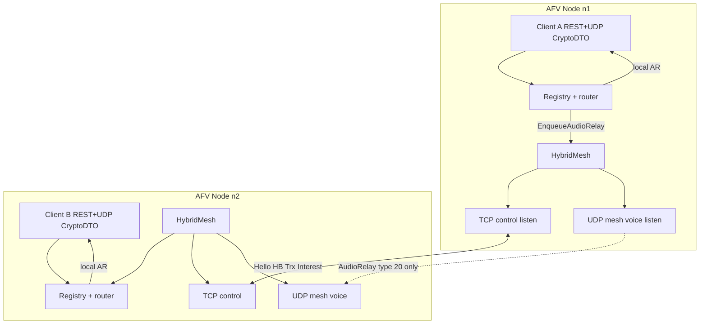

# AFV Multi-Node Production Mesh — Hybrid TCP Control + UDP Voice (PR-10b)

| Field | Value |
|-------|--------|
| **Title** | AFV multi-node production mesh — hybrid TCP control + UDP voice |
| **Author** | openfsd design (implementer-ready) |
| **Date** | 2026-07-28 |
| **Status** | **Implemented** (rev 3 — H-20 multi-host fix + H-19 rate; hybrid stack landed) |
| **Parent** | `docs/design/afv-mesh-pr10.md` (PR-10 Memory path landed; TCP-only voice plan **superseded**) |
| **Also amends** | `docs/design/afv-server.md` §Clustering (production mesh transport) |
| **Contract** | `docs/design/afv-mesh-implementer-prompt.md` (framing + Interest invariants remain; transport revised here) |
| **In-repo target** | `docs/design/afv-mesh-pr10b.md` (land during implementation) |

---

## Supersedes / amends PR-10b TCP-only voice

This document **supersedes** the production-mesh transport plan in `docs/design/afv-mesh-pr10.md` that placed **all** mesh traffic — including high-rate `AudioRelay` (type 20, opaque Opus + TX geometry) — on a single **TCP** connection with dual outbound queues (voice depth 256 drop-oldest; control depth 64).

| Topic | PR-10 / original PR-10b (superseded for production) | This document (normative for production) |
|-------|------------------------------------------------------|------------------------------------------|
| Control plane | TCP: Hello, Heartbeat, Trx*, SessionLeave, Interest | **Unchanged** — TCP only |
| Voice plane | TCP: `AudioRelay` on same conn, voice queue 256 | **UDP only** — `AudioRelay` never on TCP |
| HOL / retransmit | Voice subject to TCP HOL and retransmission delay | Voice is lossy, best-effort, no HOL with control |
| `AFV_CLUSTER_LISTEN` | TCP listen for entire mesh | TCP **control** listen only |
| Voice endpoints | N/A (piggybacked) | `AFV_CLUSTER_VOICE_LISTEN` + peer voice addr derivation |
| MemoryMesh | In-process dual queues (voice+ctrl) | **Unchanged** — tests-only; may keep in-process queues |
| Framing codecs | `EncodeAudioRelay` / `DecodeAudioRelay` | **Same payload codec**; UDP datagram carries type-20 frame |
| Fail-closed enable | `ENABLED=true` without TCP → error | `ENABLED=true` without **hybrid** production mesh → error |
| Import graph | `internal/afv` ↛ `internal/cluster` | **Unchanged** |

**Parent doc patches (normative — land with PR-10b.1, do not wait for 10b.5):**

When landing `docs/design/afv-mesh-pr10b.md` (even as Draft), **immediately** patch:

1. `docs/design/afv-mesh-pr10.md` implementation status table:
   - Production mesh transport → **PR-10b hybrid TCP control + UDP voice** (TCP-only voice **superseded**)
   - Operator wiki multi-node AFV → deliverable of PR-10b stack
2. `docs/design/afv-mesh-pr10.md` TCP mesh / dual-queue sections: add a callout that production AudioRelay is **UDP only** per `afv-mesh-pr10b.md`; dual TCP voice+control queues apply to **MemoryMesh** tests only for production semantics.
3. `docs/design/afv-server.md` §Clustering normative transport row:
   - **Control** = TCP between static peers
   - **AudioRelay (type 20)** = UDP mesh voice (not TCP)
   - Point to `afv-mesh-pr10b.md`

**What remains valid from PR-10 (do not re-litigate):**

- Sticky home clients; AEAD keys never leave home; Opus never in rqlite
- Interest filter; max 4 remote peers; static `AFV_CLUSTER_PEERS`
- Hello CT-PSK; post-Hello Snapshot+Interest (M-16); peer death 15s (M-9)
- `isATC` / `isXC` on AudioRelay; `routeSyntheticTX`; KD-16 deadlock rule
- MemoryMesh e2e Cases A–F as the in-process correctness bar
- `Mesh` interface surface already landed in `internal/afv/mesh.go`

---

## Overview

openfsd AFV is a single-binary VATSIM-shaped voice service (`internal/afv`: REST + UDP CryptoDTO). PR-10 landed the **mesh data plane logic** in-process: length-prefixed framing, Interest, remote directory, AudioRelay re-encrypt path, and MemoryMesh e2e (Cases A–F). Production enablement is fail-closed: `AFV_CLUSTER_ENABLED=true` without a production mesh returns `errClusterTCPNotBuilt` from `NewDefault` (`internal/afv/bootstrap.go`).

This design specifies the **production multi-host AFV mesh** as a **hybrid transport**:

1. **TCP control plane** — Hello (first-frame + constant-time PSK), Heartbeat, TrxSnapshot, TrxDelta, SessionLeave, Interest. Reliable-ish, low rate, dual-queue control path depth 64 drop-oldest.
2. **UDP voice plane** — AudioRelay **only**. Lossy, drop-oldest / best-effort per peer, no head-of-line blocking with control. Payload codec is the existing `EncodeAudioRelay` / `DecodeAudioRelay` in `mesh_frame.go`.

AFV mesh remains a **separate fabric** under `internal/afv/`. It must **never** import `internal/cluster` (copy patterns only from `internal/cluster/tcp_mesh.go`). Clients stay sticky to a home node; mesh is **inter-node only**.

---

## Background & Motivation

### Current state (on `dev`)

| Layer | Path | State |
|-------|------|--------|
| Framing + codecs | `internal/afv/mesh_frame.go` | Landed; Hello, HB, Trx*, Leave, AudioRelay, Interest |
| Queues | `internal/afv/mesh_queue.go` | Landed; voice 256 + control 64 drop-oldest |
| MemoryMesh | `internal/afv/mesh_memory.go` | Landed; tests-only via `SetMesh` |
| Interest / remote dir | `mesh_interest.go`, `mesh_remotedir.go` | Landed |
| Server hooks | `mesh.go`, `server.go`, `udp.go`, `api.go` | Landed; `EnqueueAudioRelay` after local AT |
| Bootstrap | `bootstrap.go` | `ClusterEnabled` → always `errClusterTCPNotBuilt` |
| Config stubs | `config.go` | `AFV_CLUSTER_{ENABLED,NODE_ID,LISTEN,PEERS,PSK}` |
| Production TCP/UDP mesh | — | **Missing** (`mesh_tcp.go` / voice UDP not in tree) |

### Pain points with TCP-only voice (original PR-10b sketch)

- **Head-of-line blocking:** a single lost TCP segment delays subsequent AudioRelay frames even when control traffic is healthy.
- **Retransmission delay:** voice that is already late is worse than dropped; TCP insists on delivery order.
- **Queue coupling risk:** even with dual queues and control priority, one writer on one stream cannot fully isolate real-time audio from control burst / congestion response.
- **Product requirement:** do **not** piggyback UDP-nature voice over TCP.

### Why hybrid preserves PR-10 invariants

The hard invariants are **data-path** properties (keys, Opus storage, sticky home, Interest, import graph), not transport properties. Hybrid transport only changes **how bytes leave the process** for type 20 vs control types. MemoryMesh continues to exercise the same `Mesh` interface for in-process e2e without sockets.

---

## Goals & Non-Goals

### Goals

1. **Production hybrid mesh** constructible from valid `AFV_CLUSTER_*=true` config in `NewDefault`; attach via `SetMesh` (or internal equivalent) before `Run`.
2. **TCP control** with Hello first-frame rule, CT-PSK, Heartbeat, directory, Interest, peer death purge.
3. **UDP voice** for AudioRelay only; same `EncodeAudioRelay` / `DecodeAudioRelay` payload; Interest-filtered fan-out; drop-oldest depth 256 per peer.
4. **Two real processes on localhost** can complete A2A via mesh (control TCP + voice UDP).
5. Fail closed: wrong PSK, non-Hello first TCP frame, peer death purge, empty Interest → no flood.
6. Config surface for voice endpoints with a **single primary ops scheme** and sticky-LB notes.
7. Unit coverage floors in the spirit of PR-10 Testing Plan for **new** modules; race/import/hygiene/build green.
8. Operator wiki: Configuration + Deployment multi-node AFV sections.
9. Update status tables in parent designs (or superseding addendum pointer).

### Non-goals

| Non-goal | Notes |
|----------|--------|
| Merge AFV mesh into FSD `internal/cluster` | KD-8; import allowlist |
| Reimplement P0 single-node AFV | Already on `dev` |
| Implement PR-9 cross-coupling XC | Keep `isXC` on AudioRelay; never XC-again |
| Global callsign claim | Dual-login across nodes remains allowed |
| Dynamic peer discovery / membership | Static peers only |
| Mesh AEAD / TLS on control or voice | Private-network + PSK trust root (same as FSD mesh) |
| Client CryptoDTO or REST changes | Sticky home unchanged |
| >4 remote peers | Cap remains 4 |
| Opus or session keys in rqlite | Unchanged |
| Browser E2E / Playwright | House standard forbids by default |

---

## Key Decisions

| ID | Decision | Rationale |
|----|----------|-----------|
| **H-1** | Production transport is **hybrid**: TCP control + UDP voice | Product mandate: no TCP HOL/retransmit for real-time audio |
| **H-2** | **AudioRelay (type 20) is forbidden on TCP**; if received, log + close that peer control conn (fail closed) | Prevents accidental dual-path and keeps control stream low-rate |
| **H-3** | UDP datagram wire = **full mesh frame** bytes (`EncodeMeshFrame` → type 20 + AudioRelay payload); **strict** one frame per datagram (`decodedFrameBytes == n` from `ReadFrom`) | Share decode path; prevent multi-frame smuggling |
| **H-4** | Voice endpoint config: **`AFV_CLUSTER_VOICE_LISTEN`** local bind + peer voice = **same host as peer TCP, port = TCP port + 1** by default; optional peer suffix `id=host:tcpPort/voicePort` | Clear ops model; no post-Hello discovery complexity; sticky LB notes unchanged |
| **H-5** | UDP accept only from **allowlist of resolved peer voice addrs** while peer is **control-authed**; canonicalize keys per H-16 | Spoof mitigation without per-packet crypto; private net assumption |
| **H-6** | Type name: production type is **`HybridMesh`** (implements `Mesh`); file split `mesh_tcp.go` (control) + `mesh_udp_voice.go` (voice) under package `afv` | Matches PR-10 file plan; no new importable subpackage |
| **H-7** | Control outbound: per-peer **ctrl queue depth 64 drop-oldest** with **per-peer TCP writer**; voice outbound: per-peer **UDP send queue depth 256 drop-oldest** with **per-peer voice drainer** (not a shared global buffer) | Preserves M-6; avoids cross-peer buffer races |
| **H-8** | Liveness is **TCP-only**. Peer death triggers: (a) 15s since `lastHB`, (b) TCP read error/close, (c) TCP write error. `lastHB` updated on **every successfully decoded post-Hello control frame** (not only Heartbeat). UDP errors never alone mark death. Death → purge remote dir + Interest; stop voice; re-init empty queues | Matches FSD `tcp_mesh.go` spirit; single liveness signal |
| **H-9** | Dial TCP only if `NodeID > self`. On second live conn for same peerID: **close previous**, reset queues, re-run Hello auth sequence on the new conn | Avoid dual control conns; FSD replace pattern |
| **H-10** | `NewDefault` with valid cluster config constructs `HybridMesh` and sets it on Server (PR-10b.4). Until then keep fail-closed sentinel. After 10b.4: delete `errClusterTCPNotBuilt` or redefine message to hybrid-start failures only | Acceptance bar; no grepping confusion |
| **H-11** | MemoryMesh stays tests-only; production never auto-wires MemoryMesh | M-11 unchanged |
| **H-12** | Named constant **`maxMeshVoiceDatagram = 16 KiB`** is the **only** accepted UDP voice size; reject larger **before** `DecodeMeshFrame`. Do **not** use `MaxMeshPayload` (1 MiB) for UDP reads. Encode path also rejects if encoded frame > this cap | DoS footgun; concrete test lock |
| **H-13** | No registry/remote-dir lock across mesh enqueue, TCP write, or UDP `WriteTo`. Peer-map locks: short hold for enqueue/map ops only; never across I/O | M-14 / KD-16 |
| **H-14** | Post-Hello sequence still Snapshot then Interest on **TCP only**. HybridMesh applies inbound Interest **on the TCP reader** (replace set for origin). Interest empty → no AudioRelay fan-out | M-16 + no flood; production is async (not MemoryMesh M-17 sync) |
| **H-15** | Peer voice address resolution is **static at Start** from config (not rewritten from TCP RemoteAddr). Log TCP RemoteAddr host ≠ configured peer TCP host as warn only | NAT/LB: operators configure true reachability |
| **H-16** | UDP allowlist: resolve each peer `VoiceAddr` at Start; key = `net.JoinHostPort(ip.To16().String(), port)` after normalizing IP; **IPv4-mapped IPv6** (`::ffff:x.x.x.x`) is **accepted as equal** to the IPv4 form (map both keys to same peer). Multi-A/AAAA: allowlist **all** resolved addrs for that peer; **send** to first successful resolve order (prefer IPv4 if both). One unconnected `PacketConn` so source port == `VOICE_LISTEN` | Consistent anti-spoof + dual-stack |
| **H-17** | Peer death / `lastHB` / dual-conn: see H-8 / H-9 (normative algorithms below) | Implementer lock |
| **H-18** | `maxMeshVoiceDatagram` formula + `maxMeshVoiceTxRadios = 64` (see Constants) | Bound geometry DoS |
| **H-19** | Inbound UDP: after allowlist, soft **per-peer inbound rate limit** (default **5000 datagrams/s**; excess dropped + counter). Cap is **anti-runaway**, not a capacity plan — sized for multi-talker fan-in (see Constants). Unknown sources never call `OnAudioRelay` | Compromised-peer / bug flood without clipping normal busy mesh |
| **H-20** | Config fail-closed: duplicate peer `VoiceAddr` (string form); `ClusterVoiceListen` ≠ `UDPListen` (normalized); local voice **full `host:port` string** ≠ any peer `VoiceAddr` (no port-only wildcard rule); ports ≠ 0 | Avoid allowlist ambiguity + client/mesh socket footgun **without** rejecting multi-host same port numbers |
| **H-21** | Parent transport row patched in **PR-10b.1** (with design file), not deferred to docs-only 10b.5 | Prevent implementers reading parents as TCP-voice |

---

## Proposed Design

### High-level architecture



```text
Client A ──REST+UDP──► AFV n1 (home A)
                          │ local AT→AR for local RX
                          │ TCP: TrxDelta / Interest / HB
                          │ UDP mesh: AudioRelay (opaque Opus + TX geo)
                          ▼
                       AFV n2 (home B)
                          │ routeSyntheticTX + encrypt AR with B keys
Client B ◄──UDP AR───────┘
```

### Sequence: cross-node A2A (hybrid)

```mermaid
sequenceDiagram
  participant A as Client A
  participant N1 as AFV n1
  participant TCP as TCP control
  participant UDP as UDP voice
  participant N2 as AFV n2
  participant B as Client B

  Note over N1,N2: Mutual Hello + Snapshot + Interest on TCP
  A->>N1: UDP AT (home AEAD)
  N1->>N1: Decrypt; routeAT local
  N1->>UDP: Enqueue AudioRelay (Interest filter)
  UDP->>N2: datagram type=20
  N2->>N2: routeSyntheticTX; re-encrypt AR
  N2->>B: UDP AR (B home keys)
  Note over TCP: Directory/Interest/HB independent of voice path
```

### Package / file layout

All under package `afv` (no new importable subpackage):

```text
internal/afv/
  mesh.go              # Mesh interface, Server hooks (existing)
  mesh_frame.go        # Codecs (existing; minor: maybe MeshType assert helpers)
  mesh_queue.go        # dropOldestQueue (existing; reuse for ctrl + voice)
  mesh_memory.go       # tests-only (existing)
  mesh_tcp.go          # NEW: HybridMesh TCP control listen/dial/Hello/HB/ctrl queues
  mesh_udp_voice.go    # NEW: HybridMesh UDP voice listen/send/allowlist
  mesh_hybrid.go       # NEW (optional): HybridMesh constructor + Start/Stop orchestration
                       #   OR fold into mesh_tcp.go if single type owns both
  mesh_tcp_test.go
  mesh_udp_voice_test.go
  mesh_hybrid_e2e_test.go  # two-process or dual-bind localhost A2A

  config.go            # add ClusterVoiceListen; extend peer parse
  bootstrap.go         # construct HybridMesh when enabled
  # server/registry/udp/api — minimal or no change if Mesh interface holds
```

**Do not** add mesh types to `pkg/afvprotocol`. **Do not** import `internal/cluster`.

### Conceptual mirror of FSD cluster (analogy only)

| FSD (`internal/cluster`) | AFV hybrid mesh |
|--------------------------|-----------------|
| `tcp_mesh.go` single TCP stream | TCP for control only; UDP for voice |
| `peerConn.outCh` depth 256 | `ctrlCh` 64 + `voiceCh` 256 **separate transports** |
| Dial if peer ID > self | Same for TCP control |
| Hello first frame + PSK | Same on TCP; CT-compare already in `VerifyHelloPSK` |
| Interest AABB | AFV `(freqHz, CellKey)` (already landed) |
| No Opus | AudioRelay on UDP |

---

## Configuration surface

### Env vars

| Env | Role | Required when `AFV_CLUSTER_ENABLED=true` |
|-----|------|------------------------------------------|
| `AFV_CLUSTER_ENABLED` | Master switch (default false) | — |
| `AFV_CLUSTER_NODE_ID` | Stable node id (string) | yes |
| `AFV_CLUSTER_LISTEN` | **TCP control** listen `host:port` | yes |
| `AFV_CLUSTER_VOICE_LISTEN` | **UDP mesh voice** listen `host:port` | yes (new) |
| `AFV_CLUSTER_PEERS` | Remote peers (see grammar) | yes (≥1, ≤4) |
| `AFV_CLUSTER_PSK` | Shared Hello secret | yes |

**Unchanged client-facing env:** `AFV_UDP_LISTEN` / `AFV_UDP_ADVERTISE_IPV4` remain **client** CryptoDTO endpoints (sticky home). Mesh voice UDP is a **separate** socket from client UDP.

### Peer string grammar (H-4)

```text
AFV_CLUSTER_PEERS =
  peer ( "," peer )*

peer =
  nodeID "=" hostPort [ "/" voicePort ]

hostPort =   # must be valid for net.SplitHostPort after /voice strip
  host ":" tcpPort
| "[" ipv6 "]" ":" tcpPort
```

Examples:

```bash
# Default +1 voice ports
AFV_CLUSTER_PEERS=n2=10.0.0.2:17000,n3=10.0.0.3:17000
# → n2 control 10.0.0.2:17000, voice 10.0.0.2:17001

# Explicit voice port (non-contiguous or shared-host multi-process)
AFV_CLUSTER_PEERS=n2=127.0.0.1:17000/17100

# IPv6 (brackets required)
AFV_CLUSTER_PEERS=n2=[2001:db8::1]:17000
AFV_CLUSTER_PEERS=n2=[2001:db8::1]:17000/17001
```

### Normative peer parse algorithm (Issue 1)

Replace today’s `id=addr` + blind `SplitHostPort(addr)`. **Order is mandatory** so `/voice` is never left inside the TCP port field (`SplitHostPort("10.0.0.2:17000/17001")` would otherwise yield port `"17000/17001"`).

```text
parseClusterPeers(s) → []ClusterPeer | error:

1. Split s on ",". For each non-empty trimmed part p:
2. Find first '='. If missing or at ends → error "invalid entry".
   id = trim(p[:eq]); rest = trim(p[eq+1:])
   if id == "" or rest == "" → error
3. Split rest into hostPort and optional voicePort:
   a. If rest contains '/':
        - Find last '/' (only one slash form is allowed; extra '/' → error)
        - hostPort = trim(before last '/')
        - voicePortStr = trim(after last '/')
        - if hostPort == "" or voicePortStr == "" → error "empty voice"
        - voicePort = parseUint16Decimal(voicePortStr); on fail → error "non-numeric voice"
   b. Else:
        hostPort = rest
        voicePort = unset (derive later)
4. Validate hostPort with net.SplitHostPort(hostPort) → (host, tcpPortStr):
   - On error → "want host:port" (covers missing brackets for IPv6)
   - host must be non-empty
   - tcpPort = parseUint16Decimal(tcpPortStr); reject non-numeric
   - if tcpPort == 0 → error "port 0"
5. If voicePort unset:
   - if tcpPort == 65535 → error "voice port overflow" (tcp+1)
   - voicePort = tcpPort + 1
6. if voicePort == 0 → error "port 0"
7. VoiceAddr = net.JoinHostPort(host, strconv.Itoa(int(voicePort)))
   Addr     = hostPort  // original SplitHostPort-valid form (preserve brackets)
8. Append ClusterPeer{ID: id, Addr: Addr, VoiceAddr: VoiceAddr}
9. After all peers: enforce unique IDs (existing), unique VoiceAddr strings
   (string equality on JoinHostPort form — H-20; Start-time resolve may add more checks)
```

**IPv6:** operators **must** use bracket form. Unbracketed IPv6 is rejected by `SplitHostPort` — treat as invalid entry (do not invent a second parser).

**Accept / reject fixtures (required unit tests):**

| Input peer entry | Result |
|------------------|--------|
| `n2=10.0.0.2:17000` | OK; Addr=`10.0.0.2:17000`, VoiceAddr=`10.0.0.2:17001` |
| `n2=10.0.0.2:17000/17100` | OK; VoiceAddr=`10.0.0.2:17100` |
| `n2=[::1]:17000` | OK; VoiceAddr=`[::1]:17001` |
| `n2=[::1]:17000/17050` | OK; VoiceAddr=`[::1]:17050` |
| `n2=10.0.0.2:65535` | **Reject** overflow |
| `n2=10.0.0.2:17000/` | **Reject** empty voice |
| `n2=10.0.0.2:17000/abc` | **Reject** non-numeric voice |
| `n2=10.0.0.2:17000/0` | **Reject** port 0 |
| `n2=10.0.0.2:0` | **Reject** port 0 |
| `n2=10.0.0.2:17000/ 17100` | OK after trim → 17100 |
| `n2=::1:17000` | **Reject** (no brackets) |
| two peers same VoiceAddr | **Reject** (H-20) |
| spaces around id/addr | trimmed OK |

### Validation (`ValidateCluster` extensions) — fail closed (H-20)

When `ClusterEnabled`:

1. Existing: node id, TCP listen, PSK, peers ≥1 ≤4, no self, unique ids, TCP host:port.
2. `AFV_CLUSTER_VOICE_LISTEN` non-empty; `SplitHostPort` OK; **port ≠ 0**.
3. Local TCP listen port ≠ local voice listen port (string port compare after SplitHostPort).
4. Peer parse algorithm above succeeds for all entries.
5. **Unique peer `VoiceAddr`** (exact string after JoinHostPort) — **fail**, not warn.
6. **`ClusterVoiceListen` ≠ `UDPListen`** after normalize: both SplitHostPort; compare `host:port` with empty host / `0.0.0.0` / `::` / `*` treated as wildcard-equal on host **if ports equal** → **fail** (client CryptoDTO must not share the mesh voice socket). Same for concrete equal host:port. (This is **local-only** socket collision — not peer comparison.)
7. **Local voice vs peer `VoiceAddr` — full host:port equality only (no port-only wildcard rule):**
   - Fail closed **only** when the configured local voice listen string’s `JoinHostPort(host, port)` **equals** a peer’s `VoiceAddr` string (after the same parse/JoinHostPort normalization used for peers).
   - Examples that **must accept**:
     - Local `0.0.0.0:17001`, peer `10.0.0.2:17001` — **OK** (recommended multi-host layout: same port number, different hosts).
     - Local `0.0.0.0:17001`, peer `10.0.0.2:17000/17001` → VoiceAddr `10.0.0.2:17001` — **OK**.
   - Examples that **must reject**:
     - Local `127.0.0.1:17001`, peer `127.0.0.1:17001` — same host:port (same-machine multi-process must use distinct ports as in the localhost example: `17001` vs `17011`).
     - Local `10.0.0.1:17001`, peer `10.0.0.1:17001` — equal concrete endpoints.
   - **Do not** treat wildcard local host as “port equals any peer port.” That incorrectly rejects production multi-host meshes where every node uses voice port `N+1` on different IPs.
   - **Optional same-host tightening (implementer may add, not required):** if peer host is loopback (`127.0.0.1` / `::1`) **and** local host is loopback or wildcard **and** ports equal → fail (catches localhost multi-process when local binds `0.0.0.0:17001` and peer is `127.0.0.1:17001`). Wiki still documents distinct ports for multi-process on one host.
8. Local TCP listen must not equal any peer TCP `Addr` by the **same full host:port equality** rule (no port-only wildcard). Self must not appear in peers (existing).

**Defaults:** no silent default for `VOICE_LISTEN` when cluster enabled — **require explicit bind**. Recommended multi-host convention: every node `AFV_CLUSTER_LISTEN=0.0.0.0:N`, `AFV_CLUSTER_VOICE_LISTEN=0.0.0.0:N+1`, peers `id=otherHost:N` (voice derives `otherHost:N+1`).

### Config struct

```go
// config.go additions
ClusterVoiceListen string `env:"AFV_CLUSTER_VOICE_LISTEN"`

// mesh.go — ClusterPeer extended
type ClusterPeer struct {
	ID        string
	Addr      string // TCP host:port (control) — SplitHostPort-valid
	VoiceAddr string // UDP host:port (voice) — derived or explicit
}
```

Update `parseClusterPeers` to populate `VoiceAddr` via the normative algorithm.

### Sticky LB ops model (unchanged, reinforced)

```text
                    ┌──────────── sticky REST ────────────┐
 Client ──HTTPS──►  │ LB / DNS per-node hostname          │
                    └───────────────┬─────────────────────┘
                                    ▼
                         AFV node home (mint keys)
                                    │
                    Client UDP ─────┘  AFV_UDP_ADVERTISE_IPV4 only

 Mesh (inter-node only):
   TCP AFV_CLUSTER_LISTEN  ↔ peers' TCP
   UDP AFV_CLUSTER_VOICE_LISTEN ↔ peers' voice addrs
```

- Mesh does **not** replace sticky affinity for clients.
- Operators must open **both** control TCP and voice UDP between node security groups.
- Client UDP port (`AFV_UDP_LISTEN`, often 50000) is **independent** of mesh voice port (often 17001).

### Example two-node localhost

```bash
# Node n1
AFV_CLUSTER_ENABLED=true
AFV_CLUSTER_NODE_ID=n1
AFV_CLUSTER_LISTEN=127.0.0.1:17000
AFV_CLUSTER_VOICE_LISTEN=127.0.0.1:17001
AFV_CLUSTER_PEERS=n2=127.0.0.1:17010/17011
AFV_CLUSTER_PSK=dev-shared-secret
AFV_UDP_LISTEN=127.0.0.1:50000
AFV_UDP_ADVERTISE_IPV4=127.0.0.1
AFV_API_LISTEN=127.0.0.1:8080

# Node n2
AFV_CLUSTER_ENABLED=true
AFV_CLUSTER_NODE_ID=n2
AFV_CLUSTER_LISTEN=127.0.0.1:17010
AFV_CLUSTER_VOICE_LISTEN=127.0.0.1:17011
AFV_CLUSTER_PEERS=n1=127.0.0.1:17000/17001
AFV_CLUSTER_PSK=dev-shared-secret
AFV_UDP_LISTEN=127.0.0.1:50001
AFV_UDP_ADVERTISE_IPV4=127.0.0.1
AFV_API_LISTEN=127.0.0.1:8081
```

---

## HybridMesh detailed design

### Type and construction

```go
// mesh_hybrid.go / mesh_tcp.go

type HybridMeshConfig struct {
	NodeID      string
	ListenTCP   string // AFV_CLUSTER_LISTEN
	ListenVoice string // AFV_CLUSTER_VOICE_LISTEN
	Peers       []ClusterPeer // remote only; TCP + Voice addrs
	PSK         string
	// HeartbeatInterval default 2s
	// PeerDeathAfter    default 15s
	// CtrlQueueDepth    default 64
	// VoiceQueueDepth   default 256
	// MaxPeers          default 4
	Logger *slog.Logger
}

type HybridMesh struct {
	cfg HybridMeshConfig
	// TCP
	ln net.Listener
	// UDP voice
	voicePC net.PacketConn
	// peerID → peer state
	// callbacks / providers same as MemoryMesh
	// implements Mesh
}

func NewHybridMesh(cfg HybridMeshConfig) (*HybridMesh, error)
```

`NewDefault` path:

```go
// bootstrap.go (normative)
if cfg.ClusterEnabled {
	if err := cfg.ValidateCluster(); err != nil {
		return nil, err
	}
	peers, _ := parseClusterPeers(cfg.ClusterPeers) // already validated
	hm, err := NewHybridMesh(HybridMeshConfig{
		NodeID: cfg.ClusterNodeID,
		ListenTCP: cfg.ClusterListen,
		ListenVoice: cfg.ClusterVoiceListen,
		Peers: peers,
		PSK: cfg.ClusterPSK,
	})
	if err != nil {
		return nil, err
	}
	srv := New(cfg, ...)
	srv.SetMesh(hm)
	return srv, nil
}
```

Replace:

```go
if cfg.ClusterEnabled {
	return nil, errClusterTCPNotBuilt
}
```

Keep `errClusterTCPNotBuilt` (or rename to hybrid-not-wired) through PR-10b.2/10b.3 so partial HybridMesh is never production-attached. Delete or redefine to `afv hybrid mesh failed to start: …` only in PR-10b.4 when `NewDefault` wires HybridMesh.

### Constants (H-12 / H-18 / H-19)

```go
// Normative constants (mesh_udp_voice.go or mesh.go)

// maxMeshVoiceDatagram is the only accepted UDP voice size (bytes).
// Do NOT use MaxMeshPayload (1 MiB) for UDP reads.
const maxMeshVoiceDatagram = 16 << 10 // 16384

// maxMeshVoiceTxRadios caps TxRadios on mesh AudioRelay encode/decode for voice path.
const maxMeshVoiceTxRadios = 64

// meshVoiceInboundRatePerSec soft cap per authed peer (datagrams/s). Excess dropped.
// Anti-runaway only — not a capacity plan. Default 5000: see H-19 capacity note.
const meshVoiceInboundRatePerSec = 5000

// Formula (documentation / tests — must fit in maxMeshVoiceDatagram):
//   frameOH = 4 + 1
//   strings = 2 * (2 + maxMeshString)           // origin + callsign worst case
//   fixed   = 4 + 3 + 4 + maxAudioRelayBytes + 2  // seq, bools, audio, nTx
//   radios  = maxMeshVoiceTxRadios * 30         // u16+u32+3*f64
//   worst   = frameOH + strings + fixed + radios
//           = 5 + 2052 + 8205 + 1920 = 12182 ≤ 16384
// Encode rejects if encoded frame length > maxMeshVoiceDatagram even if audio ≤ 8192.
```

UDP read buffer: allocate `maxMeshVoiceDatagram+1`; if `n > maxMeshVoiceDatagram` drop and count (same pattern as client UDP oversized drop in `udp.go`).

**H-19 capacity note (inbound rate default):**

| Factor | Order of magnitude |
|--------|--------------------|
| Opus / CryptoDTO TX rate per talker | ~20–50 datagrams/s (codec-dependent) |
| Concurrent remote talkers whose Interest hits this node (busy event) | tens (not thousands) on ≤5-node mesh |
| Mesh fan-in from **one** peer node | sum of that node’s concurrent TX that pass Interest |

- **200/s was too low:** a few concurrent talkers on a peer can exceed it → silent drop under normal load.
- **Default 5000/s per peer:** headroom for ~100 talkers × ~50 pps, or fewer talkers with burst/retransmit noise, while still bounding runaway (buggy peer spinning TX). Still cheap vs per-AR encrypt + client `WriteTo`.
- Cap is **not** a guarantee of voice quality under overload; it is fail-soft anti-DoS. Not an env product knob in first cut (constant; change in code if ops proves need).
- Formula alternative if implementers prefer: `max(5000, min(20000, MaxSessions*50/4))` — optional; **normative default remains 5000**.

### Mesh interface compliance

`HybridMesh` implements the existing `Mesh` interface in `mesh.go` without signature changes:

| Method | Behavior |
|--------|----------|
| `Start` | Resolve peer voice addrs; listen TCP + UDP voice; accept/dial; HB loop; post-auth Snapshot+Interest when each peer Hello completes |
| `Stop` | Close listeners/conns; wait workers |
| `PublishTrxSnapshot/Delta/Leave/Interest` | Encode payload; enqueue **control** job per live **authed** peer (drop-oldest 64). Outbound Interest does **not** mutate local `peerInterest` |
| `EnqueueAudioRelay` | Normative MemoryMesh-compatible filter (below); never touch TCP |
| `PeerWants` / `InterestedPeers` | Read `peerInterest` map (filled **only** from inbound TCP Interest apply) |
| Callbacks | `OnAudioRelay`, `OnPeerDead`, `OnDirectory`, providers |

### Per-peer state

```go
type hybridPeer struct {
	id         string
	tcpAddr    string
	voiceAddrs []*net.UDPAddr // all resolved at Start
	sendVoice  *net.UDPAddr   // WriteTo target (prefer IPv4 if dual-stack)
	conn       net.Conn
	ctrlQ      *dropOldestQueue[meshCtrlJob]
	voiceQ     *dropOldestQueue[voiceJob]
	lastHB     time.Time
	authed     bool
	stop       chan struct{}
	// inboundRate: token bucket / sliding window for H-19
}

type voiceJob struct {
	// exclusive copy of full mesh frame bytes for this peer only
	packet []byte
}
```

**Deadlock / concurrency (H-7, H-13):**

- **Per-peer TCP writer** drains `ctrlQ`; **per-peer voice drainer** drains `voiceQ` and `WriteTo`s (not a global shared buffer).
- **Packet copy at enqueue** per peer — forbid sharing one `[]byte` across peers or concurrent `WriteTo`.
- Peer-map mutex: short hold for lookup/enqueue/conn swap only; **never** across `conn.Write` or `WriteTo`.
- Server already unlocks registry before `EnqueueAudioRelay`.

### Interest apply on HybridMesh (H-14 — Issue 3)

MemoryMesh applies Interest **synchronously inside `PublishInterest`** on the peer map (M-17) and does **not** re-apply from control drain. HybridMesh **must not** copy that sync path.

**Normative inbound Interest (TCP reader, type 30):**

```text
on TCP DecodeMeshFrame type == MeshTypeInterest:
  p, err := DecodeInterest(payload)
  if err != nil: death path (malformed post-Hello control)
  if p.NodeID != fromPeerID: close peer   // must match Hello-authenticated id
  set := make(map[FreqCell]struct{}, len(p.Entries))
  for e in p.Entries:
    set[FreqCell{FreqHz: e.FreqHz, Cell: CellKey{ILat: e.ILat, ILon: e.ILon}}] = {}
  // REPLACE entire set (not merge). Empty entries → empty set (clears Interest).
  lock; peerInterest[fromPeerID] = set; unlock
  // no callback required; PeerWants sees new set after unlock
```

- Entry cap remains the **publisher’s** job (`interestMaxEntries`); receiver uses existing decode caps.
- Full replace under one assignment — no partial merge.
- `EnqueueAudioRelay` copies matching peer IDs under `RLock`, unlocks, then enqueues (H-13).

**Outbound `PublishInterest`:** encode + enqueue control to each authed peer only. Does **not** write `peerInterest[self]`.

### EnqueueAudioRelay / Interest fan-out (Issue 9 — match MemoryMesh)

Must match landed `MemoryMesh.EnqueueAudioRelay` (`mesh_memory.go`):

```text
EnqueueAudioRelay(relay):
  if OriginNode == "": OriginNode = self
  Audio = append([]byte(nil), Audio...)
  TxRadios = append([]RelayTxRadio(nil), TxRadios...)

  snapshot authed peerIDs under RLock; unlock
  for each peerID:
    want = false
    for each tx in relay.TxRadios:
      ck = CellKey{
        ILat: geo.CellIndex(tx.LatDeg, geo.DefaultGridCellDeg),
        ILon: geo.CellIndex(tx.LonDeg, geo.DefaultGridCellDeg),
      }
      if PeerWants(peerID, tx.FreqHz, ck): want = true; break
    if !want: continue   // empty Interest → no flood (Case F)
    payload, err := EncodeAudioRelay(relay)  // max audio; enforce maxMeshVoiceTxRadios
    if err != nil: drop; continue
    packet = EncodeMeshFrameBytes(type=20, payload)
    if len(packet) > maxMeshVoiceDatagram: drop; continue
    peer.voiceQ.Enqueue(voiceJob{packet: copy(packet)})  // drop-oldest 256
```

### TCP control plane

#### Listen / dial (H-9)

- `net.Listen("tcp", ListenTCP)`
- Dial peers with `peer.ID > self.NodeID`; backoff 200ms → cap 5s (FSD pattern)
- Accept handles reverse
- Both sides send Hello immediately; first frame must be Hello

#### Hello (existing M-3)

- `VerifyHelloPSK`; nodeID ∈ allowlist and ≠ self
- Reject wrong PSK / unknown / self / non-Hello first → close, Warn without PSK
- On success:
  1. If existing live conn for peerID: **close old**, stop old workers, **recreate empty** ctrlQ/voiceQ
  2. Install new conn; `authed=true`; `lastHB=now`
  3. Ensure per-peer TCP writer + voice drainer running
  4. Send TrxSnapshot then Interest (M-16)

#### Allowed TCP frame types

| Type | Allowed on TCP |
|------|----------------|
| 1 Hello | First frame only; post-auth unexpected Hello → **close** |
| 2 Heartbeat | Yes |
| 10–12 Trx*/Leave | Yes |
| 20 AudioRelay | **No** — close peer (H-2) |
| 30 Interest | Yes → apply replace |
| other | Close peer |

#### Control writer

- Per-peer goroutine drains `ctrlQ` (depth 64 drop-oldest)
- `EncodeMeshFrame(conn, typ, payload)`
- Write error → **death path** (same as read failure)

#### Heartbeat / death / lastHB (H-8 — Issue 4)

**`lastHB`:** advance on **every successfully decoded post-Hello control frame** (any allowed type), not only Heartbeat — FSD `tcp_mesh.go` pattern.

**Death triggers (any):** (1) `now-lastHB > 15s`; (2) TCP read error/close; (3) TCP write error. UDP errors alone never kill the peer.

**Death procedure (idempotent):**

```text
authed = false
close conn; stop writer
peerInterest[peerID] = empty set
re-init empty ctrlQ + voiceQ (drop stale)
OnPeerDead(peerID)  // Server → remote.RemoveNode; local sessions stay
slog.Warn
// dialer keeps dialing; acceptor waits
```

**Reconnect:** Hello success → replace conn + queues + Snapshot+Interest.

#### Inbound TCP reader

- Read deadline ≈ `peerDeathGrace + 5s`
- Success → `lastHB=now`; dispatch directory / Interest / HB
- Never `OnAudioRelay` from TCP
- Error → death procedure

### UDP voice plane

#### Listen / socket invariant (H-5 / H-16)

- **One** unconnected `ListenPacket("udp", ListenVoice)` for mesh voice
- All `WriteTo` on that socket → **source port == bound VOICE_LISTEN port**
- Client CryptoDTO stays on `AFV_UDP_LISTEN` (different socket)

#### UDP allowlist canonicalize (H-16 — Issue 2)

```text
At Start, for each peer VoiceAddr:
  resolve host → one or more IPs (literal IP → single)
  for each IP: store UDPAddr{IP: IP.To16(), Port: voicePort}
  sendVoice = first IPv4 if any, else first
  for each resolved addr:
    insert allowlist[canonicalUDPKey(addr)] = peerID
    if To4() != nil also insert IPv4 string form (and v4-mapped form)
      so ::ffff:127.0.0.1 and 127.0.0.1 match same peer
    if key maps to different peerID → fail Start

canonicalUDPKey: JoinHostPort(ip.To16().String(), port) (+ dual keys for v4)
```

Inbound: lookup src → peerID; require `authed`; else drop + counter; **never** `OnAudioRelay` for unknown sources.

**IPv4-mapped policy:** **accept as equal** (dual-key insert). Unit-test both forms.

#### Outbound path

See EnqueueAudioRelay above. Voice drain **per-peer**:

```text
WriteTo(job.packet, peer.sendVoice)
// err → udpSendErrs++; Debug only — no death
```

#### Inbound path (strict framing Issue 14 + flood H-19)

```text
n, src := ReadFrom(buf sized maxMeshVoiceDatagram+1)
if n > maxMeshVoiceDatagram: drop; continue

peerID = allowlistLookup(src)
if peerID == "" || !authed: drop; continue   // no OnAudioRelay

if !inboundRate.Allow(peerID): drop; inboundRateDrops++; continue  // H-19, default 5000/s

frame, err := DecodeMeshFrameExact(buf[:n])
// require 4 + int(be_u32 length) == n  (zero trailing; no multi-frame)
if err != nil || frame.Type != 20: drop; continue
relay, err := DecodeAudioRelay(frame.Payload)
if err != nil || len(relay.TxRadios) > maxMeshVoiceTxRadios: drop; continue
if relay.OriginNode != peerID: drop; continue
onAudio(peerID, relay)  // after releasing mesh locks
```

### MTU / IP fragmentation (Issue 6)

- Real Opus frames expected **well under path MTU** (typical AFV voice ≪ 1500).
- `maxAudioRelayBytes=8192` is a **safety clamp** matching client `AFV_MAX_DATAGRAM`, not a target size.
- Full mesh frame + max clamp **can** IP-fragment; fragment loss drops the whole relay.
- **Accepted risk** on private mesh. Wiki: verify UDP path; avoid hostile fragment-dropping paths.
- **Non-goal:** PMTUD, smaller default clamp, multi-datagram reassembly. H-3 unchanged.

### MemoryMesh relationship

| Concern | MemoryMesh | HybridMesh |
|---------|------------|------------|
| Production `NewDefault` | Never | Yes when enabled (10b.4+) |
| Transport | In-process channels | TCP + UDP sockets |
| Interest apply | Sync in `PublishInterest` (M-17) | **Async TCP reader replace** only |
| Voice queue | depth 256 in-process | depth 256 → per-peer UDP WriteTo |
| E2E barrier | `PeerWants` immediate | Poll `PeerWants` with timeout after remote publish |
| Tests | Cases A–F required regression | Localhost hybrid e2e (T11) |

No requirement to change MemoryMesh dual-queue design; it remains a valid `Mesh` for unit/e2e without ports.

---

## API / Interface Changes

### Client-visible API

**None.** REST and CryptoDTO unchanged. `PostCallsignResponse.addressIpV4` remains this node’s client UDP advertise address.

### Internal

| Surface | Change |
|---------|--------|
| `Config.ClusterVoiceListen` | New env field |
| `ClusterPeer.VoiceAddr` | New |
| `parseClusterPeers` / `ValidateCluster` | Normative voice peer parse + H-20 fail-closed checks |
| `NewHybridMesh` + `HybridMesh` | New production `Mesh` |
| `NewDefault` | Construct hybrid mesh when enabled (PR-10b.4 only) |
| `errClusterTCPNotBuilt` | Keep until 10b.4; then delete or redefine to hybrid-start errors (`AFV hybrid mesh failed to start: …`) |
| `Mesh` interface | **No change** (already sufficient) |
| `DecodeMeshFrameExact` | New helper: require full datagram consumed |
| Package comments | `mesh.go` / `mesh_frame.go`: say HybridMesh production, not “TCPMesh is PR-10b” only |

### Bootstrap / test surface (Issue 11)

| Today | After 10b.4 |
|-------|-------------|
| `TestNewDefault_ClusterEnabledFailsClosed` asserts error contains `"TCP"` | Replace with: valid cluster env **including `AFV_CLUSTER_VOICE_LISTEN`** → `NewDefault` returns server with **non-nil `Mesh()`**; incomplete config still errors; `ENABLED=false` → nil mesh |
| `errClusterTCPNotBuilt` | Remove from success path |
| Comments referencing TCPMesh-only production | Update to HybridMesh |

Until 10b.4, `NewDefault` remains fail-closed (10b.2/10b.3 must not claim production readiness).

### Before / after bootstrap (10b.4)

```go
// BEFORE (today through 10b.3)
if cfg.ClusterEnabled {
	return nil, errClusterTCPNotBuilt // or errHybridMeshNotWired
}

// AFTER 10b.4
if cfg.ClusterEnabled {
	// ValidateCluster already called (includes VOICE_LISTEN)
	hm, err := NewHybridMesh(hybridConfigFrom(cfg))
	if err != nil {
		return nil, fmt.Errorf("afv hybrid mesh failed to start: %w", err)
	}
	s := New(...)
	s.SetMesh(hm)
	return s, nil
}
```

---

## Data Model Changes

**None for SQLite/rqlite.** Mesh state remains process-local:

| Structure | Lifetime |
|-----------|----------|
| Local registry / AEAD keys | Process |
| `remoteDir` | Process; purged on peer death |
| Peer Interest maps | Process |
| TCP conns + queues | Process |
| UDP voice socket | Process |

No migrations. No Opus in DB.

---

## Alternatives Considered

### A1. TCP-only mesh with dual queues (original PR-10b)

| Pros | Cons |
|------|------|
| One port; simpler firewall | HOL + retransmit delay on voice; product rejected |

**Verdict:** **Rejected** for production. Superseded by this document.

### A2. QUIC single connection (control + datagrams)

| Pros | Cons |
|------|------|
| Multiplex + unreliable datagrams | New dependency; ops complexity; overkill for static ≤5 node private mesh |

**Verdict:** Deferred. Hybrid TCP+UDP matches ops skill set and FSD-like static peers.

### A3. Post-Hello voice endpoint advertisement

| Pros | Cons |
|------|------|
| Flexible behind NAT rewrite | Extra state; bootstrap race; less predictable firewalling |

**Verdict:** Rejected for first cut. Static config (H-4) is primary. May revisit as optional Hello extension without changing type numbers.

### A4. Raw Opus UDP without mesh frame wrapper

| Pros | Cons |
|------|------|
| Slightly smaller packets | Fork decode path; lose type guard |

**Verdict:** Rejected. Full mesh frame on UDP (H-3).

### A5. Derive voice port only from `AFV_CLUSTER_LISTEN+1` without `VOICE_LISTEN`

| Pros | Cons |
|------|------|
| One less env var | Forces same bind host semantics; harder multi-process colocated tests |

**Verdict:** Rejected as sole scheme. Explicit `AFV_CLUSTER_VOICE_LISTEN` required; peer default +1 remains.

### A6. Merge AFV into `internal/cluster`

| Pros | Cons |
|------|------|
| One mesh ops surface | Violates import graph; rate domain pollution (KD-8) |

**Verdict:** Rejected.

### A7. DTLS or AEAD on mesh voice

| Pros | Cons |
|------|------|
| Stronger on hostile nets | Key distribution; latency; not required under private-net + allowlist trust model |

**Verdict:** Deferred. Same trust root as FSD mesh PSK + static peers.

---

## Security & Privacy Considerations

| Threat | Severity | Mitigation |
|--------|----------|------------|
| Spoofed UDP AudioRelay | High | Canonical allowlist (H-16); require control-authed peer; `OriginNode` must match peer id; unknown sources never `OnAudioRelay` |
| Unauthenticated TCP peer | High | Hello first-frame + CT-PSK + allowlist (existing) |
| Type-20 on TCP as smuggling path | Med | H-2: close connection |
| Multi-frame UDP smuggling | Med | Strict `DecodeMeshFrameExact` (consumed == n) |
| AEAD key exfiltration | High | Keys never on mesh wire (PR-10 Case E); hybrid does not add key fields |
| PSK brute force | Med | Private network; CT compare; no PSK in logs |
| Outbound amplification | Med | Interest filter; max 4 peers; drop-oldest voice; max audio 8192 |
| Inbound flood from authed peer | Med | H-19 per-peer soft rate limit (**5000/s** anti-runaway) + counters; residual under private-net trust |
| Oversized UDP DoS | Med | `maxMeshVoiceDatagram` (16 KiB) — never `MaxMeshPayload` for UDP |
| Ambiguous allowlist (dup voice) | High | H-20 fail-closed on duplicate VoiceAddr |
| Client/mesh socket mix | High | H-20 fail if VOICE_LISTEN == UDPListen |
| Peer IP mismatch (NAT) | Low | Configure reachable VoiceAddr; log TCP RemoteAddr ≠ config as warn only (H-15) |
| Sticky LB bypass | Med | Ops docs; per-node advertise IP; mesh is inter-node only |

**Trust root:** operators who know `AFV_CLUSTER_PSK` and appear in `AFV_CLUSTER_PEERS` — identical operational model to FSD mesh.

**Privacy:** AudioRelay carries callsign + geometry + Opus; treat mesh network as trusted as voice content. No client passwords/JWT on mesh.

**Inbound flood policy (Issue 8 / H-19):** private-net trust assumes peers are operator-controlled. Soft rate limit is **anti-runaway** (best-effort CPU protection), **not** a capacity plan and **not** a DDoS product. Default **5000/s** is sized so normal multi-talker fan-in is not clipped; residual risk remains if a peer is compromised and floods above the cap.

---

## Observability

| Signal | Mechanism |
|--------|-----------|
| Control listen / voice listen up | `slog.Info` with addrs at Start |
| Hello success / fail | Info / Warn (no PSK) |
| Peer death | Warn + purge |
| Voice queue drops | `atomic.Uint64` + periodic Debug |
| Control queue drops | atomic + Debug; Snapshot resync on reconnect |
| UDP allowlist drops | atomic + Debug (rate-limit log spam) |
| Inbound rate drops (H-19) | atomic + periodic Debug |
| Oversize UDP drops | atomic |
| TCP type-20 reject | Warn once per peer episode |
| Interest truncate | Warn (existing) |
| **Silent UDP mute** (Issue 15) | **Required:** periodic `slog.Debug` (≤1/min) if any authed peer has non-empty Interest **and** both `voiceTx==0` and `voiceRx==0` for that peer for **>30s** |

Optional later (not merge-blocking): Prometheus counters for relay in/out/drop, peer RTT via HB timestamps.

No new metrics subsystem required for acceptance. Wiki checklist (10b.5) remains mandatory for operators.

---

## Testing Plan

### Gates (every hybrid PR)

```bash
go test -race ./internal/afv/...
bash scripts/check-coverage.sh 80
bash scripts/check-import-graph.sh
bash scripts/check-hygiene.sh
gofmt -l .   # clean on touched files
go build -o openfsd ./cmd/openfsd
```

### Coverage floors (spirit of PR-10 M-18)

| Scope | Bar |
|-------|-----|
| New TCP control modules | ≥90% statements |
| New UDP voice modules | ≥90% |
| Peer parse / ValidateCluster voice extensions | ≥95% |
| Frame path reuse (type-20 on UDP encode/decode integration) | table-driven |
| Overall `internal/afv` | do not regress below soft 80% |

### Mandatory tests (new / extended)

| # | Test | Notes |
|---|------|-------|
| T1 | Peer parse fixtures (IPv4 default+1, explicit `/`, IPv6 brackets, overflow 65535, empty/non-numeric voice, port 0, dup VoiceAddr) | `mesh_config_test.go` |
| T1b | `ValidateCluster`: require `VOICE_LISTEN`; voice≠TCP; voice≠UDPListen; full host:port local≠peer VoiceAddr; port 0 reject; **accept** multi-host `0.0.0.0:17001` + peer `10.0.0.2:17001` | same |
| T2 | TCP Hello wrong PSK → no authed peer; no voice accepted | `mesh_tcp_test.go` |
| T3 | Non-Hello first TCP frame → close | net.Pipe or localhost |
| T4 | Type 20 on TCP → peer closed | unit |
| T5 | UDP from unknown source: drop; **OnAudioRelay never called** | `mesh_udp_voice_test.go` |
| T6 | UDP from known peer while not authed: drop | unit |
| T6b | IPv4-mapped `::ffff:127.0.0.1` allowlist accept-as-equal | unit |
| T7 | Interest empty → zero UDP sends under load | unit |
| T7b | Interest **replace** (not merge); empty Interest clears prior set | TCP reader unit |
| T8 | Voice queue drop-oldest 256 under backpressure | queue + hybrid |
| T9 | Control queue drop-oldest 64 | same |
| T10 | Peer death (read error + 15s timeout): purge dir; stop voice; local sessions alive; queues re-inited | hybrid |
| T10b | Dual conn replace: second Hello closes first | unit |
| T10c | `lastHB` advances on TrxDelta (not only HB) — death timer reset | unit |
| T11 | **Localhost two-node hybrid e2e:** two `Server`+`HybridMesh`, REST+UDP clients, A→B AR | `mesh_hybrid_e2e_test.go` |
| T12 | Wrong PSK two-node: no A2A | e2e |
| T13 | `NewDefault` valid cluster+`VOICE_LISTEN` → non-nil `Mesh()`; incomplete still errors; disabled nil mesh | replace fails-closed-TCP test |
| T14 | Import graph: no `internal/cluster` | CI |
| T15 | MemoryMesh Cases A–F still green | regression |
| T16 | UDP oversize `n > maxMeshVoiceDatagram` dropped before decode | unit |
| T17 | Strict framing: trailing bytes after frame → drop | unit |
| T18 | Inbound rate limit: delivers under **5000/s** default; drops excess above cap | unit |

**T11 detail:** prefer in-package dual HybridMesh on `127.0.0.1` with free ports (`:0` bind then discover) inside `go test` — no external processes required if both meshes run in one test binary. Optional stress: `exec` two `openfsd` binaries in integration tag later (not required for merge).

---

## Rollout Plan

1. **Default off:** `AFV_CLUSTER_ENABLED=false` — P0 single-node unchanged.
2. **Land hybrid code behind enable flag** with tests green.
3. **Staging:** two hosts / two localhost processes; open TCP+UDP mesh ports; sticky REST; verify A2A + peer kill + wrong PSK.
4. **Operator wiki:** Configuration + Deployment multi-node AFV sections (ports, sticky LB, example compose).
5. **Rollback:** set `AFV_CLUSTER_ENABLED=false` or stop peers; local voice continues; no DB rollback.
6. **Parent doc status:** mark PR-10b hybrid landed; strike TCP-only voice.

### Feature flags

No additional flag beyond `AFV_CLUSTER_ENABLED`. Voice and control always pair when enabled.

---

## Risks

| Risk | Severity | Mitigation |
|------|----------|------------|
| Operators open TCP but forget UDP firewall → silent cross-node mute | **High** | Require `VOICE_LISTEN`; wiki checklist; startup Info both binds; **periodic Debug** if Interest non-empty and voice rx/tx zero >30s (Issue 15) |
| TCP port +1 collision with unrelated service | **Med** | Explicit `/voicePort`; validate ≠ control port |
| UDP spoof on shared L2 | **Med** | Canonical allowlist + authed gate; private net |
| Interest race before first publish | **Med** | Post-Hello Snapshot+Interest; PeerWants poll in e2e |
| Dual death signals if UDP errors used | **Low** | H-8: TCP-only death |
| IP fragmentation of large AudioRelay | **Med** | Expected Opus ≪ MTU; max 8192 is clamp; accepted private-mesh risk; wiki note (Issue 6) |
| Authed peer inbound flood | **Med** | H-19 rate limit; residual under private-net trust (Issue 8) |
| Allowlist dual-stack mismatch | **Med** | H-16 dual-key IPv4-mapped accept; Start resolve all A/AAAA |
| Config ambiguity (dup voice / client socket) | **High→mitigated** | H-20 fail-closed |
| Port `:0` in production confusion | **Low** | Fixed ports in docs; tests may use `:0` |
| Scope creep into QUIC/DTLS | **Low** | Non-goals |

---

## Open Questions

| # | Question | Disposition |
|---|----------|-------------|
| 1 | Voice port discovery via Hello advertise? | **Closed for PR-10b:** static config (H-4); advertise deferred |
| 2 | Per-packet voice auth token? | **Closed:** allowlist + control auth sufficient first cut |
| 3 | Keep `errClusterTCPNotBuilt` name? | **Closed:** keep until 10b.4; then delete or redefine to `afv hybrid mesh failed to start: …` (H-10 / Issue 16) |
| 4 | Single file vs `mesh_tcp.go` + `mesh_udp_voice.go` | **Closed:** split (H-6) |
| 5 | Type 20 on TCP ignore vs close? | **Closed:** close (H-2) |
| 6 | IPv6 peer strings | **Closed:** brackets required; normative parse algorithm + fixtures (Issue 1) |
| 7 | `lastHB` only HB vs any frame? | **Closed:** any successfully decoded post-Hello frame (H-8 / Issue 4) |
| 8 | Inbound rate limit value? | **Closed default 5000/s** (H-19); anti-runaway with multi-talker headroom; not a product env knob in first cut |
| 9 | Wildcard local voice vs peer same port number? | **Closed:** full host:port equality only; multi-host same port **accepted** (H-20 rule 7 rev 3) |

---

## Observability of acceptance (operator checklist)

- [x] Both nodes log control TCP listen + voice UDP listen
- [x] Hello success both directions
- [x] Interest non-empty after clients bind
- [x] Cross-node AR heard
- [x] Kill one process → peer death warn; survivors keep local A2A
- [x] Wrong PSK → auth fail; no voice

---

## References

- `docs/design/afv-mesh-pr10.md` — Memory path + framing + Interest (parent; TCP-only voice **superseded**)
- `docs/design/afv-server.md` — KD-8/9/16/17, Clustering
- `docs/design/afv-mesh-implementer-prompt.md` — implementer contract
- `Agents.md` — package ownership; `internal/afv` ↛ `internal/cluster`
- `internal/afv/mesh.go` — `Mesh` interface, `ValidateCluster`, Server hooks
- `internal/afv/mesh_frame.go` — `EncodeAudioRelay` / `DecodeAudioRelay` / `VerifyHelloPSK`
- `internal/afv/mesh_queue.go` — drop-oldest queues
- `internal/afv/mesh_memory.go` — tests-only reference implementation
- `internal/afv/bootstrap.go` — `NewDefault` fail-closed today
- `internal/cluster/tcp_mesh.go` — dial rule / peerConn patterns (**do not import**)
- `scripts/check-import-graph.sh` — hard import edges

---

## PR Plan

Incremental, independently reviewable PRs. Each keeps `go test -race ./internal/afv/...`, import graph, hygiene, and build green.

### PR-10b.1 — Config: voice listen + peer voice address parse + parent transport pointer

| | |
|--|--|
| **Title** | afv mesh: AFV_CLUSTER_VOICE_LISTEN + peer voice grammar + design land |
| **Files** | `internal/afv/config.go`, `internal/afv/mesh.go` (`ClusterPeer`, `parseClusterPeers`, `ValidateCluster`), `mesh_config_test.go`, **`docs/design/afv-mesh-pr10b.md`**, patch status + transport row in `docs/design/afv-mesh-pr10.md` and `docs/design/afv-server.md` (H-21 / Issue 12) |
| **Depends on** | None (PR-10 already on `dev`) |
| **Description** | Normative peer parse algorithm + fixtures; H-20 fail-closed (VOICE_LISTEN, voice≠TCP, voice≠UDPListen, unique VoiceAddr, **full host:port** local≠peer VoiceAddr — multi-host same port number OK). **Do not** construct production mesh — `NewDefault` still fail-closed. Land this design file and **immediately** correct parent “TCP carries all types” rows. |

### PR-10b.2 — HybridMesh TCP control plane

| | |
|--|--|
| **Title** | afv mesh: HybridMesh TCP control (Hello, HB, directory, Interest) |
| **Files** | `internal/afv/mesh_tcp.go`, `mesh_tcp_test.go`, optional `mesh_hybrid.go`; reuse `mesh_frame.go` / `mesh_queue.go` |
| **Depends on** | PR-10b.1 |
| **Description** | TCP listen/dial (ID>self), Hello first-frame + CT-PSK, control queue 64, Snapshot/Delta/Leave/Interest/HB, **lastHB on any post-Hello frame**, death on read/write/timeout, dual-conn replace, Interest **replace** apply on reader, reject type 20 on TCP. **`EnqueueAudioRelay` is a no-op** (preferred — Issue 13); do **not** buffer voice without send. **Not production-complete:** `NewDefault` remains fail-closed (`errClusterTCPNotBuilt` or renamed “hybrid not wired”). Tests T2–T4, T7b, T9, T10/T10b/T10c control-side. |

### PR-10b.3 — HybridMesh UDP voice plane

| | |
|--|--|
| **Title** | afv mesh: UDP AudioRelay voice plane + Interest fan-out |
| **Files** | `internal/afv/mesh_udp_voice.go`, `mesh_udp_voice_test.go`, integrate Start/Stop / `EnqueueAudioRelay` |
| **Depends on** | PR-10b.2 |
| **Description** | Bind VOICE_LISTEN; H-16 allowlist; MemoryMesh-compatible fan-out; `maxMeshVoiceDatagram`; strict exact-frame decode; per-peer voice drainer + copy; H-19 inbound rate; no death from UDP alone. Tests T5–T8, T6b, T16–T18. Still **not** wired in `NewDefault`. |

### PR-10b.4 — Bootstrap production wiring + localhost hybrid e2e

| | |
|--|--|
| **Title** | afv mesh: NewDefault HybridMesh attach + localhost A2A e2e |
| **Files** | `internal/afv/bootstrap.go`, `mesh_config_test.go` (replace `TestNewDefault_ClusterEnabledFailsClosed`), `mesh_hybrid_e2e_test.go`, package comments in `mesh.go` / `mesh_frame.go`, delete/redefine `errClusterTCPNotBuilt` |
| **Depends on** | PR-10b.3 |
| **Description** | Valid `AFV_CLUSTER_*=true` **including VOICE_LISTEN** constructs HybridMesh via SetMesh; non-nil `Mesh()`; e2e two nodes A2A; wrong PSK; peer death; MemoryMesh A–F still pass; T13. |

### PR-10b.5 — Operator wiki + ops checklist

| | |
|--|--|
| **Title** | docs: multi-node AFV hybrid mesh ops |
| **Files** | Operator wiki Configuration + Deployment multi-node AFV; firewall/sticky-LB/MTU notes; mute-debug checklist |
| **Depends on** | PR-10b.4 (or draft after 10b.1; “landed” status after 10b.4) |
| **Description** | Ports, peer grammar, sticky LB, two-node env example, “open both TCP and UDP”, fragment/MTU note. Parent status “implemented” only after 10b.4 (pointer rows already fixed in 10b.1). |

### Suggested merge order

```text
10b.1 → 10b.2 → 10b.3 → 10b.4 → 10b.5
```

## Implementation notes for engineers

1. **Copy, don’t import** FSD dial/backoff/accept/replace-conn patterns from `internal/cluster/tcp_mesh.go`.
2. **Reuse** `dropOldestQueue`, `EncodeMeshFrame` / `DecodeMeshFrame`, `EncodeAudioRelay` / `DecodeAudioRelay`, `VerifyHelloPSK`.
3. **KD-16 / H-13:** registry locks released before mesh enqueue; HybridMesh unlocks peer maps before `onAudio` / I/O.
4. **Client UDP vs mesh UDP:** two sockets; never multiplex client CryptoDTO on mesh voice port (H-20 validates).
5. **`SetMesh` before `Run`:** production sets mesh in `NewDefault` (10b.4); tests may inject MemoryMesh.
6. **Interest dirty / publish loop** already in `server.go` — HybridMesh only transports frames; apply inbound Interest on TCP reader only.
7. **MemoryMesh Interest path is not the Hybrid path** — do not sync-apply on `PublishInterest` for HybridMesh (Issue 3).
8. When landing design: **`docs/design/afv-mesh-pr10b.md`** + parent transport row in **same PR as 10b.1**.

---

## Acceptance checklist (product gate for PR-10b stack)

- [x] `NewDefault` + valid `AFV_CLUSTER_*=true` (incl. `VOICE_LISTEN`) constructs production hybrid mesh and attaches via `SetMesh`
- [x] Two HybridMesh nodes on localhost A2A via TCP control + UDP voice
- [x] Wrong PSK / non-Hello first frame / peer death purge / Interest filter (no flood)
- [x] AudioRelay never sent or accepted on TCP (close on receive)
- [x] Normative peer parse fixtures green; H-20 config fail-closed
- [x] `maxMeshVoiceDatagram` oversize drop; strict one-frame-per-datagram
- [x] Unit coverage floors met for new modules; MemoryMesh A–F green
- [x] `go test -race ./internal/afv/...`; import graph; hygiene; `go build -o openfsd ./cmd/openfsd`
- [x] Operator wiki Configuration + Deployment multi-node AFV
- [x] Status + transport rows in `afv-mesh-pr10.md` / `afv-server.md` updated; design at `docs/design/afv-mesh-pr10b.md`
- [x] AEAD keys never leave home; Opus never in rqlite; no `internal/cluster` import
- [x] Sticky LB ops note present; silent-mute Debug signal present

---

## Document control

| | |
|--|--|
| **Draft location** | session temp path (this file) |
| **Final in-repo path** | `docs/design/afv-mesh-pr10b.md` |
| **Supersedes** | PR-10b TCP-only AudioRelay transport in `docs/design/afv-mesh-pr10.md` |
| **Does not supersede** | PR-10 MemoryMesh, framing, Interest, Server hooks |

## Revision history

| Rev | Date | Notes |
|-----|------|-------|
| 1 | 2026-07-28 | Initial hybrid PR-10b design |
| 2 | 2026-07-28 | Design review: normative peer parse, UDP allowlist, Interest apply, death/lastHB, maxMeshVoiceDatagram, MTU, H-20 config, inbound rate, PR plan sharpening (Issues 1–18) |
| 3 | 2026-07-28 | H-20 rule 7: drop port-only wildcard peer compare (multi-host same voice port OK); H-19 default **5000/s** with capacity note |
