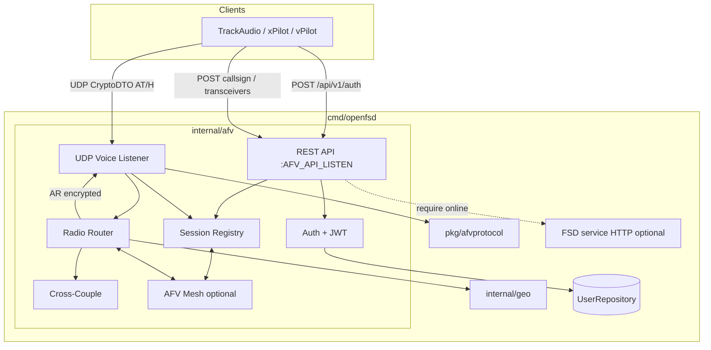
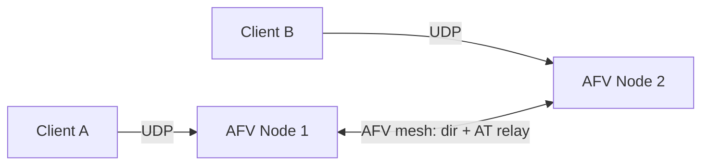

# Audio for VATSIM (AFV) Server for openfsd — Full Feature Implementation

| Field | Value |
|-------|--------|
| **Document** | AFV (Audio for VATSIM) server — full feature design |
| **Author** | _(design author / implementer)_ |
| **Date** | 2026-07-28 |
| **Status** | **Draft** (rev 2 — review e59fdb24 addressed) |
| **Project** | openfsd |
| **Target land path** | `docs/design/afv-server.md` (when accepted) |
| **Related** | `Agents.md`, `docs/design/distributed-openfsd.md`, `internal/auth`, `internal/geo`, `internal/cluster`, `internal/db`, `cmd/openfsd/main.go`, [AFV-Native](https://github.com/xsquawkbox/AFV-Native) (BSD-3) |
| **Protocol source of truth** | AFV-Native headers/sources (Chris Collins); also used by TrackAudio, xPilot, VectorAudio, vPilot (VATSIM clients) |
| **Revision** | rev 2: JWT/`internal/auth` alignment; normative HA recipe; bootstrap; mesh/XC/concurrency/coverage/PR-plan fixes |

---

## Overview

openfsd today is an FSD data-plane + boring-web control plane. Clients (vPilot, xPilot, TrackAudio, AFV-Native) obtain **voice** from a completely separate service: **Audio for VATSIM (AFV)**. AFV is a two-plane system:

1. **API server (HTTPS REST JSON)** — authentication, callsign voice sessions, transceiver posts, station aliases.
2. **Voice server (UDP CryptoDTO)** — encrypted Opus frames with smart spatial / frequency routing. The server does **not** decode Opus; it is a crypto endpoint + frequency/geo router.

This design adds a full-featured, openfsd-native AFV implementation as an optional service in the single `openfsd` binary (`-afv`), reusing existing auth (CID/password + `internal/auth` JWT helpers), `internal/geo` for range, `internal/db` for credentials, and an AFV-specific cluster mesh for multi-node voice — **without** putting Opus or live transceiver state into rqlite, and without violating the enforced import graph.

```text
Clients (TrackAudio / xPilot / vPilot / AFV-Native)
   │ HTTPS REST                         │ UDP CryptoDTO (ChaCha20-Poly1305)
   ▼                                    ▼
┌──────────────────────────────────────────────────────────────────────┐
│ cmd/openfsd  [-fsd] [-web] [-afv]                                    │
│                                                                      │
│  FSD gnet :6809     web Gin :8000     AFV API HTTPS    AFV UDP voice │
│       │                  │                 │                 │       │
│       ▼                  ▼                 ▼                 ▼       │
│  postoffice         service HTTP      internal/afv      radio router │
│  + cluster mesh     + /api/v1         REST + JWT        AT → AR      │
│                           │                 │                 │       │
│                           └──── shared UserRepository / JWT secret ──┘
└──────────────────────────────────────────────────────────────────────┘
```

---

## Background & Motivation

### Why AFV is separate from FSD

VATSIM (and thus openfsd clients) treat **data** and **voice** as independent attachment planes:

| Plane | Protocol | Typical endpoint | Purpose |
|-------|----------|------------------|---------|
| FSD | TCP text packets (`pkg/protocol`) | `fsd.example:6809` | Position, text, flight plans |
| AFV API | HTTPS REST JSON | `https://voice.example` | Auth, session, radios |
| AFV Voice | UDP CryptoDTO | `host:port` from POST callsign | Encrypted Opus |

Clients configure a **voice base URL** (e.g. `https://voice1.vatsim.net`). They never speak FSD for voice. An openfsd network without AFV forces operators onto third-party voice (Discord, etc.) and breaks VATSIM-shaped client UX.

### Protocol provenance (source of truth)

Primary open client library: **[xsquawkbox/AFV-Native](https://github.com/xsquawkbox/AFV-Native)** (BSD-3-Clause, Christopher Collins). Used by TrackAudio, xPilot, VectorAudio; shapes client expectations for REST paths, JSON field names, CryptoDTO layout, and DTO names.

Critical constants (`include/afv-native/afv/params.h`):

| Constant | Value | openfsd use |
|----------|-------|-------------|
| `NetworkVersion` | `3a5ddc6d-cf5d-4319-bd0e-d184f772db80` | **Library constant / future only** — **not** required in AuthRequest JSON (`username`/`password`/`client` only). Expose as `pkg/afvprotocol.NetworkVersion` for metadata; do not require clients to send it. |
| Heartbeat interval | 3000 ms | Client timer; server replies to `H` with `HA` |
| Heartbeat timeout | 10000 ms | Server reaper aligned with client |
| Transceiver update interval | 20000 ms | Client-driven POST interval |

CryptoDTO constants (`include/afv-native/cryptodto/params.h`):

| Constant | Value |
|----------|-------|
| AEAD key size | 32 bytes |
| AEAD IV size | 12 bytes |
| AEAD tag size | 16 bytes |
| Max datagram | 65536 (protocol absolute); openfsd **P0 practical reject cap** = **8192** bytes (see Security) |
| Modes | 0=Undefined, 1=None, 2=ChaCha20Poly1305 |

### Current openfsd seams this design reuses

| Surface | Path | AFV use |
|---------|------|---------|
| Process entry | `cmd/openfsd/main.go` | Add `-afv`; colocated DSN rewrite; goroutine lifecycle like FSD/web |
| Envconfig | `internal/server/config.go` / `internal/web` `NewDefaultServer` | `afv.NewDefault(ctx)` mirrors web: envconfig + DB open + migrate + `InitDefaultConfig` |
| User store | `internal/db.UserRepository` | CID + password verify (same as FSD password path in `conn.go`) |
| Config KV | `db.ConfigJwtSecretKey` (`"JWT_SECRET_KEY"`) | Shared HS256 secret unless `AFV_JWT_SECRET` override |
| JWT | `internal/auth` (`MakeJwtToken` / `ParseJwtToken`, HS256, **`iss=openfsd`**) | AFV bearer: `token_type=afv`; service gate: `token_type=fsd_service` |
| Geo | `internal/geo` | Haversine / `DistanceSq` / `BoundingBox` / cell grid for range index |
| Service HTTP | `internal/server/http_service.go` + `serviceapi` | Optional “require FSD online” via `GET /online_users` |
| Cluster patterns | `internal/cluster` | Framing / PSK / interest **patterns only**; AFV mesh is separate |
| Import graph | `scripts/check-import-graph.sh` | New package edges + coverage floors |
| Hygiene | `scripts/check-hygiene.sh` | No panic / slog-only / no fmt.Print |

### Pain points without native AFV

1. No VATSIM-compatible voice for club/VA/regional networks running openfsd.
2. Operators cannot offer TrackAudio/xPilot/vPilot voice against their certificate DB.
3. Cross-coupling, frequency aliases, and air-to-air VHF are network features that third-party Discord cannot provide.
4. Clustering FSD without voice clustering leaves multi-region incomplete.

---

## Goals & Non-Goals

### Goals

1. **Wire-compatible AFV API + Voice server** for AFV-Native-derived clients (TrackAudio, xPilot, VectorAudio; vPilot as stretch/manual validation).
2. **Single-binary opt-in** via `-afv`, envconfig for listen/advertise addresses, JWT, range knobs.
3. **Auth** against openfsd `UserRepository` (CID as username, bcrypt password verify); signed JWT with `exp` via existing `internal/auth` helpers.
4. **Session lifecycle**: POST callsign → channel keys → UDP bind after first valid packet → H/HA heartbeats → DELETE / timeout teardown.
5. **Radio router**: same-frequency match, geo range, `DistanceRatio`, multi-transceiver ATC, pilot A2A, cross-coupling (phased).
6. **Opaque Opus** — never decode/encode audio on the server hot path.
7. **Clustering** optional: sticky clients + transceiver directory mesh + AT frame relay; never Opus-in-rqlite.
8. **Import-graph clean**, race-clean, coverage floors for new pure packages.
9. **Phased delivery** (P0→P2) with independently mergeable PRs.

### Non-Goals (v1 / design boundaries)

- Opus codec, mixing, or VHF DSP on the server (client-side in AFV-Native).
- Terrain diffraction / SRTM path loss (documented P2; free-space + altitude model is P0).
- Full ATIS TTS synthesis pipeline (P2 / external integration).
- HF / SELCAL fidelity beyond simple range tables (P2).
- Replacing Discord for non-AFV clients.
- Putting AFV control plane into `internal/web` as a required dependency of core voice (web admin for aliases is optional PE later).
- Forcing AFV on by default for every openfsd deploy.
- Encoding AFV live state in rqlite or FSD position packets.
- Extending `internal/cluster` FSD frame types with high-rate Opus (separate AFV mesh).
- Full multi-node production mesh in the first land (first mesh cut = memory mesh / two-node e2e; production framing is a design-addendum track — see Clustering).

---

## Proposed Design

### High-level architecture



### Package layout (Agents.md ownership)

| Package | Owns | Import constraints |
|---------|------|-------------------|
| **`pkg/afvprotocol`** | Pure CryptoDTO frame + DTO types + AEAD encapsulate/decapsulate + goldens | **No I/O**. Allowlist: stdlib + `golang.org/x/crypto` (chacha20poly1305). Msgpack: **hand-rolled minimal subset** for AFV array DTOs only (stdlib). |
| **`internal/afv`** | REST API, UDP voice server, session registry, radio router, range model, station aliases, config, bootstrap (`NewDefault`), optional AFV mesh | May import: `pkg/afvprotocol`, `internal/geo`, `internal/db`, `internal/auth`, `internal/serviceapi` (DTOs only), stdlib, envconfig/jwt as needed. **Must not** import `internal/server`, `internal/session`, `internal/postoffice`, `internal/web`, `internal/cluster`, `internal/sweatbox`, `internal/metar`. |
| **`cmd/openfsd`** | `-afv` flag, colocated lifecycle, shared memory DSN rewrite when AFV shares DB with FSD/web | May import `internal/afv` (wires deps only) |

**Rationale for `pkg/afvprotocol` vs pure `internal/afv`:**

- Matches `pkg/protocol` / `pkg/twrfiles` ownership: wire format is a public, fixture-tested contract.
- Enables a future `pkg/afvclient` (test client / e2e) without importing `internal/*`.
- Forces goldens and ≥98% coverage floor on the wire layer.

**Rationale against stuffing AFV into `internal/cluster` or `internal/server`:**

- FSD mesh frame types and deadlock rules are FSD-specific; high-rate voice would pollute claim/directory semantics.
- `internal/web` must never import server/session/cluster; AFV is a peer service like FSD, not a web submodule.
- Server package is already large (gnet + handlers + sweatbox host).

#### Agents.md table additions (to land with PR-1)

```text
| pkg/afvprotocol | Pure CryptoDTO wire + AFV DTOs + AEAD | No I/O; stdlib + x/crypto only |
| internal/afv    | AFV REST API + UDP voice + radio router + session registry + optional AFV mesh | geo, db, auth, afvprotocol, serviceapi DTOs; never server/web/session/postoffice/cluster |
```

#### Import graph script additions (exact)

Append to `scripts/check-import-graph.sh` **after** existing checks (do not replace the web block):

```bash
# pkg/afvprotocol — stdlib + golang.org/x/crypto only (go.mod already has x/crypto)
check_imports_allowlist "pkg/afvprotocol" "${MODULE}/pkg/afvprotocol/..." \
  "golang.org/x/crypto"

# internal/afv — forbid FSD internals and web
check_no_imports "internal/afv" "${MODULE}/internal/afv/..." \
  "${MODULE}/internal/server" \
  "${MODULE}/internal/session" \
  "${MODULE}/internal/postoffice" \
  "${MODULE}/internal/web" \
  "${MODULE}/internal/cluster" \
  "${MODULE}/internal/sweatbox" \
  "${MODULE}/internal/metar"
```

**Edit the existing web forbid list** (current lines ~167–175) by appending one path — do not invent a second `check_no_imports "internal/web"`:

```bash
check_no_imports "internal/web" "${MODULE}/internal/web/..." \
  "${MODULE}/internal/session" \
  "${MODULE}/internal/postoffice" \
  "${MODULE}/internal/metar" \
  "${MODULE}/internal/sweatbox" \
  "${MODULE}/internal/server" \
  "${MODULE}/internal/cluster" \
  "${MODULE}/internal/afv"
```

`cmd/openfsd` may import `internal/afv` (no forbid needed; cmd is outside the checked internal edges).

#### Coverage floors (normative — KD-14)

| Package | Floor | When |
|---------|-------|------|
| `pkg/afvprotocol` | **≥98% hard** | From PR-1 (`scripts/check-coverage.sh` + Agents.md §8) |
| `internal/afv` | **≥80% soft** (report only) | Through end of P0 (PR-5/6) |
| `internal/afv` | **≥85% hard** | Starting PR that closes P0 process surface (PR-6), or next PR if mesh not yet landed |
| Mesh subfiles | count toward `internal/afv` | When PR-10+ lands; floor stays 85% unless raised to 90% later |

Exact `check-coverage.sh` hard-map edits:

- **PR-1:** add `"pkg/afvprotocol": 98.0`
- **PR-6:** add `"internal/afv": 85.0` hard (and keep soft aspirational only if desired for overall)

---

### CLI & process model

#### Flag semantics

```go
fsdFlag := flag.Bool("fsd", false, "run the FSD server …")
webFlag := flag.Bool("web", false, "run the web UI …")
afvFlag := flag.Bool("afv", false, "run the AFV voice API + UDP voice server")
// Default when NO flags: fsd+web only (AFV opt-in).
// When any flag is set: run exactly the selected set.
if !runFSD && !runWeb && !runAFV {
    runFSD, runWeb = true, true
}
```

**Key decision: AFV is opt-in, not part of the empty-flag default.**

Rationale:

1. AFV exposes a **public** HTTPS API and UDP voice surface; club FSD deploys often do not want that without TLS/ops intent.
2. Matches sweatbox “disabled unless configured” culture.
3. Default `docker-compose.yml` (FSD+web only) stays simple; AFV ports are additive.
4. Operators who want all three run: `openfsd -fsd -web -afv` or document a compose profile.

Colocated memory DSN rewrite today covers FSD+web. Extend:

```go
// Any multi-service process that opens the user DB must share :memory:.
// If ≥2 of {fsd, web, afv} are enabled and DSN is bare ":memory:", rewrite
// to db.SharedMemorySQLiteDSN (same as today's fsd+web path).
normalizeColocatedMemoryDSN(runFSD, runWeb, runAFV)
```

#### Bootstrap: `afv.NewDefault(ctx)` (mirror web/FSD)

AFV **owns its own DB open path** when enabled. It must not depend on FSD having already migrated when running **`-afv` alone**.

```text
afv.NewDefault(ctx):
  1. envconfig → afv.Config (+ shared DATABASE_* env, same names as server/web)
  2. RequireDatabaseDriver / OpenRepositories (same pattern as internal/web.NewDefaultServer)
  3. If DATABASE_AUTO_MIGRATE:
       - sqlite: migrate locally
       - rqlite: only if DATABASE_MIGRATE_LEADER (same policy as web/FSD)
  4. db.InitDefaultConfig(ctx, ConfigRepo)  // seeds JWT_SECRET_KEY via SetIfNotExists
  5. Resolve JWT secret:
       - if AFV_JWT_SECRET non-empty → use that (raw string or hex; document as raw HMAC key material)
       - else ConfigRepo.Get(ctx, db.ConfigJwtSecretKey)  // constant "JWT_SECRET_KEY"
  6. Require AFV_UDP_ADVERTISE_IPV4 non-empty when starting UDP
  7. Build Server{users, configKV, jwtSecret, registry, router, ...}
```

**Startup order in `cmd/openfsd`:**

| Flags | Order |
|-------|--------|
| `-fsd` (+ optional web/afv) | Construct FSD first (`server.NewDefault`) so migrations/admin seed complete; then wait for service HTTP if web; then start AFV goroutine |
| `-web` without `-fsd` | web `Main` migrates + `InitDefaultConfig` itself |
| **`-afv` alone** | `afv.NewDefault` migrates + `InitDefaultConfig` itself — **must work with empty DB** |
| `-fsd -afv` | FSD first; AFV `NewDefault` uses same DSN; `InitDefaultConfig` is idempotent (`SetIfNotExists`) |

Acceptance (PR-6): both `openfsd -afv` alone and `openfsd -fsd -web -afv` boot and serve `POST /api/v1/auth` against a test user.

#### Config (`internal/afv.Config`, envconfig)

| Env | Default | Purpose |
|-----|---------|---------|
| `AFV_API_LISTEN` | `127.0.0.1:8080` | REST bind (loopback default; public deploys set `0.0.0.0:443` behind TLS terminator or use TLS fields) |
| `AFV_API_PUBLIC_BASE_URL` | `""` | Optional; not required by clients (they pin base URL themselves) |
| `AFV_UDP_LISTEN` | `0.0.0.0:50000` | UDP voice bind |
| `AFV_UDP_ADVERTISE_IPV4` | **required when AFV on** | `host:port` returned as `addressIpV4` (must be client-reachable) |
| `AFV_UDP_ADVERTISE_IPV6` | `""` | `addressIpV6` or empty string |
| `AFV_TLS_CERT_FILE` / `AFV_TLS_KEY_FILE` | empty | If set, serve HTTPS; else plain HTTP (dev/LAN). Production: TLS terminator or these files. |
| `AFV_JWT_SECRET` | empty | Override HMAC secret; **else** `ConfigRepo.Get(db.ConfigJwtSecretKey)` |
| `AFV_JWT_TTL` | `1h` | Token lifetime; clients refresh 60s before `exp` |
| `AFV_HEARTBEAT_TIMEOUT` | `10s` | Match AFV-Native client timeout |
| `AFV_SESSION_IDLE_TIMEOUT` | `30s` | Teardown if no UDP after POST or after last packet |
| `AFV_MAX_SESSIONS` | `5000` | Global concurrent voice sessions |
| `AFV_MAX_SESSIONS_PER_CID` | `5` | Per-certificate cap |
| `AFV_AUTH_FAIL_MAX` / `AFV_AUTH_FAIL_WINDOW` | `20` / `1m` | Mirror FSD auth fail rate limit |
| `AFV_MAX_DATAGRAM` | `8192` | Reject larger UDP frames before decrypt (P0 amplification floor) |
| `AFV_REQUIRE_FSD_ONLINE` | `false` | If true, POST callsign checks callsign online on FSD **and** CID match |
| `AFV_FSD_HTTP_SERVICE_ADDRESS` | `http://127.0.0.1:13618` | Service HTTP base for online check |
| `AFV_CALLSIGN_STRICT` | `false` | If true, POST callsign when in use returns **409** instead of replace |
| `AFV_RANGE_UNICOM_NM` | `15` | Range for 122.800 MHz (Hz `122800000`) |
| `AFV_RANGE_DEFAULT_NM` | `40` | Default air-to-air / tower-ish |
| `AFV_RANGE_ATC_NM` | `150` | Default ATC radio max |
| `AFV_RANGE_EDGE_RATIO` | `0.1` | DistanceRatio at range edge |
| `AFV_STATIONS_FILE` | empty | JSON file of station aliases (P1 content; route always present) |
| `AFV_CROSS_COUPLE` | `true` | Enable XC policy when ATC multi-freq (P1) |
| `AFV_CLUSTER_ENABLED` | `false` | Multi-node AFV mesh |
| `AFV_CLUSTER_NODE_ID` / `LISTEN` / `PEERS` / `PSK` | | Mesh config (P1+) |
| `DATABASE_DRIVER` / `DATABASE_SOURCE_NAME` / `DATABASE_AUTO_MIGRATE` / `DATABASE_MIGRATE_LEADER` / `DATABASE_MAX_CONNS` / `AUTH_READ_LEVEL` | same as FSD/web | Shared UserRepository + config KV |

Database: AFV **reads** users and config KV. No new durable tables for P0 sessions (ephemeral). P1 station aliases may use file or config KV; optional `afv_stations` migration later.

---

### REST API (control plane)

Exact client contract from AFV-Native `APISession.cpp` / `VoiceSession.cpp`.

| Method | Path | Auth | Status codes | Purpose |
|--------|------|------|--------------|---------|
| `POST` | `/api/v1/auth` | none | 200 raw JWT; 400 bad body; 401 bad password; 403 rejected | Login |
| `GET` | `/api/v1/stations/aliased` | Bearer | 200 JSON array | Station frequency aliases (**P0 returns `[]`**) |
| `POST` | `/api/v1/users/{username}/callsigns/{callsign}` | Bearer | 200 JSON; 409 if strict | Create / replace voice session |
| `DELETE` | `/api/v1/users/{username}/callsigns/{callsign}` | Bearer | 200 | Tear down |
| `POST` | `/api/v1/users/{username}/callsigns/{callsign}/transceivers` | Bearer | 200 | Replace transceiver list |

**Auth request** (camelCase JSON only — no `NetworkVersion` field required):

```json
{"username":"1000001","password":"...","client":"TrackAudio"}
```

**Auth response:** body is the **raw JWT string** (not a JSON wrapper). Return `200` with `Content-Type: text/plain; charset=utf-8` and the compact JWT. Clients use `getResponseBody()` as the bearer token.

#### JWT claims — aligned with `internal/auth` (KD-5)

**Do not** invent `iss=openfsd-afv`. Verified in tree:

- `internal/auth` hardcodes `issuer = "openfsd"` and `ParseJwtToken` uses `jwt.WithIssuer(issuer)`.
- `CustomFields` has `token_type`, `cid`, names, `network_rating` only — no `username` / `client`.
- Service-HTTP middleware requires `token_type == "fsd_service"` and Administrator rating with **issuer `openfsd`**.

**AFV access token (normative):**

```go
// Prefer reusing MakeJwtToken so ParseJwtToken works unchanged.
tok, err := auth.MakeJwtToken(&auth.CustomFields{
    TokenType:     "afv",
    CID:           cid,
    NetworkRating: protocol.NetworkRating(user.NetworkRating), // or Observer minimum
}, ttl)
raw, err := tok.SignedString(secretKey)
```

Emitted claims (illustrative JSON):

```json
{
  "iss": "openfsd",
  "exp":  ...,
  "nbf":  ...,
  "iat":  ...,
  "jti":  "...",
  "token_type": "afv",
  "cid": 1000001,
  "network_rating": 1
}
```

| Claim | Required on AFV bearer | Notes |
|-------|------------------------|-------|
| `iss` | **`openfsd`** | From `MakeJwtToken` |
| `exp` | **yes** | Client only parses `exp` (verify false / alg none) |
| `token_type` | **`afv`** | Middleware rejects other types |
| `cid` | **yes** | Path `{username}` must equal `strconv.Itoa(cid)` |
| `username` / `client` | **not required** | Client name may be logged at auth time only; not a JWT claim |

**FSD service tokens** for the online gate remain:

```go
auth.MakeJwtToken(&auth.CustomFields{
    TokenType:     "fsd_service",
    CID:           adminCIDOrZero,
    NetworkRating: /* ≥ Administrator as used by web */,
}, shortTTL)
```

Same secret as FSD service HTTP (`db.ConfigJwtSecretKey` unless AFV uses a dedicated secret **only for AFV bearer validation** — if `AFV_JWT_SECRET` is set, **service-gate JWT must still use the FSD/shared config secret**, not the AFV-only override).

Client parses with `algorithms({"none"}), verify(false)` but **reads `exp`**. Default TTL 1h; client re-auths 60s before expiry (or 59 min if no `exp`).

Path `{username}` must match JWT `cid`. Callsign is case-preserved for wire but uniqueness compares case-insensitively (match FSD callsign norms).

**Any authenticated CID may POST any callsign** (P0; document). Impersonation of an *online* FSD user is mitigated when `AFV_REQUIRE_FSD_ONLINE=true` (see Integration).

**PostCallsignResponse:**

```json
{
  "voiceServer": {
    "addressIpV4": "203.0.113.10:50000",
    "addressIpV6": "",
    "channelConfig": {
      "channelTag": "550e8400-e29b-41d4-a716-446655440000",
      "aeadReceiveKey": "<base64 32 bytes>",
      "aeadTransmitKey": "<base64 32 bytes>",
      "hmacKey": null
    }
  }
}
```

**Key naming is from the client's perspective:**

| JSON field | Client use | Server use |
|------------|------------|------------|
| `aeadTransmitKey` | Encrypt client→server | **Decrypt** inbound UDP |
| `aeadReceiveKey` | Decrypt server→client | **Encrypt** outbound UDP |

Generate both keys with `crypto/rand` (32 bytes each). `channelTag` = UUID string. Server stores session keyed by `channelTag` and by `(cid, callsign)`.

**Mandatory golden (PR-1):** AFV-Native `test/cryptodto/test_ChannelConfig.cpp` fixture:

```json
{
  "channelTag": "abc123",
  "aeadReceiveKey": "N/v4cGEr0ko04zsli340q+r5eRrctKbfQJo6tJ88UtM=",
  "aeadTransmitKey": "594N9AjfiCL8b/P1oWA0i0IgUNg2mwbVvQI7yfb0Ud8=",
  "hmacKey": "totallyFakeHmacKey"
}
```

Decode must match the fixed 32-byte rx/tx key arrays from that test. Treat as **required** fixture under `pkg/afvprotocol/testdata/channelconfig_afvnative.json`, not optional.

**Transceiver body** (PascalCase fields — wire-compatible with AFV-Native):

```json
[
  {
    "ID": 0,
    "Frequency": 118700000,
    "LatDeg": 40.64,
    "LonDeg": -73.78,
    "HeightMslM": 10.0,
    "HeightAglM": 10.0
  }
]
```

Frequency is **integer Hz** (`118.700 MHz` → `118700000`).

**Station alias** (response array elements):

```json
{"id":"KJFK_TWR","name":"Kennedy Tower","frequency":123450000,"frequencyAlias":118700000}
```

**P0:** `GET /api/v1/stations/aliased` always registered and returns `[]` when no file/config. Clients that fetch aliases at connect must not 404. P1 fills content from `AFV_STATIONS_FILE`.

#### Auth implementation sketch

```go
// internal/afv/auth.go — local dummy hash; do NOT import internal/server
// (dummyBcryptHash is unexported in internal/server/limits.go).
var dummyBcryptHash = mustDummyBcrypt() // same recipe: bcrypt of "openfsd-timing-pad"

func (s *Server) handleAuth(w http.ResponseWriter, r *http.Request) {
    var req AuthRequest // username, password, client
    // parse JSON; 400 on failure
    cid, err := strconv.Atoi(req.Username)
    // rate-limit by remote IP (AFV_AUTH_FAIL_*)
    user, err := s.users.GetUserByCID(r.Context(), cid)
    hash := dummyBcryptHash
    if err == nil && user != nil {
        hash = user.Password
    }
    ok := s.users.VerifyPasswordHash(req.Password, hash) // always compare
    // 401 if !ok; 403 if rating suspended (optional)
    tok, err := auth.MakeJwtToken(&auth.CustomFields{
        TokenType: "afv",
        CID:       cid,
        // NetworkRating from user when available
    }, s.cfg.JWTTTL)
    raw, err := tok.SignedString(s.jwtSecret)
    w.Header().Set("Content-Type", "text/plain; charset=utf-8")
    w.WriteHeader(200)
    _, _ = w.Write([]byte(raw))
}
```

HTTP stack: prefer **stdlib `net/http` + `http.ServeMux`** (Go 1.22+ method routes) for AFV API. **Boring-web does not apply** to this machine API (no HTML UI required for P0).

---

### UDP CryptoDTO (media plane)

#### On-wire frame (explicit little-endian)

AFV-Native `Channel.cpp` uses raw `memcpy` for sizes/sequence and comments **“LE systems only.”** openfsd **always** uses `encoding/binary.LittleEndian` for:

- `headerSize` (u16)
- body `nameLen` / `dtoMsgpackLen` (u16)
- nonce bytes 4–11 = sequence as **u64 LE**
- never native-endian loads

```text
┌──────────────┬────────────────────────────┬────────────────────────────────┐
│ u16 LE       │ msgpack Header array       │ body (AEAD ciphertext + tag)   │
│ headerSize   │ [ChannelTag, Sequence, Mode]│ + 16-byte Poly1305 tag         │
└──────────────┴────────────────────────────┴────────────────────────────────┘
         AAD for AEAD = bytes[0 .. 2+headerSize)  (size prefix + header)
         Nonce = 12 bytes: zeros[0:4] || Sequence as u64 LE in bytes[4:12]
         Header is PLAINTEXT (outside AEAD) — ChannelTag readable before decrypt
```

`Mode`: production accepts **only ChaCha20-Poly1305 (2)**. **Reject Mode None (1)** and Undefined (0).

#### Normative inbound packet steps

```text
1. If len(pkt) > AFV_MAX_DATAGRAM (default 8192) → drop (no decrypt)
2. Parse u16 LE headerSize; slice header msgpack; unpack Header{ChannelTag, Sequence, Mode}
3. If Mode != ChaCha20Poly1305 → drop
4. Lookup session by ChannelTag (registry read lock) → miss: drop
5. Decrypt body with session.ClientTxKey (JSON aeadTransmitKey), AAD = pkt[0:2+headerSize],
   nonce from Sequence
6. Sequence window Received(Sequence): Before → drop; OK/Overflow → accept
7. Parse body: nameLen | name | dtoMsgpackLen | msgpack
   (client UDPChannel checks dtoMsgpackLen == remaining after name)
8. If !Bound: bind UDPAddr = src; Bound = true
   else if src != UDPAddr: drop (no rebind P0)
9. Dispatch by name ("H", "AT", …); update LastUDP
10. Encrypt/send replies OUTSIDE registry write locks (see Concurrency)
```

#### Body after decrypt

```text
u16 LE nameLen | name ASCII | u16 LE dtoMsgpackLen | msgpack payload
```

DTO names and msgpack **array** payloads:

| Name | Dir | Msgpack | Notes |
|------|-----|---------|-------|
| `H` | C→S | `[Callsign string]` | |
| `HA` | S→C | **`dtoMsgpackLen = 0`** (no msgpack bytes) | Normative server encode — see below |
| `AT` | C→S | `[Callsign, SequenceCounter u32, Audio bin, LastPacket bool, Transceivers [][ID u16]]` | |
| `AR` | S→C | `[Callsign, SequenceCounter u32, Audio bin, LastPacket bool, Transceivers [][ID u16, Frequency u32, DistanceRatio f32]]` | |

`DistanceRatio`: `0.0`–`1.0`, ~`0.1` at edge of reception (client VHF sim / volume / noise).

#### Normative HA (heartbeat ack) encode recipe

AFV-Native `VoiceSession::setupSession` registers DTO handler `"HA"` and ignores payload bytes after CryptoDTO decode. Server **must** still produce a fully valid encrypted frame.

**Preferred HA body (locked):**

```text
nameLen = 2 (u16 LE)
name    = 'H' 'A'
dtoMsgpackLen = 0 (u16 LE)
msgpack payload = <empty>
```

**Full HA datagram construction:**

```go
// session.TxSeq is server→client CryptoDTO sequence (independent of client Sequence).
seq := sess.TxSeq.Add(1) - 1
// Header msgpack array: [channelTag string, seq uint64, mode=2]
// Encrypt body with sess.ClientRxKey (JSON aeadReceiveKey)
// AAD = headerSize||header; nonce = LE seq in bytes 4..11
pkt := afvprotocol.EncapsulateHA(sess.ChannelTag, seq, sess.ClientRxKey[:])
conn.WriteTo(pkt, sess.UDPAddr)
```

| Field | Value |
|-------|--------|
| DTO name | exact `"HA"` (2 ASCII bytes) |
| `dtoMsgpackLen` | **0** (preferred; empty msgpack array `[]` also accepted by client but not emitted by openfsd) |
| Mode | `2` (ChaCha20Poly1305) |
| ChannelTag | same as session |
| Sequence | server `TxSeq` post-increment |
| Encrypt key | **ClientRxKey** (`aeadReceiveKey` from PostCallsignResponse) |

**PR-1 / PR-4 acceptance golden:** fixed keys + sequence → binary HA ciphertext fixture; plus **H decrypt → HA encrypt** round-trip test (client Tx key / server Rx key pair).

On `H`: update `LastUDP`, send HA as above. Reaper: if bound and `now-LastUDP > HeartbeatTimeout`, or unbound and `now-Created > SessionIdleTimeout`, delete session.

#### `pkg/afvprotocol` surface

```go
package afvprotocol

const (
    NetworkVersion = "3a5ddc6d-cf5d-4319-bd0e-d184f772db80" // metadata only
    ModeChaCha20Poly1305 = 2
    KeySize, NonceSize, TagSize = 32, 12, 16
    MaxDatagramProtocol = 65536
)

type Header struct {
    ChannelTag string
    Sequence   uint64
    Mode       int
}

// Channel holds AEAD keys from the *server* view after PostCallsignResponse:
// DecryptKey = client's aeadTransmitKey; EncryptKey = client's aeadReceiveKey.
type Channel struct{ /* ... */ }

func ParseHeader(pkt []byte) (hdr Header, headerEnd int, err error) // plaintext only
func (c *Channel) DecryptBody(pkt []byte, headerEnd int, seq uint64) (body []byte, err error)
func (c *Channel) Encapsulate(seq uint64, dtoName string, msgpackPayload []byte, dst []byte) (n int, err error)
// Encapsulate with dtoMsgpackLen=0 when msgpackPayload is nil/empty.
```

Goldens under `pkg/afvprotocol/testdata/` (mandatory):

- `channelconfig_afvnative.json` + decoded key vectors from AFV-Native `test_ChannelConfig.cpp`
- Header msgpack + full ChaCha frame round-trip
- H / HA / AT / AR encode-decode
- Sequence window outcomes vs AFV-Native `SequenceTest` semantics

#### Sequence / replay

Port AFV-Native `SequenceTest` outcomes explicitly:

| Outcome | Meaning | Server action |
|---------|---------|---------------|
| `OK` | in-window new sequence (including gap-fill inside window) | accept; advance window |
| `Before` | duplicate or too old (before window min) | **drop** |
| `Overflow` | sequence **beyond** window (forced window jump) | **accept**; advance/jump window |

**Window size (normative):** server RX window = **64** (= `sizeof(uint64_t)*8` bitfield maximum used by AFV-Native `sequence_bitfield_t`).  

Rationale: AFV-Native `UDPChannel` default constructor uses `receiveSequenceHistorySize = 10` for the **client’s** receive window. Server-side anti-replay should be at least as strict as the bitfield allows; 64 is the full bitfield width, not a claim that the client default is 64. Document this divergence; unit-test bitfield edge cases against AFV-Native `test_SequenceTest.cpp` behavior where fixtures exist.

Server **TX** sequence is an independent monotonic `uint64` per session (starts at 0).

---

### Session lifecycle

```mermaid
sequenceDiagram
  participant C as Client
  participant API as AFV REST
  participant R as Registry
  participant U as UDP Voice

  C->>API: POST /api/v1/auth {username,password,client}
  API-->>C: raw JWT (exp)
  C->>API: POST .../callsigns/{cs} Authorization Bearer
  API->>R: CreateOrReplaceSession(cid, cs, keys, channelTag)
  API-->>C: voiceServer{address, channelConfig}
  C->>U: UDP H / AT encrypted with aeadTransmitKey
  U->>R: Resolve channelTag; bind UDP src if first packet
  U-->>C: HA / AR encrypted with aeadReceiveKey
  C->>API: POST .../transceivers [radios]
  API->>R: UpdateTransceivers
  C->>API: DELETE .../callsigns/{cs}
  API->>R: RemoveSession
```

**Registry fields (ephemeral):**

```go
type VoiceSession struct {
    ChannelTag   string
    CID          int
    Callsign     string
    ClientName   string // from auth request; not a JWT claim
    ClientTxKey  [32]byte // JSON aeadTransmitKey — server decrypt
    ClientRxKey  [32]byte // JSON aeadReceiveKey — server encrypt
    UDPAddr      net.Addr
    Bound        bool
    Transceivers []Transceiver
    RxSeq        SequenceWindow // window=64
    TxSeq        atomic.Uint64
    LastUDP      time.Time
    Created      time.Time
    IsATC        bool
    CrossCouple  bool // P1; default true when IsATC && AFV_CROSS_COUPLE
}
```

Indexes (all guarded — see Concurrency):

- `byTag map[string]*VoiceSession`
- `byCallsign map[string]*VoiceSession` (upper)
- `byCID` for limits
- Frequency spatial index

**UDP source binding:** First packet that passes decrypt + tag + sequence binds `UDPAddr`. Default **no rebind**.

**Callsign uniqueness (KD-15 — locked):**

- One voice session per callsign (case-insensitive) per node.
- Default: **POST replaces** existing session for that callsign (any CID), rotates channel keys + tag, tears down old UDP binding. Matches client reconnect after crash.
- If `AFV_CALLSIGN_STRICT=true`, return **409** when callsign already held.
- Open Question #1 is **closed**.

---

### Concurrency model (KD-16)

REST, UDP readers, reaper, and (later) mesh mutate registry and frequency index concurrently. Apply the same spirit as Agents.md postoffice deadlock rule:

> **Never hold a registry/index lock across UDP `WriteTo` or mesh send if send may block.**

**Normative rules:**

1. **Single `sync.RWMutex` on Registry** for P0 (simpler; profile before sharding). Optional later: shard by `hash(channelTag) % N`.
2. **Inbound UDP:** `RLock` → lookup session pointer + copy keys/tag/bound addr needed for decrypt path; for route, under `RLock` (or short `Lock` for index) **copy recipient list** (`[]recipient{sessPtr or udpAddr, rxTrx…, ratio}`); **Unlock**; then encrypt + `WriteTo` outside lock.
3. **Transceiver POST / session create/delete:** `Lock`; update maps + frequency index; `Unlock`.
4. **Reaper:** `Lock` or collect candidates under `RLock` then delete under `Lock`; never send while locked.
5. **Per-session outbound (optional P0.5):** non-blocking enqueue to a small buffer (e.g. 64 packets); drop newest or oldest under load; never block UDP read loop on slow clients.
6. **Session fields:** `TxSeq` atomic; `LastUDP` updated under lock or via atomic unix-nano; transceiver slice replaced immutably (copy-on-write) so routers can hold a snapshot.

---

### Radio router

#### Index structure

```text
freqHz → cellKey → []trxRef{session*, trxID, lat, lon, altM}
```

Use spatial hashing (`internal/geo.CellCover` / `CellKey`) **per frequency** with cell size ~0.25° (`DefaultGridCellDeg`).

#### Route algorithm (AT → AR)

For each inbound `AT` (after normative decrypt path):

1. Validate `AT.Callsign` equals session callsign (case-insensitive).
2. **For each TX transceiver ID in `AT.Transceivers` independently:**
   - Resolve ID → that radio’s position + frequency from the session’s current transceiver table; skip unknown IDs.
   - Collect candidate RX transceivers on that frequency (and aliases when P1).
   - Skip same session (no hear-self).
   - Compute slant-range distance; apply range model; compute `DistanceRatio`.
   - Append matching RX radios to per-recipient accumulators (a multi-radio ATC may collect several RX entries from one or more TX legs).
3. For each recipient session, emit **one** `AR` with:
   - `Callsign` = **original transmitter callsign** (the pilot/controller who sent AT)
   - Same `SequenceCounter`, `Audio`, `LastPacket` as AT
   - `Transceivers` = all matched RX radios for that recipient (merged if multiple TX legs hit them)
4. Encrypt each AR with recipient ClientRxKey / next TxSeq; `WriteTo` outside locks.

**Multi-TX fan-out is first-class:** one AT with TX IDs `{0,1}` on two frequencies routes independently on each frequency/position, then merges AR transceiver lists per listener.

#### Range model (P0) — deterministic ATC class

| Class | Detection (P0 locked) | Default max range |
|-------|----------------------|-------------------|
| UNICOM | `freq == 122800000` | `AFV_RANGE_UNICOM_NM` (15) |
| ATC | `len(transceivers) >= 2` **OR** callsign contains `'_'` | `AFV_RANGE_ATC_NM` (150) |
| Default | otherwise | `AFV_RANGE_DEFAULT_NM` (40) |

**ATC / range class:** `IsATC = len(transceivers) >= 2 || strings.Contains(callsign, "_")`. Document false positives for pilot callsigns with underscores (rare on VATSIM-shaped nets); refine in P1 if needed. Open Question #2 closed for P0.

Channelization: exact Hz equality P0. Terrain: **P2** via `PathLoss` interface; P0 free-space.

#### Cross-coupling (P1) — normative algorithm

**When XC applies:** session `IsATC && CrossCouple && AFV_CROSS_COUPLE && distinct RX frequencies ≥ 2`.

**Enablement:** implicit for multi-freq ATC (no REST flag in P1). Pilots never XC.

**Algorithm (after primary AT→AR delivery to local listeners including the ATC):**

```text
Example:
  Pilot P on GND 121.900 transmits AT
  ATC C listens on GND 121.900 and TWR 118.700 with XC on
  Pilot Q listens on TWR 118.700

1. Primary route: P's AT on 121.900 → AR to C (and any other GND listeners).
   AR.Callsign = "P" (original transmitter). DistanceRatio from P's TX radio to each RX.

2. XC rebroadcast (server-internal, not a client AT):
   For each other frequency F on C's transceiver set where F != 121.900:
     Treat a synthetic transmitter at C's transceiver position on frequency F
     with the same Opus payload / LastPacket / SequenceCounter as P's AT
     (audio identity remains P's voice; see AR identity below).
     Route to listeners on F (e.g. Q) using DistanceRatio from C's F radio → listener.
     AR.Callsign = "P" (original speaker — controller is a coupler, not the speaker).
     Internal flag isXC=true so this packet is never XC'd again.
     Never deliver XC AR back to P or to C as a self-loop.

3. Loop prevention:
   - Packets with isXC never trigger another XC.
   - Mesh relay (when present) carries isXC so remote nodes do not double-couple.
```

**AR identity lock:** `Callsign` always names the **human speaker** (original AT callsign), not the coupling controller. Clients use callsign for UI “who is talking”; XC must not re-label as the ATC.

**DistanceRatio source:** primary path uses original TX position; XC leg uses **controller’s radio position on the coupled frequency**.

**TX-capable vs RX-only:** P0/P1 treat all posted transceivers as both RX and potential XC TX positions (clients post the radios they use). No separate TX-only flag in AFV-Native transceiver JSON.

**Acceptance (PR-9):** table-driven unit test for the example above; manual TrackAudio multi-freq ATC check before claiming VATSIM parity. AFV-Native client lib does not define server XC — document that openfsd XC is a **network policy**, validated empirically.

#### Station aliases (P1 content; P0 empty route)

Config file (`AFV_STATIONS_FILE`):

```json
[
  {"id":"BOS_GND","name":"Boston Ground","frequency":121900000,"frequencyAlias":121650000}
]
```

Router (P1): TX on `frequency` heard by RX on `frequencyAlias` and vice versa (bidirectional default).

---

### Clustering

#### Single-node default

`AFV_CLUSTER_ENABLED=false`. All sessions local. Sufficient for club/VA/regional ≤1k concurrent voice. **P0 is single-node only.**

#### Multi-node model (P1+; design freeze before production mesh)

**Chosen approach: sticky clients to one AFV node + mesh of transceiver directory + relay of AT frames.**



Why not Opus in rqlite: Raft latency kills real-time audio (**hard KD**).  
Why separate from `internal/cluster`: import allowlist, rate, interest model.

##### First mesh cut (implementable scope for PR-10)

**Non-goals for first cut:** production multi-region ops, dynamic membership, callsign claim RPC, encrypted mesh beyond shared PSK, >2 peers stress.

**Goals:** in-process / localhost **memory mesh** or TCP between two nodes; directory sync; AT relay; e2e two clients on different nodes hear each other in range.

##### Normative mesh framing (KD-17) — first cut

| Item | Spec |
|------|------|
| Transport | TCP between static peers (`AFV_CLUSTER_PEERS=id=host:port,...`) |
| Frame | `[u32 BE length][u8 type][payload]` where length = 1+len(payload); max payload **1 MiB** |
| Auth | First message must be Hello with HMAC-SHA256(PSK, nodeID\|\|nonce) or simple constant-time compare of shared `AFV_CLUSTER_PSK` on Hello (document chosen scheme in PR); reject peers failing auth |
| Types | `1=Hello`, `2=Heartbeat`, `10=TrxSnapshot`, `11=TrxDelta`, `12=SessionLeave`, `20=AudioRelay`, `30=Interest` |
| Heartbeat | every 2s; peer-death after 15s → drop remote directory entries for that node; local sessions unaffected |
| Interest | each node advertises set of `(freqHz, cellKey)` for local RX; rate ≤ 2 Hz; cap **4096** entries (drop coarsest cells if over) |
| AudioRelay payload | msgpack/json binary: originNode, callsign, seq, audio, last, isXC, []{freq, lat, lon, alt, txID} — **never client AEAD keys** |
| Relay queues | per-peer outbound channel depth **256**; **drop oldest AudioRelay** under pressure; never block UDP hot path on full mesh queue |
| Deadlock | never hold registry lock while sending on mesh TCP |
| Max peers first cut | **≤ 4** (document; like FSD mesh caution) |
| Sticky LB | required: REST sticky by CID or per-node API only advertises local UDP |
| Dual-login | per-region uniqueness only in first cut; no cluster-wide claim |

Keys never leave the home node. Local node re-runs range model for **local** RX only and encrypts AR with local keys.

**PR plan:** PR-10 is **framing + memory mesh two-node e2e only**. Production TCP polish / interest caps / ops docs may split to PR-10b after a short design addendum if scope grows. Full FSD-mesh-scale work is **out of band** relative to P0.

---

### Integration with FSD

| Mode | Behavior |
|------|----------|
| **Standalone AFV** | `afv.NewDefault` opens DB; `AFV_REQUIRE_FSD_ONLINE=false` |
| **Colocated** `-fsd -web -afv` | Shared DB; FSD migrates first; AFV `InitDefaultConfig` idempotent; optional online gate |
| **Split process** | AFV `DATABASE_*` → shared store; gate via `AFV_FSD_HTTP_SERVICE_ADDRESS` |

Online gate algorithm (**locked when flag true**):

1. Mint short-lived JWT with `auth.MakeJwtToken` → `token_type=fsd_service`, Administrator rating, **`iss=openfsd`**, secret = **shared config JWT secret** (not `AFV_JWT_SECRET` override).
2. `GET {base}/online_users` with Bearer token.
3. Require callsign present in pilots or ATC (case-insensitive) **and** `online.CID == jwt.CID` when the online entry includes CID (`serviceapi.OnlineUserGeneralData.CID`). If callsign online under a **different** CID → reject POST (403).
4. Cache snapshot 1–2s.

**P0 without gate:** any authenticated CID may create any callsign (document for operators).

**Do not** import `postoffice` from AFV.

---

### Feature support matrix

| Feature | Phase | Notes |
|---------|-------|-------|
| POST auth → raw JWT + exp | **P0** | `MakeJwtToken` / `token_type=afv` |
| `GET /stations/aliased` → `[]` | **P0** | Always registered |
| POST/DELETE callsign | **P0** | Replace default (KD-15) |
| POST transceivers | **P0** | Replace list |
| UDP CryptoDTO ChaCha | **P0** | Normative inbound steps |
| H → HA (`dtoMsgpackLen=0`) | **P0** | Golden required |
| AT → AR range route | **P0** | Per-TX-ID expansion |
| Pilot A2A / ATC multi-trx | **P0** | Deterministic IsATC rule |
| Sequence window 64 | **P0** | SequenceTest outcomes |
| Datagram size cap 8 KiB | **P0** | Amplification floor |
| Station aliases file content | **P1** | |
| Cross-coupling | **P1** | Normative algorithm; design-ready |
| AFV cluster mesh | **P1+** | First cut: 2-node memory/TCP; design KD-17 |
| Require FSD online + CID | **P0 optional** | Default off |
| Admin ops / PPS soft limits | **P2 / PR-11** | |
| ATIS / terrain / web stations | **P2** | |
| Inter-controller direct voice | **non-goal v1** | |

#### Client compatibility targets

| Client | Priority | Validation |
|--------|----------|------------|
| AFV-Native / goldens | P0 | Protocol fixtures + Go fake client |
| TrackAudio | P0 | Manual after CLI smoke |
| xPilot | P0 | Manual |
| VectorAudio | P1 | Manual |
| vPilot | P1 | Manual / capture fixtures |

---

### Performance targets

| Scale | Concurrent voice | Posture |
|-------|------------------|---------|
| Club | ~100 | Single node |
| Regional | ~1 000 | Single node |
| Large | ≤5 000 | Index + optional mesh |

| Metric | Target |
|--------|--------|
| Route latency p99 same host | **&lt; 20 ms** |
| UDP hot path | Pool buffers; copy recipients under lock only |
| Practical max datagram | **8192** (config) |

---

### Observability

| Signal | Mechanism |
|--------|-----------|
| Auth success/fail | slog + counters |
| Sessions create/destroy/replace | slog + gauge |
| UDP decrypt fail / oversize drop | rate-limited warn |
| Route fan-out | histogram |
| Mesh peer state | slog (when enabled) |

Never log JWT, passwords, or AEAD keys. ChannelTag OK.

---

### Security & Privacy

| Threat | Mitigation |
|--------|------------|
| Password brute force | Auth fail rate limit; local dummy bcrypt |
| JWT forgery | HS256 via `MakeJwtToken`; `token_type=afv`; `iss=openfsd` |
| UDP injection | AEAD + tag + seq window + source bind |
| Amplification (P0) | Reject datagrams `> AFV_MAX_DATAGRAM` (8192); session caps; Mode None rejected |
| Amplification (P1+) | Per-session PPS soft limits (PR-11) |
| Online impersonation | When gate on: callsign **and** CID match |
| Key leakage | Redact logs |
| Mesh | PSK Hello; no client keys on mesh |

TLS: production API HTTPS. Server can decrypt all voice (VATSIM model) — document; no recording in v1.

---

### Data model

**P0:** no new SQL tables. Sessions ephemeral.  
**JWT secret:** `AFV_JWT_SECRET` or `db.ConfigJwtSecretKey`.  
**P1 optional:** stations file / config KV / table.

---

### Testing strategy

| Layer | What |
|-------|------|
| Protocol goldens | ChannelConfig AFV-Native fixture; HA; H/AT/AR; SequenceTest |
| Range / router / XC | Table-driven |
| Auth REST | httptest + fake UserRepository |
| Bootstrap | `-afv` alone opens DB + InitDefaultConfig |
| E2E | Two fake clients A2A; race `-race` |
| Mesh first cut | Memory mesh two-node |

Gate commands (every PR):

```bash
go test -race ./pkg/afvprotocol/...   # when package exists
go test -race ./internal/afv/...      # when package exists
go test -race ./...
gofmt -l .
bash scripts/check-import-graph.sh
bash scripts/check-hygiene.sh
bash scripts/check-coverage.sh 80
go build -o openfsd ./cmd/openfsd
```

---

## API / Interface Changes

### `cmd/openfsd`

- New `-afv` flag; default trio logic; DSN rewrite includes AFV.
- `run()` starts `afv.NewDefault` / `Run` when enabled; FSD constructed first when present.

### New packages

- `pkg/afvprotocol`, `internal/afv` as specified.
- No FSD `pkg/protocol` wire changes.

### Web

- Import graph forbids `internal/afv`.
- P2 optional boring-web station admin.

---

## Alternatives Considered

### A1. AFV as subprocess / separate binary

**Pros:** Isolation. **Cons:** Breaks single-binary ops. **Verdict:** Rejected for default; `-afv`-only process still works.

### A2. AFV inside `internal/server`

**Pros:** Colocation. **Cons:** Import/size bloat. **Verdict:** Rejected.

### A3. Voice on FSD `internal/cluster`

**Pros:** One mesh. **Cons:** Rate/interest/import mismatch. **Verdict:** Rejected.

### A4. Third-party msgpack in `pkg/afvprotocol`

**Pros:** Speed of implementation. **Cons:** Pure-package deps. **Verdict:** Prefer hand-rolled; fallback only if needed.

### A5. Client-side-only voice

**Verdict:** Out of scope.

### A6. Default-on AFV with empty flags

**Verdict:** Rejected; opt-in `-afv`.

### A7. Reuse an existing AFV server binary beside openfsd

**Pros:** Less openfsd code if a mature open AFV server existed; operators might point clients at it.  
**Cons:** (1) No widely deployed open-source AFV **server** matching the AFV-Native client contract with openfsd’s certificate DB and JWT story; (2) dual-process auth sync (password hashes, suspensions) is ops-heavy; (3) clustering, online-gate, and range policy would diverge from openfsd control; (4) thin reverse-proxy that only swaps auth still needs a compatible voice plane.  
**Verdict:** **Rejected** for native product path. Operators may still run a third-party voice stack **instead of** `-afv`; openfsd does not maintain an adapter. Revisit only if a BSD/MIT AFV server becomes a clear upstream dependency.

---

## Rollout Plan

1. PR-1 wire package + goldens + import/coverage scripts.  
2. PR-2–5 server path to single-node voice (with empty stations route early).  
3. Thin CLI smoke as soon as UDP works (PR-4b) so advertise/NAT is de-risked before full compose.  
4. PR-6 process surface + compose profile.  
5. P1 aliases, XC (after XC algorithm freeze — done in rev 2), mesh first cut.  
6. P2 ATIS/terrain/admin on demand.

**Rollback:** stop `-afv`; no P0 schema dependency.

**Effort band (indicative):**

| Slice | Person-weeks |
|-------|----------------|
| P0 PR-1–6 (protocol → CLI) | **~4–7** |
| PR-7 online gate | **~0.5–1** |
| PR-8 aliases | **~0.5–1** |
| PR-9 XC | **~1–2** |
| PR-10 mesh first cut | **~2–4** (not full FSD-mesh scale) |
| PR-11 ops | **~0.5–1** |
| P2 | separate product call |

---

## Open Questions

1. ~~Callsign replace vs 409~~ → **Closed: KD-15 replace default; strict 409 opt-in.**
2. ~~ATC detection~~ → **Closed for P0: `len(trx)>=2 || strings.Contains(cs, "_")`.**
3. **HTTPS default bind** — loopback HTTP vs requiring TLS files in non-dev (ops preference).
4. ~~Auto `AFV_REQUIRE_FSD_ONLINE` when `-fsd`~~ → **Closed: remains explicit default false.**
5. **vPilot proprietary quirks** — may need capture fixtures after field trial.
6. ~~XC enable API~~ → **Closed for P1: implicit multi-freq ATC; normative algorithm above.**
7. **IPv6 advertise** — ops doc; empty string OK P0.
8. **Mesh Hello auth scheme detail** (HMAC vs raw PSK compare) — implementer may pick either constant-time PSK compare for first cut; document in PR-10.

---

## Key Decisions

| ID | Decision | Rationale |
|----|----------|-----------|
| **KD-1** | `pkg/afvprotocol` + `internal/afv` | Wire purity + server isolation |
| **KD-2** | `-afv` **opt-in** | Public surface needs intent |
| **KD-3** | Server swaps AEAD keys | AFV-Native client-perspective ChannelConfig |
| **KD-4** | Opaque Opus | Latency/CPU; protocol intent |
| **KD-5** | AFV JWT via `auth.MakeJwtToken`, **`iss=openfsd`**, `token_type=afv`; no required `username`/`client` claims; service gate uses `fsd_service` + shared secret | Matches real `internal/auth` + service HTTP middleware |
| **KD-6** | Raw JWT body on `/api/v1/auth` | AFV-Native `getResponseBody()` |
| **KD-7** | Free-space range P0; terrain P2 | Ship without SRTM |
| **KD-8** | Separate AFV mesh; not FSD cluster frames | Rates/imports/failure domains |
| **KD-9** | Sticky node + directory + AT relay; never Opus in rqlite | Correct crypto; real-time |
| **KD-10** | FSD online gate optional; when on, **callsign + CID** | Import-safe; anti-impersonation |
| **KD-11** | Hand-rolled minimal msgpack | Pure package |
| **KD-12** | Bind on first valid packet; no rebind P0 | Hijack resistance |
| **KD-13** | Stdlib `net/http` for AFV REST | Machine API |
| **KD-14** | Coverage: `pkg/afvprotocol` ≥98% hard PR-1; `internal/afv` soft 80% through P0 then **≥85% hard** at PR-6 | Single CI truth |
| **KD-15** | POST callsign **replaces** + rotates keys; `AFV_CALLSIGN_STRICT` → 409 | Reconnect; closes OQ-1 |
| **KD-16** | Copy recipients under lock; never block send while holding registry lock | Deadlock rule analogue |
| **KD-17** | Mesh first cut: length-prefix BE frames, static peers, PSK, queue depth 256 drop-oldest, ≤4 peers, 2-node e2e | Implementable without FSD-mesh scope |
| **KD-18** | HA: name `"HA"`, `dtoMsgpackLen=0`, encrypt ClientRxKey, server TxSeq++ | Wire-precise TrackAudio heartbeats |
| **KD-19** | Server RX sequence window **64** (bitfield max); not client default 10 | Stronger anti-replay; documented divergence |
| **KD-20** | P0 practical UDP max **8192** bytes | Amplification floor before PR-11 PPS |

---

## Risks

| Risk | Severity | Mitigation |
|------|----------|------------|
| Msgpack / HA layout mismatch | **High** | Goldens + HA recipe KD-18 |
| Key direction bugs | **High** | ChannelConfig AFV-Native fixture mandatory |
| Advertise/NAT wrong | **High** | Require advertise IPv4; early CLI smoke PR-4b |
| Mesh under-specified expansion | **Med** | First cut KD-17; addendum if ops needs more |
| Dense UNICOM CPU | **Med** | Index + size cap + later PPS |
| vPilot incompat | **Med** | Capture fixtures |

---

## References

- [AFV-Native](https://github.com/xsquawkbox/AFV-Native) — BSD-3  
  - `params.h`, `APISession`, `VoiceSession`, `Channel.cpp`, `UDPChannel.cpp`, `test_ChannelConfig.cpp`, `SequenceTest`  
- openfsd `Agents.md`, `internal/auth/jwt.go` (`issuer = "openfsd"`), `internal/db` (`ConfigJwtSecretKey`, `InitDefaultConfig`), `internal/web.NewDefaultServer`, `internal/server/http_service.go`, `internal/geo`, `docs/design/distributed-openfsd.md`, `scripts/check-import-graph.sh`

---

## PR Plan

Each PR: independently reviewable; house gates:

`go test -race ./... && gofmt -l . && bash scripts/check-import-graph.sh && bash scripts/check-hygiene.sh && bash scripts/check-coverage.sh 80 && go build -o openfsd ./cmd/openfsd`

### PR-1: `pkg/afvprotocol` CryptoDTO foundation

- **Title:** `afv: add pkg/afvprotocol (CryptoDTO + DTO goldens)`
- **Files:** `pkg/afvprotocol/**`, `scripts/check-import-graph.sh`, `scripts/check-coverage.sh` (`pkg/afvprotocol: 98`), `Agents.md`
- **Dependencies:** none
- **Effort:** ~1–1.5 pw
- **Description:** LE framing; ChaCha; minimal msgpack; **mandatory ChannelConfig AFV-Native golden**; HA encapsulate (`dtoMsgpackLen=0`); SequenceTest outcomes window=64; import allowlist `golang.org/x/crypto`.
- **Accept:** `go test -race ./pkg/afvprotocol/...`; coverage ≥98%; import-graph OK.

### PR-2: Config + REST auth + JWT + empty stations route

- **Title:** `afv: REST auth (MakeJwtToken afv) and stations/aliased empty`
- **Files:** `internal/afv/{config,auth,api,server,dummy_bcrypt}.go`, tests
- **Dependencies:** none on PR-1 for JWT; may land parallel; prefer after PR-1 for repo layout only
- **Effort:** ~0.5–1 pw
- **Description:** envconfig; `POST /auth` 400/401/403/200 raw token via `auth.MakeJwtToken` `token_type=afv` `iss=openfsd`; rate limit; local dummy bcrypt; **`GET /stations/aliased` → `[]`**; Bearer middleware parses with `ParseJwtToken`.
- **Accept:** `go test -race ./internal/afv/...` (auth tests).

### PR-3: Callsign session + transceiver REST

- **Title:** `afv: callsign create/replace and transceiver POST`
- **Files:** `internal/afv/{session,registry,api_callsign}.go`, tests
- **Dependencies:** PR-2
- **Effort:** ~0.5–1 pw
- **Description:** POST/DELETE callsign; **KD-15 replace**; keys + PostCallsignResponse; transceiver replace; per-CID limits; no UDP yet.
- **Accept:** unit tests replace + limits.

### PR-4: UDP voice H/HA + decrypt path

- **Title:** `afv: UDP CryptoDTO listener with normative HA`
- **Files:** `internal/afv/udp.go`, concurrency helpers, tests
- **Dependencies:** PR-1, PR-3
- **Effort:** ~1–1.5 pw
- **Description:** Normative inbound steps; size cap; bind; H→HA golden; sequence window; reaper; **no lock across WriteTo**.
- **Accept:** localhost UDP e2e H/HA; `-race`.

### PR-4b: Thin `-afv` smoke wiring (optional but recommended)

- **Title:** `afv: minimal cmd/openfsd -afv for live UDP smoke`
- **Files:** `cmd/openfsd/main.go` (flag + run AFV only path), `afv.NewDefault` bootstrap slice
- **Dependencies:** PR-4
- **Effort:** ~0.5 pw
- **Description:** De-risk advertise/NAT/DB bootstrap before full compose docs; `NewDefault` migrate + `InitDefaultConfig`.
- **Accept:** `openfsd -afv` alone serves auth + HA against test user.

### PR-5: Radio router AT→AR (single-node voice complete)

- **Title:** `afv: frequency/geo radio router AT to AR`
- **Files:** `internal/afv/{router,range,index}.go`, tests
- **Dependencies:** PR-4
- **Effort:** ~1–1.5 pw
- **Description:** Freq+cell index; range model; **per-TX-ID expansion**; DistanceRatio; IsATC rule; two-client A2A e2e.
- **Accept:** table-driven router + e2e A2A; `-race`.

### PR-6: Full CLI/compose + coverage floor harden

- **Title:** `afv: wire -afv colocated modes and compose profile`
- **Files:** `cmd/openfsd/**`, `docker-compose.afv.yml`, wiki, `check-coverage.sh` (`internal/afv: 85` hard), `Agents.md` §8
- **Dependencies:** PR-5 (PR-4b if present)
- **Effort:** ~0.5–1 pw
- **Description:** Flag defaults; DSN rewrite ≥2 services; startup order; document advertise; TrackAudio manual checklist.
- **Accept:** `-afv` alone and `-fsd -web -afv` boot tests; coverage floors.

### PR-7: Optional require-FSD-online + CID match

- **Title:** `afv: FSD online_users gate with CID match`
- **Files:** `internal/afv/fsdgate.go`, config, httptest tests
- **Dependencies:** PR-3 sufficient for unit tests; process integration after PR-6
- **Effort:** ~0.5 pw
- **Description:** `fsd_service` JWT with **shared** secret; callsign+CID; cache.
- **Accept:** unit tests gate allow/deny.

### PR-8: Station aliases file + alias-aware routing

- **Title:** `afv: station aliases content and router alias match`
- **Files:** `internal/afv/stations.go`, router, sample JSON
- **Dependencies:** PR-5 (route already exists empty from PR-2)
- **Effort:** ~0.5–1 pw
- **Description:** Load `AFV_STATIONS_FILE`; GET returns list; bidirectional alias match.
- **Accept:** unit tests alias routing.

### PR-9: Cross-coupling (**requires XC algorithm freeze — done rev 2**)

- **Title:** `afv: ATC cross-coupling rebroadcast`
- **Files:** `internal/afv/xcouple.go`, tests
- **Dependencies:** PR-5; design algorithm in this doc
- **Effort:** ~1–2 pw
- **Description:** Normative XC; AR callsign = original speaker; isXC flag; example unit test; manual TrackAudio note.
- **Accept:** unit example pilot GND / ATC XC / pilot TWR; no loop.

### PR-10: AFV mesh first cut (**design-addendum if scope grows**)

- **Title:** `afv: mesh framing + two-node directory and AT relay`
- **Files:** `internal/afv/mesh_*.go`, KD-17 implementation, memory mesh tests
- **Dependencies:** PR-5, PR-6; **not** blocked on full FSD-mesh parity
- **Effort:** ~2–4 pw
- **Description:** Frames, Hello/PSK, TrxDelta, AudioRelay, interest cap, drop-oldest queues, 2-node e2e. **No** production multi-region claim protocol.
- **Accept:** memory mesh two-node A2A; `-race`; document sticky LB.
- **Follow-on (optional PR-10b):** TCP ops hardening, peer-death synthetic leave, metrics — after field use.

### PR-11: Ops polish

- **Title:** `afv: kick endpoint, PPS limits, ops logging`
- **Files:** admin routes, limits, docs
- **Dependencies:** PR-6
- **Effort:** ~0.5–1 pw
- **Description:** Soft PPS; session kick; runbooks.
- **Accept:** unit tests limits.

### PR-12 (P2, optional): ATIS / terrain / web stations UI

- **Title:** `afv: P2 ATIS hook, terrain PathLoss, boring-web station admin`
- **Dependencies:** PR-8, PR-11; product priority
- **Effort:** TBD
- **Description:** Only when requested; boring-web checklist if web touches.

---

*End of design document (rev 2).*
