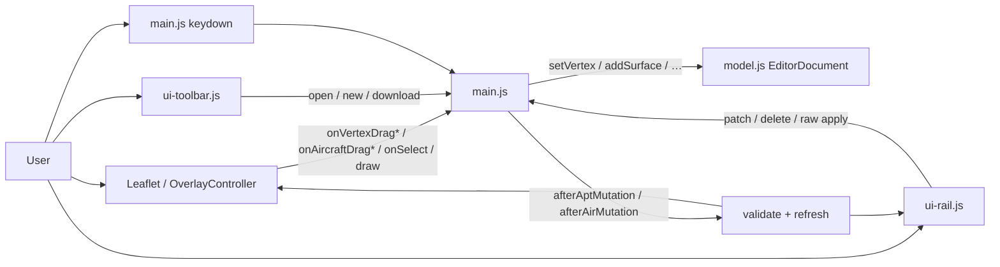
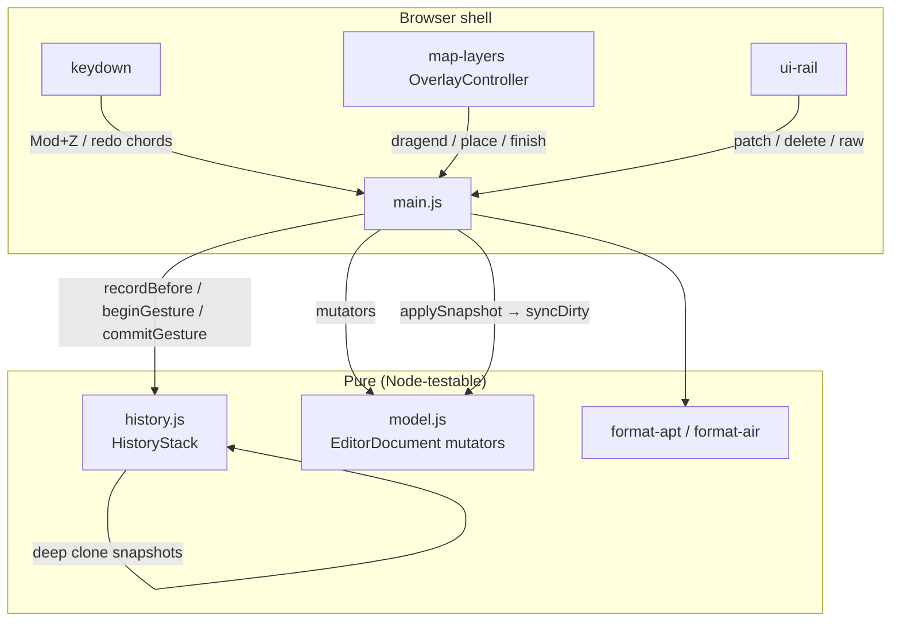

# Airport Editor: Undo / Redo

| Field | Value |
|-------|--------|
| **Document** | Undo/redo for `/airport-editor` document mutations |
| **Author** | _(design author / implementer)_ |
| **Date** | 2026-07-27 |
| **Status** | **Implemented** (PR1: pure `history.js` + tests; PR2: `main.js` wiring / gestures / keys / K13 seed; PR3: this design note + parent dirty baseline retcon) |
| **Parent designs** | [`docs/design/apt-air-editor.md`](apt-air-editor.md) (Implemented), [`docs/design/airport-editor-vertex-drag.md`](airport-editor-vertex-drag.md) (Implemented) |
| **Target branch** | `dev` (PR base; do not merge without user approval) |
| **Scope** | Client-only history stack for editor document; keyboard-only UI |

---

## Overview

> **Closeout (2026-07-27):** Code landed in `history.js` / `main.js` with pure tests under `webjs/airport-editor/history.test.js`. Keyboard-only undo/redo (`Mod+Z` / `Mod+Shift+Z` / `Mod+Y` when `!inField`), gesture-coalesced vertex/aircraft drag, snapshot stack (max depth 100), and K13 clean-content hash seeding at bootstrap / successful Open / New. Design history below is retained as the engineering record (key decisions, mutation inventory, checklist). Parent dirty-hash baseline prose retconned in [`apt-air-editor.md`](apt-air-editor.md).

The openfsd **Airport Editor** (`/airport-editor`) is a map-first, Admin-only progressive-enhancement tool for authoring paired `.apt` / `.air` documents entirely in the browser. Geometry, headers, and aircraft are mutated in place via `model.js` helpers. Before this work there was **no** undo stack: a mis-dragged vertex, accidental surface delete, or botched raw Apply was permanent until the user re-opened a file.

This design adds a **pure, Node-testable history module** and thin wiring in `main.js` so every **committed** document mutation is undoable/redoable via keyboard shortcuts. History is **snapshot-based** (deep clones of airport + aircraft + selection), with **gesture coalescing** so a vertex/aircraft drag is one undo step, not one step per pointer move. Dirty tracking continues to use FNV clean-content hashes (`last*DownloadHash`, K13); download itself is not an undo entry. **No toolbar undo/redo buttons** — keyboard only. No server persistence of history.

Primary touch surfaces:

| Piece | Path |
|-------|------|
| New pure history | `internal/web/static/js/openfsd/airport-editor/history.js` |
| Document model | `…/model.js` (unchanged mutators; optional tiny clone helper if useful) |
| Shell wiring | `…/main.js` (push before commit, undo/redo keys, drag gesture) |
| Tests | `webjs/airport-editor/history.test.js` (+ minor main-path coverage via history API only) |

---

## Background & Motivation

### Current architecture (relevant slice)



| Piece | Role today |
|-------|------------|
| `model.js` | Pure mutators: `setAirport`, `setAircraft`, `addSurface`, `updateSurface`, `deleteSurface`, `setVertex`, `insertVertex`, `deleteVertex`, `addAircraft`, `updateAircraft`, `deleteAircraft`, `snapAircraftToParking`, `updateAirportHeaders`, `resetDocument`, dirty hash helpers |
| `main.js` | Single ownership of `doc`; routes all UI events into mutators; `afterAptMutation` / `afterAirMutation` → `validateDocument` + `markServerValidationStale` + `refresh` |
| `map-layers.js` | Live vertex drag paints layers mid-gesture; **commits** on `onVertexDragEnd` / `onAircraftDragEnd` |
| `draw-tools.js` | Places park/aircraft or finishes polyline → `addSurface` / `addAircraft` |
| `ui-rail.js` | Field `change` → patch; actions for delete/insert vertex/raw apply |
| Dirty | `aptDirty` / `airDirty` + `lastAptDownloadHash` / `lastAirDownloadHash` (FNV-1a via `hashText`). **K13:** field names mean last clean content hash; seeded at bootstrap, successful Open, and New via download-format text; Blob download still overwrites via `noteDownload`. Pre-history code left hashes **null** on Open/bootstrap (null = always dirty under `syncDirtyFromHash`) |

There was **no** history structure before this work. Mutations remain in-place on the live `doc` object. Mid-drag already mutates `doc` on every move (`setVertex` / `updateAircraft`) without full refresh — important for coalescing design.

### Mutation inventory (must be undoable when committed)

| Source | Mutation path | Side | Commit boundary today |
|--------|---------------|------|------------------------|
| Vertex drag | `setVertex` mid-drag; again on dragend | APT | `onVertexDragEnd` → `afterAptMutation` |
| Aircraft drag | `updateAircraft` mid-drag + dragend | AIR | `onAircraftDragEnd` → `afterAirMutation` |
| Draw park | `addSurface` | APT | `placed-park` → `afterAptMutation` |
| Draw aircraft | `addAircraft` | AIR | `placed-aircraft` → `afterAirMutation` |
| Finish polyline | `addSurface` via `finishDraw` | APT | `doFinishDraw` → `afterAptMutation` |
| Airport headers | `updateAirportHeaders` | APT | rail `onAirportPatch` → `afterAptMutation` |
| Surface props | `updateSurface` | APT | rail `onSurfacePatch` → `afterAptMutation` |
| Delete surface | `deleteSurface` | APT | rail / Del key → `afterAptMutation` |
| Insert/delete vertex | `insertVertex` / `deleteVertex` | APT | rail → `afterAptMutation` |
| Aircraft props | `updateAircraft` | AIR | rail `onAircraftPatch` → `afterAirMutation` |
| Delete aircraft | `deleteAircraft` | AIR | rail / Del → `afterAirMutation` |
| Snap to parking | `snapAircraftToParking` | AIR | rail → `afterAirMutation` |
| Raw Apply APT/AIR | `setAirport` / `setAircraft` | APT/AIR | `onApplyRaw` → after* |
| Session bootstrap | `createEmptyDocument` + **seedCleanContentHashes** (K13) | baseline | stack empty; empty clean hashes so first undo can recompute clean |
| Open APT/AIR | `setAirport` / `setAircraft` (markDirty false) + **seed clean hash** via download-format helpers (K13) | replace | **clears history after success** (not undoable); failed open does not clear |
| New document | `resetDocument` + seed empty clean hashes (same helper) | replace | **clears history** |
| Download / mark clean | `noteDownload` / `markClean` | dirty only | **not** document content — no history entry |
| Mode / selection / fit / layer | UI chrome | — | **not** undoable (selection **is** restored with content snapshots for continuity) |
| Draw preview points (unfinished) | `draw` session only | — | **not** in document; Esc cancel has no history |
| Park / finish **cancel** after `ensureAirport` | `ensureAirport` may create empty APT + `aptDirty` before prompt returns null | APT shell | **no** history entry (pre-existing side effect); not undoable in v1 unless fixed separately |

### Pain points

1. Accidental delete or vertex drag has no recovery without re-opening a file.
2. Raw Apply replaces the whole side with no step-back.
3. Dense authoring sessions (taxiway reshape) need multi-step undo without re-download churn.

### Why now

Vertex drag is reliable (parent fix landed). The remaining high-friction gap for authors is **no history**. Scope is pure client JS — no import-graph, Go, or protocol risk.

---

## Goals & Non-Goals

### Goals

1. **Undo/redo all committed airport document mutations** that affect APT and/or AIR content (geometry, surface props, headers, aircraft list/props, raw apply).
2. **Keyboard only**: no toolbar undo/redo buttons. Optional minimal status-line feedback after undo/redo (reuse existing `showStatus` strip).
3. **Shortcuts** (normative — see Key Decisions K3 / K14) — conventional editor bindings only, **map/chrome focus only**:
   - **Undo:** `Ctrl+Z` (Windows/Linux) / `Cmd+Z` (macOS); no Shift — only when **`!inField`**.
   - **Redo:** `Ctrl+Y` and `Ctrl+Shift+Z` (Windows/Linux); `Cmd+Shift+Z` and `Cmd+Y` (macOS) — only when **`!inField`**.
   - **Do not** bind `Ctrl/Cmd+X` (cut) to redo or any editor history action.
   - When focus is in `INPUT` / `TEXTAREA` / `SELECT` / contenteditable, leave `Mod+Z` / redo chords to the **browser** (native text undo); do not `preventDefault` or run document history.
4. **Pure history module** unit-tested under `webjs/airport-editor/` without Leaflet/DOM.
5. **One undo step per completed drag** (vertex or aircraft), not per mousemove.
6. **Preserve dirty tracking** vs last clean-content hash: undo/redo recompute `aptDirty`/`airDirty` from current content vs **live** `last*DownloadHash` (hashes are not rewound by history). **Seed** those hashes at session bootstrap, on successful Open, and on New (K13) so never-downloaded clean state survives undo — including “open page → draw → undo” without clicking New.
7. **No server persistence** of history; clear on full document replace (Open / New).
8. **Incremental PR plan** mergeable into `dev`; small pure module + thin `main.js` wiring.
9. Respect boring-web, Agents.md web ownership, and **no** Playwright.

### Non-Goals

- Visual undo/redo toolbar buttons or menu items.
- Server-side version history, multi-user CRDT / OT, or collaborative undo.
- Undo of mode changes, base layer toggle, map pan/zoom, draw **in-progress** vertices (before finish), or download/mark-clean alone.
- Infinite history / disk-backed history.
- Rewriting mutators into a command pattern or making `model.js` immutable.
- Browser automation suite.
- Changing `pkg/twrfiles` wire format or Go validate APIs.
- Undo across Open/New (replace clears stack).
- Binding **cut** (`Ctrl/Cmd+X`) to redo or any history action (nonstandard; product decision: conventional chords only).
- Document-level undo/redo while typing in rail/raw fields (browser owns those chords; K14).
- Fixing pre-existing `ensureAirport`-before-prompt dirty side effects on cancelled park/finish (out of undo scope; document only).

---

## Key Decisions

| Decision | Choice | Rationale |
|----------|--------|-----------|
| **K1. History model** | **Document snapshots** (deep clone of airport + aircraft + selection), not inverse command objects | Small documents (KBTV APT ~2.5 KiB text; JSON clone ≪ 100 KiB typical); one pure module covers all mutation sites without wrapping each mutator; simpler tests |
| **K2. Push timing** | **Record-before-mutation**: push pre-state immediately before a committed mutation (or at gesture begin for drags) | After mutation, live `doc` is the new present; undo restores pre-state |
| **K3. Keyboard bindings** | Undo `Mod+Z`; Redo `Mod+Shift+Z` + `Mod+Y`. **No** `Mod+X` binding | Conventional browser/editor chords only; `Mod+X` remains cut. Early draft considered X-as-redo from a misstatement — **rejected** by product decision |
| **K4. Drag coalescing** | `beginGesture` on first mid-drag / dragstart baseline; `commitGesture` on dragend (push baseline if content changed); drop empty gestures | Matches product expectation; keeps stack size reasonable |
| **K5. Dirty flags** | **Not stored in snapshots.** On apply: restore content + selection; recompute dirty via `syncDirtyFromHash` against **current** `last*DownloadHash` using **only** `formatAptForDownload` / `formatAirForDownload` | Bootstrap/open/new seed remains the “last clean content” anchor; undo after download correctly re-dirties; mark-clean does not invent fake history |
| **K6. Open / New** | **`clearHistory` after successful** Open APT, Open AIR, and New only; failed open does not clear. Single stack: opening one side drops undo entries for the other. Bootstrap does **not** clear history (stack is already empty) | Aligns with “unsaved will be lost” confirms; avoids retaining huge prior docs; failed parse must not wipe a good stack |
| **K7. UI chrome** | No buttons; status flash optional (“Undid.” / “Redid.” / “Nothing to undo”) | Product requirement; strip already used for mode tips |
| **K8. Max depth** | Default **100** entries; drop oldest on overflow | Bounds memory; enough for a long reshape session |
| **K9. Clone strategy** | Prefer `structuredClone`; fallback `JSON.parse(JSON.stringify)`. **`captureSnapshot` and `applySnapshot` both deep-clone** so stack entries never share object identity with live `doc` | Document is JSON-safe; prevents silent corruption if a retained snap and live tree aliased the same objects |
| **K10. Selection** | Included in snapshot; restored on undo/redo | Map handles / rail inspector stay coherent with geometry |
| **K11. Mode / draw / serverValidation** | **Not** in snapshot. On undo/redo: leave mode; cancel in-progress draw; `markServerValidationStale` | Mode is intentional UI; unfinished draw is ephemeral; server confirm is a side channel |
| **K12. Module boundary** | New `history.js` pure; `main.js` owns when to push/apply; model mutators stay as-is | Same pattern as `model.js` / `draw-tools.js`; minimal rewrite |
| **K13. Clean-content hash baseline** | Seed `lastAptDownloadHash` / `lastAirDownloadHash` via **one helper** (`seedCleanContentHashes(doc)` → `hashText(formatAptForDownload(doc))` / `hashText(formatAirForDownload(doc))`) at: (1) **session bootstrap** immediately after `createEmptyDocument()`; (2) successful **Open APT** (apt side only) / **Open AIR** (air side only); (3) **New** after `resetDocument` (both sides). Leave dirty flags false when seeding a clean baseline. **Never** leave or reset hashes to `null` for a “clean” state — `syncDirtyFromHash` treats null as always dirty. Field names stay for compat — they mean “last clean content hash,” not download-only; download still overwrites via `noteDownload` | Without bootstrap seed, load→draw→undo false-dirties (hashes still null). Open/New alone miss the common no-New path. Single download-format recipe avoids formatAPT vs formatAptForDownload hash divergence |
| **K14. Keydown scope** | Document undo/redo chords run **only when `!inField`**. Save/Open remain the only `Mod+*` chords that work inside fields | Rail patches commit on `change` (blur); in-field Mod+Z would `preventDefault` browser text undo and `refresh` would wipe uncommitted input / raw buffer. Map-focused authoring is the primary undo surface |

---

## Proposed Design

### High-level architecture



### Snapshot shape

```js
/**
 * @typedef {Object} EditorSnapshot
 * @property {import('./model.js').Airport|null} airport
 * @property {import('./model.js').Aircraft[]} aircraft
 * @property {{ type: string, index: number }|null} selection
 * @property {number} _nextSurfaceId
 * // intentionally omitted: aptDirty, airDirty, last*DownloadHash,
 * // mode, serverValidation, filenames, parse error arrays
 */
```

**Included:**

- `airport` (full tree including surfaces/points/headers) or `null`
- `aircraft` array (full objects)
- `selection` (normalized or null)
- `_nextSurfaceId` so ids after undo/add stay monotonic and stable relative to that timeline

**Excluded (live on `doc` only):**

| Field | Why |
|-------|-----|
| `aptDirty` / `airDirty` | Recomputed from clean-content hashes (K5) |
| `lastAptDownloadHash` / `lastAirDownloadHash` | “Last clean content” anchors (seeded on bootstrap/Open/New — K13; overwritten on download); not rewound by undo |
| `aptFilename` / `airFilename` | Open metadata; Open clears history anyway |
| `aptErrors` / `airErrors` / `softWarnings` | Rebuilt by `validateDocument` after apply |
| `mode` | UI chrome (K11) |
| `serverValidation` | Marked stale (K11) |

### Pure API (`history.js`)

```js
/** @typedef {Object} HistoryStack
 *  @property {EditorSnapshot[]} undoStack
 *  @property {EditorSnapshot[]} redoStack
 *  @property {EditorSnapshot|null} gestureBaseline  // non-null during drag
 *  @property {number} maxDepth
 */

export const DEFAULT_HISTORY_MAX_DEPTH = 100;

/**
 * @param {{ maxDepth?: number }} [opts]
 * @returns {HistoryStack}
 */
export function createHistory(opts = {}) { /* ... */ }

/**
 * Deep-clone document content fields into a snapshot.
 * Always returns a private clone (structuredClone or JSON fallback).
 * Mutating live `doc` after capture must not affect the returned snap.
 * @param {import('./model.js').EditorDocument} doc
 * @returns {EditorSnapshot}
 */
export function captureSnapshot(doc) { /* deepClone fields listed in EditorSnapshot */ }

/**
 * Apply snapshot into live doc (mutates doc). Does NOT touch dirty hashes,
 * filenames, mode, or serverValidation.
 * **Normative isolation:** deep-clone `snap` *into* `doc` (do not assign
 * `doc.airport = snap.airport` by reference). Stack-retained snaps and live
 * doc never share object identity. Caller must revalidate + syncDirty + refresh.
 * @param {import('./model.js').EditorDocument} doc
 * @param {EditorSnapshot} snap
 */
export function applySnapshot(doc, snap) {
  /* deepClone snap.airport / aircraft / selection; assign _nextSurfaceId */
}

/**
 * Push a pre-mutation snapshot onto undo; clear redo; trim maxDepth.
 * **Always pushes** — no equality skip on this path (v1).
 * Gesture no-op detection uses `contentEquals` only inside `commitGesture`.
 * @param {HistoryStack} h
 * @param {EditorSnapshot} snap
 */
export function pushUndo(h, snap) { /* depth trim; clear redo */ }

/**
 * Record current doc as undo entry (convenience).
 * Must be called BEFORE mutating doc for a discrete edit.
 * Always pushes (via pushUndo) — no identical-top elision.
 * @param {HistoryStack} h
 * @param {import('./model.js').EditorDocument} doc
 */
export function recordBeforeMutation(h, doc) {
  pushUndo(h, captureSnapshot(doc));
}

/**
 * Start a multi-event gesture (vertex/aircraft drag).
 * Captures baseline once; ignores nested begins.
 */
export function beginGesture(h, doc) {
  if (h.gestureBaseline) return;
  h.gestureBaseline = captureSnapshot(doc);
}

/**
 * End gesture: if live doc content differs from baseline, push baseline to undo and clear redo.
 * Always clears gestureBaseline. Returns whether an entry was pushed.
 */
export function commitGesture(h, doc) {
  const base = h.gestureBaseline;
  h.gestureBaseline = null;
  if (!base) return false;
  if (contentEquals(base, captureSnapshot(doc))) return false;
  pushUndo(h, base);
  return true;
}

/**
 * Abort gesture without stacking (e.g. if we ever cancel mid-drag).
 * Does not restore doc — caller restores if needed.
 */
export function discardGesture(h) {
  h.gestureBaseline = null;
}

/**
 * Undo: push *current* doc onto redo, apply top of undo onto doc.
 * @returns {{ ok: true, snap: EditorSnapshot } | { ok: false, reason: string }}
 */
export function undo(h, doc) {
  if (h.gestureBaseline) {
    // Defensive: commit or discard — normative: main should not undo mid-gesture
    return { ok: false, reason: 'gesture-active' };
  }
  if (!h.undoStack.length) return { ok: false, reason: 'empty' };
  const current = captureSnapshot(doc);
  const prev = h.undoStack.pop();
  h.redoStack.push(current);
  applySnapshot(doc, prev);
  return { ok: true, snap: prev };
}

/**
 * Redo: inverse of undo.
 */
export function redo(h, doc) { /* symmetric */ }

export function canUndo(h) { return h.undoStack.length > 0 && !h.gestureBaseline; }
export function canRedo(h) { return h.redoStack.length > 0 && !h.gestureBaseline; }
export function clearHistory(h) {
  h.undoStack.length = 0;
  h.redoStack.length = 0;
  h.gestureBaseline = null;
}

/**
 * Structural content equality for gesture no-op detection (not byte-perfect format).
 * Compare airport + aircraft via JSON.stringify of captured fields (selection optional).
 */
export function contentEquals(a, b) { /* ... */ }
```

**Depth policy:** when `undoStack.length > maxDepth` after push, `shift()` oldest. Redo is cleared on every new `pushUndo` / successful `commitGesture`.

**Equality for empty drag:** compare `airport` + `aircraft` only (ignore selection for “did geometry move?”). If user only reselected mid-gesture, no stack entry.

### Wiring in `main.js`

#### Ownership

```js
const history = createHistory({ maxDepth: DEFAULT_HISTORY_MAX_DEPTH });
const doc = createEmptyDocument();
// K13: seed before any mutation path can run (draw without clicking New).
seedCleanContentHashes(doc);
```

Single stack for **both** APT and AIR (document-level). A surface edit and an aircraft edit share one timeline — correct for “all changes to the airport” product language and simpler than dual stacks.

**Bootstrap seed (normative):** immediately after `createEmptyDocument()`, call the same `seedCleanContentHashes` used by New. Do **not** rely on the user clicking New. Do **not** set hashes to `null` for empty clean.

#### Discrete commits (record-before)

APT and AIR paths stay separate. Helpers:

```js
function commitApt(mutate, opts) {
  recordBeforeMutation(history, doc);
  mutate();
  afterAptMutation(opts);
}
function commitAir(mutate, opts) {
  recordBeforeMutation(history, doc);
  mutate();
  afterAirMutation(opts);
}
```

Map each existing site:

| Site | Wrap |
|------|------|
| `onAirportPatch` | `commitApt(() => updateAirportHeaders(...))` |
| `onSurfacePatch` | `commitApt(() => updateSurface(...))` |
| `onDeleteSurface` | `commitApt` after confirm |
| `onInsertVertex` / `onDeleteVertex` | `commitApt` |
| `onAircraftPatch` / `onDeleteAircraft` / `onSnap` | `commitAir` |
| `onApplyRaw` | `commitApt` or `commitAir` around `setAirport`/`setAircraft` |
| Del key surface/aircraft | same as rail deletes |
| Draw park / aircraft / finish | **not** `commitApt`/`commitAir` — push-on-success only (below) |

**Draw path:** `handleMapClick` / `finishDraw` mutate `doc` inside `draw-tools.js` before `main.js` sees the result. Normative rule:

- For **polyline vertex clicks** (`need-more` / `vertex`): **do not** push (draw session only).
- For **placed-park / placed-aircraft / finished**: capture **before** the call; **push only** when the action is a successful commit.
- For **cancel / none / error**: **do not** push. Note: park/finish cancel may still leave an `ensureAirport` shell + dirty flag (pre-existing; see mutation inventory). History must not claim the doc is unchanged — only that **no stack entry** is created.

```js
onMapClick(...) {
  // select mode: no history
  if (doc.mode === MODE_SELECT) { ...; return; }

  if (doc.mode === MODE_PARK || doc.mode === MODE_AIRCRAFT || isPolylineMode(doc.mode)) {
    const before = captureSnapshot(doc);
    const result = handleMapClick(doc, draw, { lat, lon });
    if (result.action === 'placed-park') {
      pushUndo(history, before);
      afterAptMutation({ fit: false });
      ...
      return;
    }
    if (result.action === 'placed-aircraft') {
      pushUndo(history, before);
      afterAirMutation({ fit: false });
      ...
      return;
    }
    // need-more / vertex / none / error: no history push.
    // Park cancel (prompt null): ensureAirport may already have mutated doc
    // (empty airport + aptDirty) — pre-existing; no undo entry for that alone.
    ...
  }
}

function doFinishDraw() {
  const before = captureSnapshot(doc);
  const result = finishDraw(doc, draw);
  ...
  if (result.action === 'finished') {
    pushUndo(history, before);
    afterAptMutation();
    ...
  }
  // cancel / error after ensureAirport: same pre-existing shell side effect; no push
}
```

This avoids false history entries for in-progress polyline clicks and cancelled name prompts, while restoring the pre-click document on successful place + undo (including `airport: null` when that was the true before state).

#### Drag gestures (coalescing)

Vertex and aircraft already call mid-drag mutators without refresh:

```js
onVertexDrag(si, vi, lat, lon) {
  beginGesture(history, doc); // first call captures baseline; subsequent no-ops
  setVertex(doc, si, vi, { lat, lon });
  // no refresh
},
onVertexDragEnd(si, vi, lat, lon) {
  setVertex(doc, si, vi, { lat, lon });
  commitGesture(history, doc); // pushes baseline if moved
  afterAptMutation({ fit: false });
},
onAircraftDrag(index, lat, lon) {
  beginGesture(history, doc);
  updateAircraft(doc, index, { lat, lon });
},
onAircraftDragEnd(index, lat, lon) {
  updateAircraft(doc, index, { lat, lon });
  commitGesture(history, doc);
  afterAirMutation();
},
```

**Gesture begin timing:** `beginGesture` on first `onVertexDrag` / `onAircraftDrag` is enough (baseline = state before first move). If pointer goes down and up without move, `commitGesture` sees equal content and pushes nothing. Optional: call `beginGesture` earlier if OverlayController ever exposes `onVertexDragStart` — **not required** for v1.

**Invariant:** never call `recordBeforeMutation` on mid-drag path; only gesture API.

**Mid-gesture undo:** `canUndo` / `canRedo` false while `gestureBaseline` set. Key handler: if chord is a bound history key and `!inField`, still **`preventDefault`** even when gesture-active / empty stack (so the browser does not also act), then show “Cannot undo now.” / “Nothing to undo.” as appropriate. Do **not** commit or discard the gesture from the keyboard.

#### Undo / redo apply path

Prefer extracting dirty recompute into a pure-ish helper testable without Leaflet (PR1 or PR2):

```js
/**
 * Recompute aptDirty/airDirty from live last*DownloadHash vs download-format text.
 * Does not mutate hashes. Safe for null airport / empty aircraft.
 * @param {import('./model.js').EditorDocument} doc
 */
export function syncDirtyAfterHistoryApply(doc) {
  // Prefer download.js helpers for empty-text symmetry with Blob save:
  // formatAptForDownload(doc) → '' when !doc.airport
  // formatAirForDownload(doc) → '' when no aircraft
  syncDirtyFromHash(doc, 'apt', formatAptForDownload(doc));
  syncDirtyFromHash(doc, 'air', formatAirForDownload(doc));
}
```

```js
function performUndo() {
  const res = undo(history, doc);
  if (!res.ok) {
    showStatus(
      res.reason === 'empty'
        ? 'Nothing to undo.'
        : res.reason === 'gesture-active'
          ? 'Cannot undo now.'
          : 'Cannot undo now.',
      false,
    );
    return;
  }
  afterHistoryApply();
  showStatus('Undid.', false);
}

function performRedo() {
  const res = redo(history, doc);
  if (!res.ok) {
    showStatus(
      res.reason === 'empty' ? 'Nothing to redo.' : 'Cannot redo now.',
      false,
    );
    return;
  }
  afterHistoryApply();
  showStatus('Redid.', false);
}

function afterHistoryApply() {
  cancelDraw(draw);
  overlays.clearDrawPreview();
  // Hashes untouched; always recompute both sides (never hard-code dirty=false)
  syncDirtyAfterHistoryApply(doc);
  validateDocument(doc);
  markServerValidationStale(doc);
  refresh({ fit: false });
}
```

**Empty airport after undo:** allowed (`airport: null` when that was the pre-mutation snapshot). `formatAptForDownload` yields `''`; dirty follows hash comparison (K13 / K5). Titlebar chips / rail already handle null airport.

#### Clean-content hash helper + Open / New / bootstrap (K6 + K13)

**One recipe everywhere** (bootstrap, Open, New, and recompute input text):

```js
/**
 * Seed last*DownloadHash from download-format text. Does not set dirty true.
 * @param {import('./model.js').EditorDocument} doc
 * @param {'apt'|'air'|'both'} [side='both']
 */
function seedCleanContentHashes(doc, side = 'both') {
  if (side === 'apt' || side === 'both') {
    doc.lastAptDownloadHash = hashText(formatAptForDownload(doc));
    // caller ensures markDirty false for the side(s) being baselined
  }
  if (side === 'air' || side === 'both') {
    doc.lastAirDownloadHash = hashText(formatAirForDownload(doc));
  }
}
```

Use **only** `formatAptForDownload` / `formatAirForDownload` — never `formatAPT`/`formatAIR` directly for seed or `syncDirtyAfterHistoryApply` (null-airport: download helpers yield `''`; `formatAPT(null)` does not).

Normative paths:

```js
// Bootstrap — right after createEmptyDocument():
seedCleanContentHashes(doc, 'both'); // empty → hash('')
// history already empty; no clearHistory required

// Open APT — after successful parse + setAirport(..., { markDirty: false }):
seedCleanContentHashes(doc, 'apt'); // apt only; leave air hash alone
clearHistory(history);

// Open AIR — after successful setAircraft(..., { markDirty: false }):
seedCleanContentHashes(doc, 'air');
clearHistory(history);

// New — after resetDocument:
seedCleanContentHashes(doc, 'both');
clearHistory(history);

// Failed open (read/parse throw or user cancel on confirm): do NOT clearHistory;
// do NOT rewrite last*DownloadHash.
```

**Product consequence (single stack):** opening only `.apt` clears undo entries that could have restored prior AIR edits (and vice versa). Dual stacks rejected (A3); call this out in manual smoke.

Do **not** push a snapshot of the previous document. Confirm dialogs already gate unsaved loss.

#### Download / mark clean

No history interaction. Dirty flags change; content unchanged. Undo stack still valid (content snapshots).

**Scenario (download seeded hash):**

1. State A → edit → State B (undo has A).
2. Download B → `noteDownload` clears dirty, stores hash(B).
3. Undo → State A; `syncDirtyFromHash` → hash(A) ≠ hash(B) → **dirty true**. Correct.
4. Redo → State B; hash matches → clean. Correct.

**Scenario (open seeded hash, never downloaded):**

1. Open file → seed apt hash from `formatAptForDownload`, clean, stack empty.
2. Edit → dirty via mutators.
3. Undo → opened content; `syncDirtyFromHash` → hash matches seeded open → **clean**. Correct.

**Scenario (bootstrap seed, no New click):**

1. Load `/airport-editor` → `seedCleanContentHashes` (empty).
2. Place parking → undo → empty content; hash matches empty seed → **clean**. Correct.

**Scenario mark-clean without download:** hashes unchanged; dirty forced false; undo/redo still recompute from hashes (may flip dirty back). Acceptable; “Mark clean” is advisory and already documented as not saved to disk.

### Sequence: vertex drag + undo

```mermaid
sequenceDiagram
  participant U as User
  participant OC as OverlayController
  participant Main as main.js
  participant H as history.js
  participant Doc as model doc

  U->>OC: pointer down + move vertex
  OC->>Main: onVertexDrag(i,vi,lat,lon)
  Main->>H: beginGesture(doc)
  Note over H: baseline = snapshot(before move)
  Main->>Doc: setVertex (live)
  loop further moves
    OC->>Main: onVertexDrag
    Main->>H: beginGesture (no-op)
    Main->>Doc: setVertex
  end
  U->>OC: pointer up
  OC->>Main: onVertexDragEnd
  Main->>Doc: setVertex final
  Main->>H: commitGesture
  Note over H: push baseline to undo; clear redo
  Main->>Main: afterAptMutation → refresh

  U->>Main: Mod+Z
  Main->>H: undo(doc)
  Note over H: push current to redo; apply baseline
  Main->>Main: afterHistoryApply (dirty sync, validate, refresh)
  Main-->>U: geometry restored; "Undid."
```

### Keyboard policy (normative) — K3 + K14

Existing `onKeyDown` in `main.js` special-cases Ctrl/Cmd for Save/Open **even in fields**, then returns early for other keys when `inField`.

```js
const inField =
  t &&
  (t.tagName === 'INPUT' ||
    t.tagName === 'TEXTAREA' ||
    t.tagName === 'SELECT' ||
    t.isContentEditable);
```

**Normative history chords — only when `!inField`:**

| Chord | `inField` | Behavior |
|-------|-----------|----------|
| `Mod+Z` (no Shift) | **false** | Document **undo**; always `preventDefault` when handling (including empty stack / gesture-active) |
| `Mod+Shift+Z` | **false** | Document **redo**; same `preventDefault` rule |
| `Mod+Y` | **false** | Document **redo**; same `preventDefault` rule |
| `Mod+Z` / `Mod+Shift+Z` / `Mod+Y` | **true** | **Do not handle** — browser native text undo/redo; no `preventDefault` |
| `Mod+S` / `Mod+O` | any | Unchanged — Save/Open (existing; only Mod+* that work in fields) |
| `Mod+X` | any | **Do not handle** — browser cut |

Where `Mod` = `Ctrl` on Windows/Linux and `Cmd` (`metaKey`) on macOS.

Implementation sketch:

```js
if ((ev.ctrlKey || ev.metaKey) && !ev.altKey) {
  // existing Save / Open …
  if (!inField) {
    if (ev.key === 'z' || ev.key === 'Z') {
      ev.preventDefault();
      if (ev.shiftKey) performRedo();
      else performUndo();
      return;
    }
    if (ev.key === 'y' || ev.key === 'Y') {
      ev.preventDefault();
      performRedo();
      return;
    }
  }
}
if (inField) return;
// mode digits, Del, Esc, …
```

Rationale:

- **Conventional chords** when the map/chrome has focus.
- **Do not steal** field undo: rail commits on `change` (blur); after leaving the field, map-focused Mod+Z undoes the committed document mutation.
- Mid-type / raw buffer: browser owns Mod+Z; document history would `refresh` and wipe uncommitted text.
- **Never** bind `Mod+X` to history.

Optional: on first successful undo in a session, one-line tip once:

`showStatus('Undo: Ctrl/Cmd+Z · Redo: Ctrl/Cmd+Shift+Z or Ctrl/Cmd+Y', false)` — **optional**, not a toolbar; skip if noisy (Open Question).

### Content equality helper

Use JSON serialization of `{ airport, aircraft }` only:

```js
export function snapshotContentKey(snap) {
  return JSON.stringify({ airport: snap.airport, aircraft: snap.aircraft });
}
export function contentEquals(a, b) {
  return snapshotContentKey(a) === snapshotContentKey(b);
}
```

Key order stable enough for our own clones (we produce objects consistently). Not used for cryptographic purposes.

### Memory & performance estimates

| Scenario | Estimate |
|----------|----------|
| KBTV-scale APT (~25 surfaces, ~2.5 KiB text) | Snapshot JSON ~3–8 KiB |
| Large sweatbox airport (~200 surfaces) | Snapshot ~50–200 KiB (order-of-magnitude) |
| Max stack 100 | ≤ ~20 MB worst case; typically ≪ 2 MB |
| `structuredClone` / JSON clone cost | Sub-ms to low-ms per commit on desktop; drag commits **once** per gesture |
| Undo/redo latency target | &lt; 50 ms to refresh including Leaflet full `render` (already accepted on dragend) |

No worker, no IndexedDB.

### Interaction with existing invariants

| Invariant | Interaction |
|-----------|-------------|
| No `refresh` while `OverlayController._dragging` | Undo/redo disabled or no-op while gesture active; do not refresh mid-drag |
| Dirty hash / `beforeunload` | K13 seed + `afterHistoryApply` recompute keep dirty accurate → unload warning still correct |
| Server validate stale | `markServerValidationStale` on apply |
| Vertex live paint | Unchanged; history only at gesture boundaries |
| `go:embed` static JS | New file must be imported from `main.js` (same directory pattern); ensure web static embed path includes it (sibling modules already embedded as tree) |

Check how static JS is served — likely directory embed or individual imports via module graph from a single entry. `main.js` is the entry; bundler-less ES modules: add `history.js` next to peers. Verify template script type=module import path.

---

## API / Interface Changes

### New module exports (`history.js`)

Public surface listed above: `createHistory`, `captureSnapshot`, `applySnapshot`, `recordBeforeMutation`, `pushUndo`, `beginGesture`, `commitGesture`, `discardGesture`, `undo`, `redo`, `canUndo`, `canRedo`, `clearHistory`, `contentEquals`, `DEFAULT_HISTORY_MAX_DEPTH`, and preferably pure `seedCleanContentHashes` + `syncDirtyAfterHistoryApply` (both use download-format helpers only).

### `main.js`

- Import history API + `syncDirtyFromHash` / `hashText` + `formatAptForDownload` / `formatAirForDownload` (not raw formatAPT/AIR for seed/recompute).
- Instantiate stack next to `doc`; **`seedCleanContentHashes(doc)` at bootstrap**.
- Wire commits / gestures / keys (`!inField`) / clear + hash seed on open/new (K6, K13).
- Prefer `syncDirtyAfterHistoryApply` pure helper (export from `history.js` or a tiny `history-dirty.js` sibling — or keep in history.js if it imports format/download pure helpers without DOM). Optionally export `seedCleanContentHashes` from the same pure module for one implementation.
- No change to OverlayController public API (gesture begin on first drag event is sufficient).

### `model.js`

**No required API change** to mutators. Clone stays in `history.js`. Dirty semantics of `syncDirtyFromHash` / `hashText` / `noteDownload` unchanged; bootstrap/Open/New gain hash **seeding** in `main.js` (or pure helper) only (K13). Do **not** change `createEmptyDocument()` to invent hashes unless a pure default is preferred — design default is explicit seed in `main.js` so model stays agnostic.

### `download.js`

**No API change required.** Sole text source for seed + `syncDirtyAfterHistoryApply` empty/null symmetry.

### `map-layers.js` / `ui-rail.js` / `draw-tools.js`

**No API change required** for v1. Rail/draw continue to call main handlers; main records history. Optional follow-up (out of plan): move `ensureAirport` after successful park/finish validation to avoid cancel dirty side effect.

### Server / Go / routes

**None.**

---

## Data Model Changes

| Layer | Change |
|-------|--------|
| Browser `EditorDocument` | No new persisted fields; history is a sibling object in `main.js` closure |
| Server DB | None |
| Migrations | None |
| Wire format APT/AIR | None |

History is **session-ephemeral**: full page reload clears it (same as document).

---

## Alternatives Considered

### A1 — Command / inverse-operation stack

| Pros | Cons |
|------|------|
| Smaller memory per op | Every mutation site must produce invert; easy to miss raw apply / header patches |
| | Drag still needs coalescing into one command |
| | Higher wiring surface and test matrix |

**Rejected** for v1. Snapshot size is acceptable; pure module is simpler.

### A2 — Immutable document + structural sharing

| Pros | Cons |
|------|------|
| Free history via old roots | Large rewrite of `model.js` mutators and all call sites |
| | Out of scope / high risk |

**Rejected.**

### A3 — Dual stacks (APT history vs AIR history)

| Pros | Cons |
|------|------|
| Undo surface without rewinding aircraft | Product “all changes” is one timeline; confusing which stack Mod+Z hits |
| | Cross-cutting raw/open clears messier |

**Rejected.** Single document stack.

### A4 — Toolbar buttons + shortcuts

| Pros | Cons |
|------|------|
| Discoverability | **Explicit non-goal** (user: keyboard only) |

**Rejected** for UI chrome. Status tip only if minimal.

### A5 — Bind Mod+X as redo (map-only or always)

| Pros | Cons |
|------|------|
| Early draft explored this from a misstated “Z + X” request | Conflicts with **cut**; nonstandard; product decision forbids it |

**Rejected.** Redo is `Mod+Shift+Z` and `Mod+Y` only.

### A6 — Store full `EditorDocument` including dirty hashes in snapshots

| Pros | Cons |
|------|------|
| Trivial restore | Undo after download would restore old “clean” incorrectly or rewind “last saved” |
| | Mark-clean / download semantics muddied |

**Rejected** in favor of K5 recompute **plus K13 bootstrap/open/new hash seeding**. Storing dirty booleans in snapshots is still inferior: clean-content anchors must stay live, not rewound. Resetting hashes to `null` is also rejected — incompatible with `syncDirtyFromHash`.

### Chosen approach

**Snapshot stack + record-before / gesture coalesce + keyboard policy K3/K14 + K13 clean baseline seeding (bootstrap + Open + New)** minimizes rewrite, matches document size, and is fully unit-testable.

---

## Security & Privacy Considerations

| Topic | Assessment |
|-------|------------|
| Authz | Unchanged — Admin-only page; no new routes |
| CSRF | No new server mutations |
| Data residency | History stays in page JS heap; never POSTed |
| XSS | Snapshots are structured data applied to model then existing rail render paths (`textContent` / no `innerHTML` for file labels) — same as today |
| Clipboard | History never binds `Mod+X`; browser cut/copy/paste in rail fields unchanged; no custom clipboard access |
| DoS | Cap stack depth (100); clone cost bounded; malicious huge APT already a client concern |
| Privacy | No new telemetry |

---

## Observability

Client-only; no server metrics.

| Mechanism | Use |
|-----------|-----|
| `showStatus` | “Undid.” / “Redid.” / “Nothing to undo.” / “Nothing to redo.” |
| Titlebar dirty chips | Confirm undo restored dirty state via existing `titlebarChips` |
| Validate tab | Rebuilt after apply |
| Logging | **No** `console.log` (hygiene); no `slog` client |

Optional future: count undo/redo in a debug flag — not v1.

---

## Testing Strategy

### Pure Node (`webjs/airport-editor/history.test.js`)

**Stack / clone (PR1):**

1. **capture / apply round-trip** — airport + aircraft + selection + `_nextSurfaceId` deep-equal; mutating live doc after capture does not change stored snap.
2. **apply isolation** — `applySnapshot` then mutate live `doc`; any snap still on undo/redo stacks remains unchanged; redo/undo after further edits still restores correct content (no shared identity).
3. **recordBefore + mutate + undo** — restores pre-state; redo restores post-state; `pushUndo` always grows stack (no identical-top elision).
4. **redo cleared** on new `pushUndo` after undo branch.
5. **maxDepth** — oldest dropped; length ≤ max.
6. **beginGesture / commitGesture** — multiple mid mutations → one undo entry; no-op if content unchanged (`contentEquals` only here); `discardGesture` leaves stacks empty.
7. **canUndo / canRedo** false during active gesture.
8. **clearHistory** empties both stacks and gesture.
9. **contentEquals** true for deep-equal geometry, false when a vertex moves.
10. **Selection + `_nextSurfaceId` restore** after undo of delete surface / add surface.
11. **Null airport baseline** — `before` snap with `airport: null` → mutate place → undo → `airport` null again (simulates capture before `handleMapClick`).

**Dirty / baseline (required — PR1 helper and/or PR2 pure `syncDirtyAfterHistoryApply` tests; not optional):**

12. **Bootstrap / empty seed** — `createEmptyDocument` + `seedCleanContentHashes` → place/mutate → undo to empty → `syncDirtyAfterHistoryApply` → **clean** (covers load→draw→undo without New).
13. **Open-equivalent seed** — set airport + `seedCleanContentHashes(doc, 'apt')` + `aptDirty = false` → mutate → undo content → **clean**.
14. **Download then undo/redo** — edit → `noteDownload` → undo → dirty; redo → clean.
15. **Mark-clean then undo** — after edit, `markClean` without changing hash → undo to prior content → dirty may flip back via recompute (assert actual hash comparison).
16. **Null airport dirty symmetry** — non-null `lastAptDownloadHash` from prior download + apply snap with `airport: null` → dirty true when `hash('') !== lastAptDownloadHash` (never hard-code clean).
17. **Seed recipe unity** — `seedCleanContentHashes` and `syncDirtyAfterHistoryApply` both use only download-format helpers (assert same hash for empty doc).

### Integration via existing modules

- No change required to `model.test.js` for core mutators unless seeding helpers are added there (prefer main-only seeding).
- Dirty cases import `formatAPT`/`formatAIR` or download format helpers + `hashText` / `noteDownload` / `syncDirtyFromHash`.

### Manual smoke (PR description)

1. Open KBTV `.apt` → Fit → drag taxi vertex → Mod+Z → line restores; Mod+Shift+Z → redo; **titlebar clean after undo to opened geometry** (K13).
1b. **Fresh page load** (no New, no Open) → place parking → Mod+Z → empty map; **titlebar clean** (bootstrap seed).
2. Delete surface (confirm) → undo → surface returns with selection if snap had it.
3. Edit ICAO in rail (**blur to commit**) → click map → Mod+Z → old ICAO; also: download then undo → dirty chip correct; redo → clean.
4. Place parking → undo removes it (restores pre-click airport, typically null or prior).
5. Draw taxi finish → undo removes surface.
6. Aircraft drag → one undo step for whole drag.
7. Focus ICAO input mid-type → Mod+Z is **browser text undo** (document stack unchanged; field text not wiped by rail re-render from document history). Blur map → Mod+Z undoes last **committed** document edit. Mod+X still cuts. Redo only when `!inField`.
8. Open APT while AIR had prior undos → stack empty (single-stack clear). Open new file → stack empty. Failed open (cancel confirm) → stack **unchanged**.
9. Mid-drag: Mod+Z does nothing harmful (preventDefault; “Cannot undo now.”); gesture completes.
10. Raw Apply APT → undo restores prior geometry. Editing raw textarea (unlocked) → Mod+Z does **not** document-undo / wipe buffer.

### CI

```bash
bash scripts/check-webjs.sh
# or: cd webjs && npm test
gofmt / go test only if incidental; no Go expected
```

**No Playwright.**

---

## Rollout Plan

| Stage | Action |
|-------|--------|
| Base branch | `dev` |
| Feature flag | **None** — Admin editor only; low blast radius |
| Land | PR plan below; design copy to `docs/design/airport-editor-undo-redo.md` in docs PR |
| Verify | `check-webjs.sh` + manual smoke |
| Merge | **User approves** — do not auto-merge |
| Rollback | Revert PR(s); no migration; users lose only in-session history (always ephemeral) |

### Risks

| Risk | Severity | Mitigation |
|------|----------|------------|
| Missed mutation site not recording history | Med | Inventory table + code review checklist; grep for `afterAptMutation` / `afterAirMutation` / mutator calls in main |
| Double-push (record + gesture) on same edit | Med | Drag path **only** uses gesture API; discrete path only `pushUndo` |
| False history on cancelled park prompt | Low | Push only when `action === 'placed-*'` / `finished` |
| Park cancel leaves ensureAirport dirty (pre-existing) | Low | Documented; optional follow-up move ensureAirport after validation |
| Memory on huge airports | Low | maxDepth 100; monitor manually if needed |
| `structuredClone` missing | Low | JSON fallback; Node 20 CI has structuredClone |
| Dirty wrong after undo | Med | K13 seed on bootstrap/open/new; always `syncDirtyAfterHistoryApply`; required pure tests empty→edit→undo, open→edit→undo, download→undo |
| Shared object identity corrupts stack | Med | apply + capture both deep-clone (K9); isolation tests |
| Selection index points at wrong surface after unrelated undo | Low | Snapshots store absolute selection with full surface list — consistent |
| Undo during Leaflet drag | Low | `canUndo` false; still `preventDefault` on bound chords when `!inField` |
| Opening one side clears other side’s undos | Low | Single-stack product rule (K6); manual smoke |
| In-field Mod+Z steals browser undo | Med | K14 — history only when `!inField` |

---

## Open Questions

1. **One-shot shortcut tip** after first undo — ship or skip to keep status quiet? **Default: skip** (mode tips already compete for the strip).
2. **maxDepth 50 vs 100?** **Default 100**; constant exported for easy tune.

Resolved by this design (not open):

- Dirty never-downloaded baseline → **K13 seed on bootstrap + Open + New** (never null hashes for clean).
- Seed/recompute text recipe → **download-format helpers only**.
- Keyboard in fields → **K14 `!inField` only**.
- Mark clean undoable → **no**.
- Filenames in snapshot → **no**.
- Design land path → `docs/design/airport-editor-undo-redo.md` in PR3; parent dirty prose updated.

---

## Implementation checklist (engineer)

- [x] Add `history.js` with pure API + depth + gesture + deep-clone apply/capture
- [x] Add `webjs/airport-editor/history.test.js` (stack + isolation + **required** dirty/baseline cases)
- [x] Pure `syncDirtyAfterHistoryApply` + `seedCleanContentHashes` exported from `history.js`
- [x] Wire `main.js`: commit sites, draw place/finish, gestures, keys (`!inField`), **bootstrap seed**, clear + hash seed on open/new
- [x] `afterHistoryApply`: cancel draw, dirty sync both sides via **same** download-format helpers as seed, validate, stale server, refresh
- [x] Keyboard matrix: Mod+Z / Mod+Shift+Z / Mod+Y only when `!inField`; **no** Mod+X; preventDefault when handling
- [x] No toolbar buttons
- [ ] Manual smoke (incl. open baseline clean after undo; in-field browser undo; single-side open clears stack) — engineer runbook
- [x] `bash scripts/check-webjs.sh`
- [x] Design note under `docs/design/` + parent dirty-baseline retcon (this PR)

---

## References

- Parent: [`apt-air-editor.md`](apt-air-editor.md) — editor architecture, no durable persistence, PE map exception; dirty = last clean-content hash (K13)
- Vertex drag: [`airport-editor-vertex-drag.md`](airport-editor-vertex-drag.md) — drag state machine, no refresh mid-drag
- Agents: `Agents.md` — `internal/web` ownership, `check-webjs.sh`, no Playwright by default
- Boring-web: `~/.grok/skills/boring-web/SKILL.md`
- Implementation files:
  - `internal/web/static/js/openfsd/airport-editor/history.js`
  - `internal/web/static/js/openfsd/airport-editor/main.js`
  - `internal/web/static/js/openfsd/airport-editor/model.js`
  - `internal/web/static/js/openfsd/airport-editor/map-layers.js`
  - `internal/web/static/js/openfsd/airport-editor/draw-tools.js`
  - `internal/web/static/js/openfsd/airport-editor/ui-rail.js`
  - `internal/web/static/js/openfsd/airport-editor/download.js`
  - `webjs/airport-editor/history.test.js`

---

## PR Plan

Incremental PRs into **`dev`**. Status: **all three landed** (PR1+PR2 code; this file is PR3).

### PR 1 — Pure history module + unit tests

| Field | Content |
|-------|---------|
| **Title** | airport-editor: add pure undo/redo history stack module |
| **Files** | `internal/web/static/js/openfsd/airport-editor/history.js` (new); `webjs/airport-editor/history.test.js` (new) |
| **Depends on** | None |
| **Status** | **Landed** |
| **Description** | Implement `createHistory`, snapshot capture/apply (**both deep-clone** — K9), `pushUndo` (always push; no top-equality skip), `recordBeforeMutation`, gesture begin/commit/discard (`contentEquals` only on commitGesture), `undo`/`redo`/`clearHistory`/`canUndo`/`canRedo`. Export pure `seedCleanContentHashes` + `syncDirtyAfterHistoryApply` (both use **only** `formatAptForDownload` / `formatAirForDownload` + `hashText` / `syncDirtyFromHash`). Full Node coverage: stack, gesture, depth, **apply isolation**, **bootstrap/empty-seed dirty**, open-seed dirty, download/mark-clean dirty scenarios. **No UI wiring yet.** |

### PR 2 — Wire history into editor shell (user-complete feature)

| Field | Content |
|-------|---------|
| **Title** | airport-editor: wire undo/redo (keyboard, gestures, all commits) |
| **Files** | `internal/web/static/js/openfsd/airport-editor/main.js` |
| **Depends on** | PR 1 |
| **Status** | **Landed** |
| **Description** | Instantiate history next to `doc`. Record-before for rail patches, deletes, snap, raw apply, Del key. Draw: snapshot before `handleMapClick`/`finishDraw`, push only on `placed-*` / `finished`. Vertex/aircraft drag: `beginGesture` on mid-drag, `commitGesture` on dragend. **K13 dirty baseline** + **K14 keyboard** as specified above. **No toolbar buttons.** |

### PR 3 — Design doc land + parent dirty semantics

| Field | Content |
|-------|---------|
| **Title** | docs: airport editor undo/redo design note + parent dirty baseline |
| **Files** | `docs/design/airport-editor-undo-redo.md` (this design, status Implemented); `docs/design/apt-air-editor.md` (Implementation status **and** dirty-tracking prose) |
| **Depends on** | PR 2 |
| **Status** | **This PR** |
| **Description** | In-repo design record matching vertex-drag closeout pattern. **Retcon parent dirty semantics:** `last*DownloadHash` means last clean content hash; seeded at editor bootstrap, successful Open, and New via download-format text; Blob download still overwrites via `noteDownload`; field names retained for compat. No runtime behavior in this PR alone. |

### Suggested merge order

```text
PR1 (pure history + tests) → PR2 (main.js wiring) → PR3 (docs)  [all landed]
```

**User-complete** undo/redo is **PR1+PR2**. PR3 is documentation only.

### Out-of-plan follow-ups (not blocking)

- Optional one-shot shortcut status tip.
- Undo of “Mark clean” / download (explicitly non-goals).
- Move `ensureAirport` after successful park/finish name validation (fix cancel dirty side effect).
- Command-pattern history if snapshot memory ever becomes an issue (unlikely).
- Vertex-level Delete key (still a known gap from vertex-drag design).
- Multi-document session restore after reload (would need persistence — non-goal).

---

*End of design document.*
