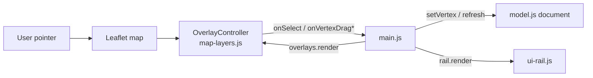
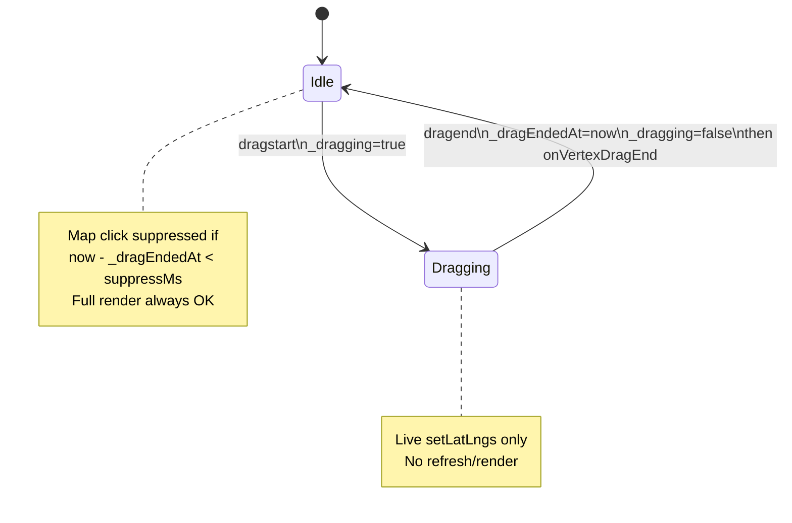

# Airport Editor: Reliable Vertex Drag (Bugfix + UX Polish)

| Field | Value |
|-------|--------|
| **Document** | Reliable vertex drag for `/airport-editor` polylines and points |
| **Author** | _(design author / implementer)_ |
| **Date** | 2026-07-27 |
| **Status** | **Implemented** (PR1: live geometry / handles / click suppress; PR2: select-mode status tip + this design note) |
| **Parent design** | [`docs/design/apt-air-editor.md`](apt-air-editor.md) (Implemented) |
| **Scope** | Bugfix + minimal UX polish — **not** a GIS rewrite |

---

## Overview

> **Closeout (2026-07-27):** Code for the fix landed in `map-layers.js` / `main.js` / `airport-editor.css` with pure tests under `webjs/airport-editor/`. Select-mode surface selection flashes a one-line tip to drag white handles. Design history below is retained as the engineering record (root causes, state machine, checklist).

The airport editor’s **vertex drag** path was partially wired but failed as a product experience. Users could select a runway/taxiway/hold/parking surface and see vertex chrome, yet **dragging nodes did not feel like it worked**: the handle may move while the underlying geometry freezes, hit targets are small and visually double-rendered, and drag-end can race with map-click deselection and a full overlay rebuild.

This design is a **focused fix** in the existing Leaflet PE stack:

1. Make **select → drag vertex** rock solid for multi-point polylines and single-point parking/hold.
2. **Live-update** the surface layer while the handle moves (parent design already required this).
3. Slightly **simplify interaction feel** (larger targets, no dual handles, robust drag-end) without new modes or libraries.
4. Keep draw tools, rail inspector, insert/delete vertex, aircraft drag, Blob download, dirty tracking, and boring-web constraints intact.

Primary touch surfaces: `map-layers.js` (`OverlayController`), `main.js` (drag callbacks / refresh lifecycle), `airport-editor.css`, and pure Node tests under `webjs/airport-editor/`.

---

## Background & Motivation

### Current architecture (relevant slice)



| Piece | Path | Role today |
|-------|------|------------|
| Overlay render + handles | `internal/web/static/js/openfsd/airport-editor/map-layers.js` | `OverlayController.render`, `_addVertexHandles`, drag listeners |
| Edit loop | `…/main.js` | `onVertexDrag` / `onVertexDragEnd` → `setVertex` → `afterAptMutation` → `refresh` |
| Document mutations | `…/model.js` | `setVertex`, `insertVertex`, `deleteVertex` (pure, tested) |
| Handle CSS | `internal/web/static/css/openfsd/airport-editor.css` | `.apted-vertex-handle` 12×12 + margins |
| Pure tests | `webjs/airport-editor/map-layers.test.js`, `model.test.js` | No real Leaflet drag simulation |

Parent design (`apt-air-editor.md`) already specified:

- **Move vertex** = select surface → drag handle (Leaflet marker).
- **Performance**: *“avoid full map rebuild on single vertex drag (update that latlng only).”*
- **Delete vertex** (parent table): “Select handle + Delete key” — **not implemented**; current `main.js` Del/Backspace deletes the **whole surface**. This fix does not close that product gap; vertex delete stays rail-only (see Open Questions / Known gaps).

Implementation shipped the select/handle scaffolding but **did not complete live geometry update**, and several Leaflet interaction details undermine reliability.

### Verified root causes (from source — not the suspect list alone)

#### RC1 — Live polyline/point update is missing (confirmed)

```115:122:internal/web/static/js/openfsd/airport-editor/main.js
    onVertexDrag(si, vi, lat, lon) {
      setVertex(doc, si, vi, { lat, lon });
      // Live-update surface polyline without full refresh of handles mid-drag.
      // Full refresh on dragend.
    },
    onVertexDragEnd(si, vi, lat, lon) {
      setVertex(doc, si, vi, { lat, lon });
      afterAptMutation();
```

- Comment promises live update; **code only mutates the model**.
- Leaflet moves the **handle marker** on drag, so something on screen moves — but `_addSurface`’s `L.polyline` / parking `L.circleMarker` is **not** updated until `onVertexDragEnd` → `afterAptMutation` → `refresh` → full `overlays.render`.
- Aircraft drag works better because the aircraft **is** the draggable marker; surface geometry is a **separate** path layer under the handle.
- Severity: **High** — primary “drag doesn’t work” feel (rubber-band line frozen; parking disc stuck while ghost handle floats).

#### RC2 — Dual handle construction (visual + interaction confusion)

```555:599:internal/web/static/js/openfsd/airport-editor/map-layers.js
  _addVertexHandles(surface, surfaceIndex) {
    // ...
      const marker = L.circleMarker([p.lat, p.lon], { radius: 6, /* ... */ });
      const handle = L.marker([p.lat, p.lon], {
        draggable: true,
        zIndexOffset: 2000,
        icon: L.divIcon({
          className: 'apted-vertex-handle',
          iconSize: [12, 12],
          iconAnchor: [6, 6],
        }),
        // ...
      });
      // dragstart / drag / dragend on handle only
      handle.addTo(this.vertexGroup);
      // Keep circle under for visibility if divIcon fails in tests.
      marker.addTo(this.vertexGroup);
```

- Two layers per vertex: non-draggable `circleMarker` (overlay pane) + draggable `divIcon` marker (marker pane).
- Marker pane is above overlay pane (`leaflet.css` z-index 600 vs 400), so the circle usually does **not** steal pointer events — but the user sees **two dots** (or a thick composite), and the intentional “keep circle under” comment is misleading (add order does not change pane stacking).
- Severity: **Medium** — confuses targeting; doubles layer churn; zero benefit in production.

#### RC3 — CSS double-offset on the hit target

```256:267:internal/web/static/css/openfsd/airport-editor.css
.apted-vertex-handle {
  width: 12px !important;
  height: 12px !important;
  margin-left: -6px !important;
  margin-top: -6px !important;
  border: 2px solid #4a7ab0;
  /* ... */
  cursor: move;
}
```

- Leaflet already positions via `iconAnchor: [6, 6]` on a 12×12 icon.
- Extra `margin-left/top: -6px` shifts the **visual** handle northwest of the true lat/lon while the drag anchor remains on the vertex.
- Result: handle appears off-vertex; easy to miss the interactive box; looks “broken” even when drag technically starts.
- Severity: **High** for perceived accuracy / grab reliability — **must ship with the live-geometry fix**, not a follow-up PR (see PR Plan).

#### RC4 — Full `render` on dragend rebuilds everything (including handles)

```412:432:internal/web/static/js/openfsd/airport-editor/map-layers.js
  render(airport, aircraft, selection = null) {
    // ...
    this.group.clearLayers();
    this.vertexGroup.clearLayers();
    // ... re-add all surfaces, aircraft, then handles if surface selected
  }
```

- Mid-drag: no full refresh (good) — and **must stay that way** via caller contract (`onVertexDrag` never refreshes).
- Dragend: `afterAptMutation` → `refresh` clears **all** layers and rebuilds — **required and allowed** once the pointer is up (`_dragging === false`).
- Parent performance note already forbids full rebuild *during* drag; live path should use `_layerByKey` + `setLatLngs` / `setLatLng`.
- Severity: **Medium** for post-drag jank; **High** if anything calls `refresh` while the pointer is still down (`_dragging === true`).

#### RC5 — Map click vs drag-end race (intermittent deselect risk)

```392:397:internal/web/static/js/openfsd/airport-editor/map-layers.js
      map.on('click', (ev) => {
        if (this._dragging) return;
        // ...
      });
```

```588:594:internal/web/static/js/openfsd/airport-editor/map-layers.js
      handle.on('dragend', (ev) => {
        // ...
        setTimeout(() => {
          this._dragging = false;
        }, 50);
      });
```

```137:142:internal/web/static/js/openfsd/airport-editor/main.js
      if (doc.mode === MODE_SELECT) {
        if (doc.selection) {
          doc.selection = null;
          refresh();
        }
```

- Select mode: empty-map click clears selection.
- Authors already left a **50ms** `_dragging` hold after `dragend` — evidence they anticipated residual clicks, not a measured production failure rate.
- On **desktop**, `click` often does **not** fire when mousedown target (handle) differs from mouseup target; Leaflet’s own map-drag click suppression does **not** automatically cover **marker** drag. Residual deselect is therefore an **intermittent** risk (touch / synthesized clicks / browser quirks), not a proven always-on bug from source alone.
- Severity: **Medium** (defensive hardening). Extending to ~250ms via a dedicated `dragEndedAt` timeline (separate from pointer-down `_dragging`) + `bubblingMouseEvents: false` + stopPropagation is the mitigation. Old mobile ~300ms synthetic click is the upper-bound rationale for the 250–400ms band (Open Question 1).

#### RC6 — Vertices only after selection (by design, but two-step)

```428:432:internal/web/static/js/openfsd/airport-editor/map-layers.js
    if (this.editable && this._selection?.type === 'surface') {
      const s = surfaces[this._selection.index];
      if (s) this._addVertexHandles(s, this._selection.index);
    }
```

- Matches parent UX table (“Select surface → drag handle”).
- User ask (“point/click/drag existing nodes on any visible polyline”) can be read as wanting **zero-step** grab-anywhere-vertices. That is a larger product change (clutter at 200 surfaces).
- This design: **keep select-then-drag**, make it obvious and reliable; optional light polish only (status tip on select). Always-on vertices for every surface is a **non-goal**.

#### RC7 — Small hit target (12×12)

- 12 CSS px is below common 24–44px target guidelines; border eats interior.
- Severity: **Low–Medium** alone; stacks with RC3. Ship together with CSS alignment in the same fix PR.

#### RC8 — `editable` flag

- `this.editable = opts.editable !== false` in `OverlayController` constructor; `main.js` does not pass `editable: false`.
- **Not** a current bug. Keep flag for tests/read-only demos.

### Pain points (user-facing)

1. Select a taxiway/runway → handles appear → drag → line does not follow.
2. Handles look misaligned / doubled; hard to grab.
3. Sometimes after release, selection/handles disappear (intermittent).
4. Interaction feels “mode-heavy” even though Select is already the right mode — friction is broken feedback, not missing modes.

---

## Goals & Non-Goals

### Goals

1. **Reliable vertex drag** for selected surfaces:
   - Multi-point: `RUNWAY`, `TAXIWAY`, multi-point `HOLD` polylines.
   - Single-point: `PARKING` and single-point `HOLD` (circleMarker geometry follows).
2. **Live geometry**: while dragging a handle, the corresponding surface layer tracks the pointer (no frozen rubber band).
3. **Stable drag-end**: model committed, dirty/validation/titlebar updated, selection **retained**, handles remain for further edits; full `render` **does** run on dragend.
4. **Simpler feel** without new tools: single handle per vertex, larger hit target, correct alignment, status copy that names the select→drag flow.
5. **Preserve** draw modes, select mode, rail inspector (insert/delete vertex, props), aircraft drag, Blob download, dirty hash / `beforeunload`, server validate, import-graph and package layout.
6. **Tests**: pure Node tests for extractable logic (including live-layer apply helper + suppress matrix + handle-options symmetry); documented **manual smoke** for Leaflet drag. No Playwright/Cypress by default (house policy).
7. **Scope small**: fix `map-layers.js` + `main.js` (+ CSS/tests) in a **user-complete** fix PR; no new packages, no leaflet-draw.

### Non-Goals

- Always-visible vertices on every unselected surface / “grab any node without selecting.”
- Mid-segment insert handles on the map (rail “Add vertex” remains).
- Snap-to-grid, snap-to-nearby-vertex, topology merge of taxi intersections.
- Vendoring `leaflet-draw` / `leaflet-geoman` / any new map framework.
- Touch-first mobile authoring optimization.
- Browser automation suite (Playwright etc.) unless product owner overrides house policy after complexity-gate write-up.
- Server-side persistence of APT/AIR.
- Changing wire format (`pkg/twrfiles`) or Go validation semantics.
- Reworking draw-tool click/dblclick finish.
- **Vertex-level Delete key** (parent table claim); stays rail-only for this fix.

---

## Key Decisions

| Decision | Choice | Rationale |
|----------|--------|-----------|
| **K1. Interaction model** | Keep **select surface → drag handles**; do not show all vertices always | Matches parent design; avoids clutter at sweatbox-scale airports (~200 surfaces); broken feedback is the real bug |
| **K2. Live update ownership** | Overlay **paints first** from handle latlng (order-independent), then `onVertexDrag` updates model; no full `render` mid-drag | Encapsulates Leaflet; model remains source of truth on commit |
| **K3. Single handle widget** | One `L.marker` + `divIcon` per vertex; **remove** dual `circleMarker` | Eliminates double-dot UX; marker pane already correct for drag |
| **K4. CSS positioning** | Size via `iconSize` / `iconAnchor` only; **no** compensating negative margins; ship in same PR as live geometry | Fixes high-severity RC3 grab misalignment with the rest of the fix |
| **K5. Drag-end state machine** | `_dragging` = pointer-down only; clear **before** `onVertexDragEnd`; post-drag map-click shield is **`dragEndedAt` only** via `shouldSuppressMapClick` | Full `refresh`/`render` after dragend must not be blocked; do not overload `_dragging` as the post-drag suppress flag |
| **K6. No new library** | Stay on in-tree Leaflet only | Parent design + complexity gate; custom handles are enough once live update works |
| **K7. Testing strategy** | Pure helpers (incl. mock-layer apply + handle options) + manual smoke; no Playwright | House default; drag is inherently browser/Leaflet |
| **K8. Parking/hold points** | Same vertex-handle path; surface layers are polyline **or** circleMarker only | One code path; explicit layer-type contract |
| **K9. Mid-drag render** | **Hard invariant**: callers must not `render`/`refresh` while `_dragging`; **omit** soft early-out | Simpler than cache-only early-out; `onVertexDrag` already forbids refresh; avoids dropping `_selection` |

---

## Proposed Design

### Target interaction (happy path)

```mermaid
sequenceDiagram
  participant U as User
  participant M as Map / OverlayController
  participant App as main.js
  participant Doc as model (doc)

  U->>M: Click polyline (select mode)
  M->>App: onSelect(surface i)
  App->>Doc: selection = surface i
  App->>M: render(..., selection)
  M-->>U: Highlight + vertex handles

  U->>M: Pointer down on handle + drag
  M->>M: _dragging = true
  loop each drag event
    M->>M: paint setLatLngs/setLatLng (overlay-local pts)
    M->>App: onVertexDrag(i, vi, lat, lon)
    App->>Doc: setVertex (aptDirty) — no refresh
  end
  U->>M: Pointer up (dragend)
  M->>M: _dragEndedAt = now; _dragging = false
  M->>App: onVertexDragEnd(...)
  App->>Doc: setVertex
  App->>App: afterAptMutation → validate + refresh
  Note over M: Full render runs because _dragging is false
  M-->>U: Geometry committed; handles still present
  Note over M: Map click suppressed via dragEndedAt<br/>for MAP_CLICK_SUPPRESS_MS only
```

### Normative drag / click / render state machine

**Single contract — implement exactly this; do not mix with alternate suppress schemes.**

| Field | Meaning |
|-------|---------|
| `_dragging` | `true` only while a vertex (or aircraft) **pointer drag is active** (after `dragstart`, until `dragend` clears it). |
| `_dragEndedAt` | `number` ms timestamp of last dragend, or `0` if never / reset on next dragstart. Used **only** for map-click suppress. |
| `MAP_CLICK_SUPPRESS_MS` | Default `250`. Duration after `_dragEndedAt` during which map clicks are ignored. |

**Transitions:**

1. **`dragstart`**: `_dragging = true`; `_dragEndedAt = 0`.
2. **`drag`**: live-paint surface layer; call `onVertexDrag` (model only — **no** `refresh`).
3. **`dragend`** (order is normative):
   1. Read final latlng from handle.
   2. `_dragEndedAt = Date.now()`.
   3. `_dragging = false`  ← **before** app callback so full rebuild is allowed.
   4. `onVertexDragEnd(si, vi, lat, lon)` → `setVertex` + `afterAptMutation` → `refresh` → `overlays.render` **must proceed**.
4. **Map `click`**: only gate is `shouldSuppressMapClick({ dragging: this._dragging, dragEndedAt: this._dragEndedAt, suppressMs: MAP_CLICK_SUPPRESS_MS }, Date.now())`. Do **not** keep `_dragging` true after pointer-up to “cover” residual clicks.
5. **`render`**: full rebuild always when called. Callers **must not** invoke `render`/`refresh` while `_dragging === true`. No soft early-out (see §6).



### 1. Fix handle rendering (`_addVertexHandles`)

**Remove** the non-draggable `circleMarker` companion. Export pure options for tests:

```js
/** Keep in sync with .apted-vertex-handle width/height in airport-editor.css */
export const VERTEX_HANDLE_PX = 16;

/**
 * Pure: options for the vertex L.marker (no Leaflet instance required).
 * @param {number} vertexIndex
 * @returns {object}
 */
export function buildVertexHandleOptions(vertexIndex) {
  const px = VERTEX_HANDLE_PX;
  return {
    draggable: true,
    autoPan: false,
    keyboard: false,
    zIndexOffset: 2000,
    bubblingMouseEvents: false,
    title: `Vertex ${vertexIndex + 1}`,
    // icon constructed at call site with L.divIcon({...buildVertexHandleIconOptions()})
  };
}

/** Pure icon size/anchor for divIcon — symmetry asserted in unit tests. */
export function buildVertexHandleIconOptions() {
  const px = VERTEX_HANDLE_PX;
  return {
    className: 'apted-vertex-handle leaflet-interactive',
    iconSize: [px, px],
    iconAnchor: [px / 2, px / 2],
  };
}
```

Normative construction:

```js
const handle = L.marker([p.lat, p.lon], {
  ...buildVertexHandleOptions(vi),
  icon: L.divIcon(buildVertexHandleIconOptions()),
});
// Only this handle — no companion circleMarker.
handle.addTo(this.vertexGroup);
```

Notes:

- Explicit `leaflet-interactive` is belt-and-suspenders with Leaflet’s marker interactive default (`pointer-events` rules in `leaflet.css` lines 242–256).
- `autoPan: false` prevents surprising map pans when dragging near edges during precise geometry work.
- **No dual handle.** Regression tests assert `buildVertexHandleIconOptions` has symmetric `iconSize`/`iconAnchor` and that handle construction no longer adds a second layer factory (see Testing).

### 2. Live geometry update (core fix)

#### Layer-type contract (normative)

Surfaces registered under `_layerByKey` key `surface:${index}` are **exactly one of**:

| Kind / points | Layer type | Live API |
|---------------|------------|----------|
| Multi-point runway / taxiway / hold | `L.polyline` | `setLatLngs(latlngs)` |
| Parking, or hold with 1 finite point | `L.circleMarker` | `setLatLng(latlng)` |

They must **not** be wrapped in a `FeatureGroup`, `L.marker`, or other container. A future refactor that wraps surface layers would silently break live update if this contract is ignored — preserve the flat registration in `_addSurface`.

#### Pure helpers

```js
/**
 * Pure: points → Leaflet latlng tuples (finite only).
 * @param {{lat:number,lon:number}[]} points
 * @returns {Array<[number, number]>}
 */
export function pointsToLatLngs(points) {
  const out = [];
  if (!Array.isArray(points)) return out;
  for (const p of points) {
    if (Number.isFinite(p?.lat) && Number.isFinite(p?.lon)) {
      out.push([p.lat, p.lon]);
    }
  }
  return out;
}

/**
 * Pure: apply latlngs to a surface layer duck-typed like Leaflet polyline/circleMarker.
 * Prefer setLatLngs (polyline) then setLatLng (circleMarker). No-op if neither.
 * @param {{ setLatLngs?: Function, setLatLng?: Function }|null|undefined} layer
 * @param {Array<[number, number]>} latlngs
 * @returns {'polyline'|'point'|'none'}
 */
export function applySurfaceLatLngs(layer, latlngs) {
  if (!layer || !latlngs || latlngs.length === 0) return 'none';
  if (typeof layer.setLatLngs === 'function') {
    layer.setLatLngs(latlngs);
    return 'polyline';
  }
  if (typeof layer.setLatLng === 'function') {
    layer.setLatLng(latlngs[0]);
    return 'point';
  }
  return 'none';
}

/**
 * Pure: patch one vertex in a points array (immutable-style new array).
 * @param {{lat:number,lon:number}[]} points
 * @param {number} vertexIndex
 * @param {number} lat
 * @param {number} lon
 */
export function patchVertexPoints(points, vertexIndex, lat, lon) {
  const src = Array.isArray(points) ? points : [];
  return src.map((p, i) =>
    i === vertexIndex ? { lat, lon } : { lat: p.lat, lon: p.lon },
  );
}
```

Instance method:

```js
_liveSetSurfacePoints(surfaceIndex, points) {
  const layer = this._layerByKey.get(`surface:${surfaceIndex}`);
  applySurfaceLatLngs(layer, pointsToLatLngs(points));
}
```

#### Normative drag handlers (order-independent paint — **only** this path)

```js
handle.on('dragstart', (ev) => {
  this._dragging = true;
  this._dragEndedAt = 0;
  if (ev?.originalEvent) this.L.DomEvent.stopPropagation(ev.originalEvent);
});

handle.on('drag', (ev) => {
  const ll = ev.target.getLatLng();
  // 1) Overlay-local paint FIRST (order-independent of model callback).
  const base = this._airport?.surfaces?.[surfaceIndex]?.points || [];
  const pts = patchVertexPoints(base, vi, ll.lat, ll.lng);
  this._liveSetSurfacePoints(surfaceIndex, pts);
  // 2) Model commit path (main must not refresh).
  this.onVertexDrag(surfaceIndex, vi, ll.lat, ll.lng);
});

handle.on('dragend', (ev) => {
  const ll = ev.target.getLatLng();
  // Final live paint (covers last frame).
  const base = this._airport?.surfaces?.[surfaceIndex]?.points || [];
  const pts = patchVertexPoints(base, vi, ll.lat, ll.lng);
  this._liveSetSurfacePoints(surfaceIndex, pts);
  // State machine: clear pointer-down flag BEFORE app refresh path.
  this._dragEndedAt = Date.now();
  this._dragging = false;
  this.onVertexDragEnd(surfaceIndex, vi, ll.lat, ll.lng);
});
```

**Rejected ordering (do not implement):** call `onVertexDrag` first then read `this._airport.surfaces[i].points` for paint. That works today only because `setVertex` mutates the shared graph in place (`model.js`), but it is order-dependent and breaks if the callback is ever async or non-mutating. Shared mutation remains true for the document model; paint must not rely on callback side effects.

**Ordering contract with `main.js`:**

| Event | OverlayController | main.js |
|-------|-------------------|---------|
| `drag` | `patchVertexPoints` → `_liveSetSurfacePoints` → `onVertexDrag` | `setVertex` only — **no** `refresh` |
| `dragend` | paint → `_dragEndedAt` + `_dragging = false` → `onVertexDragEnd` | `setVertex` + `afterAptMutation({ fit: false })` (full `refresh` **runs**) |

### 3. Map-click suppress after drag (single wire-up)

**Normative pure helper:**

```js
/**
 * @param {{ dragging: boolean, dragEndedAt: number, suppressMs: number }} state
 * @param {number} [now]
 * @returns {boolean}
 */
export function shouldSuppressMapClick(state, now = Date.now()) {
  if (state.dragging) return true;
  if (
    state.dragEndedAt > 0 &&
    now - state.dragEndedAt < state.suppressMs
  ) {
    return true;
  }
  return false;
}

export const MAP_CLICK_SUPPRESS_MS = 250;
```

**Normative controller fields** (constructor):

```js
this._dragging = false;
this._dragEndedAt = 0;
// MAP_CLICK_SUPPRESS_MS imported/exported constant
```

**Normative map click body** (replace today’s `if (this._dragging) return`):

```js
if (this.onMapClick) {
  map.on('click', (ev) => {
    if (
      shouldSuppressMapClick(
        {
          dragging: this._dragging,
          dragEndedAt: this._dragEndedAt,
          suppressMs: MAP_CLICK_SUPPRESS_MS,
        },
        Date.now(),
      )
    ) {
      return;
    }
    const ll = ev.latlng;
    this.onMapClick(ll.lat, ll.lng, ev.originalEvent);
  });
}
```

**Aircraft dragend** uses the same state fields and the same helper (set `_dragEndedAt`, clear `_dragging` **before** `onAircraftDragEnd`).

**Test matrix (required rows):**

| `dragging` | `dragEndedAt` relative to `now` | `shouldSuppressMapClick` | `render` allowed? |
|------------|----------------------------------|--------------------------|-------------------|
| `true` | any | `true` | **No** (caller invariant; pointer still down) |
| `false` | within `suppressMs` | `true` | **Yes** (post-drag rebuild must run) |
| `false` | after `suppressMs` / `0` | `false` | **Yes** |

This is the critical distinction fixed after review: **post-drag click suppress must not block `render`.**

### 4. CSS hit target

```css
/* Vertex drag handles (Leaflet divIcon).
 * Width/height MUST match VERTEX_HANDLE_PX (map-layers.js) — keep in sync.
 * Do not use negative margin; Leaflet positions via iconAnchor. */
.apted-vertex-handle {
  position: relative; /* containing block for ::after hit pad */
  overflow: visible;  /* do not clip expanded hit area */
  width: 16px !important;
  height: 16px !important;
  margin: 0 !important; /* positioning is iconAnchor only */
  border: 2px solid #4a7ab0;
  border-radius: 50%;
  background: #fff;
  box-shadow: 0 0 0 1px rgba(0, 0, 0, 0.25);
  cursor: grab;
  box-sizing: border-box;
}
.apted-vertex-handle:active {
  cursor: grabbing;
  background: #e8f0fa;
}
/* Expanded hit area without growing the visible disc.
 * Relies on position:relative + overflow:visible on the icon. */
.apted-vertex-handle::after {
  content: '';
  position: absolute;
  inset: -6px; /* ~28px effective target */
}
```

Notes:

- Leaflet marker icons are typically `position: absolute` with explicit width/height; `position: relative` on the icon element establishes the containing block for `::after` without fighting map placement (the icon’s own transform is on the parent marker pane node).
- CSS `!important` width/height overrides Leaflet’s inline size styles from `iconSize` — **both** must stay at 16. Accept comment-synced constants; do **not** inject user-derived HTML via `divIcon` `html:` (XSS).
- Checklist item: verify centered grab in manual smoke step 2.

### 5. `main.js` callback simplification

```js
onVertexDrag(si, vi, lat, lon) {
  setVertex(doc, si, vi, { lat, lon });
  // Intentionally no refresh — OverlayController live-updates the surface layer.
  // Hard invariant: never refresh/render while OverlayController._dragging.
},
onVertexDragEnd(si, vi, lat, lon) {
  setVertex(doc, si, vi, { lat, lon });
  afterAptMutation({ fit: false }); // full refresh — _dragging already false
},
```

Status tip (PR2):

- After successful surface select (map or rail) in Select mode, `showStatus('Drag white handles to move vertices. Click empty map to deselect.', false)`.
- When selection leaves a surface (empty-map deselect or non-surface select), clear that tip only (do not wipe unrelated status banners).
- Toolbar tip for Select mode remains: “Select mode — click features; drag vertices.”
- Do **not** thrash status on every drag tick; tip only when selection becomes a surface.

Do **not** call `rail.render` on every drag tick (would thrash DOM). Inspector lat/lon table updates on dragend via existing `refresh` — acceptable; live inspector coords are non-goal.

### 6. Mid-drag `render` policy (hard invariant — no soft early-out)

**Chosen approach (K9):** callers must not call `render` / `refresh` / `setSelection` while a vertex or aircraft drag is active (`_dragging === true`).

- `onVertexDrag` / `onAircraftDrag` already forbid refresh.
- Rail `onSelect` → `refresh` during an active map drag is not a supported path; if it ever happens, Leaflet’s active `Draggable` is already at risk — a soft early-out that only caches `_airport` would **drop `_selection` updates** and desync controller vs `doc` without fixing the Draggable issue.
- Therefore: **omit** a `if (this._dragging) return` early-out inside `render`. Keep `render` simple and always full-rebuild. Enforcement is the main.js / callback contract + state machine above.
- `setSelection` continues to call `render` as today; it is only used when the user is not mid-drag of a vertex handle.

### 7. Parking / single-point hold

Existing `_addSurface` already uses `circleMarker` for parking and single-point hold. `applySurfaceLatLngs` uses `setLatLng`. No second code path. Layer-type contract in §2 applies.

**Not in scope:** making the parking disc itself the only drag affordance (handle is enough once aligned).

### 8. Interaction simplification summary

| Before | After |
|--------|--------|
| Dual circle + marker | Single grab handle |
| 12px + offset margins | 16px + expanded `::after` hit pad, no margin offset |
| Line frozen mid-drag | Line/point follows handle |
| 50ms `_dragging` hold doubles as click suppress | `_dragging` pointer-only; `dragEndedAt` + pure helper for clicks |
| Dragend refresh blocked if suppress overloads `_dragging` | Dragend clears `_dragging` first; full rebuild always |
| Opaque failure modes | Status tip on select; selection retained after drag |

Modes remain: Select / Park / Taxi / Runway / Hold / Aircraft. No mode removed or added.

### Architecture after fix

```mermaid
flowchart TB
  subgraph mid_drag ["During drag (_dragging=true; no full render)"]
    H[Vertex L.marker]
    H -->|drag| Patch[patchVertexPoints]
    Patch --> Live["applySurfaceLatLngs"]
    H -->|onVertexDrag| SV["setVertex(doc)"]
    Live --> PL["polyline or circleMarker\n(surface:N contract)"]
    SV --> Doc[(EditorDocument)]
  end

  subgraph end_drag ["On dragend"]
    H2[dragend] --> Clear["_dragEndedAt=now\n_dragging=false"]
    Clear --> EndCb[onVertexDragEnd]
    EndCb --> SV2[setVertex]
    SV2 --> AAM[afterAptMutation]
    AAM --> Val[validateDocument]
    AAM --> Ref["refresh → full render\n(allowed)"]
    Ref --> Rail[rail + titlebar chips]
  end

  subgraph click ["Map click"]
    C[map click] --> Sup{shouldSuppressMapClick}
    Sup -->|dragging or within suppressMs| Ignore[ignore]
    Sup -->|else| ClearSel[select mode: clear selection]
  end
```

---

## API / Interface Changes

No server HTTP, Go package, or import-graph changes.

### JS exports (additive, pure)

| Export | Module | Purpose |
|--------|--------|---------|
| `pointsToLatLngs(points)` | `map-layers.js` | Finite point → `[lat,lon][]` |
| `applySurfaceLatLngs(layer, latlngs)` | `map-layers.js` | Duck-typed live geometry apply; returns branch taken |
| `patchVertexPoints(points, vi, lat, lon)` | `map-layers.js` | Immutable-style vertex patch for paint |
| `shouldSuppressMapClick(state, now?)` | `map-layers.js` | Drag / post-drag map-click filter |
| `MAP_CLICK_SUPPRESS_MS` | `map-layers.js` | Default 250 |
| `VERTEX_HANDLE_PX` | `map-layers.js` | 16; comment-synced with CSS |
| `buildVertexHandleOptions(vi)` | `map-layers.js` | Marker options for tests |
| `buildVertexHandleIconOptions()` | `map-layers.js` | `iconSize`/`iconAnchor` symmetry for tests |

### `OverlayController` internal methods

| Method | Visibility | Behavior |
|--------|------------|----------|
| `_liveSetSurfacePoints(si, points)` | private | `applySurfaceLatLngs` via `_layerByKey` |
| `_addVertexHandles` | private | Single marker; normative drag state machine |
| `render` | public | Full rebuild always; **no** mid-drag early-out |

### Callback contracts (unchanged signatures)

```ts
onVertexDrag?: (surfaceIndex: number, vertexIndex: number, lat: number, lon: number) => void
onVertexDragEnd?: (surfaceIndex: number, vertexIndex: number, lat: number, lon: number) => void
```

Semantics clarified:

- **`onVertexDrag`**: may fire at high frequency; **must not** trigger full overlay `render` / `refresh`.
- **`onVertexDragEnd`**: invoked only after OverlayController has set `_dragging = false`; **must** full-refresh via existing mutation path.

### CSS

- `.apted-vertex-handle` as §4 (`position: relative`, `overflow: visible`, no negative margin).
- No new global Leaflet overrides.

---

## Data Model Changes

**None.**

- `setVertex` / `insertVertex` / `deleteVertex` remain the mutation API.
- Dirty flags, download hash, validation arrays unchanged.
- No schema / migration / server storage.

---

## Alternatives Considered

### A1 — Vendor `leaflet-draw` / `leaflet-geoman`

| Pros | Cons |
|------|------|
| Mature vertex edit UX | New dependency weight; complexity-gate; harder pure-unit testing; diverges from parent “custom tools first” |
| | Larger review surface than a bugfix |

**Rejected** for this fix. Revisit only if select→drag still inadequate after the fix PR (parent already deferred this).

### A2 — Always show vertices for all surfaces in Select mode

| Pros | Cons |
|------|------|
| Matches “drag any node on any polyline” literally | Visual clutter (hundreds of handles); hit-testing ambiguity between adjacent taxiways; expensive layer count |
| | Still need selection for inspector/delete |

**Rejected** as default. Optional future: “show all vertices” toggle — out of scope.

### A3 — Custom mousedown/mousemove drag on `circleMarker` only (no `L.marker`)

| Pros | Cons |
|------|------|
| One layer type for polylines and handles | Reimplement Leaflet.Draggable; more bug surface; map pan conflicts |

**Rejected** — fix `divIcon` marker path instead.

### A4 — Live update only on dragend (model-only mid-drag)

| Pros | Cons |
|------|------|
| Minimal code | **Does not fix user report**; line still frozen |

**Rejected** — contradicts parent performance/UX note and user ask.

### A5 — Full rewrite of overlay as React/canvas

| Pros | Cons |
|------|------|
| — | Violates boring-web / house SPA ban; massive scope |

**Rejected.**

### A6 — Soft `render` early-out while `_dragging` (cache-only)

| Pros | Cons |
|------|------|
| Defensive if a buggy caller refreshes mid-drag | Easy to get wrong (drop `_selection`); masks caller bugs; blocked post-drag rebuild when incorrectly tied to suppress window (rev1 defect) |

**Rejected** in favor of hard caller invariant (K9).

### Chosen approach vs alternatives

**Targeted OverlayController + main + CSS fix in one user-complete PR** wins: smallest diff, aligns with parent design, testable pure helpers, no new deps, preserves draw/select modes, non-contradictory state machine.

---

## Security & Privacy Considerations

| Topic | Assessment |
|-------|------------|
| XSS | Continue **no `innerHTML`** for file-derived labels; `divIcon` uses `className` only (no `html:` with surface names). Tooltips stay `tooltipTextNode` / `textContent`. |
| Authz | Unchanged — Admin-only page shell; no new routes. |
| CSRF | No new state-changing server endpoints. |
| Data | Geometry still browser-local; drag does not POST coordinates. |
| Threat | Malicious `.apt` with huge point counts — already a client DoS concern; live `setLatLngs` is O(points per surface) per move event, fine for budgeted sizes. |

No new privacy surface.

---

## Observability

Client-only feature; no new server metrics.

| Mechanism | Use |
|-----------|-----|
| Existing status flash (`showStatus`) | User feedback on select / errors |
| `doc.aptDirty` + titlebar `APT*` | Confirms drag committed |
| Validate tab | Catches invalid geometry after edit |
| `slog` / Gin | Unchanged (page load only) |

Do **not** add `console.log` noise (hygiene / house style). No browser RUM required.

---

## Testing Strategy

### Pure Node tests (`webjs/airport-editor/map-layers.test.js`)

Add cases for:

1. **`pointsToLatLngs`**: empty, skips non-finite, preserves order.
2. **`applySurfaceLatLngs`** with mock layers:
   - `{ setLatLngs(calls) }` → branch `'polyline'`, called with full latlngs.
   - `{ setLatLng(calls) }` only → branch `'point'`, called with first latlng.
   - `{}` / `null` → `'none'`.
3. **`patchVertexPoints`**: replaces only index `vi`; does not mutate input array.
4. **`shouldSuppressMapClick`** (full matrix from §3):
   - `dragging: true` → true (render still “allowed” only in the sense of policy — document that post-drag uses `dragging: false`).
   - `dragging: false`, within `suppressMs` after `dragEndedAt` → true (**and** render must still be allowed — separate concern; assert suppress only).
   - `dragging: false`, after window / `dragEndedAt: 0` → false.
5. **`buildVertexHandleIconOptions`**: `iconSize[0] === iconSize[1] === VERTEX_HANDLE_PX`; `iconAnchor` is half; className includes `apted-vertex-handle`.
6. **`buildVertexHandleOptions`**: `draggable: true`, `autoPan: false`, `bubblingMouseEvents: false`.
7. Short comment block above the suite: RC1 (live path = `applySurfaceLatLngs`), RC2 (no companion circle factory in exports), RC3 (no CSS margin in JS positioning), K5 (suppress ≠ block render).

Existing `setVertex` tests in `model.test.js` remain sufficient for model commits.

**Not required:** parsing `map-layers.js` source text for “circleMarker” string matches (brittle). Prefer exported pure builders so “no dual handle” is a construction discipline + code review of `_addVertexHandles`.

### What we will not automate (default)

- Real Leaflet pointer drag in headless Chrome (Playwright).
- Visual pixel diffs.

### Manual smoke checklist (PR description / engineer runbook)

Run `go run ./cmd/openfsd -web` (or full binary), Admin login, open `/airport-editor`:

1. Open a multi-surface `.apt` (e.g. KBTV-scale fixture if available) → Fit.
2. **Select mode** → click taxiway → handles appear **centered** on vertices (single white disc each — no double-dot).
3. Drag a mid vertex → **polyline follows** handle continuously.
4. Release → line stays; selection **remains**; titlebar shows `APT*`; inspector coords updated (full refresh ran).
5. Drag runway end vertex → same.
6. Select parking → drag its single handle → disc follows; release keeps selection.
7. Select hold polyline / point → same.
8. Click empty map (after >~300ms) → selection clears (handles gone). Immediately after a drag, a spurious map click should **not** clear selection.
9. Drag aircraft marker → still works; no vertex regression.
10. Draw new taxi (mode Taxi) → finish → select → drag still works.
11. Rail: Add vertex / Delete vertex → map updates; drag new vertex works. (**Note:** keyboard Del still deletes **surface**, not vertex — expected; see Known gaps.)
12. Download `.apt` → coords reflect dragged positions (spot-check raw / re-open).
13. Repeat a drag near map edge with `autoPan: false` — map should not jump unexpectedly.
14. JS disabled: page shell still loads (map PE exception); no server regression.

### CI

```bash
bash scripts/check-webjs.sh
# or: cd webjs && npm test
go test -race ./internal/web/...   # no Go change expected; sanity
bash scripts/check-hygiene.sh     # if any Go touched (should not be)
```

---

## Rollout Plan

| Stage | Action |
|-------|--------|
| Implement | **One user-complete fix PR** (see PR Plan); optional follow-up for status copy/docs; **no feature flag** |
| Verify | Manual smoke on local binary + `check-webjs.sh` green |
| Deploy | Standard openfsd release; static assets go with binary (`go:embed` / static tree as today) |
| Rollback | Revert PR(s); no migration. Users may have downloaded interim APT files — no server state. |
| Flag | Not needed; risk contained to Admin map editor |

### Risks

| Risk | Severity | Mitigation |
|------|----------|------------|
| Residual click still clears selection on some browsers | Med | `dragEndedAt` + 250ms suppress + `bubblingMouseEvents: false` + stopPropagation; tune `MAP_CLICK_SUPPRESS_MS` if smoke fails (see OQ1) |
| Live update no-ops if surface layer wrapped later | Med | Layer-type contract in §2; `applySurfaceLatLngs` returns `'none'`; code review of `_addSurface` |
| Caller `refresh` mid-drag destroys Draggable | Low | Hard invariant; no soft early-out; keep drag callbacks refresh-free |
| CSS/`VERTEX_HANDLE_PX` drift | Low | Comment keep-in-sync; icon options unit test; smoke step 2 |
| Operator habit: expects drag without select | Low | Status tip; optional future “show all vertices” non-goal |
| QA expects parent “Del = delete vertex” | Low | Document known gap (rail-only vertex delete) in PR / design note |

---

## Open Questions

1. **Suppress duration**: Is 250ms enough on slow trackpads / touch, or should it be 400ms (near old mobile 300ms synthetic click)? Resolve via manual smoke; constant is `MAP_CLICK_SUPPRESS_MS`.
2. **Live inspector coordinates**: Update rail vertex table mid-drag? **Default no** (DOM thrash). Confirm with product if instructors edit numbers while dragging (unlikely).
3. **Delete key vs parent table**: Parent UX table says “Delete vertex | Select handle + Delete key”; implementation deletes **surface**. This fix **accepts rail-only vertex delete** and documents the gap. Vertex-level Del is a separate small UX PR if desired.
4. **Copy design into repo**: **Done** — this file (`docs/design/airport-editor-vertex-drag.md`).

### Known gaps (document, do not fix here)

- **Vertex delete is rail-only** (`ui-rail.js` delete-vertex action). Keyboard Delete/Backspace with a surface selected deletes the **entire surface** (`main.js` `onKeyDown`). Parent design table claim is aspirational / stale relative to shipped code.

---

## References

- Parent design: `docs/design/apt-air-editor.md` (Implemented) — vertex UX table, performance note, PR7 edit loop.
- Agents / package rules: `Agents.md` — `internal/web` isolation; boring-web mandatory; coverage + `check-webjs.sh`.
- Boring-web: `~/.grok/skills/boring-web/SKILL.md`, checklist, decision-test (map PE exception already documented for this page).
- Implementation files:
  - `internal/web/static/js/openfsd/airport-editor/map-layers.js` — `OverlayController`, `_addVertexHandles`
  - `internal/web/static/js/openfsd/airport-editor/main.js` — `onVertexDrag` / `onVertexDragEnd` / `refresh`
  - `internal/web/static/js/openfsd/airport-editor/model.js` — `setVertex`
  - `internal/web/static/css/openfsd/airport-editor.css` — `.apted-vertex-handle`
  - `webjs/airport-editor/map-layers.test.js`, `model.test.js`
- Leaflet CSS: `internal/web/static/css/leaflet.css` (marker pane z-index, `.leaflet-interactive` pointer-events, `.leaflet-div-icon`)

---

## PR Plan

Prefer a **tight, user-complete fix** over a three-way split. CSS grab alignment (RC3, high severity) must not land after “live geometry only.”

### PR 1 — Fix vertex drag (user-complete)  **[default]**

| Field | Content |
|-------|---------|
| **Title** | airport-editor: fix vertex drag (live geometry, handles, click suppress) |
| **Files** | `internal/web/static/js/openfsd/airport-editor/map-layers.js`; `internal/web/static/js/openfsd/airport-editor/main.js`; `internal/web/static/css/openfsd/airport-editor.css`; `webjs/airport-editor/map-layers.test.js` |
| **Depends on** | None |
| **Description** | **Single mergeable fix.** Remove dual circleMarker+marker. Order-independent live paint via `patchVertexPoints` + `applySurfaceLatLngs`. Normative state machine: clear `_dragging` before `onVertexDragEnd`; map click uses `shouldSuppressMapClick` with `_dragEndedAt`. CSS: remove double-offset margins, 16px handle, `position: relative` + `overflow: visible` + `::after` hit pad. Export pure helpers + handle option builders; unit tests for points, apply, suppress matrix, iconSize/iconAnchor symmetry. Same suppress for aircraft dragend. **Do not claim “user-complete” without CSS.** |

### PR 2 — UX copy + docs

| Field | Content |
|-------|---------|
| **Title** | airport-editor: select-mode drag status tip and design note |
| **Files** | `main.js` (status on surface select / mode tip alignment); `docs/design/airport-editor-vertex-drag.md` (this design); one-liner under parent “Implementation status” |
| **Depends on** | PR 1 |
| **Description** | On surface select in Select mode, flash a one-line tip to drag handles. Note parent Del-key / rail-only vertex delete gap. No Playwright. |

### Suggested merge order

```text
PR1 (user-complete fix) → PR2 (copy / docs)  [both landed]
```

**Do not** split live geometry from CSS/suppress into separate merges by default — that leaves high-severity RC3 unfixed after “live geometry only.” If a multi-PR split is forced for review bandwidth, the **only** acceptable partial first land is CSS-only (margin fix) as a PR0 that can merge alone; never ship live geometry without CSS alignment as the advertised “fix.”

### Out-of-plan follow-ups (not blocking)

- Mid-edge insert handles on map.
- Optional “show all vertices” density toggle.
- Vertex-level Delete key (align with parent table).
- Quantize float chatter on format (parent already optional).

---

## Implementation checklist (engineer)

- [x] Single `divIcon` handle; no dual circleMarker
- [x] Live paint: `patchVertexPoints` → `applySurfaceLatLngs` on drag (**before** model callback)
- [x] Surface layer contract: `surface:N` is polyline or circleMarker only
- [x] `onVertexDrag` never calls `refresh` / `rail.render`
- [x] **dragend:** set `_dragEndedAt`, set `_dragging = false`, **then** `onVertexDragEnd` → `afterAptMutation({ fit: false })`
- [x] Map click uses `shouldSuppressMapClick` only (not a long-lived `_dragging` after pointer-up)
- [x] No soft `render` early-out that can block post-drag rebuild
- [x] CSS: no negative margin; `VERTEX_HANDLE_PX` matches; `position: relative`; `overflow: visible`
- [x] Pure tests: apply mock layers, suppress matrix (incl. “dragging false + within suppress → click suppressed, render still OK by contract”), icon symmetry
- [x] Selection retained after successful drag (smoke)
- [x] Document: vertex delete rail-only; Del deletes surface
- [x] Select-mode surface tip: `Drag white handles…` (PR2)
- [x] `bash scripts/check-webjs.sh` green
- [ ] Manual smoke § Testing complete (engineer runbook)
- [x] No new imports from `internal/web` → forbidden packages
- [x] No Playwright added

---

*End of design document.*
