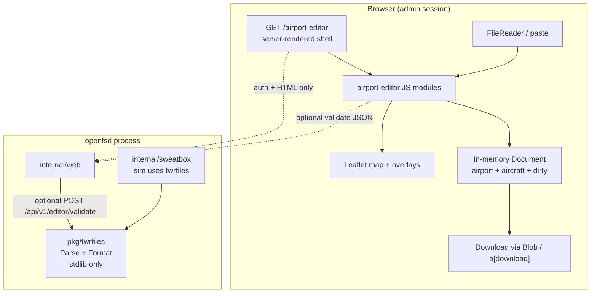

# Integrated .APT + .AIR Editor — openfsd Web UI

| Field | Value |
|-------|--------|
| **Document** | Integrated .APT + .AIR Editor on openfsd Web UI |
| **Author** | _(design author / implementer)_ |
| **Date** | 2026-07-23 |
| **Status** | Draft (rev 2 — review issues addressed) |
| **Target repo** | `/Users/rnorris/scratch/openfsd` |
| **Related** | `docs/design/sweatbox-integrated-simulator.md`, `internal/sweatbox`, `internal/web` |

---

## Overview

openfsd already loads TWRTrainer-compatible **`.apt`** (airport geometry) and **`.air`** (scenario aircraft snapshots) into an in-process sweatbox simulator and exposes an instructor control panel at `/sweatbox`. Instructors still author those files outside the product — typically in a text editor or the legacy Windows TWRTrainer UI — then paste or upload them.

This design adds a **single, integrated map-first editor** on the openfsd admin Web UI for creating and editing **paired** `.apt` and `.air` files. The editor is a **server-rendered MPA shell** with a **JavaScript-heavy progressive enhancement** (Leaflet map + geometry tools). **No durable server persistence** of `.apt` / `.air` (no disk, no DB): primary load is client-local (FileReader / paste) and primary save is **browser Blob download**. Optional Admin-only echo-download and validate POSTs may hold bodies **transiently in process memory** for the duration of the request only — they never write files or store rows.

The page targets a dense **16:9 operator console** matching the sweatbox rail aesthetic, reuses in-tree Leaflet assets, and respects the boring-web house standard and the web ↛ sweatbox import-graph edge.

```text
Instructor workflow (target):

  Open /airport-editor
       │
       ├─ Open .apt  ──► parse (JS) ──► draw surfaces on OSM map
       ├─ Open .air  ──► parse (JS) ──► place aircraft markers
       ├─ Edit geometry / props / aircraft in-memory
       ├─ Validation panel (parity with Go ParseAPT / ParseAIR messages)
       └─ Download .apt / Download .air  (Blob; never written to server disk)
              │
              ▼
        Optional: paste into /sweatbox load forms or load via FSD HTTP
```

---

## Background & Motivation

### Current state

| Surface | Path | Role |
|---------|------|------|
| APT parser | `internal/sweatbox/apt.go` `ParseAPT` | TWRTrainer-compatible; non-fatal `[]string` errors |
| AIR parser | `internal/sweatbox/air.go` `ParseAIR` | 16 colon fields; best-effort rows + errors |
| Domain types | `internal/sweatbox/types.go` | `Airport`, `Surface`, `Aircraft`, `Point` |
| Fixtures | `internal/sweatbox/testdata/KBTV_example.{apt,air}` | Golden samples |
| Format (write) | **missing** | No `FormatAPT` / `FormatAIR` today — only parse |
| Sweatbox UI | `internal/web/templates/sweatbox.html` + `sweatbox.css` + `sweatbox.js` | 16:9 rail; forms + PE poll |
| Sweatbox routes | Admin-only under `requireMinRatingHTML(Administrator)` | `/sweatbox`, form POSTs, CSRF |
| Dashboard map | `dashboard.html` + `dashboard.js` + embedded Leaflet 1.9.4 | OSM standard tiles; PE exception documented |
| Import graph | `scripts/check-import-graph.sh` + `Agents.md` | **`internal/web` must not import `internal/sweatbox`** |
| JS tests | **none** | No package.json / vitest / playwright in repo today |

### Pain points

1. **Authoring friction**: building runway/taxi polylines and parking spots as raw lat/lon text is error-prone.
2. **APT/AIR coupling is invisible**: aircraft lat/lon/hdg and dep ICAO should align with airport geometry; separate text files hide that.
3. **No round-trip tooling**: Go can parse but cannot serialize; instructors cannot regenerate clean files after mechanical edits.
4. **Sweatbox load is not an editor**: `/sweatbox` is a live control plane (requires FSD + `SWEATBOX_ENABLED`); it should stay that way.
5. **External tools**: TWRTrainer is legacy Windows; openfsd users need a first-party path.

### Why a map editor (and why PE exception is justified)

Airport geometry is inherently geographic. A text-only form would satisfy “no JS” but not the user requirement for an intuitive, utilitarian map canvas. Dashboard already documents a **Leaflet map PE exception**. This design extends that pattern to a specialized admin tool, with an explicit JS budget exception, a real HTML shell, and a no-JS text fallback for open/paste/download.

---

## Goals & Non-Goals

### Goals

1. **Integrated .apt + .air editor** on one bookmarkable URL, map canvas + dense rail.
2. **OpenStreetMap base map** with airport-intuitive layering (documented tile choice).
3. **Utilitarian 16:9 console** consistent with sweatbox visual language (tokens, panels, mono numbers).
4. **No durable server persistence** of APT/AIR (disk/DB); document lives in the browser; download only. Transient request bodies allowed for echo-download and validate (Admin-only, size-capped).
5. **Boring-web compliance**: real route, server authz, no SPA router, no global server-state store, CSRF only when mutating the server. Map geometry authoring is a **documented complexity-gate exception** (like dashboard Leaflet); no-JS paste + echo-download remains for the data path.
6. **JS heavily tested**: unit coverage as close to 100% as practical on pure modules; e2e covering editor flows.
7. **Go tests** for any new routes/handlers (authz, shell render, optional echo-download).
8. **Validation parity** with `ParseAPT` / `ParseAIR` error *semantics* (and message strings where stable).
9. **Import-graph safe**: web never imports sweatbox; choose a clean validation strategy (below).
10. **Incremental, mergeable PR plan**.

### Non-Goals (v1)

- Server persistence, multi-user collaboration, or version history of airport files.
- Live sweatbox session editing (use `/sweatbox` for that).
- Full GIS suite (buffer tools, snap-to-OSM roads, elevation models).
- Automatic import of X-Plane `apt.dat` inside the browser (keep `cmd/aptdat2apt` offline).
- SPA framework, client-side router, hydration, or React/Vue/Svelte.
- Mobile-first touch drawing (landscape desktop/laptop is the primary surface; still usable, not optimized).
- ZIP dual-download (prefer separate `.apt` / `.air` downloads).
- Real-time multiplayer cursors / CRDT sync.
- Editing files already loaded into a running sweatbox engine.

---

## Proposed Design

### High-level architecture



**Core principle:** the editor document lives in the browser. The server provides (1) the authenticated page shell, (2) static assets (Leaflet + first-party JS/CSS), and (3) optional **stateless** validate / echo-download endpoints that may hold bodies transiently in RAM but **never** write APT/AIR to disk or DB.

### Package split: `pkg/twrfiles` (canonical wire format)

Today parse lives in `internal/sweatbox`, which **web must not import**. JS must reimplement parse/serialize for interactive editing. To avoid three divergent truth sources (sweatbox Go, future web Go, JS), extract pure wire format into a new stdlib-only package:

| Package | Owns |
|---------|------|
| **`pkg/twrfiles`** | Types for file I/O (`Airport`, `Surface`, `Aircraft`, `Point`), `ParseAPT`, `ParseAIR`, **`FormatAPT`**, **`FormatAIR`**, exported name validators (`IsWordName`, `IsTaxiHoldName`, `IsRunwayDesignator`, …), surface/engine/rules constants, golden fixtures under `pkg/twrfiles/testdata/` |
| **`internal/sweatbox`** | Sim domain (taxi graph, engine, motion); imports `pkg/twrfiles`; **default PR1 strategy = type aliases + constant re-exports + thin parse wrappers** (see migration) so sim call sites keep compiling with minimal renames |
| **`internal/web`** | Page + optional `POST /api/v1/editor/validate-{apt,air}` using `pkg/twrfiles` only |
| **JS `static/js/openfsd/airport-editor/*`** | Client parse/format mirroring `pkg/twrfiles`; document model; map UI |

#### Why `pkg/` not `internal/twrfiles`

| Option | Verdict |
|--------|---------|
| **`pkg/twrfiles`** (chosen) | Symmetry with `pkg/protocol` (pure wire format); reusable by `cmd/*` (e.g. future format tooling, `aptdat2apt` emission checks); `internal/web` already imports `pkg/protocol` — same pattern |
| `internal/twrfiles` | Also importable by web (not on forbidden edge list) but hides a pure format package that is not sim-specific; weaker for external/cmd reuse |

#### PR1 migration mechanics (normative — not optional)

Blast radius is large: `Airport`, `Surface`, `Point`, `Aircraft`, surface/engine/rules constants, and `Airport.FindSurface` are embedded across the sim (`engine.go` `LoadAirport`/`LoadScenario`, `taxi.go`, `motion.go`, `dispatch.go`, `pattern.go`, tests) and `internal/server/sweatbox_host.go` (`ParseAPT`/`ParseAIR`). Parse helpers are **not** parse-only: `isWordName` is called from `internal/sweatbox/taxi.go` (taxi route `@parking` validation).

**Default PR1 strategy — aliases + re-exports in sweatbox** (minimize rename churn; keep `internal/server` calling `sweatbox.ParseAPT` until a later optional cleanup):

```go
// internal/sweatbox/twrfiles_alias.go (illustrative)
package sweatbox

import "github.com/renorris/openfsd/pkg/twrfiles"

type (
	Point    = twrfiles.Point
	Surface  = twrfiles.Surface
	Airport  = twrfiles.Airport
	Aircraft = twrfiles.Aircraft
)

const (
	SurfaceParking     = twrfiles.SurfaceParking
	SurfaceRunway      = twrfiles.SurfaceRunway
	SurfaceTaxiway     = twrfiles.SurfaceTaxiway
	SurfaceHold        = twrfiles.SurfaceHold
	EnginePiston       = twrfiles.EnginePiston
	EngineTurboprop    = twrfiles.EngineTurboprop
	EngineJet          = twrfiles.EngineJet
	EngineHelicopter   = twrfiles.EngineHelicopter
	RulesVFR           = twrfiles.RulesVFR
	RulesIFR           = twrfiles.RulesIFR
	RulesDVFR          = twrfiles.RulesDVFR
	RulesSVFR          = twrfiles.RulesSVFR
	XPDRModeNormal     = twrfiles.XPDRModeNormal
	XPDRModeStandby    = twrfiles.XPDRModeStandby
)

// Thin wrappers so existing call sites (including internal/server) stay stable in PR1.
func ParseAPT(text string) (Airport, []string) { return twrfiles.ParseAPT(text) }
func ParseAIR(text string) ([]Aircraft, []string) { return twrfiles.ParseAIR(text) }

// FindSurface stays a method on Airport — move method body to pkg/twrfiles with the type.
```

**Validators used by sim (must be exported from `pkg/twrfiles`):**

| Current unexported | Export as | Consumers after move |
|--------------------|-----------|----------------------|
| `isWordName` | `twrfiles.IsWordName` | parse + `taxi.go` (`!twrfiles.IsWordName(name)` or sweatbox one-line `func isWordName = twrfiles.IsWordName` keep local name) |
| `isTaxiHoldName` | `twrfiles.IsTaxiHoldName` | parse |
| `isRunwayDesignator` | `twrfiles.IsRunwayDesignator` | parse |
| `isSquawk` | `twrfiles.IsSquawk` | parse |
| `isValidRegistration` / `isValidAirlineList` | export or keep package-private in twrfiles | parse only |

Prefer **local one-line wrappers** in sweatbox for `isWordName` so `taxi.go` needs zero renames in PR1:

```go
func isWordName(s string) bool { return twrfiles.IsWordName(s) }
```

**Files that must stay green after PR1** (non-exhaustive but required):

| Package | Must pass |
|---------|-----------|
| `pkg/twrfiles` | moved parse unit tests + KBTV fixtures |
| `internal/sweatbox` | `apt_test`, `air_test`, `airport_test`, `taxi_test`, `motion_test`, `engine_test`, `pattern_test`, `dispatch_*_test` |
| `internal/server` | `sweatbox_host_test`, `sweatbox_http_test`, `e2e_sweatbox_test`, any host load path using `sweatbox.ParseAPT`/`ParseAIR` |

**Import-graph allowlist (mandatory in PR1):** today sweatbox is:

```bash
check_imports_allowlist "internal/sweatbox" "${MODULE}/internal/sweatbox/..." \
  "${MODULE}/internal/geo"
```

Update to:

```bash
check_stdlib_only "pkg/twrfiles" "${MODULE}/pkg/twrfiles/..."

check_imports_allowlist "internal/sweatbox" "${MODULE}/internal/sweatbox/..." \
  "${MODULE}/internal/geo" \
  "${MODULE}/pkg/twrfiles"
```

Also update `Agents.md` §1 package table: sweatbox = stdlib + `internal/geo` + `pkg/twrfiles`; add `pkg/twrfiles` row (stdlib only, like protocol). Coverage: add **`pkg/twrfiles` ≥98%** hard floor in `scripts/check-coverage.sh` **in PR1** (when package lands). Keep sweatbox floor ≥95%.

**Migration steps (ordered):**

1. Create `pkg/twrfiles` with types, parse, exported validators, fixtures (move from `internal/sweatbox/testdata`).
2. Add sweatbox aliases + wrappers; delete moved parse bodies from sweatbox `apt.go`/`air.go`/`types.go` (leave sim-only types).
3. Point sweatbox fixture reads at `pkg/twrfiles/testdata` (relative path from test, or shared embed — files only, no import cycle).
4. Green full `go test -race ./pkg/twrfiles/... ./internal/sweatbox/... ./internal/server/...`.
5. Update import-graph + coverage scripts + Agents.md.
6. **Do not** force `internal/server` to import `pkg/twrfiles` in PR1 — wrappers preserve `sweatbox.ParseAPT`.

**Why not keep parsers only in sweatbox + pure JS?**

- Server-side validate (useful for PE / confidence) would be impossible without import violation or FSD proxy.
- Format (serialize) is needed for clean downloads and Go round-trip tests; it belongs next to Parse.
- `pkg/protocol` precedent: pure wire format is a first-class package.

**Why still reimplement parse/format in JS?**

- Interactive map editing cannot block on a network round-trip per vertex.
- Offline / FSD-down authoring still works (page is static shell; document is client-side).
- Download must work with pure Blob without server.

**Drift control (mandatory):**

1. Shared golden fixtures: `pkg/twrfiles/testdata/` (single tree; sweatbox tests read via path).
2. **Cross-language golden suite** (see Testing): identical bad/good inputs; assert error *counts* and *substring* matches for stable messages.
3. Format round-trip **and** golden Format text files (see Format contract) — structural equality alone can hide formatting drift.

### Route, authz, navigation

| Item | Value |
|------|--------|
| **URL** | `GET /airport-editor` |
| **Auth** | Session cookie (`requireSessionHTML`) |
| **Authz** | **Administrator** (`requireMinRatingHTML(protocol.NetworkRatingAdministator)`) — same tier as `/sweatbox` and config editor |
| **Nav** | Layout header: link **Airport Editor** next to Sweatbox when `User.CanEditConfig` |
| **Does not require** | `SWEATBOX_ENABLED` or FSD process |

**Rationale for Admin (not Supervisor):** sweatbox control and config are Admin; airport authoring is training-ops infrastructure with the same audience. If product later wants Supervisors to author scenarios without config access, lower the gate in one place (`routes.go` + nav).

**Optional mutations (CSRF):**

| Method | Path | Purpose |
|--------|------|---------|
| `POST` | `/airport-editor/download-apt` | No-JS / PE: accept `apt_text` form field, respond `Content-Disposition: attachment; filename="….apt"` — **no disk write** |
| `POST` | `/airport-editor/download-air` | Same for `.air` |
| `POST` | `/api/v1/editor/validate-apt` | JSON body `{ "text": "…" }` → standard **`APIV1Response`** with `data.errors []string` + light summary (see Validate API) |
| `POST` | `/api/v1/editor/validate-air` | Same envelope; `data.errors` + light aircraft summary |

Body size caps: mirror sweatbox **2 MiB** (`sweatboxWebMaxBody = 2 << 20`). CSRF on all of the above when cookie-authenticated (existing `csrfIfCookieSession` / form CSRF).

**Blob download path (primary with JS):** no CSRF, no server POST — create `Blob` + temporary `<a download>` click.

### Page shell (server-rendered)

**Files (new):**

- `internal/web/templates/airport_editor.html`
- `internal/web/pages_airport_editor.go` — `handleFrontendAirportEditor`, optional download handlers
- `internal/web/pagemodel.go` — `airportEditorPage` embeds `basePage`
- `internal/web/static/css/openfsd/airport-editor.css` — tokens aligned with `sweatbox.css`
- `internal/web/static/js/openfsd/airport-editor/*.js` — modules (see JS structure)

**Template registration:** add `"airport_editor"` to `pageTemplateKeys` in `templates.go`.

**HTML structure (semantic, utilitarian):**

```html
<main id="apted-root" class="apted" data-js="airport-editor"
      data-sample-apt="/static/… optional later"
      data-validate-apt="/api/v1/editor/validate-apt"
      data-validate-air="/api/v1/editor/validate-air">

  <!-- Title + dirty status -->
  <header class="apted-titlebar">…</header>

  <!-- Toolbar: open/download/new/fit/layer/mode -->
  <div class="apted-toolbar" role="toolbar">…</div>

  <div class="apted-body">
    <div id="apted-map" class="apted-map" role="application"
         aria-label="Airport map editor (requires JavaScript)">
      <!-- noscript / empty: PE fallback message -->
    </div>

    <aside class="apted-rail" aria-label="Editor panels">
      <!-- tablist: Airport | Surfaces | Aircraft | Validate | Raw -->
      …
    </aside>
  </div>

  <!-- No-JS fallback: always present in HTML (not JS-injected) -->
  <section class="apted-fallback" aria-labelledby="apted-fallback-heading">
    <h2 id="apted-fallback-heading">Text fallback (works without JavaScript)</h2>
    <p class="apted-hint">Map editing requires JavaScript. Paste or type file text below, then download.</p>

    <form method="post" action="/airport-editor/download-apt" class="apted-form">
      <input type="hidden" name="csrf_token" value="{{ .CSRFToken }}">
      <div class="apted-field">
        <label for="apt_text">Airport .apt</label>
        <textarea id="apt_text" name="apt_text" rows="12" spellcheck="false"
                  placeholder="icao=KBTV&#10;…"></textarea>
      </div>
      <div class="apted-field">
        <label for="apt_filename">Download filename</label>
        <input type="text" id="apt_filename" name="filename" value="airport.apt"
               autocomplete="off" spellcheck="false" maxlength="64"
               pattern="[A-Za-z0-9._\-]{1,64}">
      </div>
      <button type="submit" class="btn btn-sm btn-primary">Download .apt</button>
    </form>

    <form method="post" action="/airport-editor/download-air" class="apted-form">
      <input type="hidden" name="csrf_token" value="{{ .CSRFToken }}">
      <div class="apted-field">
        <label for="air_text">Scenario .air</label>
        <textarea id="air_text" name="air_text" rows="8" spellcheck="false"></textarea>
      </div>
      <div class="apted-field">
        <label for="air_filename">Download filename</label>
        <input type="text" id="air_filename" name="filename" value="scenario.air"
               autocomplete="off" spellcheck="false" maxlength="64"
               pattern="[A-Za-z0-9._\-]{1,64}">
      </div>
      <button type="submit" class="btn btn-sm btn-primary">Download .air</button>
    </form>
  </section>
</main>
```

**No-JS field contract (PR 3 acceptance):**

| Form | Fields | Server reads |
|------|--------|--------------|
| download-apt | `csrf_token`, `apt_text`, `filename` | body = `apt_text`; disposition from sanitized `filename` |
| download-air | `csrf_token`, `air_text`, `filename` | body = `air_text` |

With JS, the same `apt_text` / `air_text` IDs may be synced from the model for progressive enhancement, but **Blob download does not require POST**.

**JS budget exception (document in template comment, matching `dashboard.html`):**

```html
{{/*
  JS budget exception (airport map editor) — complexity-gate exception:
  This route loads Leaflet (vendor) + first-party airport-editor modules.
  Map geometry authoring is JS-primary (documented exception to the general
  PE bar). Essential data path without JS: paste apt_text/air_text + form
  echo-download. No SPA router / global server store / hydration.
*/}}
```

First-party JS will exceed 30–50 KB compressed (map tools + parse). Document as **exception** in PR and `internal/web/README.md`. Prefer multiple small modules over one mega-file for unit testing.

**PR 3 Go test acceptance (shell + fallback):**

- Body contains `id="apted-root"`, `name="apt_text"`, `name="air_text"`, both download form actions, CSRF fields.
- Map container present with accessible label noting JS requirement.
- Download POST: workdir file count unchanged (no `os.Create` side effects).

### UI layout (16:9 operator console)

Mirror sweatbox density: system font ~0.8125rem, mono for coords/callsigns, panel headers uppercase, intentional scroll regions, fit one viewport.

```text
┌─ openfsd header (existing layout) ──────────────────────────────────────┐
│ AIRPORT EDITOR   KBTV · APT* · AIR  ·  16 park · 2 rwy · 12 taxi · 3 ac │
├─ toolbar ───────────────────────────────────────────────────────────────┤
│ [Open .apt] [Open .air] │ [DL .apt] [DL .air] │ New │ Fit │ ⊙ Layer ▼  │
│ Mode: ○ Select  ● Draw taxi  ○ Park  ○ Rwy  ○ Hold  ○ Aircraft          │
├─────────────────────────────┬───────────────────────────────────────────┤
│                             │ [Airport][Surfaces][Aircraft][Validate][Raw]│
│   Leaflet map (full height) │ List (filter)                              │
│   · taxi polylines          │  A  taxi  10 pts                           │
│   · runway polylines        │  19/1 rwy  6 pts                           │
│   · parking dots            │  G1 park                                   │
│   · aircraft icons+hdg      │ ─────────────────────────────────────────  │
│   · selected vertex handles │ Inspector: name, props, lat/lon table      │
│                             │ [Add vertex] [Delete surface] [Snap AC]    │
│                             │ ─────────────────────────────────────────  │
│                             │ Validation (N issues)                      │
└─────────────────────────────┴───────────────────────────────────────────┘
```

**CSS grid** (from `sweatbox.css` pattern):

```css
.apted-body {
  display: grid;
  grid-template-columns: 1fr;
  min-height: 0;
  flex: 1;
}
@media (min-width: 900px) {
  .apted-body {
    grid-template-columns: minmax(0, 1fr) minmax(18rem, 24rem);
    max-height: calc(100dvh - var(--apted-header-approx) - 6rem);
  }
}
.apted-map { min-height: 16rem; background: #dfe6ea; }
```

Rail width ~18–24rem; map takes remainder. Prefer **right rail** (matches sweatbox).

### Map base layer evaluation & choice

| Layer | Runways/taxi at z≥15 | API key | License / ops | Notes |
|-------|----------------------|---------|---------------|-------|
| **OSM Standard** (`tile.openstreetmap.org`) | **Good** — runway outlines, taxi, terminals visible | No | OSMF tile policy; attribution required | **Already used by dashboard** |
| Carto Voyager | Good labels; airport detail similar/slightly cleaner | No | Free basemaps w/ attribution | Nice alternate |
| Carto Positron | Light; **weaker** pavement contrast | No | Same | Better for data overlay, worse for tracing |
| OpenTopoMap | Topo focus; **poor** airport pavement | No | Attribution | Skip as default |
| Esri World Imagery | **Best pavement** for tracing | No* | Esri attribution; ToS for production volume | Excellent overlay option |
| Humanitarian OSM | Infrastructure emphasis | No | Attribution | Optional tertiary |
| Mapbox / Google / specialized aviation | Excellent | **Yes** | Cost + keys | Reject for v1 |

\*Esri world imagery tiles are commonly used without keys for light client use but carry attribution and fair-use expectations; treat as optional basemap, not default dependency.

**Decision (v1):**

1. **Default base:** **OSM Standard** — consistent with `dashboard.js`, zero new vendor/CDN, airport features readable at editor zoom (typically 14–17 for a single field).
2. **Optional second base (layer control):** **Esri World Imagery** for tracing pavement when OSM vectors lag real-world construction.
3. **Optional third (nice-to-have):** Carto Voyager for cleaner cartography when imagery is too noisy.

Implement with Leaflet `L.control.layers` or a compact custom toggle in the toolbar (prefer Leaflet control for a11y defaults).

**Attribution (required — do not regress):**

- Keep Leaflet **attribution control visible** for both OSM and Esri layers (`attribution` option on each `L.tileLayer` must be non-empty).
- Dashboard currently calls `map.attributionControl.setPrefix("")` — that only clears the “Leaflet” prefix, not OSM credit, but implementers **must not** disable the attribution control or strip tile `attribution` strings. Editor code review checklist: attribution control present; OSM + Esri credits visible when those layers are active.
- Optional later: config constant for private tile mirror URL (out of scope for v1 hard requirement).

```js
// Default (mirrors dashboard tile URL; attribution mandatory)
L.tileLayer("https://tile.openstreetmap.org/{z}/{x}/{y}.png", {
  maxZoom: 19,
  attribution: "&copy; <a href=\"https://www.openstreetmap.org/copyright\">OpenStreetMap</a>"
});
// Optional imagery
L.tileLayer(
  "https://server.arcgisonline.com/ArcGIS/rest/services/World_Imagery/MapServer/tile/{z}/{y}/{x}",
  {
    maxZoom: 19,
    attribution: "Tiles &copy; Esri — Source: Esri, Maxar, Earthstar Geographics, and the GIS User Community"
  }
);
// Do NOT: map.attributionControl.remove() or empty attribution strings.
// setPrefix("") is optional cosmetic only; tile attribution must remain.
```

**OSMF tile usage:** editor is admin-only, low concurrency. Still: no aggressive prefetch; rely on Leaflet default tile loading; cache via browser.

**E2E / offline:** production editor loads real tiles. Map PE is covered by pure JS unit tests + manual smoke — **no Playwright** (house boring-web policy).

### Integrated APT + AIR document model

```js
// Conceptual shape (JS); Go mirrors in pkg/twrfiles
/**
 * @typedef {Object} EditorDocument
 * @property {Airport|null} airport
 * @property {Aircraft[]} aircraft
 * @property {boolean} aptDirty
 * @property {boolean} airDirty
 * @property {string|null} aptFilename   // last opened name for download default
 * @property {string|null} airFilename
 * @property {string[]} aptErrors        // last validation
 * @property {string[]} airErrors
 * @property {Selection} selection       // surface id | aircraft callsign | vertex index
 * @property {string} mode               // select | park | runway | taxi | hold | aircraft | vertex-edit
 */
```

**IDs:** assign stable client-only IDs (`s1`, `s2`, …) for surfaces so map layers can rebind without relying on names during rename. Callsigns remain the aircraft key (uppercase); renaming callsign updates key with duplicate checks.

**Dirty flags (utilitarian, reliable):**

Browser Blob + temporary `<a download>` has **no reliable completion signal** (and can be blocked by the browser). Therefore:

1. On any model mutation → set `aptDirty` / `airDirty` as appropriate.
2. Maintain `lastAptDownloadHash` / `lastAirDownloadHash` (hash of last successfully **formatted** text the user initiated a download for).
3. **Do not** clear dirty merely on click. After `format*` succeeds and the download is **initiated** (Blob URL created + click dispatched), set `last*DownloadHash` to that text’s hash and set dirty = false **only if** current formatted text still equals that hash (it will at that instant). If the user edits again, dirty becomes true again.
4. Expose explicit toolbar action **“Mark clean”** (per side or both) for users who cancelled a dialog or know the file is saved elsewhere — never claim the OS saved the file.
5. Titlebar chips: `APT` / `APT*` / `AIR` / `AIR*` reflecting dirty flags; tooltip: “Unsaved changes (download to save locally)”.

**UX state table (dual document):**

| State | Titlebar | Map | Rail default tab | Snap to parking | Notes |
|-------|----------|-----|------------------|-----------------|-------|
| Empty | `— · APT · AIR` | World or last center; empty overlays | **Airport** | Disabled (tooltip: load/create parking first) | Empty-state rail copy: “Open or paste a .apt, or start drawing.” |
| APT only | `KBTV · APT · AIR` | Surfaces drawn | **Surfaces** after open | Enabled if ≥1 parking | AIR empty is normal |
| AIR only | `— · APT · AIR` | Aircraft markers only | **Aircraft** | Disabled | Soft warn: no airport geometry |
| Both | `KBTV · APT · AIR` (+ `*` if dirty) | Surfaces + aircraft | Last used tab (session UI pref) | Enabled if parking exists | Soft warn if AC dep ≠ ICAO or AC far from field |
| Both, ICAO mismatch | ICAO from APT; badge if any AC.dep ≠ APT.ICAO | Same | Validate tab if user clicks Validate | Same | Status chip: `dep≠ICAO` soft, not a parse error |

**Open / New / replace confirms:**

| Action | Behavior |
|--------|----------|
| Open .apt while APT loaded | If `aptDirty`, confirm “Replace airport geometry? Unsaved APT changes will be lost.” AIR untouched |
| Open .air while AIR loaded | Same for `airDirty`; APT untouched |
| New (both) | If either dirty, confirm; reset both to defaults |
| Download AIR with empty APT | Allowed; soft warn in Validate panel only |
| Download either side with parse errors | **Allowed** (WIP authoring); button remains enabled; Validate panel shows issues |

**Raw tab (normative — not live two-way binding):**

- Raw is a **read-only formatted preview** of current model (`formatAPT` / `formatAIR` text areas, `readonly`).
- **“Apply raw…”** button opens an editable buffer (or toggles readonly off) and on confirm runs `parse*` → replaces model for that side → re-validates. Failed parse keeps previous model and shows errors.
- Never bind keystrokes in Raw directly to map layers (avoids dual-write races).

**Default rail tab:** **Airport** on first visit; after successful Open APT → **Surfaces**; after Open AIR → **Aircraft**. Persist last tab in UI prefs only.

**Cross-file integration features (high value, keep utilitarian):**

| Feature | Behavior |
|---------|----------|
| ICAO → aircraft dep | On new aircraft, default `dep = airport.ICAO`; optional “set all empty dep to ICAO” action |
| Field elev → alt | New aircraft default `alt = field elevation` when parked |
| Snap aircraft to parking | Select AC + parking → set lat/lon to parking point; **disabled** when no parking surfaces; optional hdg estimate from nearest taxiway |
| Parking name list | Aircraft inspector shows parking dropdown for “place at” |
| Fit bounds | Union of all surface points + aircraft; no-op toast if empty |
| Mag var | Display-only helper in Airport tab (heading display remains true as stored; no auto-magnetic conversion in v1) |
| Validation of AC vs APT | Soft warnings: aircraft far from airport centroid (> e.g. 15 NM); dep ≠ ICAO |

Soft warnings are **editor-only** (not Go ParseAIR errors).

### APT editing interactions

| Action | UX |
|--------|-----|
| Select surface | Click map feature or rail list row |
| New parking | Mode Park → click map → name prompt (default `P1`…, `\w+`) → single point |
| New taxiway/hold | Mode → click vertices; double-click / Enter finishes; Esc cancels |
| New runway | Mode Rwy → place ≥2 points; inspector sets designators A/B, displaced thresholds, turnoff L/R |
| Move vertex | Select surface → drag handle (Leaflet marker or circle marker) |
| Insert vertex | Select segment midpoint control or “Insert after” in inspector |
| Delete vertex | Select handle + Delete key (enforce min counts: park/hold 1; taxi/rwy ≥2) |
| Delete surface | Inspector / Del with confirm if >1 point |
| Rename | Inspector; validate naming rules (`isWordName` / `isTaxiHoldName` / runway designators) |
| Airport headers | Airport tab: ICAO, mag var, elevations, pattern size, climbs, airlines, registration |

**Do not vendor leaflet-draw for v1** unless necessary: custom click-to-add + vertex markers keep the dependency surface to **existing Leaflet only** and are easier to unit-test. If vertex editing becomes painful, leaflet-draw can be reconsidered via the complexity decision test (extra vendor weight).

**Rendering style (utilitarian):**

| Kind | Style |
|------|--------|
| Taxiway | Gray/blue polyline, weight 3, name tooltip |
| Runway | Dark/black thicker polyline, end labels (A/B) |
| Hold | Orange single marker (or short dash) |
| Parking | Small square/circle + label |
| Selected | Highlight color matching sweatbox `--sbx-sel-border` |
| Aircraft | Existing `plane.png` + `leaflet.rotatedmarker.js` rotation by heading |

### AIR editing interactions

| Action | UX |
|--------|-----|
| List | Rail Aircraft tab: callsign, type, engine, rules, sqk |
| Select | Click marker or row → inspector (all 16 fields) |
| Place new | Mode Aircraft → click map → defaults from Airport + blank callsign focus |
| Drag | Drag marker updates lat/lon |
| Rotate hdg | Inspector number; optional shift-drag later (v1.1) |
| Delete | Del / button |
| Duplicate | Clone with new callsign suffix |
| Validation | Inline field errors + Validate tab |

Field enums match Go constants:

- Engine: `P|T|J|H`
- Rules: `V|I|D|S`
- XPDR: `N|S`
- Squawk: exactly 4 digits `[0-9]{4}`

Serialize with **16 colon fields** exactly as `ParseAIR` expects; preserve route/remarks content (including empty fields).

### Toolbar & keyboard shortcuts

**Discoverability first:** Open / Download / New / Fit / Layer / mode switches are **labeled toolbar buttons**. Keyboard is optional power-user enhancement, not the primary path for Open.

| Shortcut | Action |
|----------|--------|
| `Ctrl/Cmd+O` | Focus/open the APT file input (toolbar “Open .apt”); no multi-key chord sequences |
| `Ctrl/Cmd+Shift+O` | Open AIR file input |
| `Ctrl/Cmd+S` | Download **dirty** side only; if both dirty, confirm “Download both?” then APT then AIR |
| `Delete` / `Backspace` | Delete selection (ignored when focus is in inputs/textareas) |
| `Esc` | Cancel draw mode → select |
| `F` | Fit bounds |
| `1` | Mode: select |
| `2` | Mode: parking |
| `3` | Mode: taxiway |
| `4` | Mode: runway |
| `5` | Mode: hold |
| `6` | Mode: aircraft |
| `V` | Focus Validate tab |

Hold has its own quick key (`5`); aircraft is `6`. No `O` then `A`/`R` chords (easy to miss and conflict with typing).

When focus is in `<input>` / `<textarea>`, letter shortcuts are disabled except Ctrl/Cmd combos.

### Progressive enhancement matrix

| Capability | No JS | With JS |
|------------|-------|---------|
| Open page (authz) | Yes | Yes |
| Paste APT/AIR text | Yes (`apt_text` / `air_text` textareas) | Yes (+ FileReader toolbar buttons) |
| Download APT/AIR | Yes (form POST → attachment echo) | Yes (Blob primary) |
| Validate vs Go | Optional later form POST to validate API re-render (not required PR3) | Client parse live + optional server confirm |
| Map edit | No — map region shows “requires JavaScript”; fallback section visible | Yes |
| Geometry draw | No | Yes |

**boring-web framing (explicit):**

- House standard: essential functionality works with HTML only for **ordinary** admin pages.
- This page is a **specialized admin tool**. **Map geometry authoring** is a **documented complexity-gate exception** (Appendix C), parallel to dashboard Leaflet — not a precedent for SPA patterns elsewhere.
- **Essential data path without JS:** paste/edit plain text + CSRF form echo-download (no durable persistence). That is what PR 3 must ship and test.
- Do not market the no-JS path as “the full airport editor”; UI copy: “Text fallback — map editor requires JavaScript.”

### FormatAPT / FormatAIR (Go + JS) — normative contract

Both languages **must** implement this exact contract (PR 2 freezes it; golden files are the oracle).

#### APT emission

| Rule | Normative value |
|------|-----------------|
| Newlines | LF (`\n`) only |
| Trailing newline | File ends with a single `\n` |
| Header keys | **Always emit all ten keys**, in this fixed order, even when empty/default |
| Header order | `icao`, `magnetic variation`, `field elevation`, `pattern elevation`, `pattern size`, `initial climb props`, `initial climb jets`, `jet airlines`, `turboprop airlines`, `registration` |
| Defaults when zero/empty | Same as parse defaults: pattern size `1`, init climb props `3000`, jets `5000`, registration `N`; numeric zeros emit as `0` / `0` / `0` for elev/mag when unset |
| Airline lists | Emit exactly as stored (no space after commas unless present in model); empty string if unset |
| Blank line | One blank line after headers, before first section |
| Surface order | **`Airport.Surfaces` slice order as-is** (editor-controlled). Do **not** re-bucket by kind on format. Opened files preserve parse order |
| Between surfaces | One blank line between sections |
| Runway options | **Always** emit `displaced threshold=<int>/<int>` then `turnoff=left\|right` after `[RUNWAY A/B]`, before points — even when both disp are 0 and turnoff is default left |
| Displaced ints | Non-negative integers, no spaces around `/` |
| Turnoff | `left` if `TurnoffLeft`; else `right` |
| Coordinates | `%.6f %.6f` (always six fractional digits, space-separated, required decimal point) |
| Names | Uppercase as stored in model (parser already uppercases) |
| Banner comment | Optional single first line `; generated by openfsd airport-editor\n` — **omit in golden Format tests** so goldens stay stable; editor UI may prepend on download only via a flag `withBanner bool` default **false** for Format API |

```text
icao=KBTV
magnetic variation=16
field elevation=335
pattern elevation=1335
pattern size=1
initial climb props=10000
initial climb jets=10000
jet airlines=AAL,ACA
turboprop airlines=EGF
registration=N

[PARKING G1]
44.468930 -73.153920

[RUNWAY 19/1]
displaced threshold=0/225
turnoff=right
44.473400 -73.153020
44.472630 -73.152860
```

#### AIR emission

| Rule | Normative value |
|------|-----------------|
| Newlines | LF only; file ends with `\n` |
| Comments | FormatAPI does **not** emit the field-legend comment block by default (`withLegend bool` default false). Editor download may set true |
| One aircraft per line | Exactly **16** colon-separated fields; no trailing colon |
| Uppercase | `Callsign`, `Type`, `Engine`, `Rules`, `Dep`, `Arr`, `XPDRMode` uppercased on format |
| Cruise | Integer decimal string (`strconv.Itoa` / JS `String(int)`) |
| Squawk | Exactly four digit chars as stored |
| Route / Remarks | Emitted as-is (may be empty); **no** trimming of internal spaces |
| Lat, Lon | `%.6f` always |
| Alt, Speed, Heading | If value is mathematically an integer, emit without decimal (`335`, `0`, `360`); else minimal decimal form that `ParseFloat` round-trips (implementation: use shortest representation with Go `strconv.FormatFloat(v, 'f', -1, 64)` / JS equivalent — **golden files pin examples**) |
| Row order | `[]Aircraft` slice order as-is |

```text
AAL123:B738/F:J:I:KBTV:KBOS:29000:BTV4 MPV LEB MHT:/v/charts:2200:S:44.469758:-73.154747:335:0:360
```

#### Golden tests (required in PR 2)

1. `testdata/KBTV_example.apt` → Parse → Format → **byte-equal** `testdata/KBTV_example.formatted.apt` (checked-in golden; may differ from original hand formatting but must re-parse identically).
2. Same for AIR → `KBTV_example.formatted.air`.
3. `Parse(Format(Parse(x)))` structural deep equal for fixtures + random/error cases.
4. JS Format must byte-equal the same goldens (parity suite).

### Optional server validate API

**Envelope (mandatory):** standard `APIV1Response` from `api_v1_response.go` — fields `version`, `err`, `data` only. Never a bare `{ errs: … }` object.

```http
POST /api/v1/editor/validate-apt
Content-Type: application/json
X-CSRF-Token: …

{"text":"icao=KBTV\n…"}
```

```json
{
  "version": "v1",
  "err": null,
  "data": {
    "errors": ["Parking area G1 has no waypoint defined."],
    "icao": "KBTV",
    "surface_count": 12
  }
}
```

AIR `data` shape:

```json
{
  "errors": [],
  "aircraft_count": 3
}
```

- Field name is **`errors`** (not `errs`).
- Do **not** return full geometry / full aircraft rows (client has the model; keeps response small).
- Auth: session or Bearer via existing `jwtBearerMiddleware`; **Admin rating checked inline** (see API routes); CSRF if cookie.

**Client use:** “Validate with server” button on Validate tab for confidence; not required every keystroke.

### File open / new / download flows

```mermaid
sequenceDiagram
  participant U as User
  participant UI as Editor UI
  participant M as Document model
  participant V as parseAPT/parseAIR JS
  participant S as Server optional

  U->>UI: Open .apt file
  UI->>UI: FileReader.readAsText
  UI->>V: parseAPT(text)
  V-->>UI: airport + errs
  UI->>M: setAirport; aptDirty=false
  UI->>UI: redraw map; fit bounds

  U->>UI: Edit taxi vertex
  UI->>M: update point; aptDirty=true

  U->>UI: Download .apt
  UI->>V: formatAPT(airport)
  UI->>U: Initiate Blob download (filename KBTV.apt)
  Note over UI,S: No durable server write
  UI->>M: lastAptDownloadHash=hash(text); aptDirty=false if still matches
```

**New document:** if dirty, confirm; clear airport to defaults (`registration=N`, pattern size 1, climbs 3000/5000 matching Go defaults), clear aircraft, reset map to world view or last center.

**Unload warning:** `beforeunload` when any dirty flag set (PE only).

### Integration with sweatbox UI (out of process)

No automatic push from editor → live sweatbox in v1 (avoids coupling and surprise load). Instructor workflow:

1. Edit & download `.apt` / `.air`
2. Open `/sweatbox` → paste/upload (existing forms)

Optional later (non-goal): “Send to sweatbox” POST that proxies existing load endpoints — would require FSD up + CSRF + confirm dialogs; keep out of v1.

---

## API / Interface Changes

### New HTML routes

```go
// setupFrontendRoutes — admin group (same as sweatbox)
admin.GET("/airport-editor", s.handleFrontendAirportEditor)
admin.POST("/airport-editor/download-apt", s.handleFrontendAirportEditorDownloadAPT)
admin.POST("/airport-editor/download-air", s.handleFrontendAirportEditorDownloadAIR)
```

Download handlers:

1. CSRF validate  
2. `MaxBytesReader` 2 MiB  
3. Read `apt_text` / `air_text` (or multipart file)  
4. Optional: run `twrfiles.Parse*` and if hard-empty reject; **do not block download on soft validation errors** (user may want to save work-in-progress) — or provide checkbox `strict=1`  
5. Set headers:

```http
Content-Type: text/plain; charset=utf-8
Content-Disposition: attachment; filename="airport.apt"
```

6. Write body bytes; **no filesystem, no DB**.

**Handler acceptance criteria (echo-download + validate):**

- No `os.WriteFile`, `os.Create`, `os.OpenFile` for user content; no DB repository calls.
- Go tests: snapshot workdir (or `t.TempDir` as cwd if needed) before/after — file set unchanged.
- `slog` allowlist: `cid`, `content_length`, `icao` (if parsed), `error_count`, `path` — **never** full body text.
- Transient RAM only for request lifetime; Admin-only so body-in-RAM is accepted risk.

Default filename: from form field `filename` if safe (`^[A-Za-z0-9._-]{1,64}$`), else `airport.apt` / `scenario.air`. Prefer ICAO when parse succeeds: `KBTV.apt`. **Do not block download on validation errors** (WIP authoring); optional `strict=1` may reject later — not v1 default.

### New JSON routes

```go
// Match sweatbox API style: jwt + CSRF, then inline Admin rating → 403 JSON (never HTML redirect).
api := apiV1Group.Group("/editor")
api.Use(s.jwtBearerMiddleware, s.csrfIfCookieSession)
api.POST("/validate-apt", s.handleAPIValidateAPT)
api.POST("/validate-air", s.handleAPIValidateAIR)
```

**Authz semantics (normative — do not copy `requireMinRatingHTML`):**

| Condition | Response |
|-----------|----------|
| Unauthenticated | Existing `jwtBearerMiddleware` behavior (401 JSON) |
| Authenticated but rating &lt; Administrator | **`403`** + `writeAPIV1Response(c, http.StatusForbidden, &genericAPIV1Forbidden)` — same as `handleAPISweatboxState` / `api_tokens.go` |
| Never | `303` redirect to `/dashboard` (that is **HTML-only** middleware) |

**Do not** introduce `requireMinRatingAPI` that wraps `requireMinRatingHTML`. Prefer **inline rating check** after claims (copy sweatbox API pattern). If a shared helper is added later, it must return JSON 403 only and must not redirect.

```go
// Inside handleAPIValidateAPT (illustrative)
claims := getJwtContext(c)
if claims == nil || claims.NetworkRating < protocol.NetworkRatingAdministator {
    writeAPIV1Response(c, http.StatusForbidden, &genericAPIV1Forbidden)
    return
}
```

### `pkg/twrfiles` public API (illustrative)

```go
package twrfiles

type Point struct{ Lat, Lon float64 }

type Surface struct {
    Kind   string
    Name   string
    Points []Point
    RwyA, RwyB string
    DispA, DispB float64
    TurnoffLeft bool
}

type Airport struct { /* same fields as current sweatbox.Airport */ }

type Aircraft struct { /* same fields as current sweatbox.Aircraft */ }

func ParseAPT(text string) (Airport, []string)
func ParseAIR(text string) ([]Aircraft, []string)
func FormatAPT(a Airport) string
func FormatAIR(rows []Aircraft) string

func IsWordName(s string) bool
func IsTaxiHoldName(s string) bool
func IsRunwayDesignator(s string) bool
func IsSquawk(s string) bool

func (a *Airport) FindSurface(name string) *Surface // moved with type
```

Constants (`SurfaceParking`, engine codes, etc.) move with the package.

### JS modules (no bundler required for v1)

**Decision:** **ES modules** for new editor code (`export`/`import`) so Node unit tests can import without a bundler:

```html
<script type="module" src="/static/js/openfsd/airport-editor/main.js"></script>
```

Static server already serves `/static/*` from embed FS — modules work same-origin.

#### Canonical source location + Node import path (normative)

| Kind | Location |
|------|----------|
| **Canonical pure + UI modules** | `internal/web/static/js/openfsd/airport-editor/*.js` (shipped via `//go:embed static/*`) |
| **Tests only** | `webjs/airport-editor/*.test.js` — **outside** embed tree (not shipped in binary) |
| **No duplication** of parse/format sources under `webjs/src/` |

Node imports modules via **stable relative paths from `webjs/`** (repo root = parent of `webjs` and `internal`):

```js
// webjs/airport-editor/parse-apt.test.js
import { parseAPT } from "../../internal/web/static/js/openfsd/airport-editor/parse-apt.js";
import assert from "node:assert/strict";
import { test } from "node:test";
```

```text
webjs/
  package.json              # { "type": "module", "engines": { "node": ">=20" } }
  airport-editor/
    parse-apt.test.js
    format-apt.test.js
    parse-air.test.js
    format-air.test.js
    model.test.js
    …
  README.md                 # how to run; Node 20 LTS pin
```

```text
internal/web/static/js/openfsd/airport-editor/
  parse-apt.js      # pure — canonical
  format-apt.js     # pure
  parse-air.js      # pure
  format-air.js     # pure
  model.js          # pure document ops
  validate.js       # pure / thin wrappers
  map-layers.js     # Leaflet-facing; mock L in tests
  ui-rail.js        # DOM
  ui-toolbar.js     # DOM
  shortcuts.js
  download.js       # Blob helpers
  main.js           # bootstrap; may read data-test-tiles=blank for e2e
```

Pure modules must not touch `window`/`document` so Node can test them at high coverage.

**CI / local (land in PR 4, not deferred):**

```bash
# scripts/check-webjs.sh
set -euo pipefail
cd "$(dirname "$0")/../webjs"
node --test airport-editor/**/*.test.js
```

- Pin **Node 20 LTS** in CI (`actions/setup-node@v4` with `node-version: "20"`).
- Prefer **zero npm deps** for unit tests (`node:test` only). If `package.json` scripts only, `npm test` can invoke node without `node_modules`.
- Add `node_modules/` to `.gitignore` if any package is ever added.
- Update `Agents.md` §9 and CI workflow in **PR 4**.

### Agents.md / import-graph updates

| From | May import |
|------|------------|
| `pkg/twrfiles` | stdlib only |
| `internal/sweatbox` | `pkg/twrfiles`, `internal/geo`, stdlib |
| `internal/web` | `pkg/twrfiles` (new), still **not** `internal/sweatbox` |

Update `scripts/check-import-graph.sh`: `check_stdlib_only` for `pkg/twrfiles`; sweatbox allowlist includes `${MODULE}/pkg/twrfiles`.

**CI note:** as of 2026-07-23, `.github/workflows/ci.yml` runs race tests, coverage, and build — **not** `check-import-graph.sh` / `check-hygiene.sh`. PR1 **should** either (a) add those scripts (+ later webjs) to CI in the same PR that introduces the new edge, or (b) explicitly rely on the Agents.md PR checklist only. **Recommendation: (a)** for import-graph + hygiene when PR1 lands; webjs step in PR 4.

---

## Data Model Changes

### Server / DB

**None.** No tables, no files on disk, no config keys required for v1.

### Client-only state

- In-memory `EditorDocument` only.
- Optional `localStorage` key `openfsd.airport-editor.v1` for **UI preferences** (last basemap, rail tab, map center/zoom) — **not** full airport payload (can be large; privacy/surprise). Optional: store draft text only if under size cap (e.g. 256 KiB) with explicit “Restore draft?” — **defer draft restore to v1.1** to reduce scope; `beforeunload` is enough for v1.

### Migrations

- Code migration: sweatbox **aliases + wrappers** (PR1); fixtures → `pkg/twrfiles/testdata` single source.
- No DB migrations.

---

## Alternatives Considered

### A. Pure JS parse/format only; no `pkg/twrfiles`; no server validate

| Pros | Cons |
|------|------|
| Smallest Go change | Drift risk long-term |
| No AGENTS package table churn | Cannot validate against Go without importing sweatbox |
| | No FormatAPT for other Go tools |

**Rejected as sole approach** — still use pure JS for the client, but Go needs Format + shared package for durability.

### B. Server-side document store (DB blobs / disk) + multi-user library

| Pros | Cons |
|------|------|
| True collaboration | Explicitly **violates user requirement** (no durable server save) |
| | Backup/retention/authz complexity |

**Rejected.**

### C. SPA (React + MapLibre) 

| Pros | Cons |
|------|------|
| Rich editor ecosystem | Violates boring-web / house standard |
| | New toolchain, hydration, client router temptation |
| | Harder PE / no-JS path |

**Rejected.** Leaflet + vanilla ES modules is enough.

### D. Validate via FSD service HTTP (proxy like sweatbox)

| Pros | Cons |
|------|------|
| Reuses sweatbox parsers in place | Requires FSD + SWEATBOX_ENABLED for a pure file tool |
| | Web→FSD for offline authoring is wrong dependency |

**Rejected** for editor validate; sweatbox remains the runtime consumer of files.

### E. leaflet-draw / Geoman plugin

| Pros | Cons |
|------|------|
| Faster polyline UX | Extra vendor JS; harder 100% unit tests |
| | Complexity decision test burden |

**Defer:** custom tools first; revisit if vertex editing UX is insufficient after PR polish.

### F. Route under `/sweatbox/editor`

| Pros | Cons |
|------|------|
| Groups with sweatbox nav | Implies dependency on sweatbox enablement |
| | Clutters live control plane mental model |

**Rejected** in favor of `/airport-editor` as an independent authoring tool.

### G. `internal/twrfiles` instead of `pkg/twrfiles`

| Pros | Cons |
|------|------|
| Still importable by web (not on forbidden edges) | Pure wire format is not sim-internal; weaker `cmd/*` reuse story |
| Slightly less “public API” surface | Breaks symmetry with `pkg/protocol` |

**Rejected** in favor of `pkg/twrfiles` — Format/parse is wire-format infrastructure; web already imports `pkg/protocol`; future `cmd` tools can share Format without importing `internal/`.

### H. Keep types in sweatbox; put only Format in a new package that re-parses/duplicates

| Pros | Cons |
|------|------|
| Smaller first PR | Duplicate types/parse risk; Format still needs Airport type |
| | Web validate still blocked or forced to reimplement |

**Rejected** — full extract of file-shaped types + parse + format is cleaner; PR1 aliases absorb blast radius.

---

## Security & Privacy Considerations

| Threat | Mitigation |
|--------|------------|
| Unauthenticated access | Session required; Admin rating |
| CSRF on download/validate POST | Existing CSRF token + cookie pattern |
| Oversized body DoS | 2 MiB `MaxBytesReader` |
| Path traversal via filename | Allowlist filename regex; never write to disk |
| XSS via callsign/name in DOM | **textContent only** (dashboard map pattern); no `innerHTML` with user data |
| Open redirect | N/A |
| Tile server data leakage | Only lat/lon tile coords leave browser to OSM/Esri — expected for maps |
| Sensitive scenario data in localStorage | v1: do not persist full drafts |
| Validate API as parse oracle | Admin-only; rate not critical; still size-capped |
| Content-Disposition injection | Sanitize filename (no CR/LF/quotes) |
| Accidental durable write | Handler criteria: no file/DB APIs; PE tests assert workdir unchanged |
| Body in RAM (echo/validate) | Admin-only + 2 MiB cap; transient request scope only — **not** a persistence path |

**Persistence wording (airtight):**

- **Forbidden:** writing APT/AIR to disk, object storage, or DB under any route.
- **Allowed:** transient request bodies for echo-download and validate; Blob-only client save.
- **Logging:** `slog` / Gin access logs — content-length, CID, optional ICAO/error_count; **never** request body text (document in handler PR checklist).

**Privacy:** primary path keeps scenarios client-side. Echo/validate transmit bodies to the process only for that request (Admin).

---

## Observability

| Signal | Approach |
|--------|----------|
| Page hits | Existing HTTP access logs if `GIN_LOGGER` set |
| Validate errors | `slog.Debug` count of errors, not body |
| Download POST | Debug log content-length + admin CID |
| Client errors | Optional `console` only; no third-party RUM in v1 |
| Metrics | Not required for v1 admin tool |

---

## Testing Strategy

### 1. Go unit tests — `pkg/twrfiles`

- Move/adapt existing `apt_test.go` / `air_test.go` cases.
- **Format goldens + round-trip** (see Format contract):

```go
apt, errs := ParseAPT(fixture)
text := FormatAPT(apt)
// byte-equal checked-in KBTV_example.formatted.apt
apt2, errs2 := ParseAPT(text)
// structural deep equal; errs empty
```

- Error message substring tests remain the contract for JS parity.
- Coverage floor: **≥98%** hard — add to `scripts/check-coverage.sh` **in PR1** when package lands (not deferred to a polish PR). Keep `internal/sweatbox` ≥95% after extraction.

### 2. Go tests — `internal/sweatbox` + `internal/server`

- Aliases/wrappers: existing sim tests must stay green without mass renames.
- Required green set: `engine_test`, `taxi_test`, `motion_test`, `airport_test`, host/http/e2e sweatbox tests.
- No intentional behavior change beyond import path / package split.

### 3. Go tests — `internal/web`

| Test | Assert |
|------|--------|
| Unauth GET `/airport-editor` | 303 `/login` |
| Observer/Supervisor GET | 303 `/dashboard` (same as sweatbox) |
| Admin GET | 200; `apted-root`; `name="apt_text"` / `name="air_text"`; both download form actions; CSRF; map container; Leaflet tags |
| Download POST without CSRF | 403 |
| Download POST with CSRF | 200 attachment; body equals submitted text; **workdir file set unchanged** |
| Validate API unauthenticated | 401 (jwt middleware) |
| Validate API bad rating (e.g. Supervisor session/Bearer) | **403 JSON** `err=forbidden` — **not** 303 |
| Validate API KBTV fixture | 200; `data.errors` empty; `data.icao=KBTV` |
| Nav link present for admin | `href="/airport-editor"` |

Follow helpers in `pe_test.go` / `pages_sweatbox_test.go` (`newTestServer`, `formLogin`, `authedGET`).

**No-JS download is Go PE only** — do not duplicate as Playwright `javaScriptEnabled: false` (avoids dual harnesses for the same path).

### 4. JS unit tests (new toolchain)

Repo has **no** Node toolchain today. Introduce:

| Choice | Normative |
|--------|-----------|
| Runner | **Node 20** built-in `node:test` + `node:assert/strict` (no Jest) |
| Coverage | `node --experimental-test-coverage` or `c8` if added later |
| Canonical sources | `internal/web/static/js/openfsd/airport-editor/*.js` |
| Tests | `webjs/airport-editor/*.test.js` import via `../../internal/web/static/js/openfsd/airport-editor/…` |
| CI | PR4: `actions/setup-node` + `bash scripts/check-webjs.sh`; Agents.md §9 |

```json
{
  "type": "module",
  "engines": { "node": ">=20" },
  "scripts": {
    "test": "node --test airport-editor/**/*.test.js"
  }
}
```

Zero production npm dependencies for unit tests. Add `node_modules/` to `.gitignore` defensively.

**Parity suite:** `pkg/twrfiles/testdata/parity_cases.json` consumed by Go and JS:

```json
[
  {"name": "icao short", "apt": "icao=BTV\n", "errorSubstrings": ["ICAO"]},
  {"name": "kbtv", "aptFile": "KBTV_example.apt", "errorSubstrings": []},
  {"name": "kbtv format", "aptFile": "KBTV_example.apt", "formatGolden": "KBTV_example.formatted.apt"}
]
```

**Coverage targets (JS):**

| Module | Target |
|--------|--------|
| parse-apt, format-apt, parse-air, format-air, model, validate | **≥95% lines** (stretch 100% on pure parse) |
| map-layers, ui-* | Best-effort with mocks |
| main.js bootstrap | Smoke only |

### 5. JS browser automation — **not used**

**Policy:** openfsd does **not** ship Playwright/Cypress/Selenium. boring-web forbids drive-by browser automation. Prefer Go PE + pure Node unit tests + manual map smoke.

~~Former harness notes retained only for archaeology; do not implement.~~

<details><summary>Superseded Playwright notes (cancelled)</summary>

### 5. JS e2e tests (Playwright) — harness requirements (CANCELLED)

**Scope:** map/editor flows only. **No-JS download stays Go PE** (Testing §3).

**Flakiness controls (normative):**

1. **Do not assert on real OSM/Esri tile pixels.** Inject a blank/local tile layer in e2e:
   - `main.js` reads `data-test-tiles="blank"` on `#apted-root` (or `?e2e=1`) and uses a transparent 256×256 data-URI / local static PNG tile layer instead of network tiles.
   - Assert **DOM/model/rail state** and **downloaded Blob text**, not map imagery.
2. **Server bootstrap:** script starts `openfsd -web` (or test binary) against **temp SQLite**, seeds Admin user, waits for `/login` 200. Document env vars (`DATABASE_URL` / project defaults). Cookie seed: Playwright login form POST (same as humans) or inject session cookie from a small Go helper if exported later.
3. **Browsers:** `npx playwright install --with-deps` documented in `webjs/README.md` / `e2e/README.md`.
4. **CI:** **optional job** (`e2e-js`) until green for N days (recommend 7); not a hard gate on main Go CI initially. Unit `webjs` tests **are** a hard gate from PR4.

**Flows (Playwright):**

1. Login as admin → `/airport-editor` → `#apted-map` and rail present (tiles blank OK).
2. Open fixture `.apt` → surface list count / ICAO chip KBTV (not tile paint).
3. Open fixture `.air` → aircraft list length 3.
4. Select parking → move vertex via model/UI → dirty chip → Blob download APT → parse text contains new coords.
5. Add aircraft → edit callsign → download AIR → 16-field line.
6. Apply raw / validation path → errors list non-empty when model invalid.

```bash
go test -race ./pkg/twrfiles/... ./internal/web/...
bash scripts/check-webjs.sh
```

</details>

### 6. Manual smoke

- KBTV load → visual compare to known layout (human, real tiles).
- Round-trip download → load into `/sweatbox` airport/scenario forms successfully.

---

## Rollout Plan

| Stage | Action |
|-------|--------|
| 1 | PR1–2: `pkg/twrfiles` extract (aliases) + Format goldens (no UI) |
| 2 | PR3: page shell + no-JS download + nav (text path complete) |
| 3 | PR4: JS pure modules + Node CI |
| 4 | PR5: validate API (can parallel map PRs after PR1–2) |
| 5 | PR6: read-only map; PR7: edit + Blob; PR8: validation polish |
| 6 | ~~PR9 Playwright~~ **cancelled** — docs only; no browser automation |

**Feature flag:** not required — Admin-only page is the gate. If needed, env `AIRPORT_EDITOR_ENABLED=false` can hide route; **default on** once shipped.

**Rollback:** revert PRs; no DB migration. Static embed reverts with binary.

**Risk of tile dependency:** if OSM tiles blocked, map blank but Raw/fallback still work; e2e never depends on public tiles.

---

## Open Questions

1. **Should Supervisors access the editor?** Default Admin-only; product call.
2. **Esri imagery ToS** for each deployer's traffic profile — keep optional and documented.
3. **Undo stack?** Highly useful; implement simple in-memory undo (50 steps) in model if time permits in map PR; otherwise v1.1.
4. **~~Playwright CI~~** — **cancelled.** No browser automation suite.

Resolved by this rev: WIP download allowed (yes); fixture path = `pkg/twrfiles/testdata`; dirty = hash + Mark clean; Format contract frozen; API authz = 403 JSON; JS import path relative from `webjs/`.

---

## Key Decisions

| # | Decision | Rationale |
|---|----------|-----------|
| 1 | **Single page `/airport-editor`**, not nested under live sweatbox | Independent of `SWEATBOX_ENABLED`; clear authoring vs control-plane split |
| 2 | **Admin-only** (same as `/sweatbox`) | Consistent training-ops audience; tight authz |
| 3 | **No durable server persistence**; Blob primary; transient echo/validate only | User requirement; RAM OK for Admin-sized POSTs |
| 4 | **Optional form echo-download** for no-JS | Boring-web data path without map |
| 5 | **`pkg/twrfiles` stdlib package** + **sweatbox type aliases/wrappers in PR1** | Web cannot import sweatbox; sim blast radius controlled; Format missing today |
| 6 | **JS reimplements parse/format** for interactive editing | Latency + offline; drift controlled by golden/parity suite |
| 7 | **OSM Standard default basemap**; Esri imagery optional; **attribution control always on** | Airport-visible, no API key, matches dashboard |
| 8 | **Integrated dual document** (APT+AIR) one UI + state table | Files tightly coupled; empty/conflict UX defined |
| 9 | **Right dense rail + full-bleed map** | Mirrors sweatbox 16:9 utilitarian console |
| 10 | **Leaflet only** (already vendored); no SPA framework | House standard + complexity gate |
| 11 | **Custom draw tools** before leaflet-draw | Fewer deps; testable pure model |
| 12 | **ES modules**; tests import static sources via relative path from `webjs/` | Direct Node tests; no source duplication |
| 13 | **JS tests outside go:embed tree** (`webjs/`) | Avoid shipping tests in binary |
| 14 | **Soft editor warnings** separate from Go parse errors | Do not invent fake ParseAIR failures |
| 15 | **Map authoring = documented complexity-gate exception** | Not the general PE bar for other pages |
| 16 | **Separate APT/AIR downloads** (no zip v1) | Simpler, matches sweatbox load UX |
| 17 | **No auto-push to live sweatbox v1** | Avoid surprising production traffic injection |
| 18 | **API Admin check = 403 JSON inline** (sweatbox API style) | Never redirect API clients |
| 19 | **Normative Format contract + golden files** | Dual-language byte parity |
| 20 | **Dirty via download hash + Mark clean** | Blob has no reliable completion event |
| 21 | **Raw tab = preview + Apply** (not live two-way) | Avoid dual-write races |
| 22 | **No Playwright** — Go PE + pure Node tests + manual map smoke | House boring-web; no browser automation suite in repo |
| 23 | **`pkg/` not `internal/` for twrfiles** | protocol symmetry + cmd reuse |

---

## Risks

| Risk | Severity | Mitigation |
|------|----------|------------|
| JS ↔ Go parser drift | **High** | `pkg/twrfiles` canonical; parity JSON; Format goldens |
| Large first-party JS untested | **High** | Pure modules + `check-webjs.sh` in PR4 CI |
| ~~Playwright flaky on tiles~~ | — | **N/A** — Playwright not shipping |
| OSM tile policy / outage | Med | Attribution required; Raw/fallback still work |
| Vertex editing UX too crude | Med | Iterate; optional leaflet-draw later via decision test |
| Embed FS bloat (Leaflet already in) | Low | Already paid cost on dashboard |
| Accidental server logging of scenarios | Med | slog allowlist; never log body |
| Filename / C-D header injection | Med | Strict filename allowlist |
| Migrating sweatbox → twrfiles breaks sim | **High** | PR1 aliases/wrappers; listed test green set |
| Import-graph not in CI | Med | Add scripts to CI in PR1 (recommended) |
| Admin confusion: editor vs sweatbox load | Low | Copy: “Download files, then load in Sweatbox” |

---

## Implementation notes for engineers

### Color / style tokens

Reuse sweatbox CSS variables where possible (`--sbx-*`) or duplicate as `--apted-*` with same values to avoid coupling stylesheets. Prefer shared tokens file only if a third console appears.

### Coordinate precision

Store full float in model; display 6 decimals in inspector; format with 6 on write. Avoid float chatter on no-op moves (optional quantize on format only).

### Performance

KBTV-scale (~30 surfaces, <20 aircraft) is trivial. Budget for ~200 surfaces / 64 aircraft (sweatbox max) without special virtualization. Rebuild layer groups on batch changes; avoid full map rebuild on single vertex drag (update that latlng only).

### Accessibility

- Toolbar buttons have visible labels (not icon-only without `aria-label`).
- Rail tabs: `role="tablist"` / `tab` / `tabpanel`.
- Map is `role="application"` with instructions in visually available help.
- Keyboard: list navigation for surfaces/aircraft when map focus is hard.

### Example FormatAPT snippet (expected)

```text
icao=KBTV
magnetic variation=16
field elevation=335
pattern elevation=1335
pattern size=1
initial climb props=10000
initial climb jets=10000
jet airlines=AAL,ACA,…
turboprop airlines=EGF,USA,COA,CJC,JZA
registration=N

[PARKING G1]
44.468930 -73.153920
…
[RUNWAY 19/1]
displaced threshold=0/225
turnoff=right
44.473400 -73.153020
…
```

### Example aircraft line

```text
AAL123:B738/F:J:I:KBTV:KBOS:29000:BTV4 MPV LEB MHT:/v/charts:2200:S:44.469758:-73.154747:335:0:360
```

---

## References

- `Agents.md` — package ownership, import edges, boring-web, coverage floors
- `docs/design/sweatbox-integrated-simulator.md` — sweatbox architecture; `.apt`/`.air` role
- `internal/sweatbox/apt.go`, `air.go`, `types.go` — current parsers & types
- `internal/sweatbox/testdata/KBTV_example.apt`, `KBTV_example.air` — golden samples
- `internal/web/templates/sweatbox.html`, `static/css/openfsd/sweatbox.css`, `static/js/openfsd/sweatbox.js` — console UX to mirror
- `internal/web/templates/dashboard.html`, `static/js/openfsd/dashboard.js` — Leaflet PE exception pattern
- `internal/web/routes.go`, `pages_sweatbox.go`, `pe_test.go` — authz & PE test patterns
- `scripts/check-import-graph.sh`, `scripts/check-coverage.sh`
- `~/.grok/skills/boring-web/` — house standard, checklist, complexity decision test
- Leaflet 1.9.4 vendored at `internal/web/static/js/leaflet.js`
- OSMF tile usage policy; Esri attribution requirements

---

## PR Plan

Each PR independently reviewable; green `go test -race ./...`, gofmt. Import-graph/hygiene: run scripts locally; **recommend adding them to CI in PR1**. Webjs unit tests land as CI in **PR4** (not deferred).

---

### PR 1 — Extract `pkg/twrfiles` (Parse + types + aliases)

- **Title:** `twrfiles: extract APT/AIR parse types from sweatbox`
- **Files/components:**
  - new `pkg/twrfiles/*` (types, parse, exported `IsWordName` etc., fixtures)
  - `internal/sweatbox` type aliases, constant re-exports, thin `ParseAPT`/`ParseAIR` wrappers, local `isWordName` → twrfiles
  - delete/moved parse bodies from sweatbox `apt.go`/`air.go`/`types.go` (file-shaped only)
  - `Agents.md` §1–2 package ownership
  - `scripts/check-import-graph.sh`: `check_stdlib_only pkg/twrfiles`; sweatbox allowlist `geo` + `pkg/twrfiles`
  - `scripts/check-coverage.sh`: **`pkg/twrfiles` ≥98%** hard floor
  - optional: wire import-graph + hygiene into `.github/workflows/ci.yml`
- **Dependencies:** none
- **Description:** Move pure parse + file-shaped types. **Default strategy = aliases/wrappers** so `internal/server` keeps `sweatbox.ParseAPT` and sim packages need minimal renames. Green: full sweatbox + server sweatbox tests listed in migration section. No Format yet. Web does not import twrfiles yet.

---

### PR 2 — `FormatAPT` / `FormatAIR` + golden contract

- **Title:** `twrfiles: add FormatAPT/FormatAIR with byte goldens`
- **Files:** `pkg/twrfiles/format_apt.go`, `format_air.go`, `testdata/*.formatted.apt|air`, parity cases, tests
- **Dependencies:** PR 1
- **Description:** Implement **normative Format contract** (always all headers; always runway disp/turnoff; `%.6f` coords; Surfaces slice order; AIR 16 fields). Goldens byte-equal; round-trip structural equality.

---

### PR 3 — Airport editor HTML shell + authz + no-JS download

- **Title:** `web: add /airport-editor shell with echo-download`
- **Files:** `routes.go`, `pages_airport_editor.go`, `pagemodel.go`, `templates/airport_editor.html` (fallback fields `apt_text`/`air_text`/`filename`/CSRF), `templates.go`, `layout.html` nav, `airport-editor.css` (layout only), tests, README note
- **Dependencies:** none strictly (parallel to PR 1–2); **must not assume twrfiles** — pure echo body
- **Description:** Admin HTML middleware only. Dual textareas + download POST + 2 MiB + Content-Disposition; slog allowlist; workdir unchanged tests. Map div inert without JS. Document complexity-gate PE exception. Field names fixed for PE acceptance tests.

---

### PR 4 — JS pure parse/format + Node unit tests + CI

- **Title:** `webjs: APT/AIR parse-format modules with parity tests`
- **Files:**
  - `internal/web/static/js/openfsd/airport-editor/{parse,format}-*.js`, `model.js`, `validate.js`
  - `webjs/package.json` (`type: module`, Node ≥20), `webjs/airport-editor/*.test.js` with relative imports to static
  - `scripts/check-webjs.sh`
  - CI `setup-node` + check-webjs step
  - `Agents.md` §9 webjs commands
  - `.gitignore` `node_modules/`
- **Dependencies:** PR 2 (goldens/parity)
- **Description:** Port rules/messages; ≥95% pure-module coverage; shared parity JSON; **no source duplication**.

---

### PR 5 — Optional server validate API

- **Title:** `web: Admin validate-apt/air JSON API via pkg/twrfiles`
- **Files:** API handlers (inline Admin → **403 JSON**), routes, tests; import-graph allows web → twrfiles
- **Dependencies:** PR 1–2; PR 3 only for route-group consistency (not strictly required)
- **Description:** Stateless POST; `APIV1Response` + `data.errors`; light summary; CSRF + size cap; never redirect.

---

### PR 6 — Map canvas read-only: load, render, select, fit

- **Title:** `web: airport-editor map layers and surface/aircraft lists (read-only)`
- **Files:** `main.js`, `map-layers.js`, `ui-rail.js`, `ui-toolbar.js` (open/fit/layer only), CSS; Leaflet + rotated marker; basemap OSM + Esri with **visible attribution**; blank-tile `data-test-tiles` hook for e2e
- **Dependencies:** PR 3, PR 4
- **Description:** **Hard scope gate:** open fixtures → draw surfaces/aircraft → select → inspector **view** → fit bounds. **No** draw modes, vertex drag, or Blob download yet. Keeps reviewable.

---

### PR 7 — Geometry & aircraft editing + Blob download

- **Title:** `web: airport-editor draw/edit modes and Blob download`
- **Files:** model mutations, draw modes (incl. hold), vertex drag, aircraft place/drag, shortcuts `1`–`6`, `download.js`, dirty hash + Mark clean, `beforeunload`, replace confirms, Raw preview+Apply
- **Dependencies:** PR 6
- **Description:** Full edit loop; Blob download; snap-to-parking (disabled without parking); ICAO defaults; dual-document UX table behaviors.

---

### PR 8 — Validation panel + server confirm + polish

- **Title:** `web: airport-editor validation UX and docs polish`
- **Files:** Validate tab, soft warnings, server validate button, empty states, sweatbox handoff copy, README/wiki residual
- **Dependencies:** PR 5, PR 7
- **Description:** Live Go-parity errors; soft cross-file warnings; residual coverage/doc chores (not re-doing PR1 floors).

---

### PR 9 — ~~Playwright e2e~~ **CANCELLED**

- **Status:** **Not shipping.** Product / house decision: **no Playwright** (openfsd has no browser automation suite; boring-web forbids drive-by Playwright).
- **Coverage instead:** Go PE tests for shell/authz/echo-download; pure Node `webjs/` tests for parse/format/model/download/validate; manual keyboard smoke for map PE.
- **Do not reintroduce** `e2e/` Playwright harness without an explicit product override of boring-web.

---

## Appendix A — Surface naming rules (from Go)

| Kind | Name rule |
|------|-----------|
| PARKING | `\w+` (ASCII word chars), stored upper |
| RUNWAY | `[RUNWAY a/b]` designators `(?:[1-2]\d|3[0-6]|[1-9])[LRC]?` each end; no leading zeros |
| TAXIWAY / HOLD | `[A-Z]+\d*` case-insensitive; taxi+hold share duplicate namespace `PATH` |
| Points | `lat lon` each with required decimal point |

## Appendix B — Boring-web checklist mapping

| Checklist item | Editor approach |
|----------------|-----------------|
| Real URL | `/airport-editor` |
| Server routing/authz | Gin + Admin rating (HTML middleware for page) |
| Essential path without JS | Paste `apt_text`/`air_text` + CSRF echo-download (PR3 tested) |
| Map geometry authoring without JS | **Not required** — **documented complexity-gate exception** (Appendix C); not a PE precedent for other pages |
| No client router / global server store | Single page; document is client file buffer only |
| CSRF on mutations | Download/validate POSTs |
| JS budget | **Documented exception** (map editor modules + Leaflet) |
| Framework | **Not used** |

## Appendix C — Complexity decision test (Leaflet + large first-party JS)

1. **User problem:** author airport geometry + scenario aircraft without external TWRTrainer.
2. **HTML/CSS/small script?** Insufficient for polyline editing on a map; text fallback covers data-only path.
3. **URLs/reload/forms?** Real URL; reload warns if dirty; forms for no-JS download.
4. **Bundle:** Leaflet already vendored (~148 KB); first-party editor estimated 40–80 KB uncompressed modules (exception).
5. **If JS fails:** text paste + server echo-download remain; map region inert with clear message.
6. **Maintainers:** openfsd web maintainers; vanilla ES modules.
7. **Removal:** delete route + static modules; twrfiles Format remains useful for Go.

**Verdict:** proceed with explicit exception; do not generalize to SPA admin UIs.
