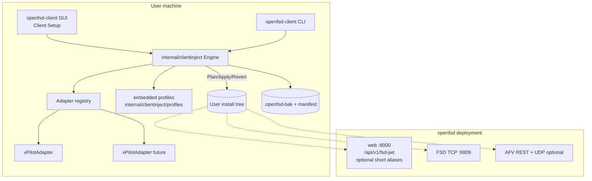
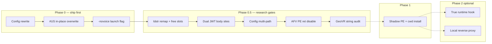
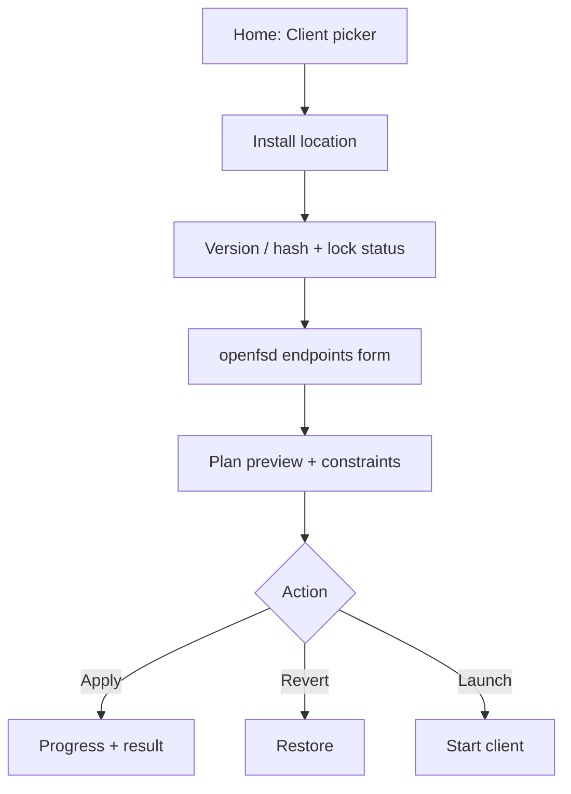
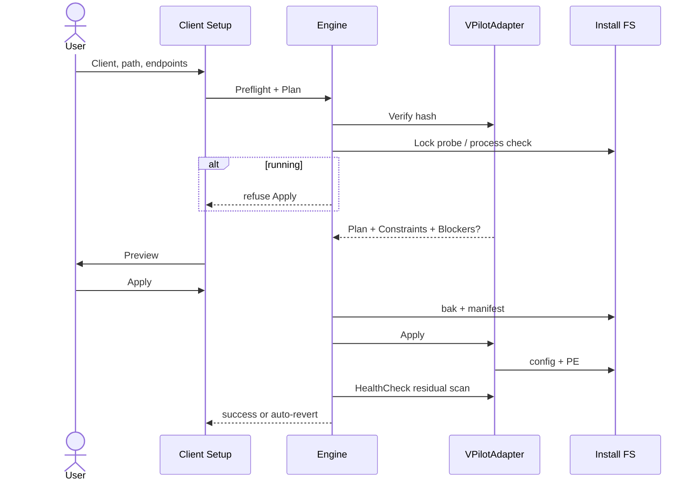

# openfsd Client Setup (multi-client injector; vPilot first)

| Field | Value |
|-------|--------|
| **Document** | openfsd Client Setup — multi-client framework + vPilot 3.12.1 adapter |
| **Author** | _(design author / implementer)_ |
| **Date** | 2026-07-28 |
| **Status** | **Draft** (rev 3 — re-review polish) |
| **Project** | openfsd |
| **Target land path** | `docs/design/client-runtime-injector.md` |
| **Related** | `Agents.md`, `docs/client-injector/research/vpilot-3.12.1.md`, `third_party/client-profiles/vpilot-3.12.1.yaml`, `wiki/Client-Connection.md`, `docs/design/afv-server.md`, `docs/authentication-token.md`, `docs/design/rest-api-versioning.md`, archived `renorris/vpilot-patch-utility`, `renorris/openfsd-client-patch-utility` |
| **Revision** | rev 3.1: fix `openfsd.example.com` host len parenthetical (19); prior rev 3 URL tables, `/j` A8, soft probe |

---

## Overview

**Product name: openfsd Client Setup** (binary `openfsd-client`). This is a **generic, cross-platform, minimal desktop GUI** (plus headless CLI) that configures **user-installed** third-party FSD/AFV clients so they connect to a private **openfsd** deployment. Phase 0 is an **on-disk + config patcher with reversible backups** — not a true in-memory runtime injector. “Runtime” strategies (shadow launch, process inject) are **later phases** only; do not market Phase 0 as memory-only rewriting.

openfsd speaks modern VATSIM-shaped FSD and optional AFV, but third-party clients (vPilot, xPilot, Euroscope, vatSys, TrackAudio, …) ship with **hardcoded VATSIM endpoints** (JWT issuer, status/datafeed URLs, AFV voice base). Operators today depend on **external, CLI-centric, version-brittle patch utilities** that often **disable AFV** rather than retargeting it.

**Critical product shape (client-agnostic):**

1. User selects **which client** (vPilot today; xPilot, Euroscope, vatSys, TrackAudio later).
2. User points at the client’s **install location on disk** (or accepts auto-detect).
3. User configures openfsd endpoints (web base, FSD host/port, AFV voice base, etc.).
4. Tool runs the **adapter-specific** mutation strategy for that client version.
5. **Apply / Revert / Launch** are first-class.

vPilot is **only the first adapter**. Architecture, GUI layout, and budget presentation must not hardcode `client_id == vpilot`.

**Legal:** never redistribute proprietary clients. Assume the client is already installed legally. Git tracks hashes, YAML profiles, research notes, and our code — never third-party binaries (`.research/` gitignored).

---

## Background & Motivation

### Current state

| Surface | openfsd path | Client need |
|---------|--------------|-------------|
| FSD JWT | `POST /api/v1/fsd-jwt` (`internal/web/auth.go` `getFsdJwt`) | Replace stock `https://auth.vatsim.net/api/fsd-jwt` |
| Classic status | `GET /api/v1/data/status.txt` (`internal/web/data.go`) | Replace stock status URL in client config/binary |
| Servers lists | `/api/v1/data/openfsd-servers.txt` (+ JSON variants) | Advertised via status.txt; cached server list often set directly |
| AFV REST | `AFV_API_PUBLIC_BASE_URL` (`internal/afv`, wiki Configuration) | Replace stock `https://voice1.vatsim.net` (or leave voice disabled via `-novoice`) |
| FSD TCP | default **6809** | Host (and optional port) via cached servers / CLI override |

Wiki `wiki/Client-Connection.md` currently **defers** to external tools (`vpilot-patch-utility`, `openfsd-client-patch-utility`). Those work but are not monorepo-first-class, are CLI-only, pin old versions (vPilot 3.11.1), and **disable AFV** rather than retargeting openfsd `-afv`.

### Research already performed (vPilot 3.12.1)

| Artifact | Location |
|----------|----------|
| Fingerprint profile (schema v1 today) | `third_party/client-profiles/vpilot-3.12.1.yaml` |
| RE notes | `docs/client-injector/research/vpilot-3.12.1.md` |
| Local extract (gitignored) | `.research/vpilot/` |

| Item | Value |
|------|--------|
| Installer SHA-256 | `528a51bf0e71ada11103314d18a9fc0321afac94e2706f2fb13e0fbf5bb4beaa` |
| `vPilot.exe` SHA-1 | `7d95a7110392c15728143cc30e1f00899c686eb5` |
| Default install | `%LOCALAPPDATA%\vPilot\` |
| Stack | .NET Framework 4.7.2 PE32 managed; Dotfuscator on network assemblies |
| AFV | GeoVR.* DLLs; stock base `https://voice1.vatsim.net` (confirm GeoVR does not re-hardcode — research gate) |
| Config crypto | Base64(3DES-ECB-PKCS7); key = MD5(GUID `5575ac09-f2de-4a1e-808b-e3398e17f8bf`) \|\| first 8 of MD5 |

CLR `#US` (3.12.1) — heap file offset `0xA22E8`, size `0x15E04` (values live in version-pinned YAML only; Go must not hardcode except tests that load profiles):

| Logical string | #US heap | Body file | ldstr CIL | UTF-16+term budget |
|----------------|----------|-----------|-----------|--------------------|
| `https://auth.vatsim.net/api/fsd-jwt` | `0x1569F` | `0xB7988` | `0x4BDB5` | 71 bytes |
| `https://voice1.vatsim.net` | `0x6D8D` | `0xA9076` | `0x1F0A7` | 51 bytes |
| `http://fsd.vatsim.net/` | `0x15751` | `0xB7A3A` | `0x4C0B2` | 45 bytes |

**Also noted (open research):** second fsd-jwt UTF-16 body at file `0xBA44A` (header walk failed — may be resource/non-`#US`). Adapter completeness requires proving liveness or dual-writing (see Research gates).

### Pain points

1. Private openfsd networks need client surgery for modern pilot clients.
2. External tools lag 3.12.1 fingerprints already researched in-tree.
3. Prior art disables AFV; openfsd now has native `-afv`.
4. Half-patched installs need transactional bak + clear recovery.
5. Risk of vPilot-only product shape instead of multi-client platform.
6. **In-place JWT `#US` budget is extremely tight** for realistic hostnames (see below) — Phase 0 without free-slot remap or server short-path alias only works for **lab/short hosts**.

### Constraints (non-negotiable)

- **Legal:** never redistribute third-party client binaries/installers.
- **Import graph:** `internal/clientinject` must not import `server`, `postoffice`, `session`, `web`, `afv`, `db`, `cluster`, `sweatbox`, `metar`, `auth`, `serviceapi`.
- **Layout:** new **auxiliary cmd** `cmd/openfsd-client` (Agents.md “single binary `cmd/openfsd`” means FSD+web+AFV **colocation**, not “only one executable in the repo”). Pattern matches `cmd/openfsd-migrate-*`.
- **boring-web** = `internal/web` only; desktop GUI is separate (Fyne).
- **Product framing:** private openfsd networks only.

---

## Goals & Non-Goals

### Goals

1. Generic **client adapter framework** — discover, verify hash, plan, apply, revert, health-check, launch.
2. **Version-pinned profiles** — refuse unknown PE hashes.
3. Pluggable mutations — config rewrite, `#US` patch, ldstr remap, later PE disable / runtime.
4. **AFV retarget preferred** when budgets and research allow; Phase 0 voice off via **`-novoice`** until PE disable site is known.
5. **Client-agnostic GUI** — no layout special-case on `client_id`; constraints come from `Plan` / adapter API.
6. Headless CLI parity.
7. Reversible by default (`.openfsd-bak` + manifest).
8. vPilot 3.12.1 path that is **honest about readiness** (see Implementation readiness).
9. First-class monorepo module (docs, embed-safe profiles, packages, PR plan).
10. Honest naming: Client Setup / on-disk apply vs later “runtime” phases.

### Non-Goals

- Redistributing proprietary clients.
- Facilitating deceptive connection to public VATSIM.
- Supporting every historical client version in v1.
- Embedding injector in `cmd/openfsd`.
- Full decompiler in-product.
- Cross-process memory inject in Phase 0–1.
- Native macOS pilot clients that do not exist (Windows primary; Wine path best-effort).
- Default TLS MITM reverse proxy.
- Browser automation tests for the desktop GUI.
- Claiming Phase 0 works for arbitrary long hostnames without free-slot remap **or** server short-path aliases.

---

## Implementation readiness (MVP vs production hostnames)

| Capability | Short-host lab MVP | Production hostnames |
|------------|--------------------|----------------------|
| Config status + CachedServers | **Yes** (Phase 0) | **Yes** |
| JWT `#US` in-place (host ≤ **12** chars for default path) | **Yes** | **No** for typical FQDNs |
| JWT via free-slot + ldstr remap | After **Research gate R1** | **Required** (unless A8 server alias) |
| JWT via server short-path alias (optional) | Optional openfsd web PR | Alternative to remap |
| AFV `#US` in-place (URL ≤ **25** chars) | **Yes** if short voice host | Same |
| AFV PE `ret` disable | **Out of Phase 0** until **R2** | Optional fallback |
| Voice off without PE patch | **`-novoice` / ForceDisableAFV launch flag** | Same |
| Residual stock JWT scan (incl. second body site) | After **R3** | **Required** for “adapter complete” |
| Config path multi-candidate | After **R4** | **Required** for “adapter complete” |
| GeoVR re-hardcode check | After **R5** | Required before promising AFV retarget |

**Do not market** the first adapter CLI as “works for any openfsd hostname” until R1 (or A8) lands.

---

## Proposed Design

### High-level architecture



### Process / package layout (Agents.md ownership)

**KD-1:** separate binary + library — not a subcommand of `openfsd`.

Agents.md “single binary” means **one server process** can run FSD+web+AFV together. The repo **already has** auxiliary cmds (`openfsd-migrate-to-rqlite`, `aptdat2apt`, …). `openfsd-client` is another auxiliary cmd.

| Package / path | Owns | Import constraints |
|----------------|------|--------------------|
| **`cmd/openfsd-client`** | Entry: GUI default, CLI subcommands | May import `internal/clientinject` + Fyne. **Not** server/web/afv/db/… |
| **`internal/clientinject`** | Engine: plan/apply/revert, backup, discover, preflight locks, launch | stdlib + `gopkg.in/yaml.v3` + pure subpackages |
| **`internal/clientinject/profiles/`** | **Embed root** for YAML profiles (`//go:embed *.yaml`) | Tracked in git; canonical runtime source |
| **`internal/clientinject/cilus`** | Pure CLR `#US` encode/decode | **stdlib only** |
| **`internal/clientinject/vpilotconfig`** | Pure vPilot 3DES + XML field rewrite | **stdlib only** |
| **`internal/clientinject/pepatch`** | Section map, overwrite, padded string | **stdlib only** |
| **`internal/clientinject/adapters`** | Per-client adapters | sibling pure packages + profiles |
| **`third_party/client-profiles/`** | Human/research **mirror** of fingerprints (may lag embed tree) | No binaries; **not** the `go:embed` root |
| **`docs/client-injector/`** | Research notes, operator guide | — |

#### Profile embed policy (KD-17)

Go `//go:embed` can only see files under the embedding package directory. Therefore:

1. **Canonical embed path:** `internal/clientinject/profiles/*.yaml`
2. **Mirror:** `third_party/client-profiles/` kept for discoverability / non-Go consumers; CI or `scripts/check-client-profiles-sync.sh` may **diff** mirror ↔ embed (or generate one from the other in PR).
3. **openfsd-client never fetches** `installer.url` from profiles (user download instructions only).
4. Optional override: `--profiles-dir` for development.

```text
cmd/openfsd-client/
  main.go
  gui/
internal/clientinject/
  engine.go
  profile.go
  backup.go
  discover.go
  preflight.go          # running process / file lock
  launch.go
  launch_shadow.go      # Phase 1
  adapter.go
  kinds.go              # MutationKind + YAML map
  profiles/             # go:embed
    vpilot-3.12.1.yaml
  adapters/
    vpilot/
    registry.go
  cilus/
  vpilotconfig/
  pepatch/
  testdata/
third_party/client-profiles/   # mirror / research index
  vpilot-3.12.1.yaml
docs/client-injector/research/
```

**Import graph additions** (`scripts/check-import-graph.sh`):

```
internal/clientinject → forbid internal/{server,web,afv,db,postoffice,session,cluster,sweatbox,metar,auth,serviceapi}
internal/clientinject/{cilus,vpilotconfig,pepatch} → stdlib only
cmd/openfsd-client → only internal/clientinject (+ GUI module deps)
```

**Coverage floors** (wire when packages land; script already skips missing packages):

| Scope | Floor |
|-------|-------|
| `internal/clientinject/cilus` | ≥98% hard |
| `internal/clientinject/vpilotconfig` | ≥98% hard |
| `internal/clientinject/pepatch` | ≥95% hard |
| `internal/clientinject` (engine + adapters) | ≥85% soft → hard after GUI PR |
| `cmd/openfsd-client` | excluded |

### Core interfaces

```go
package clientinject

// Endpoints — user-configured openfsd connection surfaces (client-agnostic).
type Endpoints struct {
    // Public HTTPS origin of openfsd web, no trailing slash.
    // e.g. "https://fsd.example.com"
    WebBaseURL string

    // FSD hostname only, or host:port if non-default port is required.
    // See "FSD address shape" below.
    FSDHost string

    // TCP port for FSD. Zero means default 6809 and omit from CachedServers
    // unless IncludePortInServerList is true.
    FSDPort int

    // If true, CachedServers uses "NAME|host:port" even when port is 6809.
    IncludePortInServerList bool

    // Human label for cached server row, e.g. "OPENFSD".
    FSDServerName string

    // AFV REST public base, e.g. "https://voice.example.com". Empty + ForceDisableAFV
    // => launch with -novoice (Phase 0); PE ret only after research gate R2.
    AFVBaseURL string

    // Prefer no voice (CLI -novoice / skip AFV #US retarget).
    ForceDisableAFV bool

    // Prefer short JWT path templates if server short paths are available.
    // When true, planner picks the shortest path that fits the #US budget from
    // ShortJWTPathCandidates (default order below), after optional soft probe.
    PreferShortJWTPath bool

    // Optional override of short-path candidates (empty = engine defaults).
    // See A8: "/j" (preferred once fixed), "/api/fsd-jwt", "/fsd-jwt".
    ShortJWTPathCandidates []string
}

// Derived (engine helpers; path depends on PreferShortJWTPath + server support):
//   JWTURL default:  WebBaseURL + "/api/v1/fsd-jwt"
//   JWTURL short:    WebBaseURL + chosen short path (A8 / fixed POST /j)
//   StatusURL:       WebBaseURL + "/api/v1/data/status.txt"
//   StatusJSON:      WebBaseURL + "/api/v1/data/status.json"
//
// Default ShortJWTPathCandidates (shortest first for budget):
//   "/j", "/fsd-jwt", "/api/fsd-jwt"
// PreferShortJWTPath without a working short route is operator error — soft-probe warns.

// FSD address shape (normative for vPilot CachedServers / -serveraddressoverride):
//   - Default port 6809: CachedServers entry "NAME|hostname" (hostname only),
//     matching prior-art AUTOMATIC|fsd.connect.vatsim.net style.
//   - Non-default port: "NAME|hostname:port".
//   - -serveraddressoverride: same host or host:port string as FSDHost field
//     after normalization (if FSDPort set and host has no port, append :port).
// Research gate R6 may refine if 3.12.1 rejects :port in CachedServers.

type InstallCandidate struct {
    ClientID      string
    RootDir       string
    PrimaryPE     string
    ConfigPaths   []string // all discovered candidates (install + AppData, etc.)
    DisplayHint   string   // e.g. "default LocalAppData install"
}

type Install struct {
    ClientID       string
    RootDir        string
    PrimaryPE      string
    // ConfigPaths that will be written (subset of candidates after resolve).
    ConfigPaths    []string
    HashSHA1       string
    ProfileID      string
}

// Constraint is a client-agnostic UI hint (GUI must not special-case vPilot).
type Constraint struct {
    Field       string // "JWTURL", "AFVBaseURL", "WebBaseURL", ...
    MaxRunes    int    // 0 = unknown / N/A
    Strategy    string // "in_place", "remap_required", "server_alias", "n/a"
    Description string
}

type MutationKind string

const (
    MutConfigRewrite MutationKind = "config_rewrite"
    MutUSHeapString  MutationKind = "cil_us_string"
    MutLdstrRemap    MutationKind = "cil_ldstr_remap"
    MutRawOverwrite  MutationKind = "raw_overwrite"
    MutPaddedString  MutationKind = "padded_string"
    MutAFVDisablePE  MutationKind = "afv_disable_pe" // only if profile has offset
    MutLaunchFlag    MutationKind = "launch_flag"    // e.g. -novoice recorded in plan
)

// YAML kind → Go kind (normative):
//   vpilot_config, config_rewrite     → config_rewrite
//   cil_us_string                     → cil_us_string
//   cil_us_or_remap                   → cil_us_string and/or cil_ldstr_remap (planner expands)
//   cil_ldstr_remap                   → cil_ldstr_remap
//   raw_overwrite, section_overwrite  → raw_overwrite
//   padded_string                     → padded_string
//   afv_disable                       → afv_disable_pe if offset set, else launch_flag -novoice
//   launch_flag                       → launch_flag

type Mutation struct {
    ID          string
    Kind        MutationKind
    Description string
    TargetRel   string
    Detail      MutationDetail // typed payload; see appendix
}

type Plan struct {
    Install   Install
    Endpoints Endpoints
    Mutations []Mutation
    // Constraints for generic budget UI (from adapter after dry plan).
    Constraints []Constraint
    Warnings    []string
    Blockers    []string // non-empty => Apply refused
}

type ApplyResult struct {
    ManifestPath string
    BackupRoot   string
    Applied      []string
}

// FileWriter abstracts disk for tests.
type FileWriter interface {
    ReadFile(path string) ([]byte, error)
    WriteFile(path string, data []byte) error
    CopyFile(src, dst string) error
    OpenReadWrite(path string) (ReadWriteSeekCloser, error)
    Stat(path string) (fs.FileInfo, error)
    Remove(path string) error
}

type ReadWriteSeekCloser interface {
    io.Reader
    io.Writer
    io.Seeker
    io.Closer
    Truncate(size int64) error
}

// Profile is the loaded schema_version 2 document (fingerprint + mutations).
type Profile struct {
    SchemaVersion           int
    ClientID                string
    DisplayName             string
    SupportedClientVersion  string
    PrimaryBinary           PrimaryBinarySpec
    ConfigFiles             []ConfigFileSpec
    CLR                     *CLRSpec
    Strings                 map[string]StringSpec
    USFreeSlots             []USFreeSlot
    Mutations               []ProfileMutationSpec
    Launch                  LaunchSpec
    // ... see appendix for full field list
}

// Adapter — per-client strategy; GUI/CLI stay generic.
type Adapter interface {
    ClientID() string
    DisplayName() string
    SupportedProfiles() []string

    Discover(ctx context.Context) ([]InstallCandidate, error)
    Verify(install Install, profile *Profile) error

    // EndpointConstraints returns static/profile hints before full plan
    // (optional; may return nil and rely solely on Plan.Constraints).
    EndpointConstraints(profile *Profile) []Constraint

    // Plan must not write disk. Must populate Constraints + Blockers.
    Plan(install Install, profile *Profile, ep Endpoints) (*Plan, error)

    Apply(ctx context.Context, plan *Plan, w FileWriter) error
    HealthCheck(install Install, ep Endpoints) error
    LaunchArgs(install Install, ep Endpoints) []string
}
```

### Engine orchestration (transactional Apply)

```text
1. Resolve adapter + profile by client_id + PE hash
2. PreflightRunningProcess(primary PE):
     - Best-effort: Windows process list / try exclusive open
     - If running or ERROR_SHARING_VIOLATION → abort with
       "Quit the client completely, then Apply again"
3. plan := adapter.Plan(...)  // includes URL budget / remap availability
4. if plan.Blockers != nil → abort (no writes)
5. BackupSession:
     - Copy each target to <file>.openfsd-bak
     - Write .openfsd-inject-manifest.json (status=in_progress)
6. Apply mutations in order
   - On any error → restore all from bak; status=failed; keep bak for forensics optional
7. HealthCheck (includes residual stock JWT scan when R3 done)
   - On failure → auto-revert; report
8. status=applied
```

**Partial-write rule:** PE and config are separate files; if PE write fails after config write, restore **both** from bak (never leave config-only openfsd + stock JWT PE, or the reverse, without user confirmation).

Revert restores bak files, verifies stock SHA of primary PE, removes/marks manifest.

### Mutation strategies (phased)



| Strategy | Phase | Notes |
|----------|-------|-------|
| Config rewrite | **0** | status + CachedServers |
| `#US` in-place | **0** | only if rendered URL fits budget |
| `-novoice` launch | **0** | voice off without PE disable |
| free-slot + ldstr remap | **0.5 / R1** | **required** for real JWT hostnames (or A8) |
| Dual/multi JWT site patch | **0.5 / R3** | residual stock JWT scan |
| Config multi-candidate | **0.5 / R4** | install dir vs AppData |
| AFV PE `ret` disable | **0.5 / R2** | not claimed until offset known |
| GeoVR inventory | **0.5 / R5** | may add DLL mutations |
| Shadow launch | **1** | hybrid: temp PE, cwd=install |
| True runtime / MITM | **2** | optional |

### “Runtime” naming honesty

| User-facing label | Implementation |
|-------------------|----------------|
| **openfsd Client Setup** | Product name |
| **Apply** | Durable on-disk PE + config (Phase 0) |
| **Launch patched (ephemeral)** | Phase 1 shadow PE |
| **Inject at launch** | Phase 2 only |

UI copy must never claim Phase 0 “rewrites only in memory.”

### JWT / AFV URL length budgeting (normative)

`#US` payload budget is **odd** (UTF-16 bytes + terminal). Max characters ≈ `(budget − 1) / 2`.

| Slot | Budget | Max chars | Stock | Stock len |
|------|--------|-----------|-------|-----------|
| fsd-jwt | 71 | **35** | `https://auth.vatsim.net/api/fsd-jwt` | 35 |
| AFV base | 51 | **25** | `https://voice1.vatsim.net` | 25 |
| auto fsd HTTP | 45 | **22** | `http://fsd.vatsim.net/` | 22 |

**Path lengths** (`len` of ASCII path only) and **in-place max host** (JWT slot max **35** runes; `len("https://")` = **8**):

| JWT path | Path len | max_host = 35 − 8 − path | Example host that fits |
|----------|---------:|-------------------------:|------------------------|
| VATSIM stock `/api/fsd-jwt` | 12 | 15 | (reference only) |
| openfsd default `/api/v1/fsd-jwt` | **15** | **12** | `fsd.ex.co` (9) |
| A8 `/api/fsd-jwt` | 12 | **15** | `fsd.example.com` (15) exact |
| A8 `/fsd-jwt` | 8 | **19** | `openfsd.example.com` (19) exact |
| Existing/fixed `POST /j` | **2** | **25** | most private FQDNs |

```text
max_host(path) = 35 - len("https://") - len(path)
full_url         = "https://" + host + path
# in-place requires len(full_url) ≤ 35
```

**Verified full-URL lengths** (exact `len`; recompute with any language one-liner before editing this table):

| URL | Length | In-place (≤35)? |
|-----|-------:|-----------------|
| `https://fsd.ex.co/api/v1/fsd-jwt` | **32** | Yes (host `fsd.ex.co` = 9) |
| `https://fsd.example.com/api/v1/fsd-jwt` | **38** | **No** — needs remap or short path |
| `https://fsd.example.com/api/fsd-jwt` | **35** | Yes (A8 `/api/fsd-jwt`) |
| `https://fsd.example.com/j` | **25** | Yes (fixed `/j`) |
| `https://openfsd.example.com/api/v1/fsd-jwt` | **42** | **No** |
| `https://openfsd.example.com/fsd-jwt` | **35** | Yes (A8 `/fsd-jwt`) |
| `https://openfsd.example.com/j` | **29** | Yes (fixed `/j`) |

**In-place AFV max URL length:** 25 characters total (not host-only). Exact lengths:

| URL | Length | In-place (≤25)? |
|-----|-------:|-----------------|
| `https://v.ex.co` | **15** | Yes |
| `https://voice.example.com` | **25** | Yes (at budget max) |
| `https://voice1.example.com` | **26** | **No** |

**Phase 0 planner rules:**

1. Render JWT/AFV URLs from endpoints (+ optional short path from PreferShortJWTPath).
2. If `len(url) ≤ max_chars` **and** encoded payload ≤ budget → in-place `#US`.
3. Else if `us_free_slots` non-empty **and** R1 complete → write free slot + ldstr remap.
4. Else if PreferShortJWTPath: choose shortest candidate path that yields `len(full_url) ≤ 35` (default order `/j`, `/fsd-jwt`, `/api/fsd-jwt`). **Soft-probe** that path (below); warn if probe fails; still allow Apply only with explicit override if probe fails.
5. Else if AFV only: ForceDisableAFV or empty AFV → plan `launch_flag -novoice` (no PE ret until R2).
6. Else **blocker** with explicit message: host must be ≤12 chars for default JWT path **or** free-slot remap not yet available **or** enable PreferShortJWTPath / shorten DNS.

GUI shows **generic** `Plan.Constraints` / meters from dry-plan on keystroke — **not** hard-coded vPilot layout.

### Optional server short-path JWT (A8) — includes existing `POST /j`

**Problem:** PE remap is the hard path for long hosts.  
**Alternative:** openfsd web exposes **short JWT paths** so in-place `#US` fits realistic private hostnames.

#### Existing code (today)

`internal/web/routes.go` already registers:

```go
e.POST("/j", func(c *gin.Context) {
    c.Redirect(http.StatusFound, "/api/v1/fsd-jwt")
})
```

A **302 redirect is a poor JWT POST surface**: many HTTP clients do not re-POST the body after a redirect (or convert to GET). For Client Setup, **`POST /j` must invoke `getFsdJwt` directly** (same handler as `POST /api/v1/fsd-jwt`), not redirect. Do **not** rely on 307/308 unless a dedicated client compatibility matrix proves safe; direct handler binding is simpler and correct.

Ultra-short path `/j` (2 chars) yields **max_host = 25** — better than `/api/fsd-jwt` (15) or `/fsd-jwt` (19) for in-place `#US`.

#### A8 normative route set (PR-5)

| Route | Behavior | max_host (in-place JWT) |
|-------|----------|------------------------:|
| `POST /j` | **Change** from 302 → **`s.getFsdJwt` directly** (fix existing short path) | **25** |
| `POST /api/v1/fsd-jwt` | Unchanged canonical | 12 |
| `POST /api/fsd-jwt` | **Add** alias → `getFsdJwt` (readable short) | 15 |
| `POST /fsd-jwt` | **Optional** alias → `getFsdJwt` | 19 |

All return the same VATSIM-shaped body as today. Outside microversion reject. Document in `docs/authentication-token.md` + wiki. Open Q10 path-clash: `/j` already exists; `/fsd-jwt` must not collide with static file routes (prefer not adding if static mount is greedy).

**Client PreferShortJWTPath trust model:**

| Step | Behavior |
|------|----------|
| Soft probe (plan-time, optional network) | For each candidate path in order, issue **credential-free** request against `WebBaseURL+path` — prefer `OPTIONS` or `POST` with empty/`{}` body. Treat **401/400/200** with JSON body shape as “route exists”; **404/405/connection error** as missing. Do **not** send real CID/password. |
| Probe disabled | Offline/lab: skip probe; emit **warning** “PreferShortJWTPath set without connectivity check — ensure server has fixed `/j` or A8 aliases.” |
| Probe fails all candidates | **Warning** + plan **blocker** unless user sets override “I confirm short JWT path works.” |
| Mis-set flag without A8/fixed `/j` | Documented operator error; soft probe is the mitigation for the footgun next to the 12-char rule. |

**KD-13 revised:** no **required** server changes for the client tool to exist; **optional** (and high-leverage) web changes: **fix `/j`**, add readable aliases. Not redistribution; not a DB migration.

### Profile schema

#### Migration: fingerprint v1 → schema v2

| Today | Target |
|-------|--------|
| `third_party/.../vpilot-3.12.1.yaml` with `profile_version: "1"` fingerprint-only | `schema_version: 2` full mutation profile in **embed** tree |

**Loader policy (single breaking cut in PR that lands mutations):**

1. Embed tree requires `schema_version: 2`.
2. Fingerprint-only v1 files are **not** loadable by the engine (research mirror may keep v1 until sync script rewrites).
3. One migration PR copies fingerprints into v2 embed YAML and updates `third_party/` mirror to match.
4. No dual-runtime support for v1 mutation application — avoids two planners.

Illustrative embed profile fields (offsets stay in YAML only):

```yaml
schema_version: 2
client_id: vpilot
display_name: vPilot
supported_client_version: "3.12.1"
# ... installer fingerprints, primary_binary, clr.us_heap ...

strings:
  fsd_jwt:
    stock: "https://auth.vatsim.net/api/fsd-jwt"
    us_heap_offset: 0x1569F
    body_file_offsets: [0xB7988]   # extend after R3 if second site live
    ldstr_file_offsets: [0x4BDB5]
    payload_budget_bytes: 71
    template: "{{.JWTURL}}"
  afv_base:
    stock: "https://voice1.vatsim.net"
    body_file_offsets: [0xA9076]
    ldstr_file_offsets: [0x1F0A7]
    payload_budget_bytes: 51
    template: "{{.AFVBaseURL}}"

# Populated only after research gate R1 — empty means remap unavailable
us_free_slots: []

mutations:
  - id: config_status_servers
    kind: vpilot_config
    fields:
      network_status_url: "{{.StatusURL}}"
      cached_servers:
        - "{{.FSDServerName}}|{{.FSDAddress}}"  # FSDAddress = host or host:port
      clear_network_credentials: true

  - id: patch_fsd_jwt
    kind: cil_us_or_remap
    string_ref: fsd_jwt
    on_too_long: error   # JWT required; never silent skip

  - id: patch_afv_base
    kind: cil_us_or_remap
    string_ref: afv_base
    on_too_long: launch_novoice   # Phase 0: NOT pe_disable until R2

  - id: afv_disable_pe
    kind: raw_overwrite
    file_offset: null    # set only after R2
    new_bytes: [0x2A]
    only_if: pe_disable_selected_and_offset_set
```

**Template vars:** `WebBaseURL`, `JWTURL`, `StatusURL`, `StatusJSON`, `FSDHost`, `FSDPort`, `FSDAddress` (normalized host or host:port), `FSDServerName`, `AFVBaseURL`.

### vPilot 3.12.1 adapter

#### Surfaces

| Surface | Phase 0 strategy |
|---------|------------------|
| FSD JWT | `#US` in-place if fits; else blocker until R1/A8 |
| Network status | config 3DES `NetworkStatusURL` → openfsd status.txt |
| Cached servers | `NAME\|FSDAddress` obfuscated |
| Auto server HTTP | skip if cached list set |
| AFV base | `#US` if fits; else `-novoice` (not PE ret) |
| Model matching / updates | leave alone |

#### Config crypto (normative)

```text
guid = "5575ac09-f2de-4a1e-808b-e3398e17f8bf"
key16 = MD5(guid)
key24 = key16 || key16[0:8]
field = Base64(3DES-ECB-PKCS7(plaintext, key24))
```

Clear `NetworkLogin` / `NetworkPassword` on Apply (KD-12).

#### Config path discovery (R4 — required before “adapter complete”)

Do **not** assume only `install/vPilotConfig.xml`.

**Candidates (ordered, Windows):**

1. `{installRoot}/vPilotConfig.xml`
2. `%LOCALAPPDATA%\vPilot\vPilotConfig.xml` (if install root differs)
3. Any path recorded in a previous manifest
4. Research may add more after ProcMon/IL notes

**Behavior:**

- Discover all existing candidates; show in GUI “Config files”.
- **Write set:** all candidates that exist **or** the install-dir path if none exist (create only if research confirms client creates there — default: rewrite existing only; if zero exist, blocker “run vPilot once to create config”).
- HealthCheck decrypts **each written** path and asserts status URL; if any written file still has stock status after apply → fail.
- Document operator validation: after Apply, connect once; if servers still VATSIM, report config path bug.

#### Binary mutations

1. Verify SHA-1/256 vs profile.
2. Preflight lock / not running.
3. Backup PE.
4. Patch primary JWT `#US` (+ all `body_file_offsets` after R3).
5. Patch AFV `#US` if retargeting.
6. Remap ldstr when using free slots (R1).
7. **Never** apply PE `ret` disable until profile `file_offset` non-null (R2).

#### HealthCheck (strengthened)

1. Decode primary `#US` slots asserted in profile.
2. **Scan entire PE** for UTF-16 stock JWT string `https://auth.vatsim.net/api/fsd-jwt` — **fail if any remain** after JWT mutation planned (catches second site `0xBA44A` if live).
3. Optionally scan for stock AFV base if AFV was retargeted.
4. Decrypt all written config paths; assert status + server list.
5. Soft: HTTP GET StatusURL (optional network).

#### CLI launch

- `-serveraddressoverride` with normalized FSDAddress.
- `-novoice` when ForceDisableAFV or AFV over-budget without PE disable.

#### GeoVR (R5)

String-inventory `GeoVR.Client.dll`, `GeoVR.Connection.dll`, `GeoVR.Shared.dll` for `voice1.vatsim.net` / AFV base. If found, either extend mutations to those DLLs or document that AFV retarget of `vPilot.exe` alone is insufficient (fall back to `-novoice` / PE disable of connect path).

### Multi-client extension model

Same adapter registry as before. **GUI rule:** no `if client_id == "vpilot"` for layout, budgets, or buttons. All per-client behavior flows from `Adapter` + `Plan.Constraints` + profile-driven mutation lists.

xPilot / Euroscope use `padded_string` + `raw_overwrite` families from prior-art YAML as **research seeds**, re-verified per version hash.

### GUI information architecture

**Toolkit:** Fyne v2 (KD-2). Product title: **openfsd Client Setup**.



Regions:

1. Header — product name + legal one-liner.
2. **Client** dropdown (vPilot enabled; others “Coming soon”).
3. Install path + Detect.
4. Fingerprint panel + **“Client is running — quit before Apply”** if preflight fails.
5. Endpoints form — web base, FSD host, FSD port (optional, default 6809), server name, AFV base, force disable voice, prefer short JWT path.
6. **Constraints panel** — data-bound to last dry-plan (`Constraints` / blockers); generic meters (field name, max runes, strategy).
7. Config files list (multi-candidate).
8. Actions Apply / Revert / Launch.
9. Log + recovery text.
10. Advanced: ephemeral launch (Phase 1), profiles dir.

**macOS:** may configure Windows paths (Wine/share); Launch best-effort.

**Persistence:** last paths/endpoints in OS config dir — never passwords.

**Every Apply:** soft banner “For private openfsd networks you are authorized to use.” Warn if `WebBaseURL` host is in known public VATSIM host set (`auth.vatsim.net`, `status.vatsim.net`, `voice1.vatsim.net`, `fsd.connect.vatsim.net`, …) — do not hard-block exotic private mirrors of those names without user override checkbox “I understand”.

### CLI

```text
openfsd-client                          # GUI when no subcommand
openfsd-client list-profiles
openfsd-client detect --client vpilot
openfsd-client plan|apply|revert|health|launch ...
  --web-base URL --fsd-host HOST [--fsd-port 6809]
  --afv-base URL [--force-disable-afv] [--prefer-short-jwt]
  --install DIR
```

Exit codes: 0 ok, 1 usage, 2 hash mismatch, 3 apply failed (reverted), 4 revert failed, 5 client running / file locked, 6 plan blockers.

### Backup & manifest

`.openfsd-bak` siblings + `.openfsd-inject-manifest.json` as in rev 1; add `preflight_ok`, `config_paths[]`, `constraints_snapshot`.

Recognize legacy `.orig` from external tools for soft migrate (optional Revert).

### Relationship to external patch utilities

**Reimplement** algorithms in monorepo; **supersede** for openfsd docs. External repos remain historical. Wiki points to `openfsd-client`.

### Sequence: Apply (vPilot)



---

## API / Interface Changes

### Client tool

New binary `openfsd-client` only.

### Optional openfsd web (A8 companion) — fix existing `POST /j`

| Route | Behavior |
|-------|----------|
| `POST /j` | **Today:** 302 → `/api/v1/fsd-jwt` (**insufficient** for POST JWT). **A8:** bind `getFsdJwt` directly |
| `POST /api/v1/fsd-jwt` | Canonical (unchanged) |
| `POST /api/fsd-jwt` | New readable alias → `getFsdJwt` |
| `POST /fsd-jwt` | Optional alias → `getFsdJwt` (watch static route clashes) |

No envelope change; same VATSIM-shaped body. Outside microversion reject. Document in `docs/authentication-token.md` + wiki.

**Not required** for tool scaffolding; **recommended** before declaring production-hostname readiness if free-slot research slips. Fixing `/j` alone unlocks max_host **25** without free-slot remap.

### Agents.md

Add ownership rows for `cmd/openfsd-client`, `internal/clientinject*`; clarify auxiliary cmds; import forbids; coverage floors; hygiene PE check.

### Wiki

`Client-Connection.md` → primary openfsd Client Setup; note status.txt is openfsd’s VATSIM-shaped subset (`json3` / `url1` / `servers.live`); validate once in manual matrix with real 3.12.1.

---

## Data Model Changes

None in openfsd DB. User-machine bak/manifest/settings only.

---

## Alternatives Considered

### A1. Subcommand of `cmd/openfsd` — **Rejected** (GUI/deps/image bloat)

### A2. Server distributes patched clients — **Rejected** (legal)

### A3. Default TLS MITM proxy — **Non-default advanced only**

### A4. Config/plugin only — **Insufficient for vPilot JWT/AFV**

### A5. GUI stack — **Fyne v2 accepted** (not Wails/Qt)

### A6. External patch utility only — **Supersede via reimplementation**

### A7. True runtime-only Phase 0 — **Rejected** (EDR, slow)

### A8. Server short-path JWT (fix `/j` + optional readable aliases) — **Accepted as optional high-leverage companion**

**Pros:** `POST /j` already exists (must stop being a 302); direct `getFsdJwt` gives max_host **25**; optional `/api/fsd-jwt` for readability; few lines in `internal/web`; often avoids free-slot research for private FQDNs.  
**Cons:** still finite host length; PE still needs **some** JWT string patch (stock VATSIM URL → openfsd URL); PreferShortJWTPath footgun without probe.  
**Verdict:** Ship A8 as optional openfsd web PR (priority: **fix `/j`**); client PreferShortJWTPath + soft probe. Complements free-slot remap for ultra-long hosts.

---

## Security & Privacy Considerations

| Threat | Severity | Mitigation |
|--------|----------|------------|
| Misuse toward public VATSIM | High (ethics) | UI banner every Apply; warn on known VATSIM hosts; product framing; no profile that targets VATSIM |
| Malicious profile YAML | Med | PR review; schema validate; no shell from YAML |
| Path traversal | Med | Clean paths; write only under install + discovered config candidates |
| Credential theft | Med | Never store passwords; clear on Apply |
| Half-patched PE | High | Preflight lock; transactional bak; auto-revert |
| Running process write | High | Preflight refuse Apply |
| Accidental binary commit | Med | Hygiene PE magic check in CI |
| Installer URL fetch | Low | Tool never downloads `installer.url` by default |
| Supply chain (Fyne) | Med | Pin version; single go.mod (KD-16) |

---

## Observability

`slog` + GUI log; manifest audit; no telemetry. Debug checklist: hash, lock, bak missing, AV, URL budget, config path, residual JWT scan, TLS on openfsd.

---

## Testing Strategy

**Never** put vPilot binaries in git/CI.

| Layer | Approach |
|-------|----------|
| cilus / vpilotconfig / pepatch | Goldens, table tests, ≥ floors |
| Profile self-consistency (CI) | `len(stock)` vs `payload_budget_bytes`; template required fields; schema_version=2 |
| Engine | Fake adapter; bak/revert; **lock failure** path (hold file handle); blocker paths |
| Residual JWT scanner | Synthetic PE with two UTF-16 copies of stock JWT |
| research tag | Local `.research/vpilot/extracted/vPilot.exe` offset confirmation |
| GUI | View-model / plan formatting unit tests; no Playwright |

**PR-4 / adapter-complete checklist (maintainer):**

1. `go test -tags=research ./internal/clientinject/...` green on machine with extract.
2. PR body pastes: PE SHA, confirmed offsets, config path(s) used, free-slot list or “short-host only”, residual scan result.
3. CI-only tests still green without extract.

**CI binary guard:** extend `scripts/check-hygiene.sh` (or sibling) to fail if files match PE `MZ` magic or `*.exe`/`*.dll` under repo except documented allowlist (none today). `.research/` already gitignored — also fail if such files are staged.

**Manual matrix:** short-host apply; long-host blocker until R1/A8; quit-client preflight; residual JWT; config multi-path; AFV short URL; `-novoice`; Revert; status feed connect once.

---

## Research gates (must complete before claims below)

| ID | Gate | Unblocks |
|----|------|----------|
| **R1** | Free `#US` slot catalog + ldstr remap on 3.12.1 | Production-length JWT hostnames without A8 |
| **R2** | AFV connect `ret` CIL file offset for 3.12.1 | PE disable fallback (not just `-novoice`) |
| **R3** | Second fsd-jwt body `0xBA44A` liveness; multi-site patch | “No residual VATSIM JWT” guarantee |
| **R4** | Config path resolution (install vs AppData) | Config Apply correctness |
| **R5** | GeoVR.* string inventory for voice base | AFV retarget confidence |
| **R6** | CachedServers `host:port` acceptance on 3.12.1 | Non-default FSD port UX |

Gates are tracked under `docs/client-injector/research/`; profiles gain offsets only when gate closed.

---

## Rollout Plan

| Stage | Content |
|-------|---------|
| R0 | Design rev 3 + pure packages |
| R1a | Engine + CLI skeleton (short-host lab) |
| R1b | Research gates R1–R5 as needed |
| R2 | Adapter “complete” for production hostnames |
| R3 | GUI |
| R4 | Wiki + Windows release artifact |
| R5 | Phase 1 hybrid shadow |
| R6+ | Other client adapters |

**Release:** Windows amd64 primary; macOS/Linux GUI optional for path management. Server Docker **unchanged**.

**Effort (revised, indicative):**

| Slice | Person-weeks |
|-------|----------------|
| Pure cilus + vpilotconfig + pepatch | **1–2** |
| Engine + preflight + backup + CLI | **1–1.5** |
| Research gates R1–R5 | **1–3** (unknown) |
| Adapter complete | **1–2** after gates |
| Optional A8 web aliases | **0.2–0.5** |
| GUI MVP | **1–2** |
| Shadow hybrid | **0.5–1** |
| Next client adapter | **0.5–1.5** each |

---

## Open Questions

1. ~~AFV disable site~~ → tracked as **R2** (not Phase 0).
2. ~~Free slots~~ → **R1**.
3. ~~Second JWT site~~ → **R3**.
4. ~~Config path~~ → **R4**.
5. Authenticode on 3.12.1 `vPilot.exe`? Affects SmartScreen copy severity.
6. Fyne packaging (`.exe` branding) for first Windows release?
7. TrackAudio config-only adapter early?
8. ~~go.mod nested vs main~~ → **KD-16: single main module**.
9. Ship A8 (fix `/j` first) before R1, in parallel, or only if R1 slips? **Recommendation:** fix `/j` early — high leverage, tiny PR.
10. Optional `/fsd-jwt` alias vs static-route clash — prefer **fixed `/j`** + **`/api/fsd-jwt`**; add `/fsd-jwt` only if no clash.

---

## Key Decisions

| ID | Decision | Rationale |
|----|----------|-----------|
| **KD-1** | Separate `cmd/openfsd-client` + `internal/clientinject` | Import isolation; auxiliary cmd pattern; not server flag |
| **KD-2** | Fyne v2 GUI; boring-web N/A | Pure Go; minimal elegant desktop UX |
| **KD-3** | Client-agnostic `Adapter` + Plan-driven constraints | Multi-client first; no vPilot-only GUI |
| **KD-4** | Phase 0 = durable on-disk + config; Phase 0.5 research gates; Phase 1 shadow; Phase 2 true runtime | Honest readiness; ship config+short-host early |
| **KD-5** | Version pin by PE hash | Offsets version-specific |
| **KD-6** | AFV retarget preferred; Phase 0 voice-off = **`-novoice`**; PE `ret` only after R2 | Do not promise PE disable without offset |
| **KD-7** | Reimplement prior art in monorepo; supersede external tools for docs | First-class module |
| **KD-8** | Pure stdlib `cilus` / `vpilotconfig` / `pepatch` | Coverage + hygiene culture |
| **KD-9** | Schema v2 template profiles; breaking cut from fingerprint v1 | One planner; embed tree is source of runtime truth |
| **KD-10** | Never redistribute client binaries; CI PE hygiene | Legal |
| **KD-11** | Transactional Apply + running-process preflight + auto-revert | Avoid half-patch / locked PE |
| **KD-12** | Clear vPilot credentials on Apply | Force openfsd credential re-entry |
| **KD-13** | No **required** server/DB changes for the tool; **optional A8** encouraged: **fix existing `POST /j` to `getFsdJwt`**, add readable aliases | PE tool stands alone; `/j` already shipped as 302 — wrong for JWT POST |
| **KD-14** | Synthetic CI + maintainer `research` tag gate for adapter complete | Offset correctness without shipping PE |
| **KD-15** | Import-graph hard-fail for clientinject → server/web/afv/db/… | Ownership forever |
| **KD-16** | **Single main `go.mod`**; pin Fyne when GUI PR lands | Avoid nested-module churn; accept download weight |
| **KD-17** | **Embed root** = `internal/clientinject/profiles/`; `third_party/client-profiles/` is mirror | `go:embed` path rules |
| **KD-18** | FSD default port **6809**; CachedServers `NAME\|host` without port when default; `host:port` when non-default or IncludePort | Prior-art shaped; R6 may refine |
| **KD-19** | Phase 0 production hostnames require **R1 free-slot remap and/or working short JWT path** (fixed `/j` or other A8); else short-host lab only (max JWT host **12** on default `/api/v1/fsd-jwt`) | Budget math; fixed `/j` → max host **25** |
| **KD-20** | HealthCheck residual UTF-16 scan for stock JWT after patch | Second-site safety |
| **KD-21** | Phase 1 shadow = **hybrid**: patch temp copy of PE (+ any DLLs mutated); **cwd = install root**; do not full-tree copy by default | DLLs/GeoVR/plugins resolve from install |
| **KD-22** | Product name **openfsd Client Setup**; “runtime injector” is roadmap language only | Naming honesty |

---

## Risks

| Risk | Severity | Mitigation |
|------|----------|------------|
| JWT over-budget without R1/A8 | **Critical** | Document 12-char rule; blockers; front-load R1; A8 |
| AFV PE disable unknown | **High** | `-novoice` only until R2 |
| Second JWT site live | **High** | R3 + residual scan KD-20 |
| Config path wrong | **High** | R4 multi-candidate + health |
| GeoVR re-hardcodes AFV | **Med** | R5 inventory |
| Client running / file lock | **High** | Preflight KD-11 |
| AV / SmartScreen | **High** | UX; Phase 1 hybrid; bak |
| Auto-update breaks hash | **Med** | Detect; re-apply prompt |
| Accidental binary commit | **Med** | Hygiene PE check |
| Status feed shape mismatch | **Low** | Manual connect once; docs note |

---

## Appendix A — Interface & kind mapping (normative sketch)

### YAML `kind` → `MutationKind`

| YAML | Go constant | Notes |
|------|-------------|-------|
| `vpilot_config` | `config_rewrite` | Detail: network status + servers |
| `config_rewrite` | `config_rewrite` | Generic |
| `cil_us_string` | `cil_us_string` | In-place only |
| `cil_ldstr_remap` | `cil_ldstr_remap` | Free slot + ldstr bytes |
| `cil_us_or_remap` | expanded by planner | Prefer in-place else remap |
| `raw_overwrite` / `section_overwrite` | `raw_overwrite` | |
| `padded_string` | `padded_string` | xPilot-class |
| `afv_disable` | `afv_disable_pe` or `launch_flag` | PE only if offset set |
| `launch_flag` | `launch_flag` | e.g. `-novoice` |

### `MutationDetail` (tagged union in practice)

```go
type USStringDetail struct {
    StringRef string
    NewString string
    HeapOff   int64
    BodyOffs  []int64
}
type LdstrRemapDetail struct {
    LdstrFileOff int64
    NewToken     []byte // e.g. 72 xx xx xx 70
    Slot         USFreeSlot
}
type RawOverwriteDetail struct {
    FileOffset int64
    NewBytes   []byte
}
type ConfigRewriteDetail struct {
    Paths            []string
    NetworkStatusURL string
    CachedServers    []string
    ClearCredentials bool
}
type LaunchFlagDetail struct {
    Args []string
}
```

### `Profile` major fields

`SchemaVersion`, `ClientID`, `DisplayName`, `Vendor`, `LicenseNote`, `SupportedClientVersion`, `Installer`, `PrimaryBinary` (path, globs, hashes, size, pe meta), `ConfigFiles[]`, `CLR.USHeap`, `Strings` map, `USFreeSlots[]`, `Mutations[]`, `Launch`, `RelatedBinaries[]` (for R5/shadow).

---

## Appendix B — Phase 1 shadow launch (hybrid)

**Default hybrid algorithm:**

1. Require install root intact (DLLs, plugins, sounds, model data stay put).
2. Create temp dir `os.MkdirTemp("", "openfsd-client-shadow-*")`.
3. Copy **only** files that will be mutated (typically `vPilot.exe`; plus any DLL listed in mutations after R5).
4. Apply PE mutations to temp copies.
5. For config: **prefer durable install config rewrite** (user expects servers saved) **or** copy config to temp only if research shows PE-relative config load — default **durable config** + shadow PE.
6. Launch: `exec` temp PE with `Dir = installRoot` (Windows CWD for satellite DLL load).
7. On exit: delete temp PE copies (best-effort); leave install PE stock if only shadow mode was used.

**Do not** full-tree copy (Costura/NAudio-sized GeoVR.Client ~15MB × tree cost, model matching paths).

If hybrid fails (DLL loads by absolute path to install PE), fall back to durable Apply.

---

## References

- `docs/client-injector/research/vpilot-3.12.1.md`
- `third_party/client-profiles/vpilot-3.12.1.yaml` (mirror)
- `docs/authentication-token.md`, `docs/design/afv-server.md`
- `wiki/Client-Connection.md`
- `internal/web/auth.go` (`getFsdJwt`), `internal/web/data.go`, `data_templates/status.txt`
- Agents.md; ECMA-335 II.24.2.4
- Prior art: `renorris/vpilot-patch-utility`, `renorris/openfsd-client-patch-utility`

---

## PR Plan

House gates when Go lands:

```bash
go test -race ./internal/clientinject/...
gofmt -l .
bash scripts/check-import-graph.sh
bash scripts/check-hygiene.sh          # include PE/binary guard when added
bash scripts/check-coverage.sh 80
go build -o openfsd-client ./cmd/openfsd-client
```

### PR-1: Design rev 3 land

| | |
|--|--|
| **Title** | `docs: client setup / injector design rev 3` |
| **Files** | `docs/design/client-runtime-injector.md` |
| **Deps** | None |
| **Description** | Land this document (incl. `/j` A8 notes, exact URL budgets). No runtime code. |

### PR-2: Pure `cilus` + `vpilotconfig` + hygiene PE guard

| | |
|--|--|
| **Title** | `clientinject: pure #US + vPilot config crypto; forbid PE commits` |
| **Files** | `internal/clientinject/cilus/*`, `vpilotconfig/*`, coverage floors, import-graph stdlib checks, `scripts/check-hygiene.sh` PE/`*.exe` guard, Agents.md rows (auxiliary cmd clarification) |
| **Deps** | PR-1 preferred |
| **Description** | ≥98% pure packages; CI rejects accidental binaries. No adapter yet. |

### PR-3: `pepatch` + engine core (backup, plan types, preflight lock, profile load)

| | |
|--|--|
| **Title** | `clientinject: pepatch, engine, backup, running-process preflight` |
| **Files** | `pepatch/*`, `engine.go`, `backup.go`, `preflight.go`, `profile.go`, `kinds.go`, `profiles/` embed skeleton, fake-adapter tests, optional `scripts/check-client-profiles-sync.sh` |
| **Deps** | PR-2 |
| **Description** | Transactional bak; file-lock preflight; schema_version 2 loader; YAML↔kind map. CLI optional stub. |

### PR-4: Research gates R1–R5 (offsets, free slots, config path, GeoVR, second JWT)

| | |
|--|--|
| **Title** | `docs/clientinject: vPilot 3.12.1 research gates (remap slots, config path, JWT sites)` |
| **Files** | `docs/client-injector/research/*`, embed profile updates when gates close, synthetic residual-scan fixtures |
| **Deps** | PR-3 (for fixture harness); can start research notes in parallel with PR-2 |
| **Description** | **Not** “ship adapter.” Close R1–R5 as far as possible; populate `us_free_slots`, multi `body_file_offsets`, config discovery notes, GeoVR inventory. May split into 4a/4b if large. |

### PR-5 (optional companion): openfsd web short JWT paths (A8)

| | |
|--|--|
| **Title** | `web: fix POST /j as fsd-jwt handler; add short-path aliases` |
| **Files** | `internal/web/routes.go`, PE/route tests (POST `/j` body reaches handler — **not** 302), `docs/authentication-token.md`, wiki |
| **Deps** | None (server-side); coordinates with client PreferShortJWTPath + soft probe |
| **Description** | (1) Change `POST /j` from 302 redirect to **`s.getFsdJwt` direct**. (2) Add `POST /api/fsd-jwt` alias. (3) Optional `POST /fsd-jwt` if no static clash. Document max_host table. Independently reviewable; high leverage for Client Setup budgets. |

### PR-6: vPilot 3.12.1 adapter + CLI (honest readiness)

| | |
|--|--|
| **Title** | `openfsd-client: vPilot 3.12.1 adapter CLI` |
| **Files** | `adapters/vpilot/*`, `cmd/openfsd-client` CLI, embed profile, residual JWT scan, config multi-path |
| **Deps** | PR-3; **PR-4 for production hostnames**; short-host lab path may land with blockers if R1 incomplete |
| **Description** | plan/apply/revert/health/launch. Acceptance: (a) short-host lab green; (b) production hostnames green **only if** R1 and/or PR-5 A8 available; (c) PE AFV disable **out of scope** until R2; (d) maintainer `go test -tags=research` evidence in PR body; (e) preflight running-client test. |

### PR-7: Fyne GUI — openfsd Client Setup

| | |
|--|--|
| **Title** | `openfsd-client: Fyne multi-client GUI (vPilot enabled)` |
| **Files** | `cmd/openfsd-client/gui/*`, Fyne in main go.mod (KD-16), legal banner, constraints panel from Plan |
| **Deps** | PR-6 |
| **Description** | Generic client picker + path + endpoints + constraints (no vPilot-only layout). Apply/Revert/Launch. |

### PR-8: Wiki + operator guide

| | |
|--|--|
| **Title** | `docs: Client Setup operator guide; update Client-Connection wiki` |
| **Files** | `wiki/Client-Connection.md`, `docs/client-injector/README.md`, README pointer |
| **Deps** | PR-6; PR-7 preferred |
| **Description** | 12-char rule, R1/A8, `-novoice`, quit-before-apply, status feed note, legal. Do **not** claim PE AFV disable until R2. |

### PR-9: Phase 1 hybrid shadow launch

| | |
|--|--|
| **Title** | `openfsd-client: hybrid shadow PE launch` |
| **Files** | `launch_shadow.go`, CLI `--ephemeral`, GUI advanced |
| **Deps** | PR-6 |
| **Description** | Temp PE (+ mutated DLLs only), cwd=install root, durable config default (Appendix B). |

### PR-10: xPilot adapter (second client)

| | |
|--|--|
| **Title** | `clientinject: xPilot version-pinned adapter` |
| **Files** | `adapters/xpilot/*`, embed profile, research notes, GUI enable |
| **Deps** | PR-3 engine; PR-7 GUI list |
| **Description** | Proves multi-client; re-verify offsets vs prior art for chosen hash. |

### PR-11 (optional): Euroscope / vatSys / TrackAudio

| | |
|--|--|
| **Title** | `clientinject: additional client adapters` |
| **Files** | per-client adapters + profiles + wiki |
| **Deps** | PR-10 pattern |
| **Description** | TrackAudio may be config-only. |

---

*End of design document (rev 3).*
