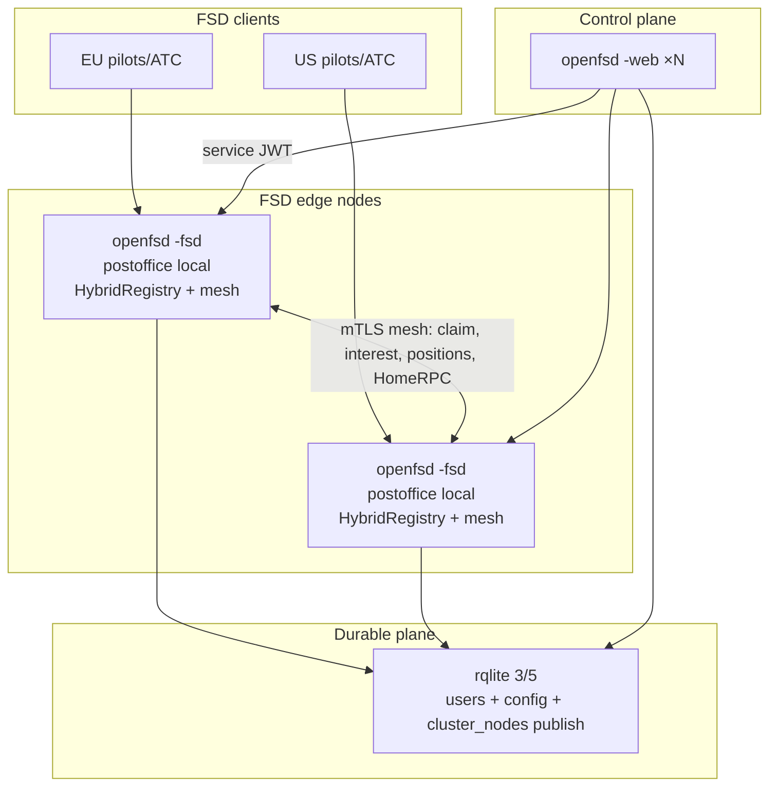
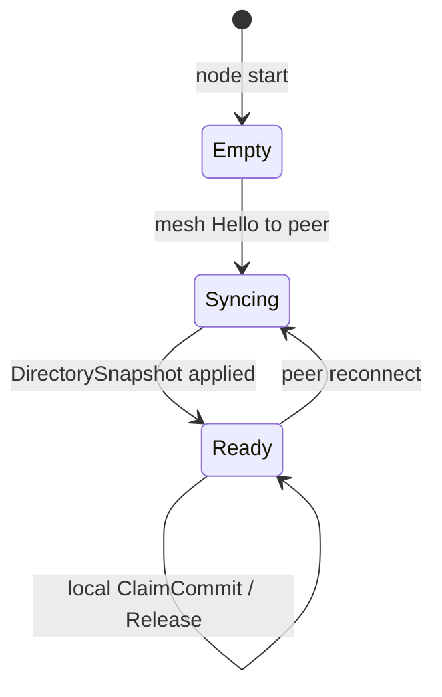
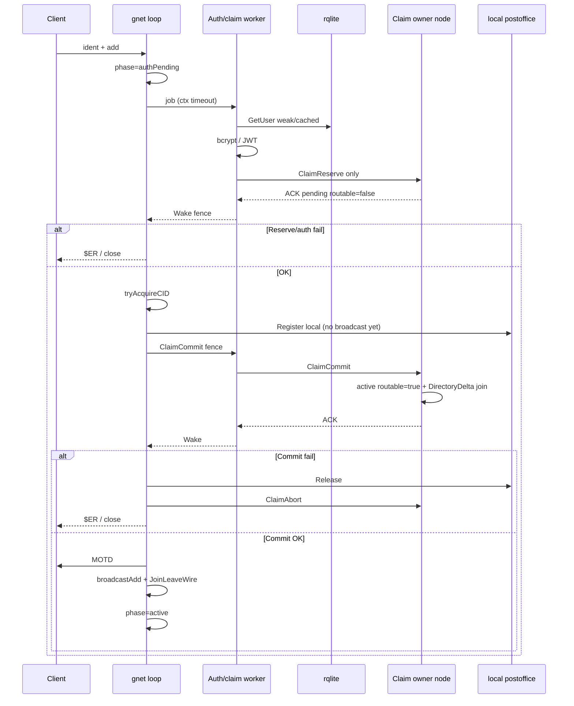
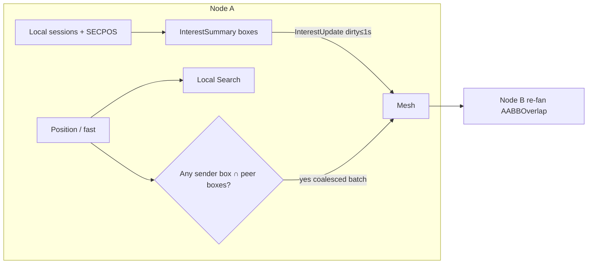
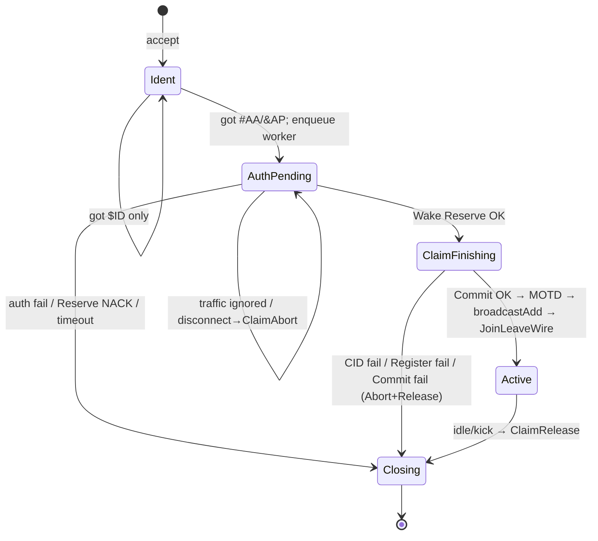

# Distributed openfsd — Full Implementation Plan & Feasibility Report

| Field | Value |
|-------|--------|
| **Document** | Distributed multi-node openfsd (mesh + rqlite) |
| **Author** | _(design author / implementer)_ |
| **Date** | 2026-07-28 |
| **Status** | **Draft** (rev 4 — product decisions: full mesh path, synthetic #DP, FPL cache) |
| **Project** | openfsd |
| **Target land path** | `docs/design/distributed-openfsd.md` (when accepted) |
| **Related** | `Agents.md`, `internal/postoffice`, `internal/server/deps.go`, `internal/db/*`, `internal/serviceapi`, `docs/design/sweatbox-integrated-simulator.md`, `wiki/Deployment.md`, rqlite docs |
| **Revision** | rev 4: product G0=full mesh; synthetic #DP on peer death; FPL cache+RPC miss; ≤8 peers; ring reconfig remains ops-drain v1 |

---

## Overview

openfsd today is a **single-process, single-node** FSD stack: gnet TCP plane, in-process `postoffice` registry (lock-free O(N) slab scan, VATSIM-scale ≤~15k), session-local flight plans, SQLite for users/config, and a boring-web control plane that talks to FSD only via service HTTP. That design is correct and fast for club / VA / regional networks. It does **not** give VATSIM-style properties: clients cannot pin to a geographically nearest edge, formation flying across distant peers cannot exploit local RTT, and a node death takes the whole network offline.

This document is a **full implementation plan plus an honest feasibility/rationality report** for making openfsd **optionally distributed**:

1. **Durable shared state → rqlite** (distributed SQLite over Raft) for users, passwords, config KV, and **datafeed** node metadata — with correct consistency levels so login and admin paths stay correct without putting rqlite on the position hot path.
2. **Ephemeral live state → in-process postoffice + inter-node mesh** for callsigns, positions, text, flight plans, queries, kills — **never** stored in rqlite.
3. **Geo-aware forwarding** so each node scans and fans out primarily **local** sessions; remote interest is a **set of AABBs** (including SECPOS), not a single union box and not a cluster-wide flood.
4. **Single-node remains the default.** Distribution is config/feature-flagged; import graph, deadlock rules, and “single binary” packaging stay intact. **Default CI and Docker Compose remain one container + SQLite forever** unless product explicitly flips that.

**Verdict (preview):** **Phased go** — product selected the **full mesh path** (2026-07-28) for multi-region multiplayer after rqlite PR-1–3, continuing PR-4–11. **No-go as a forced rewrite** of the default: single-node SQLite remains default CI/compose and runtime unless `CLUSTER_ENABLED`. Mesh is a **new subsystem** (~15–30 person-weeks); re-validate engineering only after PR-3 if rqlite surprises. Most openfsd deployments may still run single-node.

---

## Background & Motivation

### Current architecture (code as of 2026-07-28)

```text
┌─────────────────────────────────────────────────────────────┐
│ cmd/openfsd  (-fsd / -web; default both)                    │
│                                                             │
│  gnet FSD :6809 ──► login (DB sync on event loop today)     │
│                 ──► handlers ──► Registry (postoffice)      │
│                 ──► Session.Send / SendPosition (coalesced) │
│                                                             │
│  service HTTP :13618 ──► /online_users, /kick_user, sweatbox│
│                                                             │
│  web Gin :8000 ──► MPA + /api/v1 ──► FSD_HTTP_SERVICE_ADDRESS│
│                                                             │
│  SQLite file (modernc) ──► UserRepository + ConfigRepository│
└─────────────────────────────────────────────────────────────┘
```

| Surface | Path | Notes for distribution |
|---------|------|------------------------|
| Protocol | `pkg/protocol` | Pure wire; **unchanged** by mesh |
| Session | `internal/session` | Per-connection; atomics for geo/FPL; `ClosestVelocityClientDistance` is **non-atomic, read-loop only** |
| Postoffice | `internal/postoffice` | Callsign map + lock-free live slab; range = **mutual** `session.VisBoxesOverlap` (primary + SECPOS); **never hold map lock across `Session.Send`** |
| Registry DI | `internal/server/deps.go` | `Registry`, `UserStore`, `ConfigStore` — no `context` today |
| Login / auth | `conn.go` `attemptAuthentication`, `gnet_fsd.go` `finishLogin` | `GetUserByCID` + bcrypt **on gnet event loop**; JWT path hits config KV + often user row |
| Position | `handler_position.go` | `UpdatePosition` + `broadcastRanged`; ATC `%` then `ClearSecondaryVisCenters` until `'` SECPOS |
| Fast pos | `handleFastPilotPosition` | `^` / `#ST` / `#SL` → `broadcastRangedVelocity` only (no registry geo update; uses last `SetGeo`) |
| Text | `handler_text.go` | Direct, `@freq`, ATC chat, `*S`, `*` |
| FPL | `handler_flightplan.go` | **Session-local** `FlightPlan.Store`; amend uses `registry.Find` then mutate; `broadcastAllATC` |
| Query / PC / SB | `handler_query.go` | Direct + ranged; `storeAssignedBeacon` does `Find` + session field write (silent no-op on miss) |
| Kill / kick | `handler_admin.go`, `http_service.go` | Local `Find` + `Disconnect` / sweatbox remove |
| Service HTTP | `http_service.go` | JWT `fsd_service`; node-local snapshot; JWT secret `Get` **every request** today |
| DB | `internal/db` | **SQLite-only** (`RequireSQLiteDriver`); `UserRepository`/`ConfigRepository` **no context**; used by **server and web** |
| Web datafeed | `internal/web/data.go` | Classic templates **shape** multi-server (`servers.txt` `range`); runtime builders currently emit **one** server entry from config |
| Sweatbox | `internal/sweatbox` + `SweatboxHost` | In-process; local `Find` only |
| Limits | `gnet_fsd.go` `tryAcquireCID` | **Node-local** `FsdMaxSessionsPerCID` |

### Why VATSIM-style multi-server exists

1. **Client↔server RTT.** Position packets and text go client → their FSD node → peers. Same-region multiplayer benefits when peers share a nearby node.
2. **Partition load.** One process scanning N≈10–15k and fanning out dense hubs is CPU- and bandwidth-bound; M nodes with ~N/M local each reduces local O(N) work when traffic is regionally clustered.
3. **Failure domain.** Node death should disconnect only its attached clients, not the global network — **for already-connected sessions**. Login/claim behavior under partial mesh failure is a separate, harder policy (see KD-4 / HA matrix).
4. **Ops topology.** Web/control plane can scale independently of the FSD data plane; durable cert store can be HA without colocating SQLite files.

### Pain points distribution must not create

- Putting **positions or callsign leases into rqlite** (Raft write amplification → death by latency).
- **Naïve flood** of every `@`/`^` to every node.
- **Blocking gnet** on remote DB or mesh RTT for position/send.
- Racey callsign claims that allow **split-brain duplicates**.
- Claim policies that make **any single peer outage block all new logins** while advertising “HA.”
- Half-mesh where DM works but **`$AM` / beacon / SERVER:FP / kill** silently break for remote callsigns.
- Violating `Agents.md` import graph.
- Forcing hobby operators to run 3× rqlite + 2× FSD by default.
- Misconfigured random multi-continent LB that **increases** mesh load without geo sticky clients.

---

## Goals & Non-Goals

### Goals

1. **Optional multi-node FSD mesh** with geo-nearest client attachment and correct cross-node visibility (range/vis-box / SECPOS semantics preserved as far as mesh interest allows).
2. **rqlite as the multi-node durable store** for users, config, and **datafeed-facing** node metadata — same SQL schema family as today; selectable read consistency.
3. **Global callsign uniqueness** across the cluster at login time via a **race-safe** claim protocol that remains usable when non-critical peers are down (see KD-4).
4. **Cross-node delivery and home-node mutations** for: ranged positions (incl. fast streams), direct messages, ATC-wide FPL, supervisor wallops, kills/kicks, client queries / `#PC` / `#SB`, **flight-plan amend**, **beacon assign**, **SERVER:FP meta** when the target lives on another node.
5. **Performance wins beyond geo-RTT:** smaller per-node registry scans, HA for connected sessions, web multi-instance, isolation of sweaty hubs — measured and documented. Sticky geo routing is **mandatory** for multi-region wins.
6. **Single-node default** unchanged in DX: one binary, local SQLite file, one-container compose path.
7. **Import graph + deadlock rules** preserved; new package `internal/cluster`; HybridRegistry lives in `internal/server`.
8. **Phased PRs**, multi-node CI compose (optional job), observability hooks, rollback to single-node; **product go/no-go after rqlite-only**.

### Non-Goals (v1)

- Storing live positions, flight plans, or callsign sessions in rqlite.
- Multi-region active-active **rqlite** write-affinity tricks (one logical Raft group is enough).
- Distributed sweatbox / cross-node synthetic pilots (v1 = **node-local only**).
- Transparent client migration / seamless reconnect to another node without disconnect.
- **Cluster-wide `FsdMaxSessionsPerCID` / connection limits** — remain **per-node** (accepted hole; document in ops). Soft directory-based counts are optional later, not v1.
- Full VATSIM network feature parity beyond openfsd’s existing datafeed shapes.
- Replacing gnet or rewriting `pkg/protocol`.
- SPA control plane.
- Automatic geo-DNS / Anycast provisioning (docs only).
- Dynamic mesh membership from rqlite as **trust root** (v1 peers are static env + TLS; see **KD-11**).

---

## Feasibility & Rationality Report

### Problem statement

| Dimension | Single-node today | Distributed target |
|-----------|-------------------|--------------------|
| Client RTT | One public endpoint (or operator LB) | Nearest FSD edge |
| Peer latency (same region) | Always local fan-out | Local if same node; mesh hop if split |
| Peer latency (cross region) | One hop local (but client far from server) | Client near home node; **one mesh hop** between nodes |
| Scale of registry scan | O(N) local, N = all online | O(N_local + remote_interest) |
| HA (connected) | Process/host = network | Node loss = partial outage for its clients |
| HA (new login) | Always local | Depends on claim protocol (owner reachable) |
| Durable store HA | SQLite file / volume | rqlite 3/5 Raft |
| Complexity | Low (current strength) | **New subsystem**: claim + interest + home RPCs + ops |

### Protocol-level requirements

| Concern | Single-node behavior | Distributed requirement |
|---------|----------------------|-------------------------|
| Callsign uniqueness | `postoffice.Register` → `ErrCallsignInUse` | Cluster-wide unique; **race-safe** claim; login-time reject |
| `#AP`/`#AA` join visibility | `broadcastAll` | Flood join/leave to mesh + **directory snapshot on link-up** for late nodes |
| Client map completeness | New client learns peers mainly via positions / queries | Same product expectation; mesh **directory** is for server routing, not necessarily full join-PDU replay to every client |
| `@` / `%` / `^` positions | `Search` mutual AABB overlap | Local Search + forward when remote **interest AABB set** requires it; receiver re-fans with mutual-overlap approximation |
| `$SF` enable | `ClosestVelocityClientDistance` during local Search | Local value **min’d** with `RemoteClosestVelocityM` (atomic) on owning read loop |
| `#TM` direct | `Find` + `TrySend` | Directory lookup → home node mesh forward |
| Frequency / ATC chat | Ranged | Same interest policy as positions |
| `$FP` / `$AM` | Session store + `broadcastAllATC` | Home-node store; `$AM` is **home-node mutation RPC**; broadcast ATC on all nodes |
| `$CQ` / `#PC` / `#SB` | Find / ranged | Wire forward or home RPC per matrix |
| Beacon BC | `storeAssignedBeacon` local Find | **Home-node mutation** (must not silent-no-op remotely) |
| Kill `$!!` / kick | Local Disconnect | `ForceDisconnect` home RPC |
| Datafeed / online_users | Snapshot local registry | Aggregate across nodes |
| Sweatbox | In-process | **Node-local only** |

**Join/leave policy (v1):** flood `#AP`/`#AA`/`#DP`/`#DA` wire bytes to all mesh peers (low rate vs positions) **and** maintain a server-side **callsign directory** (snapshot + incremental). Pilot clients are **not** guaranteed a full historical join dump of remotes (matches single-node: new client is not walked the entire registry of `#AP` lines at login; maps fill from positions / ATC). Directory completeness is a **server routing** requirement.

### When geo distribution wins

**Wins hard:** same-region sticky clients; regional events; HA for connected sessions; web scale-out on rqlite.

**Wins weakly / not at all:** single mega-hub still on one node; random cross-region LB without sticky geo (mesh ≈ single-node fan-out + overhead — **hurts**).

**Rough quantification:**

| Scenario | N | Nodes | Local scan | Mesh pos |
|----------|---|-------|------------|----------|
| Club | 200 | 1 | O(200) | 0 |
| Regional EU/US | 2k | 2 | ~O(1k) | Cross-ocean interest only |
| VATSIM-like busy | 12k | 4 | ~O(3k) + interest | Significant for large ATC boxes |
| Pathological random 4-node | 12k | 4 | O(3k) + near-full remote interest | **Hurts** |

### Complexity budget vs openfsd simplicity

| Cost | Estimate |
|------|----------|
| rqlite + caches only (PR-1–3) | **~2–4 person-weeks** — high value, low risk |
| Auth offload (PR-4) | **~1–2 person-weeks** |
| Mesh framing + membership (PR-5) | **~2–3 person-weeks** |
| Race-safe claim + directory (PR-6) | **~3–5 person-weeks** including e2e races |
| Home-node RPCs + DM/kill (PR-7) | **~3–4 person-weeks** |
| Interest + positions + `$SF` (PR-8) | **~4–8 person-weeks** (largest risk) |
| Web aggregate + ops (PR-9–11) | **~2–4 person-weeks** |
| **Full mesh path total** | **~15–30 person-weeks** band — a **subsystem**, not a patch |

**Rationality:** Remains **opt-in** at runtime (`CLUSTER_ENABLED=false` default). **Product decision 2026-07-28: full mesh path** (continue PR-4–11 after rqlite PR-1–3; prioritize multi-region multiplayer). Still **re-validate after PR-3** if rqlite ops cost or correctness surprises; that is an engineering checkpoint, not a re-open of the product strategy.

### Feasibility verdict

| Option | Verdict | Criteria |
|--------|---------|----------|
| Big-bang always-distributed | **No-go** | Destroys simplicity |
| rqlite only, no mesh | **Valid partial product** | HA certs/config + multi-web; **does not** fix geo FSD latency |
| Full mesh + rqlite, feature-flagged | **Phased go (product selected 2026-07-28)** | Full PR-1–11 path; multi-region multiplayer priority; engineering re-check after PR-3 only if rqlite surprises |
| Stay single-node forever | **Valid for most operators** | Default deploy remains single-node; mesh is opt-in config |

**Default CI / compose:** one container, SQLite — **permanent default** for the unflagged product. Mesh compose is additional (PR-10), not a replacement of the one-container path.

---

## Key Decisions

### Resolved Product Decisions (2026-07-28)

Final product choices (not re-opened without a new product review):

| ID | Decision | Implication |
|----|----------|-------------|
| **PD-1 G0** | **Full mesh path** — after rqlite PR-1–3, continue PR-4–11 (~15–30 person-weeks total mesh subsystem). Priority: **multi-region multiplayer**. | Runtime still opt-in (`CLUSTER_ENABLED=false` default). Engineering may re-validate after PR-3 only if rqlite cost/correctness surprises; product strategy is go. |
| **PD-2 Peer death** | Survivors **inject synthetic `#DP`/`#DA`** for all callsigns that lived on a hard-dead peer after grace. | Map cleanup; directory leave; no live migration. |
| **PD-3 SERVER:FP** | Directory **FPL cache** updated on `$FP`/`$AM`; **HomeRPC fallback on miss**. | Not always-RPC; not cache-only without fallback. |
| **PD-4 Max edges** | **≤ 8** static FSD peers in v1. | Owner-hash ring and mesh sized for M≤8. |
| **PD-5 Ring reconfig** | v1 = **ops drain** + static `CLUSTER_PEERS` reconfig; automatic rehash/virtual nodes deferred to **v1.1+**. | No mid-flight automatic ownership transfer. |


### KD-1 — Ephemeral vs durable split (mandatory)

| State | Home | Why |
|-------|------|-----|
| Users, password hashes, ratings | **rqlite** | Durable, low write rate, needs HA |
| Config KV (JWT secret, MOTD, server ident, flags) | **rqlite** | Shared; **process cache required** (see KD-6) |
| `cluster_nodes` rows | **rqlite** | **Datafeed / ops publish only** — not mesh trust root |
| Live callsigns, positions, vis boxes, FPL, beacons | **Memory + mesh** | High churn |
| METAR cache | Memory per node | Already async |
| Sweatbox | Memory on one node | v1 non-distributed |

### KD-2 — Inter-node fabric = custom TCP mesh (primary)

**Primary: length-prefixed framed TCP (mTLS or PSK) in `internal/cluster`.**

| Option | Pros | Cons | Decision |
|--------|------|------|----------|
| **Custom TCP mesh** | No broker; single-binary ops; full control | Implement membership, backpressure | **Primary** |
| NATS | Fast pubsub | Extra process | Fallback if schedule slips |
| gRPC bidi | Types | Heavier | Later transport option |
| Redis pubsub | Familiar | Another store | Reject |
| rqlite as bus | — | Unsuitable | **Reject** |

```text
[u32 be len][u8 type][payload…]
types: Hello, Heartbeat,
       ClaimReserve, ClaimCommit, ClaimAbort, ClaimRelease,
       DirectorySnapshot, DirectoryDelta,
       JoinLeaveWire, PositionBatch, DirectPacket,
       HomeRPC (mutate FPL, beacon, meta query, force disconnect),
       InterestUpdate, ProximityHint, …
```

Encoding: stdlib-friendly binary or protobuf if justified. No JSON on position batches.

### KD-3 — Geo-aware interest (set of AABBs, SECPOS-aware)

Each node publishes an **InterestSummary** (≈1 Hz, or dirty-flag coalesced ≤1 s):

```text
InterestSummary {
  node_id
  boxes[]AABB   // after merge; hard cap MAX_INTEREST_BOXES (default 64)
  // Built from every local session:
  //   - primary VisBox (lat/lon/range from session atomics)
  //   - each active SECPOS secondary center box (same vis range as primary ATC)
  // Dirty when: UpdatePosition, SetSecondaryVisCenter, ClearSecondaryVisCenters,
  //             Register, Release
}
```

**Box cap / merge policy (normative for PR-8a):** raw box count on a busy edge easily exceeds 64 (ATC × (1 primary + ≤4 SECPOS) + pilots). Algorithm:

1. **Classify:** `ATC` = boxes from `IsAtc` sessions (primary + each active SECPOS); `PILOT` = non-ATC primary boxes.
2. **Grid quantize** all boxes to cell size `q` (start `q ≈ 0.05–0.1°`).
3. **Merge same-class boxes that share a grid cell** (AABB union of co-cell boxes) — reduces N without expanding to hemisphere.
4. If `len(boxes) > MAX`: **prefer keeping ATC/SECPOS** — merge PILOT boxes more aggressively (double `q` for pilots only, re-merge) before touching ATC.
5. If still over cap: double global `q`, re-merge all classes (ATC still merged last / protected longer).
6. **Never silently drop an ATC/SECPOS box** while any PILOT box remains. Only if ATC-only set still exceeds MAX after max quantize steps: merge nearest ATC pairs by center distance (last resort over-forward), increment `cluster_interest_overflow_total`, log at Warn.
7. Metrics: `cluster_interest_boxes` (gauge), `cluster_interest_overflow_total`, `cluster_interest_quantize_deg`.

Golden test: many CTR secondaries at/over cap boundary — zero SECPOS false-negative relative to unmerged oracle for a fixed pilot target (or document residual only after ATC-only overflow path).

**Sender algorithm (position / ranged wire):**

1. Local `postoffice.Search` / `SearchATC` as today (unchanged mutual overlap).
2. Build **sender relevance boxes** = sender’s primary VisBox ∪ SECPOS boxes (from session atomics; for `^`/`#ST`/`#SL` use last known geo — no `UpdatePosition` on that path).
3. For each peer, if **any** sender relevance box overlaps **any** box in peer’s InterestSummary → enqueue `PositionBatch` (coalesce 20–50 ms per peer).

**Receiver algorithm (re-fan):**

There is no `SearchOverlapping` today. Implement as:

- **Preferred:** pure helper in `internal/cluster` or `internal/server` that takes `reg.Snapshot()` (or a dedicated lock-free iterate if added later) and filters with `geo.AABBOverlap` between **packet relevance boxes** (decoded from batch meta: sender primary + secondaries) and **each local session’s** VisBoxes (export read helpers already used by `VisBoxesOverlap` internals / `session` geo atomics).
- **Optional small postoffice API (same PR as needed):** `SearchOverlappingBoxes(boxes []AABB, fn)` that scans live slab lock-free — **no mesh I/O inside postoffice**. Keep package pure.

**Mutual-overlap note:** Classic FSD is any-vs-any between two sessions’ box sets. Mesh approximation:

- Interest publishes **receiver desire** (union of local clients’ boxes).
- Sender forwards if sender boxes overlap that interest.
- Receiver re-checks mutual-style overlap between **sender boxes in the batch** and **each local recipient’s boxes** before `SendPosition`.

This can still **false-positive** WAN forwards when interest uses coarse unions, but **must not false-negative** SECPOS: interest **must include secondary center boxes**, refreshed when `%` clears and `'` re-applies (dirty flag). Cap + quantize bound summary size.

**False-positive trade:** over-forward is acceptable within budget; under-forward of CTR secondaries is not.

Golden tests: CTR with SECPOS near a pilot on another node; pilot-only 50 NM pair; large FSS box.

### KD-4 — Global callsign uniqueness: **owner-node claim (v1 primary)**

**Promote consistent-hash owner-node claims to v1** (not deferred “v2”). All-to-all unanimous free is **rejected as primary** — it is race-prone without reservations and couples login availability to every peer.

#### Protocol (race-safe)

Callsign `C` has **owner** `O = peers[hash(C) % len(stable_peer_ring)]` where `stable_peer_ring` is the configured `CLUSTER_PEERS` set (sorted node IDs), **not** the live set (avoids rehash flapping). If owner is self, claim is local-only under a node mutex.

**Two-phase on owner (single serialized arbiter per callsign key).**

#### Normative login order (single source of truth — KD-4 = KD-7 = login diagram)

`DirectoryDelta` join and peer **Lookup routability** happen **only on successful `ClaimCommit`**, which runs **after** local `Register`. Until Commit, the owner holds a **pending reserve** only (not routable for HomeRPC/Direct).

```text
PHASE A — worker (off gnet loop; authPending):
  A1. Auth (rqlite/cache + bcrypt/JWT)
  A2. Optional local pre-check (fast reject if callsign held locally)
  A3. ClaimReserve{callsign, node:L, fence:uuid, ttl:2s} → owner O
      O under per-callsign lock:
        - if active holder OR pending reserve by other fence → NACK
        - else store pending{L, fence, expiry, routable=false}; ACK
  A4. Wake loop with {auth OK, fence} — do NOT ClaimCommit here
      do NOT DirectoryDelta here
      do NOT local Register here

PHASE B — conn-affine gnet loop (after Wake OK):
  B1. tryAcquireCID — on fail: ClaimAbort(fence); $ER ServerFull; close
  B2. local postoffice.Register(session)
      - on ErrCallsignInUse: ClaimAbort(fence); releaseCID; $ER; close
      - session is local-only; MUST NOT broadcastAdd / JoinLeaveWire yet
  B3. ClaimCommit{callsign, fence} → owner O  (may run via short sync RPC
      from loop only if non-blocking with timeout, else hand off to worker
      then re-Wake; see note below)
      O: if pending matches fence and not expired:
           pending → active{L, fence, routable=true}
           DirectoryDelta join (now Lookup + HomeRPC may target L)
           ACK
         else NACK
  B4. on Commit NACK/timeout: local Release; releaseCID; ClaimAbort if needed; $ER; close
  B5. on Commit ACK: MOTD → broadcastAdd local → JoinLeaveWire flood → phase=active

PHASE C — disconnect / #DP (any time after Reserve ACK):
  C1. If still pending only: ClaimAbort(fence)
  C2. If committed active: ClaimRelease{fence} → O deletes if fence matches;
      DirectoryDelta leave; local Release if registered

Note on B3 IO: ClaimCommit must not stall the event loop unbounded.
Preferred: B2 Register then enqueue Commit on worker with fence; second Wake
for B4/B5. Register-before-Commit is intentional so HomeRPC never targets a
node that lacks a session. Reserve alone guarantees uniqueness (no second
login can Reserve the same callsign). Local peers may briefly see the callsign
in postoffice before Commit; outbound join flood waits for B5 so remote maps
and directory agree.
```

#### Abort path matrix (normative)

| Failure point | Claim action | Local registry | CID limit | Client | Join flood / DirectoryDelta |
|---------------|--------------|----------------|-----------|--------|------------------------------|
| Auth fail / timeout | none | none | none | `$ER` / close | no |
| ClaimReserve NACK / timeout | none | none | none | callsign in use / try later | no |
| Disconnect during authPending (after Reserve) | **ClaimAbort** | none | none | close | no |
| tryAcquireCID fail | **ClaimAbort** | none | not held | ServerFull | no |
| Register conflict | **ClaimAbort** | none | release if acquired | callsign in use | no |
| ClaimCommit NACK / timeout | **ClaimAbort** (or Release if owner half-applied — owner is transactional) | **Release** | releaseCID | `$ER` | no |
| Disconnect after Register, before Commit ACK | **ClaimAbort** + local **Release** | released | releaseCID | close | no |
| Disconnect after Commit | **ClaimRelease** | **Release** | releaseCID | normal | DirectoryDelta leave + `#DP` flood |

**Why this is race-safe:** only the owner serializes reserves for a given callsign; two concurrent logins cannot both Reserve-ACK. Commit does not create uniqueness — Reserve did; Commit only flips `routable` and emits directory join.

**TTL:** pending reserves expire (2 s) so crashed L cannot wedge a callsign; active holds are released on disconnect or owner anti-entropy (see directory). **Lookup** and HomeRPC/Direct **must ignore non-routable pending** entries.

**HomeRPC readiness:** peers treat callsign as reachable **iff** directory says `routable=true` (post-Commit). This closes the Commit-before-Register NotFound window without allowing dual active claims.

#### HA / partition policy matrix

| Situation | Claim / login behavior | Connected sessions |
|-----------|------------------------|--------------------|
| Owner **up**; some non-owner peers down | **Logins OK** for callsigns hashing to live owners | Unaffected |
| Owner **down** for callsign C | **Fail-closed for C only** (login reject after `CLUSTER_CLAIM_TIMEOUT`, e.g. 300–500 ms) | Existing sessions on other nodes keep flying; **cannot** re-claim C until owner returns or **manual ring reconfig** |
| L partitioned from owner | Login on L for C **fails closed** | L’s existing clients continue **local-only** visibility; mesh forwards fail soft |
| Minority partition with no owner contact | New claims fail closed; **no** optimistic dual-active claim (avoids split-brain) |
| Full mesh healthy | Normal path; two owner RTTs (Reserve + Commit) + local register |

**Product honesty:** this is **partial HA for logins** (not “any node down, all logins still work for all callsigns”). It is **much better** than all-to-all fail-closed: one dead edge blocks only its **hash slice** of new callsigns, not the entire cluster. Connected multiplayer HA remains “node death disconnects its clients only.”

**Owner recovery:** on owner restart, `DirectorySnapshot` from peers rebuilds active map; fencing tokens prevent stale L from resurrecting released claims. Ring membership changes are **ops events** (rolling reconfig with drain) — not automatic mid-flight rehash in v1 (deferred v1.1+; see Resolved Product Decisions).

**Max FSD edges v1:** **≤ 8** static peers in `CLUSTER_PEERS` (product decision 2026-07-28). Owner-node claim and all-to-all mesh topology are sized for this bound.

**Peer hard-death (product decision 2026-07-28):** after mesh peer down beyond grace (e.g. 15 s), each survivor:
1. Marks directory entries for that `node_id` suspect then dead.
2. Injects synthetic `#DP`/`#DA` wire to **local** clients for each affected callsign (map cleanup).
3. Emits DirectoryDelta leave (and ClaimRelease-equivalent cleanup on claim owner if the dead node hosted the session).
No automatic callsign migration to another node — clients must reconnect.

**Concurrent-claim e2e** (same callsign, two nodes, same ms) is a **go/no-go gate** for PR-6.

**Rejected as primary:** all-to-all “unanimous free” without held reservation (TOCTOU duplicate). All-to-all + two-phase reserve on **every** peer is possible but worse latency (M RTTs) and worse HA (any peer down blocks all claims) — keep only as historical alternative in Alternatives.

### KD-5 — Registry composition: local postoffice + HybridRegistry in **server**

```text
handlers → server.Registry
              │
              ▼
         server.HybridRegistry   // MUST live in internal/server (e.g. cluster_registry.go)
           ├─ local *postoffice.PostOffice
           └─ mesh  cluster.Mesh   // nil when CLUSTER_ENABLED=false
```

- `Search` / `UpdatePosition` / local `Register`/`Release`: local postoffice only (+ mesh side effects).
- `Find` / `Send`: **local sessions only** — return `ErrCallsignDoesNotExist` if not local.
- **All cross-node work** uses mesh ports / HomeRPC, not fake `*session.Session` pointers.
- Handlers that today call `Find` then mutate must use the **home-node RPC matrix** (below).

### KD-6 — rqlite access paradigms

| Operation | Consistency | Notes |
|-----------|-------------|-------|
| Login `GetUserByCID` | **weak** default; optional **linearizable** via `AUTH_READ_LEVEL` | + **required** user cache |
| Admin user mutations | Raft write | Invalidate user cache (CID) |
| Config `Get` | **none/weak** + **required process cache** | **JWT secret cache is mandatory** — every JWT login and every service-HTTP auth middleware hits this today |
| Config `Set` | Raft write | Bump generation; poll ≤2 s or mesh invalidate |
| Migrations | **Single migrate leader only** | See Data Model |

**Explicit ban:** position path, `broadcastRanged*`, `Send`/`SendPosition` never call rqlite.

### KD-7 — Login must leave the gnet hot path when remote / slow

Today `finishLogin` → `attemptAuthGnet` runs on the event loop. Multicore gnet (`FsdNumEventLoop` / GOMAXPROCS) makes blocking worse (still stalls that connection’s loop).

**Required state machine extension on `fsdConnCtx`:**

```text
fsdPhaseIdent → (add packet parsed) → fsdPhaseAuthPending
       → (worker: auth+Reserve OK) → fsdPhaseClaimFinishing  // loop: CID→Register→Commit
       → (Commit OK) → MOTD/broadcast → fsdPhaseActive
       → (any fail / timeout / disconnect) → abort matrix → close
```

Rules:

1. OnTraffic for `authPending`: only update liveness / detect disconnect; **do not** parse further login lines (reject double-add).
2. Auth worker runs `GetUserByCID` + bcrypt/JWT **and `ClaimReserve` only** off loop (see KD-4 PHASE A).
3. Completion scheduled **back onto the connection’s gnet event loop** (gnet conn-affine callback / `c.Wake`) so CID limits, Register, MOTD, `broadcastAdd` stay single-threaded with the conn ctx.
4. **Normative order — identical to KD-4 (do not diverge):**
   - Worker: auth → **ClaimReserve** → Wake (fence held; **no** Commit, **no** Register, **no** DirectoryDelta)
   - Loop: `tryAcquireCID` → local **Register** → **ClaimCommit** (worker+Wake if needed for IO) → MOTD → `broadcastAdd` → `JoinLeaveWire`
   - DirectoryDelta join is emitted **by the owner inside ClaimCommit**, never earlier
5. Disconnect while `authPending` or mid-B: follow KD-4 **Abort path matrix** (`ClaimAbort` / `ClaimRelease` / local Release / releaseCID).
6. Errors via `AsyncWrite` / existing coalesce path only after outbound exists; login errors before outbound use existing gnet write helpers.

Tests: disconnect during auth; disconnect after Register before Commit; slow DB (50–200 ms); concurrent second TCP same CID; claim NACK; Commit timeout after Register (must Release + Abort, no join flood).

### KD-8 — Sweatbox stays node-local (v1)

No change from rev 1.

### KD-9 — Single-node default; distribution config-driven

```text
CLUSTER_ENABLED=false
DATABASE_DRIVER=sqlite|rqlite
CLUSTER_NODE_ID=us-east-1
CLUSTER_LISTEN=0.0.0.0:7600
CLUSTER_PEERS=eu-west-1=eu.host:7600,us-east-1=us.host:7600
CLUSTER_MESH_TLS_CERT=...
CLUSTER_CLAIM_TIMEOUT=400ms
AUTH_READ_LEVEL=weak
FSD_HTTP_SERVICE_ADDRESSES=http://fsd-a:13618,http://fsd-b:13618
```

`CLUSTER_LISTEN` uses **host:port** (colon), same spirit as `FSD_LISTEN_ADDRS`.

### KD-10 — Web multi-instance without importing server/cluster

Web uses service HTTP + `serviceapi` only. Multi-FSD via `FSD_HTTP_SERVICE_ADDRESSES` or config-derived list from rqlite `cluster_nodes` **URLs** (discovery data, not mesh). Kick routes using `node_id` on online user entries.

### KD-11 — Mesh membership trust (security)

**v1 trust root = static `CLUSTER_PEERS` + mesh mTLS (or PSK).**  
`cluster_nodes` in rqlite is **publish-only for datafeed / admin UI**, never sufficient alone to accept a mesh TCP peer. Adding a DB row does not authorize a peer; ops must update env/peers + certs.

### KD-12 — Mesh concurrency / deadlock analogue

```text
Never block gnet OnTraffic or hold postoffice/registry locks across mesh network IO.
```

- Handlers/`HybridRegistry` side-effects: **non-blocking enqueue** to per-peer bounded channels (drop policy below).
- One **writer goroutine per peer**; reader goroutine per peer.
- Position/Interest/ProximityHint: **latest-wins coalesce**; drop oldest on overflow; metric `cluster_forward_drops_total{reason}`.
- DirectPacket / HomeRPC / Claim*: **reliable queue** with timeout; on full queue → fail RPC/login path (no silent success).
- Never call `Session.Send` while holding mesh peer locks; copy recipients then send (same spirit as postoffice rule).

### KD-13 — Coverage for `internal/cluster`

Target **≥90%** statement coverage for `internal/cluster` (claim, directory, interest pure logic, framing). Enforce in `scripts/check-coverage.sh` when package lands (PR-5/6). Overall floor remains ≥80%.

---

## Proposed Design

### High-level topology



### Package map (import graph) — normative for `check-import-graph.sh`

Land rules in **PR-5** with the package skeleton; update `Agents.md` ownership table same PR.

```text
cmd/openfsd → server, web, db, cluster (wiring only)

internal/cluster   (NEW) — pure mesh + claim + directory + interest types
  ALLOW: internal/geo, stdlib, small framing deps
  ALLOW optional: packages that do not create cycles; prefer NO session pointers in public API
  FORBID: internal/server, internal/web, internal/db, internal/postoffice,
          internal/sweatbox, internal/metar, internal/serviceapi

internal/server
  → cluster, postoffice, session, db, …
  owns HybridRegistry, handler HomeRPC integration

internal/db
  → sqlite + rqlite HTTP; used by server and web
  FORBID: server, session, web, cluster

internal/web
  FORBID: server, session, postoffice, cluster, metar, sweatbox
  ALLOW: db, auth, serviceapi, protocol

internal/serviceapi
  FORBID: cluster, server, session, postoffice, web

internal/postoffice — unchanged purity (stdlib + geo + session only)
```

**HybridRegistry MUST live in `internal/server`** (e.g. `cluster_registry.go`), not in `cluster`, so `cluster` never imports `postoffice`.

### Callsign directory state machine



| Event | Action |
|-------|--------|
| Mesh link up | Request `DirectorySnapshot` from peer (or exchange); merge by fence/token; conflict → prefer higher fence epoch / owner authority |
| Incremental | `DirectoryDelta` on **ClaimCommit** (join, `routable=true`) / ClaimRelease / graceful leave — **never** on Reserve alone |
| Peer lost | Mark entries hosted on that node **suspect**; after grace (e.g. 15 s) **drop** and survivors **inject synthetic `#DP`/`#DA`** for every callsign that lived on the dead node (map cleanup — product decision 2026-07-28). Also `ClaimRelease`/directory leave deltas as if those sessions disconnected. |
| Local login | Follow KD-4: Reserve (pending, not routable) → Register → Commit → delta |
| Lookup(callsign) | O(1) map → `node_id` + meta only if **`routable=true`**; pending reserves are invisible to HomeRPC/Direct |

**Meta cache fields (for SERVER:FP / datafeed / routing without full session):** callsign, node_id, cid, is_atc, fpl_info (updated on home-node `$FP`/`$AM` via DirectoryDelta meta), assigned_beacon, last_geo (optional, rate-limited).

**SERVER:FP read path (product decision 2026-07-28):** prefer directory `fpl_info` cache; on miss (or empty), **HomeRPC `QuerySessionMeta`** to the home node — not always-RPC.

**Late-joining FSD node:** snapshot repairs server directory. **Late-joining pilot client:** no full remote `#AP` replay required (product = positions/queries build map; same as single-node not dumping registry at login). Optional future: MOTD-time optional bulk — **non-goal v1**.

### Handler × home-node operation matrix (normative)

Legend: **W** = pure wire forward (bytes as-is to home or interest fan-out); **M** = home-node state mutation (+ optional reply); **D** = directory meta only; **L** = local-only.

| Operation | Code today | Cluster behavior | Mesh API |
|-----------|------------|------------------|----------|
| `@` `%` position | UpdatePosition + broadcastRanged | L Search + interest W batch | `PositionBatch` |
| `^` `#ST` `#SL` | broadcastRangedVelocity | Interest W; geo = last known | `PositionBatch` (velocity flag) |
| `#TM` direct | Find + TrySend | Directory → W to home | `DirectPacket` |
| `#TM` `@freq` / ATC chat | ranged | Interest W | `PositionBatch`/ranged type |
| `#TM` `*S` / `*` | All supervisors / All | Flood W | `BroadcastClass` |
| `#SB` / unprivileged `#PC` | sendDirectOrErr | Direct W | `DirectPacket` |
| Privileged `#PC` BC | storeAssignedBeacon + send | **M** on target home + W to recipient | `HomeRPC AssignBeacon` + `DirectPacket` |
| `$FP` file | local store + broadcastAllATC | L store; meta D; flood ATC W | `DirectoryDelta` meta + `BroadcastATC` |
| `$AM` amend | Find + store + broadcastAllATC | **M** on target home; then ATC W | `HomeRPC MutateFlightPlan` |
| `$CQ SERVER:FP` | Find + read FPL | **D first:** directory `fpl_info` cache (updated on home `$FP`/`$AM`); **M fallback:** `HomeRPC QuerySessionMeta` on miss/stale | Directory meta + optional HomeRPC |
| `$CQ SERVER:ATC` / IP / CAPS | local | L (ATC list may include directory ATC flags) | directory optional |
| `$CQ` peer / ranged | forward | W | Direct / interest |
| `$!!` kill | Find + Disconnect | **M** home | `HomeRPC ForceDisconnect` |
| HTTP kick | Find + Disconnect | **M** home (web routes node) | same or service HTTP on home |
| `#DP`/`#DA` | Release + broadcast | L Release + ClaimRelease + flood W | `ClaimRelease` + `JoinLeaveWire` |
| Join `#AP`/`#AA` | broadcastAll | Flood W + directory | `JoinLeaveWire` |
| METAR | workers | L | — |
| Sweatbox | host local | L only | — |

**HomeRPC requirements:**

- Request includes `callsign`, `fence` or generation, `op`, payload; response `OK / NotFound / Conflict`.
- **Idempotent** where possible (AssignBeacon last-write-wins; MutateFlightPlan last-write-wins; ForceDisconnect idempotent).
- Timeout → caller `$ER` or soft-fail per existing abuse resistance (document per op: amend → NoSuchCallsign or timeout error; beacon → no silent success without ACK).
- **PR-7 must ship this matrix** (not “DM only”); ATC cross-node is in scope for PR-7, not deferred without an explicit non-goal (we do **not** mark ATC broken as acceptable).

### HybridRegistry + handler pattern

```go
// Find remains local-only (*session.Session).
// Cross-node:
sendDirectOrErr → mesh.SendDirect
amendFlightplan → mesh.HomeRPC(MutateFlightPlan) if !local
storeAssignedBeacon → mesh.HomeRPC(AssignBeacon) if !local
kill → mesh.HomeRPC(ForceDisconnect) if !local
```

### Position + `$SF` sequence (concurrency-safe)

```mermaid
sequenceDiagram
  participant P as Pilot A on N1
  participant Loop as N1 gnet read loop
  participant Mesh as Mesh workers
  participant N2 as Node B
  participant N3 as Node C

  P->>Loop: @ position
  Loop->>Loop: UpdatePosition local
  Loop->>Loop: Search local → localClosest
  Loop->>Loop: remoteMin = min over remoteHintMap peer entries not expired
  Loop->>Loop: eff = min(localClosest, remoteMin); $SF hysteresis @ 5 NM
  Loop->>Mesh: non-blocking NotePosition / enqueue batch
  Mesh->>N2: PositionBatch
  Mesh->>N3: PositionBatch
  N2->>Mesh: ProximityHint peer=N2 d=d2
  N3->>Mesh: ProximityHint peer=N3 d=d3
  Mesh->>Mesh: remoteHintMap[N2]={d2,exp}; remoteHintMap[N3]={d3,exp}
  Mesh->>Mesh: recompute RemoteClosestVelocityM = min(map values)
  Note over Loop: mesh never writes ClosestVelocityClientDistance
```

**Normative `$SF` remote proximity (multi-peer safe):**

| Structure | Writer | Reader |
|-----------|--------|--------|
| `ClosestVelocityClientDistance` | Owning read loop only (from local Search each `@`) | Owning loop hysteresis |
| `remoteHintMap` peer→`{distance_m, expiry}` | **Mesh workers only** (insert/update on ProximityHint; delete on expiry sweep) | Mesh workers when recomputing aggregate |
| `RemoteClosestVelocityM` (atomic float bits) | Mesh workers: set to **min** of non-expired map entries, or +Inf if empty | Owning loop at end of position handle |

**Rules:**

1. A ProximityHint from peer P **upserts** `remoteHintMap[P]` — it does **not** replace the whole map and must not blindly `Store` a larger distance over a closer peer’s hint.
2. Aggregate: `RemoteClosestVelocityM = min({e.distance_m | e in map, now < e.expiry})`, else +Inf.
3. **Per-source TTL:** each entry expires independently (default 2–3 s without refresh from that peer). Expiry sweep on mesh timer recomputes the atomic min.
4. Owning loop: `eff = min(localClosest, RemoteClosestVelocityM.Load())` then existing 5 NM `$SF` hysteresis.
5. Never write `ClosestVelocityClientDistance` from mesh goroutines.

**Tests:** (a) two nodes, one remote within 5 NM — enable/disable + race; (b) **three nodes**, remotes at 2 NM and 8 NM — enable stays true while 2 NM hint live; when 2 NM peer expires/leaves, eff becomes min(local, 8 NM) and disable if both &gt; 5 NM.

### Login sequence (distributed, owner claim) — matches KD-4 / KD-7



### Interest routing



### Performance strategy

| Lever | Mechanism |
|-------|-----------|
| Geo sticky clients | Multi-entry `servers.txt` / JSON **populated** from `cluster_nodes` + geo-DNS/LB **docs** (PR-docs) |
| Shrink N | Per-node registry |
| Coalesce mesh | 20–50 ms PositionBatch |
| Interest filter | AABB **set** incl. SECPOS |
| HA connected | Node death → its clients only |
| HA login | Per-owner hash slice |
| rqlite off hot path | Cache + async login |
| JWT / service HTTP | **Required** config cache |

**Latency SLOs (design, not CI gates):** local position p99 &lt; 1 ms CPU; same-continent mesh add p99 &lt; 30 ms; login p99 &lt; 2 s; rqlite weak miss p99 &lt; 50 ms same DC.

---

## API / Interface Changes

### `internal/db` repositories (preferred single surface)

```go
// PR-1 expands both server and web call sites.
type UserRepository interface {
    GetUserByCID(ctx context.Context, cid int) (*User, error)
    CreateUser(ctx context.Context, u *User) error
    UpdateUser(ctx context.Context, u *User) error
    ListUsers(ctx context.Context, filter UserListFilter) ([]*User, error)
    CountUsers(ctx context.Context, filter UserListFilter) (int, error)
    DeleteUser(ctx context.Context, cid int) error
    VerifyPasswordHash(plaintext, hash string) bool
}

type ConfigRepository interface {
    Get(ctx context.Context, key string) (string, error)
    Set(ctx context.Context, key, value string) error
    SetIfNotExists(ctx context.Context, key, value string) error
}
```

`server.UserStore` / `ConfigStore` match the read subset with context.  
**Blast radius:** `internal/web` auth, account, users API, config editor; `cmd/openfsd` bootstrap; tests — all updated in PR-1. SQLite impl ignores ctx cancellation only where driver cannot honor it, but still accepts ctx for future rqlite.

### `RequireDatabaseDriver`

Replace `RequireSQLiteDriver` with:

```go
// Accept: "", "sqlite", "rqlite"
func RequireDatabaseDriver(driver string) error
```

Update call sites: `server.NewDefault`, `web` env bootstrap, `wiki/Configuration.md`, `wiki/Deployment.md`, `README` if mentioned, `repositories.go` factory.

### `internal/cluster` ports

```go
type Mesh interface {
    Start(ctx context.Context) error
    NodeID() string
    ClaimReserve(ctx context.Context, cs string, meta ClaimMeta) (fence string, err error)
    ClaimCommit(ctx context.Context, cs, fence string) error
    ClaimAbort(cs, fence string)
    ClaimRelease(cs, fence string)
    Lookup(cs string) (nodeID string, meta DirMeta, ok bool)
    SendDirect(cs string, wire []byte) error
    HomeRPC(ctx context.Context, cs string, op HomeOp, payload []byte) ([]byte, error)
    ForwardRanged(wire []byte, senderBoxes []AABB, class RangeClass)
    PublishInterest(sum InterestSummary)
    // Directory
    // …
}

// session.Session gains:
// RemoteClosestVelocityM atomic — or wrapper on Session in server package if we
// prefer not to grow session; preferred: session field documented concurrent-safe.
```

### Service HTTP

| Endpoint | Change |
|----------|--------|
| `GET /online_users` | Per-user `node_id`, `server_ident` |
| `POST /kick_user` | Local only; web picks node from snapshot |
| `GET /cluster/health` | Optional admin mesh status |

### Env

See KD-9. `CLUSTER_LISTEN=0.0.0.0:7600` (colon).

---

## Data Model Changes

### Schema

Reuse users + config migrations. Add:

```sql
CREATE TABLE IF NOT EXISTS cluster_nodes (
  node_id     TEXT PRIMARY KEY,
  fsd_host    TEXT NOT NULL,
  fsd_port    INTEGER NOT NULL DEFAULT 6809,
  service_url TEXT NOT NULL,
  location    TEXT NOT NULL DEFAULT '',
  region      TEXT NOT NULL DEFAULT '',
  is_sweatbox INTEGER NOT NULL DEFAULT 0,
  updated_at  TEXT NOT NULL
);
```

**Not stored:** online callsigns, positions, FPLs.

### rqlite access layer

```text
internal/db/
  rqlite_client.go      // leader redirect, level=, timeouts
  user_rqlite.go
  config_rqlite.go
  migrate_rqlite.go     // chosen path below
  repositories.go       // driver switch
```

### Migrations — **single chosen path (implementation-ready)**

**Decision: dedicated migrate path over rqlite HTTP; not every replica migrates.**

1. Embed the same `internal/db/migrations/*.up.sql` files.
2. Maintain table `schema_migrations` **compatible with golang-migrate’s sqlite version format** (version, dirty) **or** a simple `schema_version INTEGER` if we abandon golang-migrate for rqlite — **prefer explicit `schema_migrations(version INTEGER PRIMARY KEY, dirty INTEGER)`** applied by our migrator for predictability.
3. **Who migrates:** only processes started with `openfsd -migrate` **or** `DATABASE_AUTO_MIGRATE=true` **and** `DATABASE_MIGRATE_LEADER=true` (default **false** on FSD/web replicas). Ops run **one** leader job against rqlite before rolling FSD.
4. Algorithm: list applied versions → apply pending `.up.sql` in order via `POST /db/execute` (multi-statement as supported) → record version. On dirty, refuse start (ops repair).
5. **Do not** use `golang-migrate`’s `database/sqlite` driver against rqlite (it is not a local sqlite file). PR-2 ships `MigrateRqlite(ctx, client)` + tests with httptest.
6. **PR-11** remains **data copy** SQLite file → rqlite (users/config rows), not the schema mechanism.

SQLite path keeps existing `db.Migrate` + golang-migrate unchanged.

### Caching

- **UserCache** required for login path under rqlite.
- **ConfigCache required** for `JWT_SECRET_KEY` and other hot keys (service HTTP middleware + FSD JWT login). Missing cache is a production footgun under multi-instance.

### SQLite file → rqlite data

PR-11 tool: read sqlite repos → rqlite execute inserts; documented downtime window.

---

## Alternatives Considered

### A1 — Redis live state + rqlite users
Reject for v1 (second technology; openfsd already exited multi-DB complexity).

### A2 — NATS primary fabric
Fallback if custom mesh slips; not primary.

### A3 — Online callsigns in rqlite UNIQUE
Reject (Raft thrash).

### A4 — Shared-nothing islands
Reject as “distributed openfsd.”

### A5 — Gossip flood positions
Reject.

### A6 — All-to-all claim with two-phase reserve on every peer
Race-safe if every peer holds pending reserve, but **any peer down blocks all logins** and latency is O(M). **Rejected as primary** in favor of owner-node (KD-4).

### A7 — Owner-node claim (selected)
**Selected for v1:** one RTT, race-safe, partial failure isolates hash slice. Cost: owner down blocks that slice; ring reconfig is ops-heavy — acceptable for M≤8 static peers.

---

## Security & Privacy Considerations

| Threat | Severity | Mitigation |
|--------|----------|------------|
| Mesh spoofing | **Critical** | mTLS or PSK; **static CLUSTER_PEERS allowlist only**; DB nodes table not trust root |
| rqlite on internet | Critical | Private net + rqlite auth |
| Callsign race / theft | High | Owner serialized reserve + fence TTL |
| JWT secret divergence / stampede | High | Single rqlite row + **required cache** |
| Cross-node kill | High | HomeRPC only from authenticated mesh peers; rating check on origin |
| Dynamic peer injection via datafeed row | High | Ignore for mesh dial/accept |

---

## Observability

| Metric | Use |
|--------|-----|
| `cluster_mesh_rtt_seconds` | Link health |
| `cluster_forward_positions_total` / `drops_total` | WAN + backpressure |
| `cluster_claim_total{result}` / `cluster_claim_seconds` | Login uniqueness |
| `cluster_homerpc_seconds{op}` | Amend/beacon/kill |
| `cluster_interest_boxes` / `cluster_interest_overflow_total` | Interest cap pressure |
| `rqlite_query_seconds{level,op}` | DB SLO |
| `user_cache_hit_total` / `config_cache_hit_total` | Cache efficacy |
| `registry_local_sessions` | Capacity |
| `auth_offload_queue_depth` | gnet safety |

Logs: claim NACK, owner down, mesh reconnect, interest box count, HomeRPC timeout — not per-position Info.

---

## Rollout Plan

Phases are keyed **only by PR numbers** (same IDs as the PR Plan table — no separate P0–P8 index).

| PR(s) | Deliverable | Go criteria | Rollback |
|-------|-------------|-------------|----------|
| **PR-0** | This design accepted (rev 3+) | Review closed | — |
| **PR-1** | `context` on `db.*Repository` (web+server) | Call sites compile; SQLite behavior unchanged | Revert PR |
| **PR-2** | rqlite client + backends + `MigrateRqlite` + driver switch | Dual-path unit tests; SQLite default green | `DATABASE_DRIVER=sqlite` |
| **PR-3** | **Required** user + config/JWT caches | Multi-instance rqlite smoke | Disable cache only in tests |
| **G0** (checkpoint, not a PR) | **Product: GO full mesh (2026-07-28)** — engineering re-check after PR-3 | rqlite path green; no blocking rqlite surprises | If rqlite surprises only: pause mesh PRs and reassess; default intent remains PR-4–11 |
| **PR-4** | gnet `authPending` offload | Stress with delayed DB; disconnect mid-auth | Flag off |
| **PR-5** | Mesh framing, membership, import-graph, coverage floor | Unit tests; graph script green | — |
| **PR-6** | Owner claim + directory + **KD-4 login order** + race e2e | Concurrent claim go/no-go; abort-matrix tests | `CLUSTER_ENABLED=false` |
| **PR-7** | HomeRPC matrix + DM + kill + join/leave | ATC amend/beacon cross-node e2e | Disable mesh |
| **PR-8a** | Interest multi-AABB + merge policy + re-fan | SECPOS golden + cap-boundary test | Disable mesh |
| **PR-8b** | PositionBatch + multi-peer `$SF` hint map | Three-node `$SF` + race-clean | Disable mesh |
| **PR-9** | Web multi-FSD aggregate + multi-entry servers builders | Kick routes; servers list N entries | Single FSD URL |
| **PR-10** | Geo sticky runbook + `docker-compose.cluster.yml` | Runbook | — |
| **PR-11** | SQLite→rqlite data copy tool | Import tested | — |

Feature flags default **off**. Optional CI job for compose cluster; default `go test` uses `MemoryMesh`.

---

## Risks

| Risk | Severity | Mitigation |
|------|----------|------------|
| Claim races | **Critical** | Owner two-phase + concurrent e2e gate |
| Login order / HomeRPC readiness | High | Single KD-4 order: Register before Commit; Lookup only routable |
| Owner down blocks hash slice logins | High | Document; static ring; ops reconfig; still better than all-to-all |
| Interest under-forward SECPOS | High | Multi-box interest + golden tests |
| `$SF` data race | High | Remote atomic only; combine on read loop |
| Silent remote beacon/amend miss | High | HomeRPC matrix in PR-7; no silent Find miss |
| gnet offload races | High | authPending + conn-affine completion |
| rqlite multi-migrate | High | Single migrate leader |
| Mesh backpressure deadlock | Med | KD-12 queues; never block loop |
| Engineering cost overrun | Med | Product selected full mesh; still re-check after PR-3; person-week bands |
| Operator random LB | Med | Sticky geo docs mandatory before multi-region marketing |
| Per-CID limits × M | Low | Accepted non-goal v1 |
| Sweatbox multi-node confusion | Low | Docs |

---

## PR Plan

Independently reviewable. Each: `go test -race ./...`, import graph, hygiene. **PR-0 is this design revision.**

| PR | Title | Components | Depends | Description |
|----|-------|------------|---------|-------------|
| **PR-0** | design: distributed openfsd rev 3 | `docs/design/distributed-openfsd.md` | — | Land accepted design (claim, HA matrix, HomeRPC, interest, migrate) |
| **PR-1** | `db: context on User/Config repositories` | `internal/db/*`, **all web + server call sites**, tests | — | Single surface with `context.Context`; behaviorally identical on SQLite |
| **PR-2** | `db: rqlite client, backends, MigrateRqlite, driver switch` | `rqlite_*.go`, `RequireDatabaseDriver`, wiki Configuration/Deployment notes, dual-path unit tests | PR-1 | Schema migrate via HTTP + **migrate leader** env; SQLite default preserved |
| **PR-3** | `server/web: required user+config caches` | cache wrappers, JWT secret path, invalidation on Set/Update | PR-2 | Mandatory for rqlite multi-instance; **G0 engineering checkpoint** (product already selected full mesh) |
| **PR-4** | `server: gnet authPending offload` | `gnet_fsd.go`, worker pool, e2e disconnect/slow DB | PR-3 | State machine; conn-affine completion |
| **PR-5** | `cluster: package skeleton, framing, membership, import-graph, coverage floor` | `internal/cluster/*`, `scripts/check-import-graph.sh`, `check-coverage.sh`, `Agents.md` table | PR-4 + G0 checkpoint | mTLS/PSK hooks; MemoryMesh; static peers **≤8**; **no production claim yet** |
| **PR-6** | `cluster: owner-node claim + directory + KD-4 login order` | claim, directory, HybridRegistry, **Reserve→Register→Commit**, abort matrix, **concurrent claim e2e** | PR-4, PR-5 | Race-safe uniqueness; HA matrix; no DirectoryDelta before Commit |
| **PR-7** | `cluster: HomeRPC matrix + DM + kill + join/leave wire` | `MutateFlightPlan`, `AssignBeacon`, `QuerySessionMeta`, `ForceDisconnect`, text/query/admin/HTTP kick paths | PR-6 | **ATC cross-node correctness**; not DM-only |
| **PR-8a** | `cluster: InterestSummary multi-AABB + merge policy + re-fan` | interest builder, ATC-first merge/cap, SECPOS dirty, golden geometry + cap boundary | PR-7 | No velocity `$SF` yet |
| **PR-8b** | `cluster: PositionBatch + multi-peer `$SF` hint map` | position/fast handlers, per-peer TTL map, three-node `$SF` + race tests | PR-8a | Core multiplayer path |
| **PR-9** | `web/serviceapi: multi-FSD aggregate + multi-entry servers builders` | replace one-element `handleGetServersJSON` / status paths; `node_id` on online users; kick routing; sweatbox list stays distinct | PR-6+ (node_id stable) | Runtime multi-server, not just template shape |
| **PR-10** | `docs/ops: geo sticky runbook + docker-compose.cluster.yml` | wiki Deployment chapter, compose 3 rqlite + 2 FSD + 1 web, optional CI job | PR-8b, PR-9 | Sticky routing **mandatory** before multi-region claims in marketing |
| **PR-11** | `tooling: SQLite→rqlite data copy` | `cmd/openfsd-migrate-to-rqlite` | PR-2 | Row import; schema already from PR-2 |

**Sizing:** if PR-7 or PR-8b exceeds ~1.5k net LOC without tests, split further.  
**Ship PR-1–11** per PD-1 (full mesh). Deploying rqlite **without** mesh remains a supported **operator** outcome for cert HA only; it is not the selected product roadmap stop.

---

## Testing Strategy

| Layer | What |
|-------|------|
| Unit | Framing; owner claim races; directory merge; interest AABB sets; rqlite client; migrator |
| HybridRegistry | Fake mesh recording HomeRPC + Forward |
| E2E MemoryMesh | 2–3 virtual nodes: concurrent claim, amend remote FPL, beacon, kill, SECPOS position, `$SF` enable, **peer hard-death synthetic `#DP`** |
| E2E compose | Optional job |
| Race | `go test -race` cluster + server |
| Coverage | `internal/cluster` ≥90% |

---

## Resolved Decisions (from Open Questions)

| Former question | Resolution (2026-07-28) | Where captured |
|-----------------|-------------------------|----------------|
| Product G0 / mesh vs rqlite-only | **Full mesh path** after PR-1–3; prioritize multi-region multiplayer | PD-1; Feasibility; Rollout G0 |
| Synthetic `#DP` on peer hard-death | **Yes** — survivors inject `#DP`/`#DA` after grace for callsigns on the dead node | PD-2; KD-4 peer hard-death; directory peer-lost row |
| SERVER:FP / FPL reads | Directory FPL cache on `$FP`/`$AM`; **HomeRPC on miss** | PD-3; meta cache; handler matrix |
| Max FSD edges v1 | **≤ 8** static peers | PD-4; KD-4 |

## Open Questions

1. **Ring reconfig without downtime (deferred):** v1 = **ops drain** + static `CLUSTER_PEERS` change (PD-5). Automatic consistent-hash virtual nodes / live ownership transfer is **v1.1+** if ever needed — not blocking v1 implementation.

---

## References

- `Agents.md` — ownership, import graph, deadlock, coverage
- `internal/postoffice/postoffice.go` — Search, VisBoxesOverlap, ClosestVelocity
- `internal/session/session.go` — field ownership; SECPOS; non-atomic ClosestVelocity
- `internal/server/deps.go`, `conn.go`, `gnet_fsd.go`, handlers, `util.go`, `http_service.go`
- `internal/db/*`, `migrations.go` (golang-migrate sqlite-only today)
- `internal/web/data.go` — one-element servers JSON today; multi range template
- [rqlite read consistency](https://rqlite.io/docs/api/read-consistency/)

---

## Appendix A — What must never touch rqlite

- `@` / `%` / `^` / `#ST` / `#SL` handling  
- `postoffice.Search` / `UpdatePosition`  
- `Session.Send` / `SendPosition` / `TrySend`  
- Flight plan hot path  
- Mesh claim/release / HomeRPC routing maps  

## Appendix B — Handler matrix

See **Handler × home-node operation matrix** in Proposed Design (canonical). Summary: pure wire **W**, home mutation **M**, directory **D**, local **L**.

## Appendix C — Complexity decision

**Product (2026-07-28)** selected the full mesh path for multi-region multiplayer (PR-1–11). Operators who only need cert/config HA may still deploy **rqlite without `CLUSTER_ENABLED`**. Mesh budget remains **~15–30 person-weeks**. G0 after PR-3 is an **engineering re-validation**, not a second product go/no-go, unless rqlite surprises force pause.

## Appendix D — gnet authPending state diagram



Order inside ClaimFinishing is exactly KD-4 PHASE B: `tryAcquireCID` → `Register` → `ClaimCommit` → MOTD/broadcast. No other order is valid.

## Appendix E — Per-CID limits (v1)

`FsdMaxSessionsPerCID` and per-IP connection limits remain **node-local**. A certificate may hold up to `max × M` sessions cluster-wide. Accepted non-goal; document in wiki. Optional later: directory count soft-limit on ClaimReserve.
