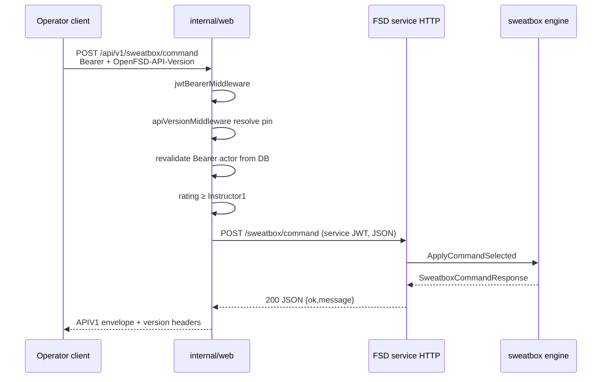
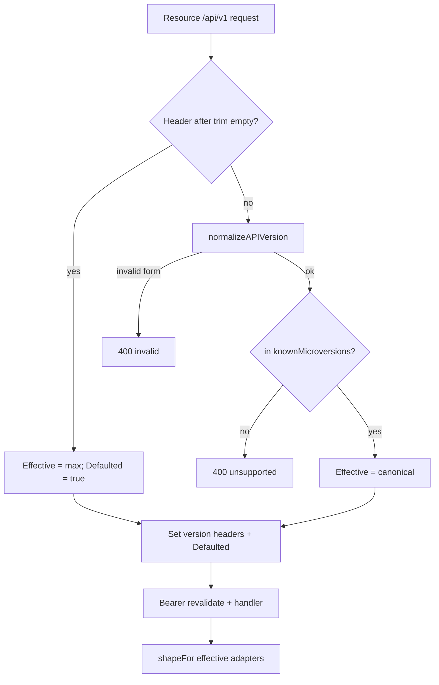
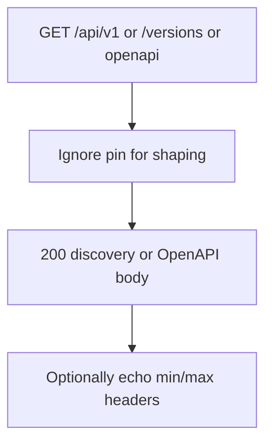

# openfsd: Operator REST Surface, Durable Versioning & Compatibility

| Field | Value |
|-------|--------|
| **Document** | Operator REST surface expansion + durable versioning/compatibility |
| **Author** | _(design author / implementer)_ |
| **Date** | 2026-07-28 |
| **Status** | **Accepted + Implemented** (design review 2026-07-28; middleware, discovery, OpenAPI embed, first-train routes, goldens, operator guide in `internal/web/README.md`) |
| **Project** | openfsd |
| **Target land path** | `docs/design/rest-api-versioning.md` |
| **Related** | `internal/web/README.md`, `Agents.md` §2/§6, `docs/design/user-dashboard-self-service.md`, `docs/design/sweatbox-integrated-simulator.md`, `internal/serviceapi/*` |

---

## Overview

openfsd already exposes a JSON control surface under `/api/v1` for dual-accept clients (Bearer access JWT **or** session cookie + CSRF). That surface is incomplete relative to the first-party MPA: sweatbox mutations, user-directory list/search, and account self-service exist only as HTML form POSTs. Operators who want to automate the same workflows the UI performs cannot do so without scraping forms.

Meanwhile the product is changing quickly. Without an explicit **stability contract**, **version discovery**, and a cheap path to freeze behavior when a breaking change is unavoidable, integrations will break on ordinary product iteration.

This design proposes a **practical hybrid** sized for a single-binary open-source FSD server—not Stripe-scale SaaS and not OpenStack-scale multi-service clouds:

1. Keep **URL major** `/api/v1` as the durable public major for the foreseeable future.
2. Adopt a written **compatibility policy** (additive free; breaks require microversion + deprecation) plus **stability tiers** (Stable / Provisional) so we can expand without over-freezing forming product surfaces.
3. Introduce an optional **date microversion header** (`OpenFSD-API-Version`) used **only when a breaking change lands**—not on every additive tweak.
4. Ship **version-agnostic discovery** (`GET /api/v1` + `GET /api/v1/versions`) + machine-readable **OpenAPI** embedded under `internal/web/openapi/`.
5. Expand the JSON surface for **operator automation** (same privileged operations as the UI where appropriate), with **Bearer CID revalidation** on privileged mutations before calling the surface “production-ready.”
6. Freeze shapes with **golden contract tests** per microversion for **Stable** enveloped routes.

Day-one implementation stays inside `internal/web` (handlers + middleware), keeps the import graph intact (web ↛ server/session/postoffice/metar/sweatbox), and avoids a heavy transform pipeline.

**Audience framing (KD-16):** Until fine-grained scopes exist, the expanded API is **operator automation with full admin-equivalent blast radius** when using admin-minted API tokens—not a multi-tenant “third-party app platform.” Docs and OpenAPI use that language.

---

## Background & Motivation

### Current architecture (as of 2026-07-28)

```text
┌────────────────────┐     dual-accept      ┌──────────────────────┐
│ Operator automation│  Bearer JWT ────────►│ internal/web (Gin)   │
│ (scripts, tools)   │  (no CSRF)           │  /api/v1/*           │
└────────────────────┘                      │                      │
                                            │  session cookie +    │
┌────────────────────┐     forms/PRG        │  CSRF (first-party)  │
│ Browser MPA        │ ───────────────────►│                      │
│ (boring-web PE)    │                      └──────────┬───────────┘
└────────────────────┘                                 │
                         service JWT (fsd_service)     │
                                                       ▼
                                            ┌──────────────────────┐
                                            │ FSD service HTTP     │
                                            │ internal/server      │
                                            │ /online_users        │
                                            │ /kick_user           │
                                            │ /sweatbox/*          │
                                            └──────────────────────┘
```

**Package ownership (non-negotiable):**

| Package | Role |
|---------|------|
| `internal/web` | Public REST + MPA; dual-accept auth; CSRF; proxies FSD service HTTP |
| `internal/serviceapi` | Pure JSON DTOs shared by web ↔ FSD service HTTP (stdlib only) |
| `internal/server` | FSD process + service HTTP control plane (not imported by web) |
| `internal/db` | Users + config repositories |
| `internal/auth` | JWT mint/parse |

**Response envelope** (`internal/web/api_v1_response.go`):

```go
type APIV1Response struct {
    Version string  `json:"version"` // currently always "v1"
    Err     *string `json:"err"`
    Data    any     `json:"data"`
}
```

**Auth today:**

| Path | Mechanism | Notes |
|------|-----------|-------|
| Browser | `openfsd_session` cookie (HttpOnly) | 24h / 30d remember-me; DB revalidation every request |
| API dual-accept | Bearer `token_type=access` **or** session cookie | CSRF required only for cookie auth (`csrfIfCookieSession`) |
| Short-lived access | 15 minutes (`makeAccessToken`) | From login/refresh |
| Admin API token | `POST /api/v1/config/createtoken` | Admin-only; max **90 days**; mints access JWT with **Administrator** rating |
| FSD JWT | `POST /api/v1/fsd-jwt` | VATSIM-shaped; for FSD TCP login, not web API |
| Service JWT | minted by web toward FSD | Internal only; not a public integration surface |

README already warns external apps: do **not** use `/auth/login` or `/auth/refresh` for programmatic access; mint an API token via config.

### Pain points

1. **Incomplete public REST** — sweatbox mutations (`/sweatbox/airport|scenario|command|pause|unpause|delete|delete-all`), user directory list (`ListUsers` / filters), and account self-service (password change, soft/hard delete) are HTML-only.
2. **No versioning contract** — envelope says `"version":"v1"` but there is no discovery of supported behavior, no deprecation channel, and no microversion pin.
3. **Inconsistent success shapes** — most handlers use `APIV1Response`; sweatbox GETs pass through raw FSD JSON (`c.Data`) without the envelope; `/fsd-jwt` uses a VATSIM-shaped body.
4. **RPC-ish resources** — `POST /user/load`, `POST /config/load` mirror legacy admin RPC style rather than resource nouns; fine to keep, but expansions should not make the problem worse without reason.
5. **API tokens are blunt** — Admin-only creation, fixed Administrator rating claim, no scopes, 90-day cap, no per-token version pin, invalidated by `resetsecretkey`; Bearer path does **not** revalidate the actor against the DB (unlike session cookies).

### Why not “just never break anything”?

Additive-only evolution is the **default** and will cover most work. But openfsd is still forming product semantics (ratings, sweatbox, datafeed fields). Occasional breaks will happen (rename fields, fix wrong status codes, tighten validation). The design must make breaks **explicit, discoverable, and testable** without requiring a rewrite of the Gin stack.

**Freeze-vs-churn tension:** Declaring goldens + OpenAPI too early over a still-forming surface creates support burden. This design uses **stability tiers** (KD-17) and a **sequenced expansion train** so versioning infrastructure lands first, high-value automation paths graduate to Stable deliberately, and Provisional routes may still churn under an explicit rule.

---

## Goals & Non-Goals

### Goals

1. **Operator-automation REST parity** with the first-party UI for workflows appropriate to machine clients, under `/api/v1` with Bearer auth (no CSRF)—framed as **admin/operator automation**, not multi-tenant third-party apps (KD-16).
2. **Durable major version** `/api/v1` for the foreseeable future; no forced `/api/v2` for routine work.
3. **Compatibility policy** codified: additive vs breaking; deprecation/sunset windows; how clients pin; **Stable vs Provisional** tiers.
4. **Cheap microversion mechanism** for rare breaks, implementable in Go/Gin without a Stripe-style transform framework on day one—with a correct multi-pin adapter model.
5. **Version-agnostic discovery + OpenAPI** so humans and tools can learn min/max version, supported routes, and auth even after a bad pin.
6. **Golden contract tests** freezing response shapes per microversion for **Stable** enveloped routes.
7. **Import-graph safe**: all public API handlers stay in `internal/web`; FSD control plane remains service HTTP + `serviceapi` DTOs.
8. **Incremental PRs**: versioning foundation + Bearer revalidation before advertising expanded write APIs as production-ready.
9. **Bearer actor revalidation** on privileged mutations before the expansion train is “done” (KD-18).

### Non-Goals

- OpenStack-style microversion on **every** small change.
- Full Stripe ordered-transform pipeline and account-pinned version DB on day one.
- SPA clients, client routers, or hydration for the first-party UI (boring-web remains mandatory for MPA).
- Exposing FSD service HTTP (`/online_users`, raw `/sweatbox/*` on the service port) as the public integration API.
- OAuth2 / OIDC / multi-tenant SaaS auth.
- Fine-grained API scopes in the first train (follow-up; until then blast-radius docs apply).
- Browser automation test suites (Playwright/Cypress) — PE + unit tests only.
- Rewriting all existing RPC-ish paths to pure REST in one shot.
- Guaranteeing multi-year support for infinite microversions (we cap support window).
- **`GET /api/v1/fsdconn/online`** in the first expansion train — **P2 convenience** only; public datafeed already covers unauthenticated consumers; dashboard HTML remains the first-party path (see Expansion §E).

---

## Key Decisions

| ID | Decision | Rationale |
|----|----------|-----------|
| **KD-1** | **Hybrid: URL major + rare date microversions + evolution policy** | Fits openfsd scale; `/api/v1` already exists; pure microversions or Stripe transforms are too expensive. |
| **KD-2** | **Keep `/api/v1` as the only public major** until a truly incompatible redesign (envelope change, auth model rewrite). Prefer microversion over `/api/v2`. | Industry-proven; cache/discoverable; already in tree. |
| **KD-3** | **Microversion header:** `OpenFSD-API-Version`. Canonical form after normalize: `YYYY-MM-DD`. Also accept alias `1.YYYYMMDD`. Normalize via pure `normalizeAPIVersion` (§Version normalization). Resource groups reject unknown pins with **400**; discovery/OpenAPI/data/fsd-jwt never reject on pin. | Dates are human-readable; pure normalize is unit-testable; recovery path must not 400. |
| **KD-4** | **Bump microversion only on breaking changes** for **Stable** routes (see §Compatibility Policy). Additive fields/endpoints do **not** bump. | Avoids combinatorial handler explosion. |
| **KD-5** | **Default when header omitted: `max_version` (current)** within major. Production clients **MUST** send `OpenFSD-API-Version`. `latest` (any ASCII case) → max. Unpinned responses set `OpenFSD-API-Version-Defaulted: true`. | Explicit pin is cheap; default-max avoids forever-legacy tax; header gives enforcement affordance without failing unpinned curl. |
| **KD-6** | **Phase-2 token pin (optional, after first train):** when minting via `createtoken`, accept optional `api_version` and embed claim; middleware uses claim when header absent. | Stripe-like UX without account tables. |
| **KD-7** | **Support window:** primary floor **≥ 90 calendar days** after a pin is superseded as max (or after deprecation announce for that pin). Optionally extend if git tags matching `v*` are cut more densely than every 45 days (keep until **two** such tags after deprecation)—**90 days is authoritative** if tag cadence is unclear. Cap active microversions **≤ 6** per major. After the floor, announce `Sunset` ≥ 30 days before removal. | Aligns with max API token TTL; avoids vague “2 releases” as the only rule. |
| **KD-8** | **Envelope stays** `{version, err, data}` for JSON API resources. Body `version` remains major `"v1"`; microversion is **only** in headers. | Avoids breaking existing parsers. |
| **KD-9** | **Exceptions stay exceptional:** `/api/v1/fsd-jwt` and **data feeds** remain non-envelope and **outside** microversion reject. Sweatbox **mutations** use envelope. Raw GET `/sweatbox/state` and `/ops` stay raw for PE; third parties use parallel **`GET /api/v1/sweatbox/session`** (enveloped). | Don’t break PE or datafeed/fsd-jwt clients. |
| **KD-10** | **Expand surface (B), not version-only (A)** — versioning + revalidation foundation first; then sequenced expansions with stability tiers. | Operator automation + durability. |
| **KD-11** | **Preserve existing paths**; add resource-oriented routes where natural. Do not delete `POST /user/load` etc. in v1. | Back-compat; PE tests hit RPC paths. |
| **KD-12** | **Multi-pin shaping via ordered adapters**, not two-branch `<= baseline / default`. Pure `shapeFor(effective, domain)` selects **newest adapter whose `introduced_at ≤ effective`** (ISO date order). Every still-supported pin must resolve; unit test walks `knownMicroversions`. | Correct when ≥2 breaks land; still no transform framework. |
| **KD-13** | **API tokens remain Admin-created**, max 90d, Bearer, no CSRF, admin-equivalent claim. Scopes deferred. **Document operator-automation blast radius.** | Matches current model; scopes are larger product work. |
| **KD-14** | **OpenAPI canonical file:** `internal/web/openapi/openapi.v1.yaml` with `//go:embed` from package `web`. Served at `GET /api/v1/openapi.json` (YAML→JSON at serve time, or dual serve `.yaml`). Optional human copy: note in `docs/` that the embed path is authoritative; CI may diff a mirrored `docs/openapi/openapi.v1.yaml` if maintainers want browsable docs outside the binary. | `go:embed` cannot reach `docs/` from `internal/web`. |
| **KD-15** | **HTML forms remain primary for browser**; JSON is for automation + PE polling. | boring-web. |
| **KD-16** | **Framing:** expanded API = **operator automation with admin-equivalent token blast radius** until scopes exist. Avoid “third-party app platform” language in README/OpenAPI. | Honest security model. |
| **KD-17** | **Stability tiers:** each route is **Stable** or **Provisional** in OpenAPI (`x-openfsd-stability`) and README. **Stable:** compatibility policy + goldens + microversion on break. **Provisional:** may change shape without microversion **only while still Provisional and only within one major**; promotion to Stable freezes current shape as baseline for that route; demotion forbidden without deprecation. | Freeze-while-churning control. |
| **KD-18** | **Bearer CID revalidation on privileged mutations** lands in the **same train as write expansions** (PR-2), before sweatbox/users/account write APIs are marked production-ready. Session path already revalidates (KD-9 session design). | Closes demoted/deleted-admin residual window proportional to expanding write surface. |
| **KD-19** | **Baseline microversion date** is the **UTC calendar date of the PR-1 merge** (or first release tag that includes it)—**not** the design-doc date. Examples below use `2026-07-28` as a **placeholder**. | Avoid eternal wrong pin label. |
| **KD-20** | **Discovery paths:** both `GET /api/v1` and `GET /api/v1/versions` return the **same** discovery payload; both are public and **version-agnostic**. | Close open question; recovery path always works. |

---

## Compatibility Policy

### Stability tiers (KD-17)

| Tier | Wire compatibility | Goldens | OpenAPI |
|------|-------------------|---------|---------|
| **Stable** | Additive free; breaks require microversion + deprecation process | Required for envelope success/error shapes at each supported pin that differs | `x-openfsd-stability: stable` |
| **Provisional** | May change request/response shape **without** microversion bump while Provisional (document in release notes); must not break **authz** silently | Optional smoke tests only | `x-openfsd-stability: provisional` |

**Promotion:** when a Provisional route is marked Stable, freeze its then-current shape under the current `apiMicroMax` (no automatic new pin unless the promotion itself renames fields).

**Existing routes at foundation ship:** treat current enveloped user/config/fsdconn/editor JSON as **Stable** once goldens land in PR-1. New expansion routes start **Provisional** unless listed Stable in the PR that ships them (see PR plan: sweatbox mutations start Provisional one release, then promote; or ship Stable if contract table is locked—PR-4 locks the mapping table → **Stable** for mutations).

**Default for this design’s expansions:**

| Route set | Initial tier | Notes |
|-----------|--------------|-------|
| Versioning discovery / OpenAPI | Stable | Infrastructure |
| Existing enveloped user/config/kick/editor | Stable | PR-1 goldens |
| Sweatbox mutations + `/session` | **Stable** once mapping table ships (PR-4) | Contract locked in this design §D |
| `GET /api/v1/users` | Stable | Thin over `UserListFilter`; low churn |
| Account password/delete JSON | **Provisional** first; promote after one release or explicit sign-off | Self-service semantics still young |
| `GET /api/v1/fsdconn/online` | P2 / Provisional if shipped | Not first train |

### Additive (no microversion bump)

- New optional JSON request fields with server defaults.
- New response fields (clients must ignore unknown keys — **documented requirement**).
- New endpoints under `/api/v1`.
- New query parameters that only filter/expand (default preserves old result set).
- Looser auth (accepting more valid tokens) — rare; document carefully.
- New HTTP success codes only when additive and not changing meaning of old codes for the same path.
- **Provisional-only shape changes** (KD-17)—with release notes; still no silent authz tightening.

### Breaking (requires microversion bump) — **Stable routes**

- Remove/rename request or response fields.
- Change field types or enum semantics.
- Change default behavior of existing fields/params.
- Change authz requirements that **reject** previously allowed callers (tightening).
- Change success/error HTTP status mapping for the same logical outcome.
- Change envelope structure for a previously enveloped path.
- Semantic changes to validation that reject previously accepted payloads.

### Deprecation process

1. Announce in OpenAPI (`deprecated: true`), `internal/web/README.md`, and release notes.
2. Emit response headers on deprecated paths:
   - `Deprecation: true`
   - `Sunset: <HTTP-date>` (RFC 8594)
   - `Link: </api/v1/...>; rel="successor-version"` when applicable
3. Keep behavior for **≥ 90 calendar days** primary floor (KD-7); optionally longer per tag cadence.
4. Remove only behind a new microversion (or after all active microversions that need it expire), and only after Sunset.

### Client requirements (normative)

| Client type | Requirement |
|-------------|-------------|
| Production operator automation | **MUST** send `OpenFSD-API-Version: <supported date>` |
| Exploratory / curl | MAY omit (receives max; `OpenFSD-API-Version-Defaulted: true`) |
| First-party PE JS | MAY omit until a break affects it; then pin or use additive-only paths |
| Datafeed / fsd-jwt consumers | Outside microversion system (fixed shapes; major-only) |

---

## Proposed Design

### High-level components

```mermaid
flowchart TB
  subgraph Client
    Ext[Operator automation]
    PE[First-party PE JS]
  end

  subgraph Web["internal/web"]
    Disc[Discovery + OpenAPI version-agnostic]
    MW[jwtBearer + csrfIfCookie + apiVersion + revalidate]
    Handlers[API handlers]
    Adapt[Ordered microversion adapters]
    Goldens[testdata/api_v1 goldens]
    OAPI[openapi/openapi.v1.yaml embed]
  end

  subgraph Shared
    SA[internal/serviceapi DTOs]
    DB[internal/db]
    Auth[internal/auth]
  end

  subgraph FSD["internal/server service HTTP"]
    SB[/sweatbox/*]
    Kick[/kick_user]
    Online[/online_users]
  end

  Ext -->|Bearer + OpenFSD-API-Version| MW
  PE -->|cookie+CSRF or Bearer| MW
  Ext --> Disc
  MW --> Handlers
  Handlers --> Adapt
  Handlers --> DB
  Handlers --> Auth
  Handlers -->|service JWT| SB
  Handlers --> Kick
  Handlers --> Online
  SA -.-> Handlers
  SA -.-> FSD
  Goldens -.-> Handlers
  OAPI --> Disc
```

### Version registry (Go)

New file: `internal/web/api_version.go` (stdlib + gin only).

```go
// Package-level constants — set baseline to UTC date of PR-1 merge (KD-19).
// PLACEHOLDER values below are examples only (design draft date).
const (
    apiMajorVersion = "v1"

    // Set at PR-1 merge to that day's UTC date; first supported pin.
    apiMicroMin = "2026-07-28" // PLACEHOLDER → replace at land

    // Newest behavior. Bump only on Stable breaks (KD-4).
    apiMicroMax = "2026-07-28" // PLACEHOLDER → replace at land

    headerAPIVersion         = "OpenFSD-API-Version"
    headerAPIMinVersion      = "OpenFSD-API-Min-Version"
    headerAPIMaxVersion      = "OpenFSD-API-Max-Version"
    headerAPIVersionDefaulted = "OpenFSD-API-Version-Defaulted" // "true" if header omitted
)

// knownMicroversions lists every still-supported pin in ascending YYYY-MM-DD order.
var knownMicroversions = []string{
    "2026-07-28", // PLACEHOLDER
}

type apiVersionContext struct {
    Requested string // raw header (may be empty)
    Effective string // normalized pin used for shaping
    Defaulted bool   // true if header omitted (or empty after trim)
}
```

### Version normalization (`normalizeAPIVersion`)

Pure function (no gin), unit-tested in PR-1:

```go
// normalizeAPIVersion converts a client version token into canonical YYYY-MM-DD.
// raw is the header value (may be empty). max is apiMicroMax.
// Returns ("", errUnsupported) or ("", errInvalid) for bad input;
// empty raw is NOT handled here — middleware treats empty as default-max before calling.
func normalizeAPIVersion(raw, max string) (canonical string, err error)
```

| Input (after `strings.TrimSpace`) | Result |
|-----------------------------------|--------|
| `latest` / `Latest` / `LATEST` | `max` (case-fold ASCII) |
| `^\d{4}-\d{2}-\d{2}$` | If `time.Parse("2006-01-02", s)` succeeds in UTC (reject impossible dates e.g. `2026-02-30`) → that date string |
| `^1\.(\d{8})$` | Insert dashes: `1.20260728` → `2026-07-28`, then same date validation |
| `1.2026-07-28` or other forms | **Reject** (invalid) |
| Whitespace-only | Treat as empty at middleware (default-max) |
| Anything else | **Reject** |

Membership in `knownMicroversions` is a **separate** check after normalize (so error text can distinguish “malformed” vs “unsupported/sunset”).

### Middleware mounting (matches `routes.go`)

Actual registration uses **separate groups**, each with its own `Use(...)`. Do **not** rely on a single parent middleware for all `/api/v1` traffic.

```text
setupRoutes:
  apiV1Group := e.Group("/api/v1")

  // Version-agnostic public (NO jwt, NO version-reject):
  apiV1Group.GET("", handleAPIDiscovery)           // GET /api/v1
  apiV1Group.GET("/versions", handleAPIDiscovery)  // same payload
  apiV1Group.GET("/openapi.json", handleOpenAPIJSON)
  apiV1Group.GET("/openapi.yaml", handleOpenAPIYAML) // optional raw embed

  apiV1Group.POST("/fsd-jwt", ...)                 // no version-reject
  setupAuthRoutes(apiV1Group)                      // login/refresh: optional soft version headers only
  setupDataRoutes(apiV1Group)                      // never version-reject

  // Dual-accept JSON resource groups — each:
  //   Use(jwtBearerMiddleware, csrfIfCookieSession, apiVersionMiddleware)
  //   and for mutation routes: revalidateBearerActorMiddleware or call helper in handler
  setupUserRoutes(apiV1Group)
  setupConfigRoutes(apiV1Group)
  setupFsdConnRoutes(apiV1Group)
  setupSweatboxAPIRoutes(apiV1Group)
  setupEditorAPIRoutes(apiV1Group)
  // later: setupUsersListRoutes, setupAccountAPIRoutes, …
```

Helper to avoid drift:

```go
// PR-1: jwt + csrf + apiVersion.
// PR-2 end state (required before write expansions are production-ready):
func (s *Server) useAPIV1Protected(g *gin.RouterGroup) {
    g.Use(
        s.jwtBearerMiddleware,
        s.csrfIfCookieSession,
        s.apiVersionMiddleware,
        s.revalidateBearerActor, // PR-2: DB overlay / reject inactive (KD-18)
    )
}
```

**`apiVersionMiddleware` (resource groups only):**

1. Read `OpenFSD-API-Version` (HTTP header names are case-insensitive).
2. Trim space; if empty → `Effective = apiMicroMax`, `Defaulted = true`.
3. Else `normalizeAPIVersion(raw, apiMicroMax)`:
   - invalid form → **400** envelope `"invalid OpenFSD-API-Version"` + min/max headers.
   - valid form but not in `knownMicroversions` → **400** `"unsupported OpenFSD-API-Version …; min=… max=…"`.
4. Optional Phase-2: if header empty and Bearer claim `api_version` present, normalize claim and require known (else 400).
5. Store `apiVersionContext` in gin context.
6. Always set response headers: `OpenFSD-API-Version: <Effective>`, min, max; if `Defaulted`, also `OpenFSD-API-Version-Defaulted: true`.

**Discovery / OpenAPI / data / fsd-jwt:**

- Never return 400 for unknown/missing microversion.
- May still **emit** min/max/max-as-OpenFSD-API-Version headers (echo current max) for observability.
- Ignore client pin for shaping (no versioned behavior on these routes).

### Multi-pin handler registration (KD-12)

**Banned as the long-term template:** two-branch `case effective <= baseline / default`.

**Required pattern:** ordered adapters; pick newest `introduced_at ≤ effective`.

```go
type shapeAdapter[T any, D any] struct {
    introducedAt string // YYYY-MM-DD, must be a known pin or "epoch"
    shape        func(T) D
}

// shapeFor selects the newest adapter with introducedAt <= effective (lexicographic ISO dates).
func shapeFor[T any, D any](effective string, adapters []shapeAdapter[T, D], domain T) D {
    // adapters sorted ascending by introducedAt; walk from end
    for i := len(adapters) - 1; i >= 0; i-- {
        if adapters[i].introducedAt <= effective {
            return adapters[i].shape(domain)
        }
    }
    // Defensive: first adapter is always baseline; tests forbid empty tables.
    return adapters[0].shape(domain)
}

// Example for one endpoint after two breaks:
var userLoadAdapters = []shapeAdapter[UserDomain, any]{
    {introducedAt: "2026-07-28", shape: shapeUserLoadV20260728},
    {introducedAt: "2026-09-01", shape: shapeUserLoadV20260901},
    {introducedAt: "2026-11-01", shape: shapeUserLoadCurrent},
}
```

Rules:

- Business logic runs **once**; only DTO shaping (and rarely request bind defaults) fork.
- Every entry in `knownMicroversions` must produce a defined shape for each versioned endpoint (unit test matrix).
- When a pin is sunset, delete its adapter + goldens in the same PR that raises `apiMicroMin`.
- Prefer pure functions over handler copies.

### Discovery endpoints (version-agnostic)

#### `GET /api/v1` and `GET /api/v1/versions` (public, no auth)

Same handler, same payload:

```json
{
  "version": "v1",
  "err": null,
  "data": {
    "major": "v1",
    "min_version": "2026-07-28",
    "max_version": "2026-07-28",
    "versions": ["2026-07-28"],
    "header": "OpenFSD-API-Version",
    "default": "max",
    "openapi": "/api/v1/openapi.json"
  }
}
```

No stub `docs` field until a real static HTML page exists. Human prose lives in `internal/web/README.md` (and design doc).

#### `GET /api/v1/openapi.json` (public)

Serves OpenAPI 3.x derived from embedded `internal/web/openapi/openapi.v1.yaml` (`//go:embed openapi/openapi.v1.yaml`). Prefer converting YAML→JSON in handler or committing a generated `.json` sibling also embedded—either is fine; YAML is the edit source.

### Envelope & headers

**Request:**

```http
GET /api/v1/config/load HTTP/1.1
Authorization: Bearer <access_token>
OpenFSD-API-Version: 2026-07-28
```

**Response (pinned):**

```http
HTTP/1.1 200 OK
Content-Type: application/json
OpenFSD-API-Version: 2026-07-28
OpenFSD-API-Min-Version: 2026-07-28
OpenFSD-API-Max-Version: 2026-07-28

{"version":"v1","err":null,"data":{...}}
```

**Response (header omitted):** same body; headers include `OpenFSD-API-Version: <max>` and `OpenFSD-API-Version-Defaulted: true`.

### Bearer revalidation (KD-18)

New helper used on **privileged mutations** (all non-GET dual-accept JSON that changes server state; also treat `POST /user/load` as read—no revalidation required, but cheap to always revalidate Bearer actors if simpler):

```go
// revalidateBearerActorIfNeeded: if auth_method == bearer, load user by claims.CID.
// Missing / inactive / suspended → 401 envelope "unauthorized".
// Overlay NetworkRating + names from DB onto claims (same as session KD-9 overlay).
// Session cookie path already revalidated in trySessionAuth — no double work required.
```

Mount as middleware after `jwtBearerMiddleware` on groups that include writes, **or** call from a single `requireActiveActor(c)` used by every mutation handler. Prefer **middleware on protected groups** so GET list/load also overlay fresh ratings (authz ceilings stay correct)—recommended: revalidate **all** Bearer-authenticated resource requests (symmetric with session). Cost: one DB read per API call for Bearer.

**Minimum bar for production-ready expansion:** revalidate on all Bearer resource-group requests.

### Sequence: operator sweatbox command



---

## Current Endpoint Inventory

### Public JSON / data (`/api/v1`)

| Method | Path | Auth | Envelope? | Notes |
|--------|------|------|-----------|-------|
| POST | `/auth/login` | public | yes | Discouraged for automation |
| POST | `/auth/refresh` | public | yes | Discouraged for automation |
| POST | `/fsd-jwt` | public | **no** (VATSIM shape) | Outside microversion reject |
| POST | `/user/load` | dual-accept | yes | Self or SUP+ |
| PATCH | `/user/update` | dual-accept | yes | SUP+ |
| POST | `/user/create` | dual-accept | yes | SUP+ |
| GET | `/config/load` | dual-accept | yes | ADM |
| POST | `/config/update` | dual-accept | yes | ADM |
| POST | `/config/resetsecretkey` | dual-accept | yes | ADM; invalidates all JWTs |
| POST | `/config/createtoken` | dual-accept | yes | ADM; max 90d |
| POST | `/fsdconn/kickuser` | dual-accept | yes | SUP+ |
| GET | `/sweatbox/state` | dual-accept | **raw passthrough** | I1+; PE poll |
| GET | `/sweatbox/ops` | dual-accept | **raw passthrough** | I1+ |
| POST | `/editor/validate-apt` | dual-accept | yes | **I1+** (code); README has one stale “Admin” line — fix in PR-1 |
| POST | `/editor/validate-air` | dual-accept | yes | I1+ |
| GET | `/data/*` | public | plain / custom | Outside microversion |

### HTML-only today (automation gap)

| Method | Path | Authz | Backend effect |
|--------|------|-------|----------------|
| POST | `/account/password` | any session | Password change |
| POST | `/account/delete` | any session | Soft/hard delete |
| GET | `/usereditor?…` | SUP+ | `ListUsers` / `CountUsers` |
| POST | `/usereditor/create\|update` | SUP+ | Form create/update |
| POST | `/sweatbox/airport\|scenario\|command\|pause\|unpause\|delete\|delete-all` | I1+ | FSD proxies |
| POST | `/configeditor/*` | ADM | Overlaps JSON config |
| POST | `/airport-editor/download-*` | I1+ | Echo-only; validate API already JSON |

`db.UserListFilter` already supports query, rating, sort, limit (default 50, cap 200), offset.

---

## Proposed API Surface Expansion

### Design principles

1. **JSON + envelope** for new privileged endpoints.
2. **Bearer without CSRF**; cookie + CSRF dual-accept remains.
3. **Same authz ceilings** as HTML (I1 / SUP / ADM).
4. Prefer **resource-ish** paths for new work; keep existing RPC paths.
5. Proxy FSD via `fsdSweatboxDo` / `makeFsdHttpServiceHttpRequest`—**never** import `internal/sweatbox` or `internal/server` from web.
6. Reuse `serviceapi` DTOs; add new DTOs to `serviceapi` when airport load response needs a shared type.
7. Assign **stability tiers** (KD-17) at ship time.

### A. Versioning foundation

| Method | Path | Auth | Version middleware | Purpose |
|--------|------|------|--------------------|---------|
| GET | `/api/v1` | public | none (agnostic) | Discovery |
| GET | `/api/v1/versions` | public | none | Same payload |
| GET | `/api/v1/openapi.json` | public | none | OpenAPI |

### B. Users directory — **Stable**

| Method | Path | Authz | Query / body | Response `data` |
|--------|------|-------|--------------|-----------------|
| GET | `/api/v1/users` | SUP+ | see pagination lock below | `{ items, total, page, page_size, pages }` |
| GET | `/api/v1/users/:cid` | self or SUP+ | — | same fields as `/user/load` |

Keep `POST /user/load|create` and `PATCH /user/update`.

#### `GET /api/v1/users` query / pagination (normative)

**Lock to HTML directory semantics** from `parseUserDirectoryQuery` / `clampDirectoryPage` (`pages_user_query.go`), plus optional `page_size` for API (HTML is fixed at 50). Prefer extracting a shared pure helper used by both HTML and JSON so behavior cannot drift.

| Parameter | Default | Invalid / edge handling |
|-----------|---------|-------------------------|
| `q` | `""` (all) | trim space; empty = no text filter |
| `rating` | omit → all ratings | non-int or outside **[-1, 12]** → treat as all (nil filter); **never 500** |
| `sort` | `cid` | only `cid` \| `name` \| `rating`; anything else → `cid` |
| `dir` | `asc` | only `desc` (case-insensitive) flips; anything else → asc |
| `page` | **1** (1-based) | non-int or &lt; 1 → **1**; after `CountUsers`, **clamp** to last page via same rule as `clampDirectoryPage` (bookmarks past end still 200 with last page) |
| `page_size` | **50** | ≤0 → 50; clamp to **[1, 200]** (matches `UserListFilter` hard cap 200) |

**Offset:** `(page - 1) * page_size` after clamp. Response echoes the **effective** `page` / `page_size` / `pages` / `total` after clamping (not the raw illegal inputs).

**Items:** no password hashes; same public fields as `/user/load` (`cid`, `first_name`, `last_name`, `network_rating`, `pilot_rating`).

### C. Account self-service JSON — **Provisional** initially

| Method | Path | Authz | Request | Response |
|--------|------|-------|---------|----------|
| POST | `/api/v1/account/password` | self OBS+ | see below | 200 envelope `data: null` |
| POST | `/api/v1/account/delete` | self | see below | 200 then client must drop credentials; `data: { "status": "soft_deleted"\|"hard_deleted" }` |

#### Password change validation (parity with `pages_account.go` / `validateNewPassword`)

**Request JSON:**

```json
{
  "current_password": "string",
  "new_password": "string",
  "confirm_password": "string"
}
```

| Rule | Behavior |
|------|----------|
| `current_password` required | 400 if empty; 401/400 if hash mismatch (match HTML: incorrect → field error → use **400** with `err` for API: `"incorrect password"`) |
| `new_password` | `validateNewPassword`: min **8** chars; **must not contain `:`** |
| `new_password != current_password` | 400 `"New password must be different from the current password"` |
| `confirm_password` | **Required for JSON** (parity with HTML). Must equal `new_password` or 400 `"Passwords do not match"` |
| Bearer success | **200** envelope; **no** session cookie side effects |
| Cookie dual-accept success | May re-issue session 24h + clear CSRF like HTML (optional parity); if implemented, document; minimum is password update succeeds |

#### Delete validation

```json
{
  "current_password": "string",
  "confirm_cid": 12345,
  "permanent": false
}
```

| Rule | Behavior |
|------|----------|
| Current password required + verified | same as HTML |
| `confirm_cid` must equal actor CID | 400 otherwise |
| Soft-delete default (`permanent` false/omitted) | `network_rating = Inactive` (same as HTML) |
| `permanent: true` **and** `ALLOW_PERMANENT_ACCOUNT_DELETE` | hard-delete row; `data.status = "hard_deleted"` |
| `permanent: true` **and** hard-delete **disabled** | **Intentional JSON divergence from HTML (fail-closed):** **400** `"permanent delete is disabled"` and **no mutation**. HTML instead soft-deletes and redirects with `permanent=disabled`. Automation must not silently get a different delete mode than requested—retry with `permanent: false` for soft-delete. Document in OpenAPI description. |
| Bearer success | no cookie clear (client drops token); session dual-accept clears session like HTML |

**Rationale for fail-closed:** a machine client that sets `permanent: true` expects hard-delete. Silently soft-deleting (HTML’s UX compromise) would leave a “deleted” account restorable via admin and is harder to detect than a 400. Operators porting form flows should map HTML’s “permanent requested but disabled → soft” path to an explicit JSON call with `permanent: false` (or enable hard-delete server-side).

### D. Sweatbox mutations (JSON proxies) — **Stable** (contract locked here)

Mount under `/api/v1/sweatbox` (I1+), dual-accept + version middleware + revalidation.

#### Public request bodies (third-party / operator)

**Prefer JSON only** on the public API (no dual raw/JSON ambiguity):

| Endpoint | Content-Type | Body |
|----------|--------------|------|
| POST `/airport` | `application/json` | `{"text":"<apt file>","replace":false}` — `replace` maps to FSD query `?replace=1` when true |
| POST `/scenario` | `application/json` | `{"text":"<air file>"}` |
| POST `/command` | `application/json` | `serviceapi.SweatboxCommandRequest` `{callsign,command}` |
| POST `/pause`, `/unpause` | empty body | — |
| DELETE `/aircraft/:callsign` | — | path param |
| DELETE `/aircraft` | `application/json` or query | `confirm=true` required (JSON `{"confirm":true}` or query `confirm=1`) |

**FSD wire:** always proxy airport/scenario as **`text/plain; charset=utf-8`** body of `text` field (same as HTML `fsdSweatboxDo`). Never send JSON to FSD for airport/scenario.

**Body size:** 2 MiB (`sweatboxWebMaxBody`) on the public request before proxy.

#### Airport response DTO

Add to `internal/serviceapi` in the sweatbox mutation PR (stdlib only):

```go
// SweatboxAirportLoadResponse is the public/FSD airport load result shape.
type SweatboxAirportLoadResponse struct {
    ICAO     string   `json:"icao"`
    Surfaces int      `json:"surfaces"`
    Errors   []string `json:"errors"`
}
```

Server handler today writes ad hoc `gin.H`; align FSD service response to this DTO when convenient, or map in web only—**public API always envelopes this shape**.

#### Status / body mapping table (normative)

Public API **always** uses `APIV1Response` for these mutations (never raw 204 empty). Map FSD → public as follows:

| Public method | FSD call | FSD status | Public HTTP | `err` | `data` |
|---------------|----------|------------|-------------|-------|--------|
| POST `/airport` | POST `/sweatbox/airport[?replace=1]` text/plain | 200 | 200 | null | `SweatboxAirportLoadResponse` (errors may be empty or warnings) |
| | | 400 | 400 | first error string or `"Invalid airport file"` | null (or include errors in `err` only—**prefer** `err` string; do not dual-channel) |
| | | 409 | 409 | aircraft-present message | null |
| | | 404 | 404 | `"Sweatbox is not enabled on the FSD server"` | null |
| | | 413 | 413 | payload too large | null |
| | | other / transport err | 502 | FSD unreachable / unexpected | null |
| POST `/scenario` | POST `/sweatbox/scenario` text/plain | 200 | 200 | null | `serviceapi.SweatboxScenarioResponse` |
| | | 400 | 400 | invalid scenario | null |
| | | 409 | 409 | no airport | null |
| | | 404 | 404 | sweatbox disabled | null |
| | | 413 | 413 | too large | null |
| | | other | 502 | … | null |
| POST `/command` | POST `/sweatbox/command` JSON | 200 + `{ok:true}` | 200 | null | `SweatboxCommandResponse` (include `ok`/`message`) |
| | | 200 + `{ok:false}` | **200** | null | same `data` with `ok:false` (**soft-fail; do not elevate to 4xx**—TWRTrainer-style, matches FSD) |
| | | 409 | 409 | no airport / conflict message | null |
| | | 400 | 400 | invalid command request | null |
| | | 404 | 404 | sweatbox disabled | null |
| | | other | 502 | … | null |
| POST `/pause` | POST `/sweatbox/pause` | 204 or 200 | **200** | null | null |
| | | 404 | 404 | disabled | null |
| | | other | 502 | … | null |
| POST `/unpause` | POST `/sweatbox/unpause` | 204 or 200 | **200** | null | null |
| | | 404 | 404 | disabled | null |
| DELETE `/aircraft/:cs` | DELETE `/sweatbox/aircraft/:cs` | 204 or 200 | **200** | null | null |
| | | 404 | 404 | not found or disabled message | null |
| DELETE `/aircraft` | DELETE `/sweatbox/aircraft` | 204 or 200 | **200** | null | null |
| | | 404 | 404 | disabled | null |
| | missing confirm | — | 400 | confirm required | null |

**Rationale:** always JSON envelope for operator clients (no empty 204); preserve command soft-fail as 200+`ok:false`; pass through 404/409 semantics with envelope `err`.

#### Enveloped read (parallel to PE raw)

| Method | Path | Envelope | Notes |
|--------|------|----------|-------|
| GET | `/api/v1/sweatbox/state` | **raw** FSD body | Unchanged for PE |
| GET | `/api/v1/sweatbox/ops` | **raw** FSD body | Unchanged for PE |
| GET | `/api/v1/sweatbox/session` | **yes** | `data` = `serviceapi.SweatboxStateJSON`; I1+; ships in **PR-4** with mutations |

### E. Online connections — **P2 / non-goal for first train**

| Method | Path | Notes |
|--------|------|-------|
| GET | `/api/v1/fsdconn/online` | Optional later; proxies `/online_users` into envelope. **Not required** for “operator REST parity v1” of this work. Public `openfsd-data.json` remains unauthenticated feed. |

### Explicitly out of public REST (for now)

| Surface | Why |
|---------|-----|
| Airport editor geometry persistence | Echo/download only; validate API exists |
| FSD wire protocol | `pkg/protocol` |
| Raw service-HTTP port | Localhost + service JWT |
| Token listing/revocation DB | Stateless JWT; revoke = expiry or secret reset |

---

## API / Interface Changes

### Create-token additive response (PR-1, no claim pin yet)

```json
{
  "version": "v1",
  "err": null,
  "data": {
    "token": "<jwt>",
    "recommended_api_version": "2026-07-28",
    "api_version_max": "2026-07-28",
    "api_version_min": "2026-07-28"
  }
}
```

Additive fields; existing clients ignoring unknown keys keep working. Phase-2 may add request field `api_version` for claim pin (KD-6).

### Response helpers

```go
func writeAPIV1Response(c *gin.Context, code int, res *APIV1Response) {
    setAPIVersionHeaders(c) // no-op safe if context missing (public routes)
    // existing marshal...
}
```

### Error for bad microversion (resource groups only)

```json
{
  "version": "v1",
  "err": "unsupported OpenFSD-API-Version \"2025-01-01\"; min=2026-07-28 max=2026-07-28",
  "data": null
}
```

HTTP **400**. Discovery still returns 200 if the client retries without relying on the bad pin.

---

## Data Model Changes

### Day one / first train

**None** for SQLite. Version registry is in-process. OpenAPI is an embedded file under `internal/web/openapi/`.

### Same train as write expansions

- Optional `serviceapi.SweatboxAirportLoadResponse` type.
- Bearer revalidation uses existing `UserRepo.GetUserByCID`.

### Phase-2 (token pin)

- Additive JWT claim `api_version`; no DB migration.

---

## Alternatives Considered

### 1. OpenStack-style microversions (every small change)

| Pros | Cons |
|------|------|
| Extremely precise client pins | High cost: branched request/response for every change |
| Default-min keeps old clients forever | Combinatorial complexity; heavy docs |
| Proven at cloud scale | Wrong scale for openfsd contributor base |

**Verdict:** Reuse **header + discovery** inspiration; reject “bump on every change.”

### 2. Stripe-style date versioning + transform pipeline

| Pros | Cons |
|------|------|
| Excellent multi-year stability | Large engineering investment |
| Account pin UX is best-in-class | Needs continuous transform maintenance |
| URL stays clean `/v1` | Overkill until many integrators exist |

**Verdict:** Adopt **date strings** + later **optional token pin**; reject full transform pipeline on day one.

### 3. URL major only (`/api/v1`, `/api/v2`)

| Pros | Cons |
|------|------|
| Simple, cache-friendly, already used | Coarse; parallel majors double test/docs burden |

**Verdict:** Keep majors for true redesigns; microversions for rare breaks within v1.

### 4. Media-type / Accept versioning

| Pros | Cons |
|------|------|
| Clean URLs | Poor curl ergonomics; less discoverable |

**Verdict:** Reject as primary.

### 5. Evolution-only (no versions / rare majors)

| Pros | Cons |
|------|------|
| Lowest maintenance | No pin/discovery story for automation |

**Verdict:** Evolution-only is day-to-day default (additive) but **insufficient alone**.

### Recommendation (openfsd-scale)

**Hybrid (KD-1–KD-20):** durable `/api/v1` + rare date microversions + additive-first + default-max + MUST-pin + stability tiers + ordered adapters + version-agnostic discovery + admin-token honesty + Bearer revalidation in the expansion train.

---

## Auth Model for Operator Automation

### Recommended path

1. Administrator mints token via Config UI or `POST /api/v1/config/createtoken` (≤90d).
2. Automation stores token as secret; sends:

```http
Authorization: Bearer <token>
OpenFSD-API-Version: <pin from createtoken recommended_api_version>
```

3. On 401, re-mint (API tokens are long-lived access JWTs—no refresh).
4. On `resetsecretkey`, all tokens die.

### Limitations (document prominently)

| Limitation | Detail | Mitigation |
|------------|--------|------------|
| **Admin-only creation** | Only ADM (12) can mint | Designated admin creates tokens |
| **Admin-equivalent power** | Claim forced Administrator | **KD-16 framing**; do not share; scopes later |
| **Max 90-day TTL** | `maxAPITokenTTL` | Calendar rotation; support window |
| **No server-side revoke list** | Stateless until exp/secret rotate | Shorten TTL; secret reset killswitch |
| **Bearer residual without revalidation (today)** | No DB check per request | **KD-18 / PR-2** revalidation before write expansion production-ready |
| **login/refresh discouraged** | Password grant sprawl | Prefer minted API tokens |
| **CSRF** | Not required for Bearer | Don’t put long-lived tokens in browsers |

### Authz matrix (JSON API)

| Capability | Min rating |
|------------|------------|
| Self user load / account password/delete | OBS+ |
| User directory / non-self / create / update | SUP+ |
| Kick | SUP+ |
| Sweatbox / editor validate | I1+ |
| Config / createtoken / reset secret | ADM |

---

## Security & Privacy Considerations

| Threat | Severity | Mitigation |
|--------|----------|------------|
| Stolen admin API token | **High** | 90d max; HTTPS; secret reset; KD-16 docs; future scopes |
| Demoted/deleted admin with live Bearer | **High** (with write expansion) | **KD-18 revalidation before production-ready writes** |
| CSRF on cookie dual-accept | Med | Existing tests; garbage Bearer must not skip CSRF |
| Privilege escalation via rating fields | High | Existing ceiling checks |
| Oversized APT/AIR | Med | 2 MiB MaxBytesReader |
| Version downgrade to ancient buggy pin | Low | Only still-supported pins |
| Discovery info leak | Low | Public versions only |
| SSRF via web→FSD | Low | Server-configured service address |

Privacy: user directory exposes PII; SUP+/self only; TLS in production.

---

## Observability

### Logging (`log/slog`)

- Debug: resolved microversion, defaulted flag, auth method, CID.
- Info: createtoken, resetsecretkey, sweatbox mutation outcomes (length/ICAO—not full APT/AIR).
- Warn: unsupported/invalid version on resource groups.
- Error: FSD unreachable, DB failures.

Never log Bearer tokens or passwords.

### Metrics (optional follow-up)

- `openfsd_api_requests_total{path,code,microversion}`
- `openfsd_api_version_unsupported_total`
- `openfsd_api_version_defaulted_total`

---

## Compatibility Test Strategy

### 1. Unit tests — version middleware + normalize

`internal/web/api_version_test.go`:

- Table-driven `normalizeAPIVersion` (latest case, dashed dates, `1.YYYYMMDD`, invalid, Feb 30).
- Omit header → max + Defaulted header.
- Unknown pin on **resource** route → 400.
- Unknown pin on **discovery** → still 200.
- Response headers always present on resource JSON.
- `shapeFor` / adapter matrix: every `knownMicroversions` entry selects expected adapter (including middle pins ≠ max).

### 2. Golden contract fixtures (narrow scope)

Directory: `internal/web/testdata/api_v1/<microversion>/<name>.json`

**PR-1 goldens — enveloped JSON routes only:**

- Include: user load/create/update error+success shapes, config load/update, kickuser, editor validate, createtoken envelope (with new additive fields), auth error envelopes as needed.
- **Exclude:** data feeds (`/data/*`), `/fsd-jwt`, raw sweatbox GET passthrough bodies (timestamps/base URLs).
- Prefer fixed clock/CID fixtures; no full datafeed snapshots.

Later PRs add goldens for new Stable routes (users list, sweatbox mutations, session).

### 3. PE / route tests

Existing suites continue. Expansion endpoints: Bearer (no CSRF) + cookie+CSRF tables. Revalidation tests: demote user mid-token → mutation 401.

### 4. Gates

```bash
bash scripts/check-import-graph.sh
bash scripts/check-hygiene.sh
go test -race ./internal/web/...
bash scripts/check-coverage.sh 80
```

### 5. What we do not add

- Playwright/Cypress.
- Full multi-version e2e against live FSD for every pin on every PR.

---

## Rollout Plan

### Stage 0 — Design acceptance

- Land doc under `docs/design/rest-api-versioning.md`.
- Confirmed: KD-5 default-max, header name, discovery both paths, OpenAPI embed path, sweatbox parallel `/session`, stability tiers, revalidation before write prod-ready.

### Stage 1 — Versioning foundation (PR-1)

- Middleware, normalize, discovery, OpenAPI embed, README (incl. validate I1+ fix), narrow goldens, createtoken recommended version fields.
- No intentional behavior change for unpinned clients beyond additive headers/fields.

### Stage 2 — Bearer revalidation (PR-2)

- Required before expanded writes are production-ready.

### Stage 3 — Sequenced surface expansion

- PR-3 users list (Stable).
- PR-4 sweatbox mutations + `/session` (Stable contract).
- PR-5 account JSON (**Provisional**).
- PR-6 docs polish.

### Stage 4 — First real Stable break (future)

- Bump max; ordered adapters; goldens; Sunset plan.

### Stage 5 — Token claim pin + scopes (follow-up)

- KD-6; scopes when product needs non-admin automation.

**Rollback:** per-PR revert; HTML paths unaffected by JSON expansion reverts.

---

## PR Plan

Ordered for incremental merge. Each PR race-clean, gofmt, import-graph green.

### PR-1: API versioning foundation

| | |
|--|--|
| **Title** | `web: OpenFSD-API-Version middleware, discovery, embed OpenAPI, baseline goldens` |
| **Depends on** | none |
| **Files** | `internal/web/api_version.go`, `api_version_test.go`, `api_v1_response.go`, `routes.go`, `api_tokens.go` (additive createtoken fields), `internal/web/openapi/openapi.v1.yaml`, `testdata/api_v1/<merge-date>/*` (enveloped only), `internal/web/README.md` (versioning + **validate I1+ wording fix**) |
| **Description** | Constants with **merge-date baseline** (KD-19). `normalizeAPIVersion` + `apiVersionMiddleware` on dual-accept groups via `useAPIV1Protected`. Discovery `GET /api/v1` + `/versions` and OpenAPI **without** version-reject. Goldens for **enveloped** routes only (exclude datafeed/fsd-jwt/raw sweatbox GET). createtoken returns `recommended_api_version` / min / max. Defaulted response header. Zero intentional breaking behavior change. |

### PR-2: Bearer actor revalidation

| | |
|--|--|
| **Title** | `web: revalidate Bearer actor against DB on API resource requests` |
| **Depends on** | PR-1 |
| **Files** | `internal/web/auth.go` (or `api_actor.go`), middleware wiring in `useAPIV1Protected`, tests (demote/delete → 401) |
| **Description** | **KD-18.** Overlay rating/names from DB for Bearer like session. Required gate before production-ready write expansion. |

### PR-3: User directory JSON API

| | |
|--|--|
| **Title** | `web: GET /api/v1/users list + GET /api/v1/users/:cid` |
| **Depends on** | PR-2 |
| **Files** | `internal/web/api_users.go`, shared query helper (extract from `pages_user_query.go` if practical), tests, goldens, routes, openapi, README |
| **Description** | SUP+ list via `UserListFilter`; **Stable**. Pagination locked to §B (1-based page, default page_size 50, clamp [1,200], clamp past last page, invalid sort/rating never 500—same as `parseUserDirectoryQuery` / `clampDirectoryPage`). Legacy `/user/*` unchanged. |

### PR-4: Sweatbox mutation JSON proxies + enveloped session

| | |
|--|--|
| **Title** | `web: /api/v1/sweatbox mutations + GET /session (enveloped)` |
| **Depends on** | PR-2 |
| **Files** | `api_sweatbox.go`, `serviceapi` airport DTO if needed, tests/goldens, openapi, README |
| **Description** | Implement §D mapping table exactly. JSON-in, text/plain to FSD for apt/air. Soft-fail command stays 200+`ok:false`. FSD 204 → public 200 envelope. Parallel `GET /session`. Raw `/state`/`/ops` untouched. **Stable.** |

### PR-5: Account self-service JSON (Provisional)

| | |
|--|--|
| **Title** | `web: Provisional JSON account password + delete` |
| **Depends on** | PR-2 |
| **Files** | `api_account.go`, tests, openapi (`x-openfsd-stability: provisional`), README |
| **Description** | Password parity §C (`confirm_password`, `validateNewPassword`, new≠current). Delete: fail-closed 400 when `permanent:true` but hard-delete disabled (intentional HTML divergence—see §C). Bearer has no session side effects. |

### PR-6: Docs polish + client guide

| | |
|--|--|
| **Title** | `docs: operator REST guide; OpenAPI complete; design status Accepted` |
| **Depends on** | PR-3–5 |
| **Files** | `internal/web/README.md`, design status, `internal/web/openapi/openapi.v1.yaml` fill-in (embed is sole authoritative source; **no** `docs/openapi/` mirror — OQ#7) |
| **Description** | curl examples; blast-radius framing (KD-16); stability tiers; pin checklist. |

### PR-7 (follow-up): Token-pinned API version claim

| | |
|--|--|
| **Title** | `auth/web: optional api_version claim on createtoken` |
| **Depends on** | PR-1 |
| **Description** | KD-6 Phase-2. Header still wins when sent. |

### PR-8 (follow-up): API scopes / non-admin tokens

| | |
|--|--|
| **Title** | `web: scoped API tokens (design + impl TBD)` |
| **Depends on** | product need |
| **Description** | Enables true multi-role automation without admin-equivalent tokens. |

**Parallelism:** PR-3, PR-4, PR-5 may proceed in parallel after PR-2.

---

## Risks

| Risk | Severity | Mitigation |
|------|----------|------------|
| Microversion branches accumulate | Med | Cap 6; additive-first; ordered adapters; sunset |
| PE depends on raw sweatbox GET | Med | Parallel `/session`; don’t envelope-break `/state`/`/ops` |
| Contributors misuse two-branch pin pattern | Med | KD-12 + unit matrix forbidding wrong middle-pin behavior |
| OpenAPI drifts | Med | Embed next to code; PR checklist |
| Admin tokens too powerful | High | KD-16; revalidation PR-2; scopes later |
| Default-max surprises unpinned clients | Med | MUST-pin docs; Defaulted header; createtoken recommended version |
| Over-freezing Provisional surfaces | Med | KD-17 tiers; account starts Provisional |
| Freeze date placeholder left as design day | Low | KD-19 merge-date rule |

---

## Open Questions

1. ~~Discovery path~~ → **Closed (KD-20):** both `GET /api/v1` and `GET /api/v1/versions`.
2. ~~OpenAPI embed~~ → **Closed (KD-14):** `internal/web/openapi/openapi.v1.yaml` + `go:embed`.
3. ~~Sweatbox GET envelope~~ → **Closed (KD-9):** parallel `GET /api/v1/sweatbox/session` in PR-4; keep raw `/state`/`/ops`.
4. **Scopes timeline:** when do multi-instructor deployments need non-admin tokens? (Does not block first train; PR-8 follow-up.)
5. ~~Bearer revalidation scope~~ → **Closed (KD-18):** all Bearer resource-group requests in PR-2 before write prod-ready.
6. ~~Account Provisional promotion criteria~~ → **Closed (user 2026-07-28):** promote after first tagged `v*` release that ships account JSON **and** explicit maintainer sign-off (small PR freezes goldens + marks Stable). Not time-only auto-promote; not deferred until scopes.
7. ~~Optional `docs/openapi` mirror + CI diff~~ → **Closed (user 2026-07-28):** **no mirror** — `internal/web/openapi/openapi.v1.yaml` + embed is the sole authoritative source; README points there.

---

## References

| Resource | Path / link |
|----------|-------------|
| Web API README | `internal/web/README.md` |
| Response envelope | `internal/web/api_v1_response.go` |
| Routes | `internal/web/routes.go` |
| API tokens | `internal/web/api_tokens.go` |
| Dual-accept auth | `internal/web/auth.go` |
| Password rules | `internal/web/user_authz.go` (`validateNewPassword`) |
| Account HTML | `internal/web/pages_account.go` |
| Sweatbox HTML mutations | `internal/web/pages_sweatbox.go` |
| Sweatbox JSON reads | `internal/web/api_sweatbox.go` |
| FSD sweatbox control plane | `internal/server/sweatbox_http.go` |
| Service DTOs | `internal/serviceapi/sweatbox.go`, `online_users.go` |
| User list repository | `internal/db/user_repository.go` |
| Account self-service design | `docs/design/user-dashboard-self-service.md` |
| Sweatbox design | `docs/design/sweatbox-integrated-simulator.md` |
| Import / package rules | `Agents.md` |
| Boring-web | `~/.grok/skills/boring-web/SKILL.md` |
| OpenStack API microversions | Nova microversions contributor docs |
| Stripe API versioning | Stripe versioning docs |
| RFC 8594 | Sunset header |

---

## Appendix A — Client checklist

1. Obtain admin API token; note `recommended_api_version` from response.
2. Send `Authorization: Bearer …` on every call.
3. Send `OpenFSD-API-Version: <pin>` on every resource call (production).
4. Treat unknown JSON fields as ignorable.
5. On **400** unsupported version, call **version-agnostic** `GET /api/v1/versions` (works even with bad pin) and upgrade.
6. On **401**, rotate token; check demotion/delete/secret reset.
7. Prefer additive fields; watch `Deprecation` / `Sunset`.
8. Understand **admin-equivalent blast radius** until scopes exist.
9. Do not use session cookies for non-browser automation.

## Appendix B — Contributor checklist (Stable breaking change)

1. Confirm breaking under §Compatibility Policy (Stable route).
2. Prefer additive alternative if possible.
3. Append new date to `knownMicroversions`; set `apiMicroMax`.
4. Add ordered adapter for new pin; keep old adapters for still-supported pins.
5. Add goldens for new pin; keep old goldens.
6. Unit-test every known pin resolves (including middle).
7. Update OpenAPI + README + release notes.
8. Set Sunset plan for deprecated pins (90-day primary floor).
9. Run `go test -race ./internal/web/...` and coverage floors.

## Appendix C — Mermaid: version resolve (resource groups)



## Appendix D — Mermaid: discovery / OpenAPI (version-agnostic)


