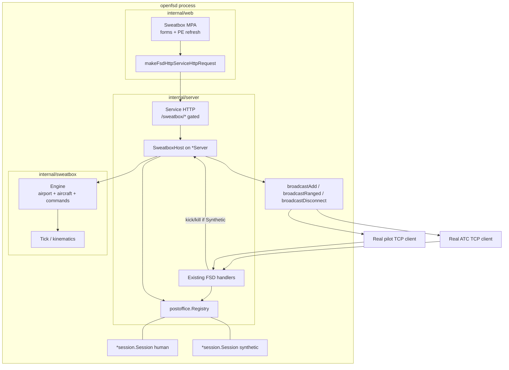
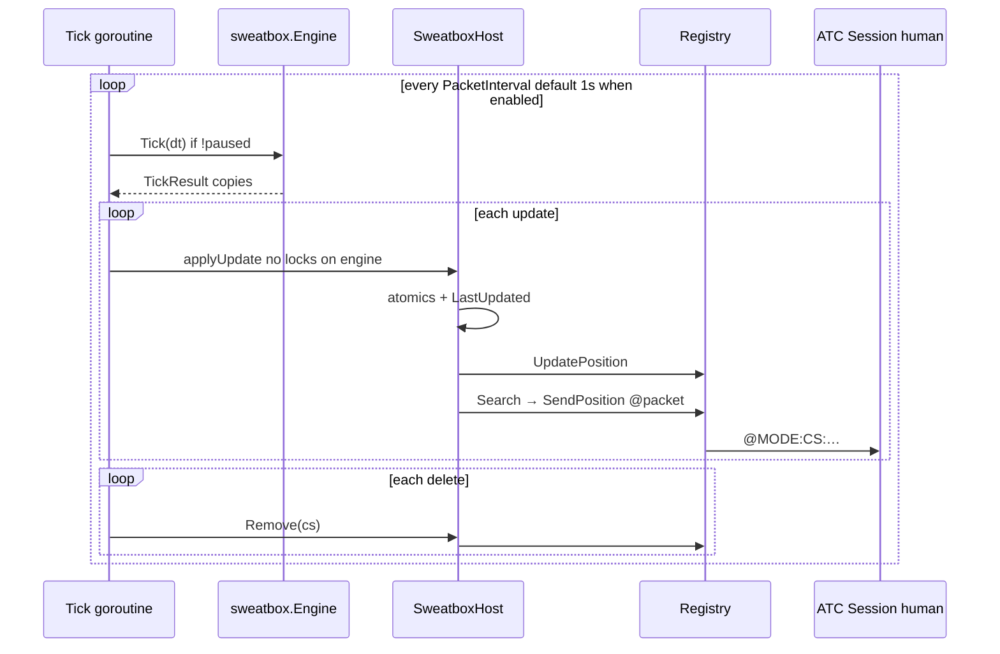
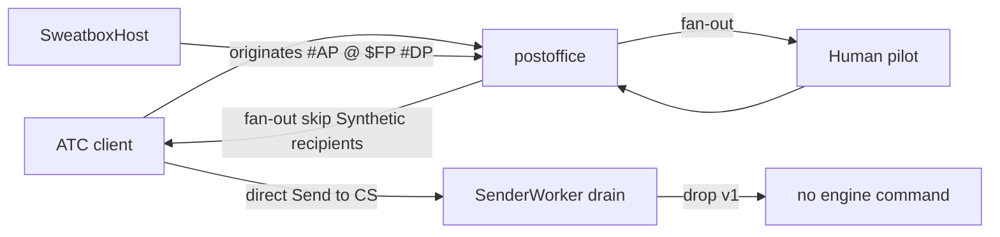
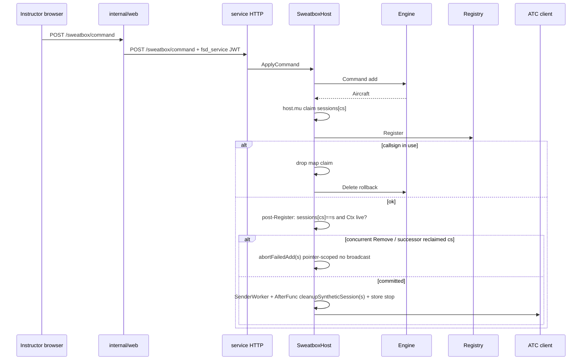

# openfsd Integrated Sweatbox Simulator + Web UI

| Field | Value |
|-------|--------|
| **Document** | Integrated Sweatbox Simulator + Instructor Web UI |
| **Author** | _(design author / implementer)_ |
| **Date** | 2026-07-17 |
| **Status** | Draft (rev 7 — AfterFunc pointer-safe + stop-before-Cancel) |
| **Target repo** | `/Users/rnorris/scratch/openfsd` |
| **Reference** | `/Users/rnorris/scratch/openfsd-twrtrainer` (UX + sim semantics only) |

---

## Overview

openfsd today is a production-shaped FSD server: real TCP pilot/ATC clients, a postoffice registry (`internal/postoffice`), per-connection sessions (`internal/session`), protocol handlers (`internal/server`), and a boring-web admin MPA (`internal/web`) that drives the FSD process via authenticated service HTTP (`internal/server/http_service.go`).

TWRTrainer (legacy VB6) produces multi-aircraft training traffic by opening **one outbound TCP pilot connection per aircraft** into a remote FSD sweatbox. That model is **explicitly rejected** for openfsd. We will implement a **native, in-process sweatbox simulator**: aircraft are synthetic participants registered in the same postoffice as humans; kinematics, taxi, pattern, and instructor commands run inside the FSD process; the admin service HTTP is the sole control plane; a server-rendered instructor UI drives that plane through the existing web → FSD HTTP proxy pattern.

Result: ATC students connect as normal FSD clients and see sweatbox traffic as ordinary pilots. Instructors never open N pilot sockets. There is no loopback networking tax between simulator and server.

```text
Legacy TWRTrainer:
  Instructor app ──N× TCP pilot──► FSD ──► ATC clients

openfsd sweatbox (this design):
  Web UI ──HTTP──► FSD service HTTP ──► in-process Engine
                                         │
                                         ▼
                              synthetic *session.Session
                              registered in postoffice
                                         │
                    position / #AP / $FP / #DP (in-process fan-out)
                                         │
                                         ▼
                              real ATC/pilot TCP clients
```

---

## Background & Motivation

### Current openfsd state (integration surfaces)

| Surface | Path | Role for sweatbox |
|---------|------|-------------------|
| Session | `internal/session/session.go` | Participant after login; atomic lat/lon/alt/gs/hdg; `Send` / `SendPosition` → `sendChan`; `New` documents `conn == nil` for **unit tests** (production synthetics are a deliberate extension of that nil-Conn path) |
| Postoffice | `internal/postoffice/postoffice.go` | Callsign map + geo index; `Register` / `Release` / `UpdatePosition` / `Search` / `All` / `Send` / `Find` / `Snapshot` |
| Registry DI | `internal/server/deps.go` | `Registry` interface used by handlers + HTTP |
| Service HTTP | `internal/server/http_service.go` | JWT `TokenType == "fsd_service"`, rating ≥ Administrator; today: `GET /online_users`, `POST /kick_user` |
| Broadcast | `internal/server/util.go` | `broadcastRanged`, `broadcastRangedVelocity`, `broadcastRangedAtcOnly`, `broadcastAll`, `broadcastAllATC`, `broadcastAllSupervisors`, `sendDirectOrErr` |
| Conn lifecycle | `internal/server/conn.go` | Real path: login → `Register` → `SenderWorker` → `broadcastAddPacket` → `eventLoop` → defer `Release` + `broadcastDisconnectPacket` |
| Cancel-only paths | `http_service.go` kick, `handler_admin.go` `$!!`, `handler_delete.go` `#DP` | Humans leave via `handleConn` defers; **Cancel alone does not Release** — critical for synthetic design |
| Web proxy | `internal/web/data.go` `makeFsdHttpServiceHttpRequest` | Mints short-lived `fsd_service` JWT and calls FSD service HTTP |
| Dashboard | `internal/web/pages_dashboard.go` + Leaflet PE | Online users already surface via service HTTP |
| E2E | `internal/server/testserver.go`, `e2e_test.go`, `pkg/fsdclient` | Real TCP clients + service JWT helpers (`MakeServiceJWT`) |
| Protocol | `pkg/protocol` | `@` pilot position, `#AP`/`#DP`, `$FP`, `#TM`, etc. |
| FPL storage | `handler_flightplan.go` + `util.go` | `FlightPlan` atomic holds **info section only** (fields after SOURCE:DEST), not full `$FP` line |

### TWRTrainer (what we learn, not what we copy)

From `openfsd-twrtrainer/docs/findings/`:

- **UX vocabulary**: aircraft table columns (callsign, type, rules, hdg, alt, spd, status, instruction); pause/unpause; load airport/scenario; command catalog (`add`, `taxi`, `pos`, `cto`, pattern entries, `del`, `p`/`un`, `ops`, …).
- **File formats**: `.apt` airport geometry (ICAO, mag var, parking/runway/taxiway/hold polylines); `.air` colon-delimited aircraft snapshots.
- **Simulation**: timer tick, waypoint-intersection taxi (~100 ft), pattern legs, simple kinematics (not full flight dynamics), pause freezes motion but aircraft remain “online”.
- **Network model (rejected)**: Winsock control array — one TCP pilot per aircraft.

### Pain points this solves

1. Training traffic requires an external multi-connection client and sweatbox network permissions.
2. Loopback N-connections add load, auth complexity, and failure modes orthogonal to the FSD core.
3. Instructors lack an integrated openfsd UI; they must run a 2006 Windows desktop app.
4. openfsd already has the right seams (Session/postoffice/service HTTP/admin web) but no sim.

---

## Goals & Non-Goals

### Goals

1. **In-process sweatbox engine** that advances simulated aircraft and injects them into the live registry alongside human sessions.
2. **No multi-TCP pilot model** — zero network hops between sim and FSD core.
3. **Service HTTP control plane** as the only production ingress for load/command/pause/state (when sweatbox is enabled).
4. **Web instructor UI** (boring-web MPA + progressive enhancement) comparable in intuition to TWRTrainer’s grid + commands.
5. **Human ↔ sweatbox interactivity**: ATC clients receive `#AP`, `@` positions, flight plans, and `#DP` as for real pilots; humans cannot “steal” sweatbox callsigns; defined handling of inbound paths that can touch synthetic sessions.
6. **TWRTrainer-compatible `.apt` / `.air` import** for existing training content; openfsd-native JSON optional later.
7. **≥95% hard unit coverage** on `internal/sweatbox` (aspirational 100% on pure parsers); **e2e** mixing human ATC, human pilot, and sweatbox aircraft including lifecycle (kick/kill).
8. **Import-graph and deadlock rules** from `Agents.md` / `scripts/check-import-graph.sh` preserved.
9. **Incremental PR plan** with independently mergeable slices.

### Non-Goals (v1)

- Replicating TWRTrainer as an external multi-TCP client.
- Full aerodynamic flight model / weather / wake turbulence.
- Multi-airport concurrent scenarios on one process (v1 = one active scenario).
- Voice / voice-channel simulation.
- Recording/playback or full “save & resume instruction state” (`.air` remains a snapshot).
- Student-facing UI (ATC clients remain ASRC/vSTARS/vatSys/etc.).
- Changing `pkg/protocol` wire bytes for existing packet types (new helper APIs only).
- SPA / client router / global client store for the instructor UI.
- Radio-frequency instructor command bridge (optional later; HTTP is v1 control plane).
- Meaningful handling of direct CPDLC-like / `#PC` / scratchpad traffic **to** synthetics (best-effort drop).

---

## Proposed Design

### High-level architecture



### Package layout and import graph

```text
internal/sweatbox/          # NEW — pure sim + command language (≥95% hard coverage)
  apt.go, apt_test.go       # .apt parse/validate
  air.go, air_test.go       # .air parse
  airport.go                # graph: surfaces, intersections, holds
  aircraft.go               # per-aircraft state machine fields
  command.go                # text command parse + alias normalize
  dispatch.go               # apply commands → state transitions
  taxi.go                   # waypoint routing / hold-short
  pattern.go                # pattern legs / anchor geometry
  motion.go                 # tick integration (ground + airborne)
  types.go                  # shared enums, status strings (no protocol import required)
  engine.go                 # Engine: load, pause, add/del, Tick(dt)
  snapshot.go               # engine-side snapshot DTO (domain fields only)
  testdata/                 # KBTV_example.apt/.air fixtures

internal/server/
  sweatbox_host.go          # SweatboxHost + lifecycle + tick apply + FPL encode
  sweatbox_http.go          # service HTTP routes under /sweatbox/* (gated)
  sweatbox_fpl.go           # encodeFlightPlanInfo + golden fixtures
  ... existing files (conn.go broadcast helpers reused via *Server methods) ...

internal/web/
  pages_sweatbox.go         # HTML handlers
  templates/sweatbox.html
  static/js/openfsd/sweatbox.js   # PE only (live table/map poll)
  routes.go                 # /sweatbox + API proxies

cmd/openfsd/                # no layout change; env → Config wiring only
```

**Allowed imports**

| Package | May import | Must not import |
|---------|------------|-----------------|
| `internal/sweatbox` | `internal/geo`, stdlib | `pkg/protocol` **preferred avoided** (domain-only; wire encode lives in server host); never `server`, `postoffice`, `web`, `session`, `db`, `auth`, `metar`, `fsdclient` |
| `internal/server` | `sweatbox`, `session`, `postoffice`, `protocol`, … | — |
| `internal/web` | `server` only for service-HTTP DTOs (keep minimal) | `session`, `postoffice`, `metar`, **`sweatbox`** |

**Import-graph script updates** (`scripts/check-import-graph.sh`):

```bash
# sweatbox: no orchestration / session / client packages
check_no_imports "internal/sweatbox" "${MODULE}/internal/sweatbox/..." \
  "${MODULE}/internal/server" \
  "${MODULE}/internal/web" \
  "${MODULE}/internal/postoffice" \
  "${MODULE}/internal/session" \
  "${MODULE}/internal/db" \
  "${MODULE}/internal/auth" \
  "${MODULE}/internal/metar" \
  "${MODULE}/pkg/fsdclient"

# web: extend existing forbidden list with sweatbox
check_no_imports "internal/web" "${MODULE}/internal/web/..." \
  "${MODULE}/internal/session" \
  "${MODULE}/internal/postoffice" \
  "${MODULE}/internal/metar" \
  "${MODULE}/internal/sweatbox"
```

`internal/geo` remains stdlib-only; sweatbox uses `geo.Distance` / `ApproxDistance` for taxi snap (~100 ft = 30.48 m) and pattern geometry.

**Protocol import in sweatbox:** v1 keeps sweatbox domain-only (floats, strings, status enums). Wire encoding (`@`, `$FP` info section, PBH pack) lives in `internal/server` host code. If a later PR needs protocol enums inside sweatbox, that is an explicit import-graph exception with rationale — default is **no**.

---

### Synthetic / virtual session model

#### Decision: real `*session.Session`, `Conn == nil`, no `eventLoop`, no TCP

`session.New` already allows `conn == nil` (documented for unit tests). Production synthetics deliberately reuse that path: no TCP, no Scanner, no `eventLoop`.

**Production synthetic policy (single source of truth):**

| Concern | Behavior |
|---------|----------|
| Construction | `session.New(hostCtx, nil, nil, LoginData{…})`; set `s.Synthetic = true` before Register |
| Flag | `Synthetic bool` on `session.Session` (immutable after construct; concurrent readers OK) |
| Register | `registry.Register(s)` — same path as humans; `ErrCallsignInUse` if collision |
| **Send-channel drain** | **Start `go s.SenderWorker()`** — already nil-`Conn`-safe: drains `sendChan`, skips write when `Conn == nil`, exits on `Ctx.Done()`. **No custom `sweatboxInboundPump` in v1.** |
| eventLoop / Scanner | Never started |
| Positions | Host tick apply → session atomics + `LastUpdated` → `registry.UpdatePosition` → `broadcastRanged` |
| Connect visibility | host-map claim → Register → **post-Register commit check** → SenderWorker → AfterFunc → broadcast (see Dual bookkeeping) |
| **Disconnect / Cancel** | See **Lifecycle contract** — mandatory, registry-authoritative |
| Kick / `$!!` | If `victim.Synthetic`, call `s.sweatbox.Remove(callsign)` → resolves pointer → `cleanupSyntheticSession(s)`. Bare `Cancel()` still safe via **pointer-scoped** AfterFunc |

#### Lifecycle contract (mandatory — prevents postoffice zombies)

Real clients leave the registry only because `handleConn` defers `registry.Release` after `eventLoop` / `SenderWorker` observe `Cancel()`. Production **Cancel-only** paths that do **not** go through that defer:

| Path | File | Current behavior |
|------|------|------------------|
| `POST /kick_user` | `http_service.go` | `client.Cancel()` only |
| `$!!` kill | `handler_admin.go` | `victim.Cancel()` only |
| Self `#DP` | `handler_delete.go` | `broadcastAll` + `Cancel()` — N/A without synthetic read loop |

**Cleanup for synthetics is pointer-scoped at the core.** Callsign is only a lookup key to find `*session.Session`. A host-map miss must **not** mean “nothing to do” if **this** session is still in the registry — but teardown must **never** destroy a **different** session that reclaimed the same callsign (ABA).

---

##### Primitives (three; do not conflate)

| API | Scope | Use when |
|-----|--------|----------|
| **`cleanupSyntheticSession(s)`** | **Pointer** — tear down **this** session only | Intentional Remove/kick (after resolving `s`), **AfterFunc** body, any path that holds a concrete `*session.Session` |
| **`Remove(cs)` / `cleanupSynthetic(cs)`** | Callsign **lookup** → then pointer cleanup | Instructor `del`, kick/`$!!`, HTTP DELETE, tick Deletes — **never** AfterFunc body |
| **`abortFailedAdd(s)`** | **Pointer** — abandon **uncommitted** add | Post-Register commit-check failure only |

AfterFunc must **never** call callsign-scoped teardown.

---

##### Host bookkeeping per synthetic (in addition to `sessions`)

```text
type synthMeta struct {
    sess     *session.Session
    stopAF   func() bool   // context.AfterFunc stop; nil until committed
}
// sessions[cs] still *session.Session for fast tick path
// afterStop[s] or meta[cs].stopAF stored at commit
```

(Or equivalent: map `*session.Session` → stop func. Key is: **intentional cleanup can stop AfterFunc before Cancel**.)

---

##### Cancel watcher (install only after commit check passes)

```go
stop := context.AfterFunc(s.Ctx, func() {
    // POINTER-SCOPED only — never cleanupSynthetic(cs)
    h.cleanupSyntheticSession(s)
})
// store stop so Remove can cancel the callback before s.Cancel()
h.setAfterFuncStop(s, stop)
```

`context.AfterFunc` returns a stop function (used elsewhere in-repo, e.g. `pkg/fsdclient`). **Store it. Use it.**

---

##### Normative `cleanupSyntheticSession(s)` (Remove core + AfterFunc body)

```text
// POINTER-SCOPED — successor-safe; idempotent; safe if already partially cleaned
cs := s.Callsign

0. stopAfterFunc(s) if any
   // MUST run before Cancel paths that would re-enter AfterFunc.
   // If we ARE the AfterFunc callback, stop is a no-op / already firing — OK.
   // Clear stored stop handle so a second call is free.

1. host.mu:
     owned := (sessions[cs] == s)
     if owned {
       delete(sessions, cs)
     }
     // foreign claim or empty map: do not touch
     unlock

2. if sReg, err := registry.Find(cs); err == nil && sReg == s && s.Synthetic {
     broadcastDisconnectPacket(s)   // #DP once for THIS pointer only
     registry.Release(s)
   }
   // Find==s_other or missing: no #DP / no Release of successor

3. s.Cancel()
   // AfterFunc already stopped on intentional path → no second cleanup.
   // If parent ctx killed us and we are inside AfterFunc, Cancel is no-op.

4. if owned {
     engine.Delete(cs)
   }
   // NOT owned: never engine.Delete
   //   - successor may own claim, or
   //   - successor may have engine.Add before claim, or
   //   - intentional cleanup already deleted while owned
```

**Idempotency vs successor-safety:** A second call with the same `s` after full cleanup finds `owned=false`, Find≠s, Cancel no-op, no engine.Delete — safe. A call with old `s` after successor reclaimed `cs` leaves successor untouched. **Idempotent ≠ callsign-scoped “always delete cs”.**

**Double `#DP`:** Intentional Remove runs step 2 once. AfterFunc is **stopped** before Cancel, so it does not run a second `#DP`. If stop fails and AfterFunc still runs, step 2 is a no-op (already Released) and step 4 skips engine.Delete if not owned.

---

##### Normative `Remove(cs)` / kick entry (callsign lookup only)

```text
1. host.mu: s = sessions[cs]; unlock
2. if s == nil:
     sReg, err := registry.Find(cs)
     if err != nil || !sReg.Synthetic: return not found
     s = sReg   // registry-authoritative for zombies (Issue A)
3. cleanupSyntheticSession(s)   // pointer path
```

Never: `AfterFunc → delete(sessions[cs])` without pointer check.

---

##### Normative `abortFailedAdd(s)` (uncommitted add only)

```text
// Same pointer rules as cleanupSyntheticSession for map/registry/engine.
// Differences: no AfterFunc was installed yet (or must not have been);
// no #DP required if never announced (optional: skip broadcast if never
// passed commit check — still Release if Find==s after Register).
cs := s.Callsign
0. stopAfterFunc(s) if any (should be none pre-commit)
1. host.mu:
     owned := (sessions[cs] == s)
     if owned { delete(sessions, cs) }
     unlock
2. if Find == s && Synthetic:
     // Registered but not announced, or race: Release without #AP if possible;
     // if #AP may have raced, #DP is OK for this pointer only
     optionally broadcastDisconnect if announced; always Release(s)
3. s.Cancel()
4. if owned { engine.Delete(cs) }
   // empty map / foreign claim: never engine.Delete
```

**Wrong predicate (forbidden):** `if !otherOwns` or “map empty ⇒ engine.Delete”.

---

##### Composition matrix

| Event | What runs | Successor-safe? |
|-------|-----------|-----------------|
| Instructor del / kick / `$!!` / HTTP DELETE / tick delete | `Remove(cs)` → `stopAF` + `cleanupSyntheticSession(s)` | Yes — pointer; AfterFunc stopped |
| Session ctx done (parent cancel) without Remove | AfterFunc → `cleanupSyntheticSession(s)` only | Yes — pointer; no callsign wipe |
| Intentional Remove then re-add same CS | Remove cleans old `s`; AfterFunc stopped or no-ops on successor | Yes — **required** test |
| Commit-check fail | `abortFailedAdd(s)` only | Yes — pointer + owned |
| Double Remove | Second call: owned=false, Find≠s | Idempotent |

**Forbidden patterns:**

| Pattern | Why |
|---------|-----|
| `AfterFunc → cleanupSynthetic(cs)` callsign-scoped | ABA kills successor after re-add |
| Intentional Remove `Cancel` without `stop()` AfterFunc | AfterFunc re-enters teardown race with re-add |
| `engine.Delete` when `!owned` in pointer paths | Wipes successor mid-add or post-reclaim |

---

##### Kick / kill hooks

```go
if client.Synthetic && s.sweatbox != nil {
    s.sweatbox.Remove(client.Callsign) // lookup → cleanupSyntheticSession
    return
}
client.Cancel() // human path unchanged
```

---

##### Tests (required)

| Case | Expect |
|------|--------|
| Kick / `$!!` after full add | registry empty, engine empty, **one** `#DP` to ATC |
| Register on registry, map empty/delayed, Remove | registry Released, engine deleted if owned/zombie for **that** s |
| Double Remove | idempotent; no panic; no second live `#DP` for a successor |
| Register then Remove before broadcast | no `#AP`; `abortFailedAdd` |
| **ABA abort claimed successor** | new aircraft survives old commit abort |
| **ABA abort engine-before-claim** | successor engine intact after old abort |
| **ABA AfterFunc / kick→re-add** | kick old → immediate re-add same CS → wait for old AfterFunc/Cancel settle → **new** still in map/registry/engine; old AfterFunc does not `#DP`/Release/engine.Delete new |

#### Inbound I/O policy (drain + skip — reconciled)

Three concerns people conflate; v1 policy is layered and non-contradictory:

| Layer | Policy | Purpose |
|-------|--------|---------|
| **1. Mandatory drain** | Start `SenderWorker` on every synthetic after Register | Prevents blocking `Send` if anything enqueues (direct `registry.Send`, incomplete skip, future code) |
| **2. Performance skip** | **All** fan-out helpers skip `recipient.Synthetic` | Avoid useless work and cap-32 pressure under storms |
| **3. Optional radio-command** | **Off in v1** | No parse of drained `#TM`; drain-and-drop only |

**Complete skip list** (every helper that enqueues to a recipient in `internal/server/util.go`):

| Helper | Enqueue method | Skip synthetics? |
|--------|----------------|------------------|
| `broadcastRanged` | `SendPosition` | **Yes** |
| `broadcastRangedVelocity` | `SendPosition` | **Yes** |
| `broadcastRangedAtcOnly` | `Send` | **Yes** (also filters ATC; belt-and-suspenders) |
| `broadcastAll` | `Send` | **Yes** |
| `broadcastAllATC` | `Send` | **Yes** |
| `broadcastAllSupervisors` | `Send` | **Yes** (synthetics are OBS today; still skip on `Synthetic`) |
| `sendDirectOrErr` / `Registry.Send` | `Send` (blocking) | **No skip** — rely on SenderWorker drain; product intent below |

Implement skip as:

```go
if recipient.Synthetic {
    return true // continue fan-out
}
```

Table-driven tests per helper (extend `util_extra_test.go` pattern): human source + synthetic recipient → synthetic `DequeueOutbound` empty; human recipient still receives.

**Direct Send product intent (v1):** Traffic targeted **to** a synthetic callsign (`#TM`, `#PC` beacon/scratchpad, forwarded `$CQ`, etc.) is **best-effort drop**. `SenderWorker` drains without interpreting. ATC clients may get no pilot reply; instructors must not debug silent drops as sim bugs. **What matters for training:** visibility (`#AP`/`@`/`#DP`), flight-plan query/amend on the **session** atomics, and instructor HTTP commands. Optional future: non-blocking drop + `$ER` to sender — out of scope for v1.

#### Why not a parallel “Participant” interface?

Postoffice and handlers are typed on `*session.Session`. A full Participant refactor is deferred (see Alternatives). Reusing Session keeps fan-out, snapshots, and callsign uniqueness automatic.

#### Session field population for synthetics

```go
LoginData{
  Callsign:         ac.Callsign,
  CID:              cfg.SweatboxCID, // default 900001 — see Key Decisions
  RealName:         "SWEATBOX",
  NetworkRating:    protocol.NetworkRatingObserver,
  MaxNetworkRating: protocol.NetworkRatingObserver,
  ProtoRevision:    100, // classic @ first; 101 later if needed
  LoginTime:        clock.Now(),
  IsAtc:            false,
  ClientID:         0,
}
s.Synthetic = true
s.FlightPlan.Store(encodeFlightPlanInfo(ac)) // host helper — exact layout below
s.Transponder.Store(ac.Squawk)
s.Altitude.Store(int32(ac.Alt))
s.Groundspeed.Store(int32(ac.Speed))
s.Heading.Store(int32(ac.Heading))
s.SetLatLon(ac.Lat, ac.Lon)
s.VisRange.Store(50.0 * 1852.0) // same pilotVisRange as handlePilotPosition
s.LastUpdated.Store(clock.Now())
```

**CID strategy (v1, single default):** Config / env `SWEATBOX_CID` (or config KV `sweatbox_cid`) default **`900001`**. No auto-created DB user in v1. Wire `#AP` uses that CID as string. Multiple synthetics share one CID (matches VATSIM sweatbox multi-connection-per-CID practice). Do **not** use bootstrap admin CID 1.

#### Nil `Conn` hardness (reframed)

**Current production hazard is not IP query.** `handleClientQueryIPRequest` uses `client.Conn.RemoteAddr()` on the **requesting** client (`$CQ…:SERVER:IP`). Synthetics never run an eventLoop, so they never invoke that path as requester. Login-phase `Conn` writes are also N/A.

**Real nil-Conn risks for synthetics:** Cancel/Release/kick/kill lifecycle (above); any future logging of `RemoteAddr`; accidental `Conn.Write` outside SenderWorker.

Still do:

1. Exhaustive `Conn` grep when landing synthetic support.
2. Add `func (s *Session) RemoteIP() string` — returns `""` or `"synthetic"` when `Conn == nil`; use from IP handler for future-proofing if ever called.
3. Do **not** center design narrative on IP panic for synthetics.

#### Deadlock rules

**Postoffice (unchanged, binding):**

> Never hold a postoffice map/tree lock across `Session.Send` if Send may block.

Sweatbox fan-out **must** use existing broadcast helpers (Search/All then Send outside locks). Prefer `SendPosition` for `@` (already used by `broadcastRanged`).

---

### Concurrency model (host vs engine)

**Lock order: never hold `Engine.mu` and `SweatboxHost.mu` at the same time.**

| Lock | Protects | Held across Send/broadcast? |
|------|----------|------------------------------|
| `Engine.mu` | airport, aircraft map, pause, counters, command mutations | **Never** across network fan-out |
| `SweatboxHost.mu` | `sessions map[string]*session.Session`, enable flags | **Never** across network fan-out |
| Postoffice locks | registry | **Never** across Session.Send (existing rule) |

**Patterns:**

```text
# Tick (SweatboxHost.Run)
result := engine.Tick(dt)          // engine locks internally; returns copies
// no engine lock held
for each update in result:
  applyTickUpdate(cs, fields)      // see liveness rules below
for each delete in result:
  Remove(cs) → cleanupSyntheticSession(s)

# applyTickUpdate — liveness re-check (normative, ALL steps mandatory)
host.mu:
  s := sessions[cs]
  unlock
if s == nil {
  skip   // concurrent Remove dropped claim
}
s2, err := registry.Find(cs)
if err != nil || s2 != s || !s.Synthetic {
  skip   // Released or replaced between map load and apply;
         // UpdatePosition must NOT run on a released session
         // (postoffice can re-Insert into R-tree when treeReady)
}
write session atomics + LastUpdated
registry.UpdatePosition(s, ...)
broadcastRanged(...)               // no host.mu / engine.mu held

# Command / HTTP
result, err := engine.Command(line)  // engine.mu only
// then host add path / Remove / abortFailedAdd without holding engine.mu
// host.mu only for map claim/delete of *Session pointers
// broadcasts after host.mu released

# Remove / AfterFunc / abortFailedAdd
// see Lifecycle contract — all pointer-scoped at the core
```

**Why both checks are mandatory:** Concurrent `Remove` can `Release` a session while a tick still holds a stale `*session.Session` pointer taken under `host.mu`. `postoffice.UpdatePosition` does **not** require membership in `clientMap`; when `treeReady` it **Delete+Insert**s into the R-tree — so a released synthetic can re-enter the geo index and keep sourcing ranged searches. Map-only check is insufficient TOCTOU coverage; **same-pointer `registry.Find` is required** before any `UpdatePosition` / position broadcast.

**Command vs tick races:** Engine serializes mutations under `engine.mu`. Concurrent `Tick` Deletes and HTTP `del` both call `Remove` → `cleanupSyntheticSession`. applyTickUpdate is a no-op if map miss **or** registry Find fails / pointer mismatch.

**Race test:** hammer `Command` + `Tick` + `Remove` under `-race`; include apply-after-Remove, Register-without-map-then-Remove, Register-then-Remove-before-broadcast, and **kick→re-add same CS** (AfterFunc must not kill successor).

---

### Dual bookkeeping: engine map + host session map + registry

Three stores must not diverge:

| Store | Authority for |
|-------|----------------|
| `Engine.aircraft` | Sim kinematics, status, instruction, taxi/pattern state |
| `host.sessions` | Mapping callsign → `*session.Session` |
| `registry` | Wire visibility / callsign uniqueness vs humans |

**Host owns coupling code; registry is authoritative for “is this synthetic still live on the wire.”** Host map is a fast path for tick apply and for tracking AfterFunc claims — not the sole source of truth for cleanup.

#### Add path (command `add`, scenario line, etc.)

Close both sides of the concurrent-Remove race:

1. **Claim before Register** (map never trails registry for a successful add).
2. **Post-Register / pre-announce re-validation** (add must not start SenderWorker/AfterFunc/`#AP` if cleanup already ran).

```text
1. engine.Add(...) → Aircraft (engine.mu)
   on engine error → return; no session
2. build session s (Synthetic=true, atomics, FP) — no locks
3. host.mu:
     if sessions[cs] already set → unlock; engine.Delete(cs); return ErrCallsignInUse
     sessions[cs] = s            // CLAIM before registry visibility
     unlock
4. registry.Register(s)
   on error (e.g. human raced same CS):
     host.mu: delete(sessions, cs); unlock
     engine.Delete(cs)
     s.Cancel()
     return error
5. *** POST-REGISTER COMMIT CHECK (mandatory) ***
   host.mu:
     if sessions[cs] != s {      // claim lost or replaced by successor
       unlock
       abortFailedAdd(s)         // POINTER-SCOPED — not cleanupSynthetic(cs)
       return errAbortedByConcurrentRemove
     }
     unlock
   if s.Ctx.Err() != nil {       // this attempt canceled; successor may own cs
     abortFailedAdd(s)           // POINTER-SCOPED
     return errAbortedByConcurrentRemove
   }
6. go s.SenderWorker()
7. stop := context.AfterFunc(s.Ctx, func() { cleanupSyntheticSession(s) })
   store stop for s   // intentional Remove must stopAF before Cancel
8. broadcastAddPacket + immediate @ + optional $FP broadcastAllATC
   // no host.mu held during broadcast
```

**Why step 5 is required:** Concurrent kick can `cleanupSyntheticSession` between Register and announce. Without re-validation, add would still `broadcastAddPacket` (`#AP` with no membership check) — ghost join. Soft serialize is **defense-in-depth only**.

**Why abort / AfterFunc never callsign-teardown:** Successor may reclaim `cs`. All teardown after pointer resolution uses **`cleanupSyntheticSession(s)`** or **`abortFailedAdd(s)`** with **`owned`** gates.

**Why `owned` not `!otherOwns`:** Add order is **engine.Add then map claim**. Empty map ≠ safe to `engine.Delete`.

**Register-error rollback (step 4 fail):** still owns claim → `abortFailedAdd(s)` (`owned==true`).

**Consistency:**

| Stage | Map | Registry | Failure path |
|-------|-----|----------|--------------|
| engine.Add, before claim | empty/other | — | abort: `owned=false` → no engine.Delete |
| claim + Register, pre-commit | `s` | `s` | abort: `owned=true` → engine.Delete; no AfterFunc yet |
| committed | `s` | `s` | Remove/AfterFunc: `cleanupSyntheticSession(s)` + stopAF |
| post-Remove re-add | `s_new` | `s_new` | old AfterFunc stopped or pointer no-op |

Invariants:

- Never `Register` without prior host-map claim.
- Never AfterFunc / `#AP` unless commit check passes.
- Commit fail → `abortFailedAdd(s)` only.
- Intentional remove → `Remove(cs)` → **stopAF** + `cleanupSyntheticSession(s)`.
- AfterFunc body → **`cleanupSyntheticSession(s)` only** (never callsign-scoped).

#### Delete path (single normative order)

```text
Remove(cs):
  resolve s from map or registry (Synthetic)
  cleanupSyntheticSession(s):
    0. stop AfterFunc for s
    1. drop map claim iff sessions[cs]==s  (owned)
    2. #DP+Release iff Find==s
    3. s.Cancel()
    4. engine.Delete iff owned
```

No callsign-wide blind delete. No “engine first.” AfterFunc does **not** re-run callsign teardown.

#### Scenario load (best-effort)

`POST /sweatbox/scenario` returns `{loaded, errors[]}`. Semantics:

- **Best-effort per aircraft line:** each successful line runs full add path; failures append to `errors` and do not roll back prior successes.
- Engine and host/registry for each callsign stay paired via the add path rollback rule.
- Auto-pause after load attempt (even partial), matching TWRTrainer safety.
- Partial success is intentional for instructor UX (bad lines listed; good lines fly).

#### Tick deletes and tick updates

- `TickResult.Deletes` → `Remove(cs)` → `cleanupSyntheticSession(s)` only.
- `TickResult.Updates` → `applyTickUpdate` with **mandatory** host-map + same-pointer `registry.Find` liveness (Concurrency model).

---

### Flight-plan wire encoding (`encodeFlightPlanInfo`)

`session.FlightPlan` stores the **info section only** — what `extractFlightplanInfoSection` returns after skipping SOURCE:DEST on `$FP` (2 fields) or SOURCE:DEST:TARGET on `$AM` (3 fields). `handleClientQueryFlightplanRequest` rebuilds:

```text
$FP{callsign}:*A:{FlightPlan.Load()}\r\n
```

via `buildFileFlightplanPacket(targetCallsign, "*A", fplInfo)`.

**Info-section field order** (`docs/protocol.md` Flight Plan; e2e `TestE2E_FlightPlan`; unit samples in `handler_test.go` / `util_extra_test.go`):

| # | Field | Source from aircraft / defaults |
|---|-------|----------------------------------|
| 0 | Flight rules | `I` / `V` / `D` / `S` from AC rules |
| 1 | Equipment / type | ICAO type string (e.g. `B738/F` or `B738`) |
| 2 | True airspeed | derived or default (e.g. cruise TAS guess; v1 default `250` if unknown) |
| 3 | Departure airport | `ac.Dep` |
| 4 | ETD | `0000` if unknown |
| 5 | Actual dep time | `0000` |
| 6 | Cruise altitude | `ac.CruiseAlt` decimal feet |
| 7 | Destination | `ac.Arr` |
| 8 | Hours enroute | `0` default |
| 9 | Minutes enroute | `0` |
| 10 | Hours fuel | `0` |
| 11 | Minutes fuel | `0` |
| 12 | Alternate | empty or `ac.Alternate` if present |
| 13 | Remarks | `ac.Remarks` |
| 14 | Route | `ac.Route` |

Example stored string (matches unit test style):

```text
I:B738/F:250:KBTV:0000:0000:29000:KBOS:0:0:0:0::/v/charts:BTV4 MPV LEB MHT
```

Example rebuilt query reply:

```text
$FPAAL123:*A:I:B738/F:250:KBTV:0000:0000:29000:KBOS:0:0:0:0::/v/charts:BTV4 MPV LEB MHT\r\n
```

**Placement:** `encodeFlightPlanInfo` lives in **`internal/server`** (host), not pure engine — wire layout is an FSD concern. Golden test: aircraft snapshot → encode → `buildFileFlightplanPacket` → bytes equal fixture under `internal/server/testdata/` or `sweatbox_fpl_test.go`.

On add and on instructor `fp`/`vp` commands: store info section, then `broadcastAllATC` with `$FP` (`buildFileFlightplanPacket(cs, "*A", info)`).

---

### ATC `$AM` / FlightPlan source of truth

**v1 decision: session `FlightPlan` (and other wire-visible atomics) are source of truth for anything ATC already mutated on the wire.**

| Writer | Effect |
|--------|--------|
| Host on add / instructor `fp`/`vp` | Writes session `FlightPlan` + engine plan fields + ATC broadcast |
| ATC `$AM` via `handleAmendFlightplan` | Writes **session only** + `$AM` broadcast (existing code) — **does not** update engine |
| Host `Snapshot` for HTTP/UI | **Merges:** engine status/instruction/kinematics + **session** `FlightPlan`, squawk/xpdr, lat/lon/alt/gs/hdg atomics for wire-visible columns |

Rationale: honest instructor UI after ATC amends; no invasive hooks in `handleAmendFlightplan` for v1. Engine plan fields may lag until next instructor `fp`/`vp` — document in UI as “filed plan (live wire)” vs internal generator state if both shown. Prefer single “Flight plan” column fed from session.

Optional v1.1: after amend, host could poll or wrap Registry — not required.

---

### Engine model (`internal/sweatbox`)

#### Core types (illustrative)

```go
package sweatbox

type Engine struct {
    mu       sync.Mutex
    airport  *Airport
    aircraft map[string]*Aircraft
    paused   bool
    started  time.Time
    elapsed  time.Duration
    arrCount int
    depCount int
    settings Settings
}

type Settings struct {
    DeleteArrivalsWhenParked bool
    MaxAircraft              int     // default 64; hard clamp ≤ 128
    DefaultPatternSizeNM     float64
    IntersectionTolM         float64 // default 30.48 (100 ft)
}

// Tick advances unpaused aircraft by dt; returns copies only.
type TickResult struct {
    Updates []AircraftUpdate
    Deletes []string
    Events  []Event
}

func (e *Engine) Tick(dt time.Duration) TickResult
func (e *Engine) LoadAirport(a *Airport) error
func (e *Engine) LoadScenario(list []AircraftSnapshot) (loaded []string, errs []error)
func (e *Engine) Command(line string) (CommandResult, error)
func (e *Engine) Delete(callsign string) bool // idempotent
func (e *Engine) Pause()
func (e *Engine) Unpause()
func (e *Engine) Snapshot() EngineSnapshot // domain only
```

Engine has **no** knowledge of Session/Registry/wire.

#### Status vocabulary

Align with TWRTrainer where practical: `Parked`, `Taxiing`, `Holding Short`, `Holding in Position`, `Takeoff`, `Departing`, pattern legs, `Landed`, etc. Exact set in `types.go` with transition tests.

#### Simulation fidelity (v1)

| Subsystem | Fidelity | Notes |
|-----------|----------|-------|
| `.apt` parse/validate | High | python_ref + findings 04 |
| Intersection taxi | High | 100 ft snap; max 100 steps |
| Pattern legs | Med–High | P1 PR |
| Takeoff/climb | Medium | Initial climb props/jets |
| Approach add | Medium | Distance NM on final |
| Airborne vectors | Medium | Constant turn/climb rates |
| Type encyclopedia | Low–Med | Reasonable table + weight/engine checks |

---

### Tick loop & wire injection



**Configuration**

| Knob | Default | Source |
|------|---------|--------|
| Tick / position interval | `1.0s` | settings; HTTP-settable; clamp `[0.2, 10.0]` |
| Pilot vis range | 50 NM | Match `handlePilotPosition` |
| PBH encoding | heading only (pitch/bank 0) | **`protocol.PackPitchBankHeading`** (or host helper) with round-trip tests vs `pitchBankHeading` in same PR as first `@` inject |

**Position packet (host):**

```go
pkt := protocol.PilotPosition{
  TransponderMode:    mapXPDR(ac.XPDRMode),
  Callsign:           ac.Callsign,
  TransponderCode:    ac.Squawk,
  NetworkRating:      s.NetworkRating,
  Latitude:           ac.Lat,
  Longitude:          ac.Lon,
  TrueAltitude:       int(ac.Alt),
  Groundspeed:        int(ac.Speed),
  PitchBankHeading:   protocol.PackPitchBankHeading(0, 0, ac.Heading),
  AltitudeCorrection: 0,
}.Marshal()
s.LastUpdated.Store(h.clock.Now())
broadcastRanged(h.registry, s, pkt)
```

**Apply-update checklist (PR 6):** lat/lon, alt, gs, hdg, xpdr, `LastUpdated`, `UpdatePosition`, `@` broadcast.

---

### SweatboxHost ↔ Server wiring

`broadcastAddPacket` / `broadcastDisconnectPacket` are **unexported methods on `*Server`** (`conn.go`). Host is not a freestanding orphan.

**Concrete shape:**

```go
// internal/server/server.go
type Server struct {
    // … existing fields …
    sweatbox *SweatboxHost // nil if disabled
}

// internal/server/sweatbox_host.go
type SweatboxHost struct {
    srv      *Server // back-ref for unexported broadcast helpers + logger/clock/registry
    eng      *sweatbox.Engine
    sessions map[string]*session.Session
    mu       sync.Mutex
    interval time.Duration
}

func (h *SweatboxHost) Run(ctx context.Context) { /* tick until ctx done */ }
func (h *SweatboxHost) Remove(callsign string) error
func (h *SweatboxHost) ApplyCommand(line string) (sweatbox.CommandResult, error)
func (h *SweatboxHost) LoadAirport(text []byte) error
func (h *SweatboxHost) LoadScenario(text []byte) (loaded int, errs []error)
func (h *SweatboxHost) State() SweatboxStateJSON // merges engine + session wire fields
```

Host methods call `h.srv.broadcastAddPacket(s)`, `h.srv.broadcastDisconnectPacket(s)`, use `h.srv.registry`, `h.srv.clock`, `h.srv.logger`.

**Alternative if back-ref is disliked:** inject `broadcastAdd func(*session.Session)` closures at `New` time — also fine; pick one in PR 6 and stick to it. **Prefer back-ref `*Server`** for fewer closure fields.

**Deps / Config:**

```go
// Config
SweatboxEnabled bool `env:"SWEATBOX_ENABLED, default=false"`
SweatboxCID     int  `env:"SWEATBOX_CID, default=900001"`

// Deps
type Deps struct {
    // … existing …
    SweatboxEnabled bool // explicit value; NewDefault copies from Config
}
```

**`New` / `NewDefault`:** if `Deps.SweatboxEnabled` (from config), allocate `sweatbox = newSweatboxHost(s)` after Server struct exists (two-phase: create Server, then `s.sweatbox = newHost(s)`).

**`Server.Run`:**

```go
if s.sweatbox != nil {
    go s.sweatbox.Run(ctx)
}
go s.runServiceHTTP(ctx)
// … listeners …
```

**`setupRoutes`:** register `/sweatbox/*` **only if** `s.sweatbox != nil`. Disabled servers expose no sweatbox HTTP surface.

**`StartTestServer`:** default **`SweatboxEnabled: true`** for e2e convenience (empty engine until load), unless a test opts out via helper `StartTestServerOpts{Sweatbox: false}` for unit speed where irrelevant. Document in testserver godoc.

---

### Feature enablement (single story)

| Mechanism | Role |
|-----------|------|
| `SWEATBOX_ENABLED` env / `Config.SweatboxEnabled` | **Single gate** — default **`false`** |
| When false | `s.sweatbox == nil`; no tick goroutine; no `/sweatbox/*` routes; web page may show “Sweatbox disabled on FSD server” |
| When true | Host runs; routes registered; web instructor usable |
| Compose / docs | Training profiles set `SWEATBOX_ENABLED=true` |
| Always compiled | Yes — no build tags; disabled by config |

Rationale: openfsd is also a general FSD server; default-on expands admin attack/ops surface and surprises non-training deploys. Tick when empty is cheap, but HTTP surface is not zero-cost operationally.

Emergency disable = set env false and restart (or future hot-disable via config reload — not v1).

---

### Multi-session / multi-airport

**v1: single active airport + single scenario namespace per FSD process.**

Loading a new `.apt` while aircraft exist: require empty set **or** `?replace=1` that `Remove`s all first. Reject ambiguous partial airport swaps.

---

## API / Interface Changes

### FSD service HTTP (auth unchanged; routes gated)

Middleware: Bearer JWT `TokenType == "fsd_service"`, `NetworkRating ≥ Administrator`. Routes registered only when sweatbox enabled.

| Method | Path | Body | Response | Purpose |
|--------|------|------|----------|---------|
| `GET` | `/sweatbox/state` | — | `SweatboxStateJSON` | Snapshot for UI/API (merged session FP) |
| `POST` | `/sweatbox/airport` | raw `.apt` text or multipart (max body **2 MiB**) | `{icao, surfaces, errors[]}` | Load/replace airport |
| `POST` | `/sweatbox/scenario` | raw `.air` / multipart (max **2 MiB**) | `{loaded, errors[]}` | Best-effort load; auto-pause |
| `POST` | `/sweatbox/command` | `{"command":"…"}` | `CommandResult` | Instructor command |
| `POST` | `/sweatbox/pause` | — | 204 | Pause |
| `POST` | `/sweatbox/unpause` | — | 204 | Unpause |
| `POST` | `/sweatbox/settings` | JSON | settings | Tick rate, delete-arrivals, etc. |
| `DELETE` | `/sweatbox/aircraft/:callsign` | — | 204 / 404 | `Remove` one |
| `DELETE` | `/sweatbox/aircraft` | — | 204 | Remove all |
| `GET` | `/sweatbox/ops` | — | ops/stats | Elapsed, arr/dep, ops/min |

**Command result:** soft validation errors → HTTP **200** + `{"ok":false,"message":"…"}` (TWRTrainer-style strings). Malformed JSON → 400. No airport → 409. Disabled sweatbox → routes absent → 404.

**Online users:**

```go
Synthetic bool `json:"synthetic,omitempty"`
```

from `session.Synthetic`. Flows to datafeed if `OnlineUserPilot` is embedded there — operators should know training traffic appears on `openfsd-data.json` when enabled. Optional v1.1: `SWEATBOX_PUBLIC_DATAFEED=false` to omit synthetics from public feed only (still on wire for ATC).

### Web layer (boring-web)

#### HTML routes (Administrator+)

| Method | Path | Behavior |
|--------|------|----------|
| `GET` | `/sweatbox` | Instructor page; if FSD sweatbox disabled, show clear error |
| `POST` | `/sweatbox/airport` | CSRF; multipart/text → proxy → redirect `?flash=` |
| `POST` | `/sweatbox/scenario` | CSRF; proxy → redirect |
| `POST` | `/sweatbox/command` | CSRF; form `command` → proxy → redirect with flash message |
| `POST` | `/sweatbox/pause` / `unpause` | CSRF |
| `POST` | `/sweatbox/delete` | CSRF; callsign |
| `POST` | `/sweatbox/delete-all` | CSRF |

Flash pattern: reuse config editor style (`?flash=saved` / error query or PRG with message) — see `pages_config.go` `c.Query("flash")`.

Multipart: set max memory / body limit (2 MiB) on these handlers; reject oversized with 413/400 HTML error.

Nav: “Sweatbox” for Administrator / `CanEditConfig` gate (same as config editor).

#### JSON API proxies

`/api/v1/sweatbox/*` with **`jwtBearerMiddleware` + `csrfIfCookieSession`** (same as `/api/v1/fsdconn` and config), min rating Administrator, proxy to FSD service HTTP. PE polls `GET /api/v1/sweatbox/state` (or HTML partial) every **1–2 s**.

#### Progressive enhancement

- **No-JS:** SSR table + forms; manual refresh.
- **With JS:** poll state; update table; optional Leaflet mini-map (document **JS budget exception** in PR description — same class as dashboard map).
- PE **never** validates commands client-side as authority.

### Command language

**Dual surface:** TWRTrainer **text primary**; structured JSON optional later for buttons.

| Surface | Example |
|---------|---------|
| Text | Callsign select + `taxi A B hs 1`, or `AAL123, taxi A B hs 1` |
| Global | `p` / `un` / `ops` / `add …` |

**No radio-frequency command requirement in v1.**

**Phased catalog:**

| Phase | Commands |
|-------|----------|
| P0a | `add`, `del`, `p`/`un`, `ops`, `pos`, `sq`/`sn`/`ss`/`id` |
| P0b | `taxi`, `hold`, `res`, `cross`, `cto`/`ctoc` |
| P0c | `fh`/`cm`/`spd`, `fp`/`vp` |
| P1 | Pattern family |
| P2 | Edge cases (`lahso`, s-turns, …) |

---

## Data Model Changes

### Runtime only (v1)

No mandatory SQLite migration. Airport/scenario in memory on host.

Optional config keys later: `sweatbox_tick_ms`, `sweatbox_cid`, `sweatbox_max_aircraft` (env is enough for v1).

### File formats

**.apt / .air** TWRTrainer-compatible (findings 04 / python_ref). Fixtures: KBTV samples in `internal/sweatbox/testdata/`.

openfsd-native JSON: optional later.

### Session schema

```go
Synthetic bool // sweatbox-managed; never set on TCP login path
```

---

## Human ↔ Sweatbox Interaction



### What ATC sees

- `#AP` on add, `@` on tick, `#DP` on remove
- `$CQ` FP answered from session `FlightPlan`
- `$AM` mutates session plan (UI merge)
- `online_users` with `synthetic: true`
- Callsign conflicts via registry both ways
- **Late-joining ATC:** does **not** receive historical `#AP` for already-online pilots (same as humans today). Sees synthetics via subsequent `@` positions when in range, and via FP query. Document this — not a sweatbox bug.

### Human pilot

Sees ranged `@` for nearby sweatbox traffic. No collision AI.

---

## Security & Privacy Considerations

| Threat | Mitigation |
|--------|------------|
| Unauthorized sim control | fsd_service JWT + Administrator; routes absent when disabled |
| Default-on surprise | **`SWEATBOX_ENABLED` default false** |
| Web session abuse | Cookie auth + CSRF; rating check server-side |
| Resource exhaustion | MaxAircraft 64 (≤128); tick clamp; **2 MiB** upload cap |
| Callsign squatting | Shared registry uniqueness |
| Upload path traversal | In-memory parse only in v1 |
| Synthetic privilege | Always pilot OBS; never ATC |
| Public datafeed | Synthetics appear as pilots when enabled — **document for operators**; optional later flag to omit from JSON feed only |
| Rate limit commands | Admin-only; no extra limiter v1 |

---

## Observability

| Signal | Implementation |
|--------|----------------|
| Logs | slog: load, command soft-fail (debug), add/del (info), tick overrun (warn), finalizeSynthetic (debug) |
| Ops endpoint | elapsed, arr/dep |
| Online users | `LastUpdated` populated; `synthetic` badge |
| Metrics | optional later |

**Performance guidance:** ≤30 AC @ 1 Hz negligible; 64–128 AC fine under linear postoffice path; pure engine tick target &lt; 5 ms.

---

## Testing Strategy

### Unit (`internal/sweatbox` → **≥95% hard**)

Parsers, intersections, taxi, commands (phased), motion, engine pause/load/max, golden KBTV.

Wire into `scripts/check-coverage.sh` as hard floor for `internal/sweatbox` (PR 1 or PR 12 — **PR 1 introduces package with local enforcement comment; PR 12 lands script floor if deferred**). Aspirational 100% on pure parsers — not a hard fail at 96%.

### Unit / integration (`internal/server`)

Synthetic register; tick inject + LastUpdated; callsign conflict; **broadcast skip per helper**; **kick/kill lifecycle**; HTTP auth; command load; nil-Conn RemoteIP helper; dual-map rollback on Register fail; FPL golden encode; host/engine race hammer.

### E2E (expanded)

| Scenario | Notes |
|----------|-------|
| Visibility | ATC sees `#AP` + `@` |
| Human pilot ranged `@` | Pilot client receives sweatbox positions in range |
| Coexistence | Human pilot + sweatbox |
| Flight plan | encode → ATC `$CQ` FP |
| Delete | HTTP delete → `#DP` |
| **Kick lifecycle** | service HTTP kick synthetic → gone from registry + state |
| **Kill lifecycle** | supervisor `$!!` synthetic → same |
| Conflict | human CS blocks sweatbox add |
| Pause freeze | positions stable while paused |
| **Taxi motion** | unpaused taxi changes lat/lon over wall clock |
| Late ATC join | joins after add; eventually sees `@` (no historical `#AP`) |
| Mixed human text | ATC→human pilot still works with synthetics present |
| Oversized upload | HTTP rejects &gt; 2 MiB |
| Max aircraft | add beyond cap fails cleanly |

PR 8 focuses happy path + conflict + delete + **kick/kill**; remaining cases can follow in PR 8b or adjacent.

### Coverage / hygiene

- sweatbox ≥95% hard; overall ≥80%
- `go test -race ./internal/sweatbox/... ./internal/server/...`
- import-graph + no panic hygiene

---

## Alternatives Considered

### A. Multi-TCP pilot clients inside openfsd (TWRTrainer model)

**Rejected** — against requirements; N× auth/read loops; flaky e2e.

### B. Parallel Participant interface in postoffice

**Deferred** — large refactor; Session reuse is pragmatic for v1.

### C. Sweatbox as separate process + IPC

**Rejected** — networking overhead; not tightly integrated.

### D. Commands only as structured JSON

**Rejected as sole surface** — loses instructor muscle memory.

### E. Radio-frequency command channel only

**Rejected for v1 control plane** — HTTP is required ingress; radio optional later.

### F. Synthetic I/O: reuse `SenderWorker` as drain (chosen) vs custom pump only

| Option | Pros | Cons |
|--------|------|------|
| **Start `SenderWorker` (chosen)** | Already nil-Conn-safe; one less abstraction; drains blocking `Send` | Spins a goroutine per AC (same as humans) |
| Custom drop-pump only | Slightly more control for radio-command parse | Duplicates SenderWorker loop; easy to forget |
| No drain + complete skip only | Fewer goroutines | Fragile if any path forgets skip; direct Send stalls handlers |

**Chosen:** SenderWorker drain + complete fan-out skip (layers 1–2). Custom inbound **parse** pump only if radio-command feature ships.

### G. Thin Participant only on `postoffice.Send` port

Lighter than full Participant refactor; still touches postoffice. **Deferred** — skip+drain sufficient for v1.

---

## Rollout Plan

1. Default **disabled** (`SWEATBOX_ENABLED=false`).
2. Training compose/docs enable true.
3. PR order: pure package → Synthetic/skip/lifecycle primitives → host+HTTP → e2e → web → pattern.
4. Rollback: disable env + restart; no schema reverse; synthetics ephemeral.

---

## Open Questions

| # | Question | Default if unanswered |
|---|----------|----------------------|
| 1 | ~~CID default~~ | **Resolved:** `900001` via `SWEATBOX_CID` |
| 2 | Synthetics on public datafeed? | **Yes** when sweatbox enabled; document ops impact; optional omit flag later |
| 3 | Radio-command bridge in v1? | **No** |
| 4 | Max aircraft? | **64** default, clamp 128 |
| 5 | Multi-instructor races? | Engine serializes; host never dual-locks with engine |
| 6 | ~~PBH pack location~~ | **Resolved:** `protocol.PackPitchBankHeading` + round-trip tests in first `@` inject PR |
| 7 | Supervisor vs Administrator for web? | **Administrator** |
| 8 | Hot-disable without restart? | **Not v1** |

---

## Key Decisions

| # | Decision | Rationale |
|---|----------|-----------|
| 1 | **In-process engine, not N TCP pilots** | Requirements; single registry truth |
| 2 | **Synthetic `*session.Session` + `Synthetic bool`** | Minimal postoffice/handler change |
| 3 | **`internal/sweatbox` pure (geo+stdlib); wire in server** | Testability; import hygiene |
| 4 | **Service HTTP `/sweatbox/*` sole control plane when enabled** | Existing web proxy pattern |
| 5 | **Layered I/O: SenderWorker drain + skip all fan-out recipients** | No sendChan stall; no custom pump v1 |
| 6 | **Pointer-scoped `cleanupSyntheticSession(s)` + stop AfterFunc before Cancel; kick/Remove resolve then pointer cleanup** | Zombies without ABA killing successors |
| 7 | **Never hold engine.mu and host.mu together** | Deadlock avoidance |
| 8 | **Claim before Register; post-Register commit check; `abortFailedAdd(s)` on fail** | No ghost `#AP`; no dual-map zombies |
| 8b | **`engine.Delete` only if `owned` at entry in all pointer paths; never `!otherOwns`** | Empty map ≠ safe Delete (engine-before-claim) |
| 8c | **AfterFunc body = `cleanupSyntheticSession(s)` only; store/stop AfterFunc on intentional Remove** | Kick→re-add same CS is successor-safe |
| 8d | **Tick apply: map + same-pointer Find before UpdatePosition** | No R-tree re-insert after Release |
| 9 | **Session atomics SoT for wire FP after register; Snapshot merges** | Honest UI after `$AM` |
| 10 | **Exact `$FP` info-section encode in host with golden tests** | Implementable ATC FP query |
| 11 | **`SWEATBOX_ENABLED` default false** | Safe for general FSD deploys |
| 12 | **`SweatboxHost` owned by `*Server` with back-ref for unexported broadcasts** | Concrete wiring |
| 13 | **CID default 900001; no auto DB user** | Consistent identity |
| 14 | **TWRTrainer text primary; `.apt`/`.air` first** | Instructor + content reuse |
| 15 | **Single airport per process; HTTP not radio (v1)** | Simplicity |
| 16 | **`protocol.PackPitchBankHeading` in first position-inject PR** | Correct headings |
| 17 | **≥95% hard coverage on `internal/sweatbox`** | Enforceable bar vs “nearly 100%” |
| 18 | **Direct `#PC`/targeted chatter to synthetics = best-effort drop** | Scope control |
| 19 | **boring-web MPA; PE poll; no SPA** | House standard |
| 20 | **Phased commands P0a/b/c → P1 → P2** | Incremental reviews |

---

## Risks

| Risk | Severity | Mitigation |
|------|----------|------------|
| **Cancel zombie in postoffice** | **Critical** | Pointer cleanup + kick hooks + AfterFunc; e2e |
| **Register↔map race zombie** | **High** | Claim before Register; Remove resolves via Find if map empty |
| **Ghost `#AP` after concurrent Remove** | **High** | Post-Register commit check; `abortFailedAdd`; unit no `#AP` |
| **ABA: abort kills successor** | **High** | `abortFailedAdd` + `owned` gate; dual ABA units |
| **ABA: AfterFunc kills successor after re-add** | **High** | AfterFunc = `cleanupSyntheticSession(s)` only; **stopAF before Cancel** on intentional Remove; kick→re-add unit |
| **Host/engine lock deadlock** | **Critical** | Never hold both; race tests |
| **Ghost positions after Remove** | **High** | applyTickUpdate: map + mandatory same-pointer `registry.Find` before UpdatePosition |
| Incomplete broadcast skip | High | Full helper list + tests; SenderWorker drain backup |
| Dual-map divergence | High | Claim-before-Register + rollback; single cleanup path |
| Wrong FPL / PBH wire bytes | Med | Golden + round-trip tests |
| Incomplete pattern AI | Med | Phase P1; honest status strings |
| Scope creep to full TWRTrainer | Med | P0/P1/P2 + PR slices |
| Public datafeed confusion | Low | Ops docs; optional omit flag later |

---

## References

- openfsd `Agents.md` — package ownership, import edges, deadlock, coverage, boring-web
- `internal/session/session.go` — Session, Send, SendPosition, SenderWorker nil-Conn drain
- `internal/postoffice/postoffice.go` — registry
- `internal/server/http_service.go` — service HTTP + kick Cancel-only
- `internal/server/handler_admin.go` — `$!!` Cancel-only
- `internal/server/handler_delete.go` — `#DP`
- `internal/server/handler_position.go` — pilot position + 50 NM + LastUpdated
- `internal/server/handler_flightplan.go` / `util.go` — FPL extract/build, all broadcast helpers
- `docs/protocol.md` — `$FP` field layout
- `internal/web/data.go`, `routes.go`, `pages_config.go` — proxy, CSRF, flash
- `scripts/check-import-graph.sh`, `scripts/check-coverage.sh`
- openfsd-twrtrainer findings + `python_ref` + KBTV samples
- boring-web skill

---

## PR Plan

Each PR independently reviewable; green `go test -race ./...`, gofmt, hygiene, import-graph.

---

### PR 1 — `internal/sweatbox`: airport + scenario parsers

- **Title:** `sweatbox: add .apt/.air parsers and KBTV fixtures`
- **Files:** `internal/sweatbox/apt.go`, `air.go`, `types.go`, `testdata/`, unit tests; `scripts/check-import-graph.sh` (sweatbox forbidden edges + **web → sweatbox**); **`Agents.md` §1 package table + §2 forbidden edges** for `internal/sweatbox` (stdlib + `internal/geo` only; must not import session/postoffice/server/web/db/auth/metar/fsdclient)
- **Dependencies:** none
- **Description:** Port validation from findings + python_ref. Coverage target ≥95% on new package (document; script floor may wait for PR 12). No server wiring. Keep human/agent ownership table in sync with import-graph script.

---

### PR 2 — `internal/sweatbox`: airport graph + taxi routing

- **Title:** `sweatbox: intersection graph and taxi planner`
- **Files:** `airport.go`, `taxi.go`, tests
- **Dependencies:** PR 1
- **Description:** 100 ft snap, taxi steps, hold-short validation, max steps.

---

### PR 3a — `internal/sweatbox`: engine skeleton + lifecycle commands

- **Title:** `sweatbox: engine skeleton with add/del/pause/ops`
- **Files:** `aircraft.go`, `engine.go`, `snapshot.go`, minimal `command.go`/`dispatch.go`
- **Dependencies:** PR 1–2
- **Description:** Engine mutex, pause/elapsed/ops, `add`/`del`/`p`/`un`/`ops`/`pos`/`sq*`/`id`. Auto-pause on scenario load. **Split from full P0 to keep review small.**

---

### PR 3b — `internal/sweatbox`: ground movement commands

- **Title:** `sweatbox: taxi/hold/cross/cto command dispatch`
- **Files:** dispatch extensions, tests
- **Dependencies:** PR 2, PR 3a
- **Description:** `taxi`, `hold`, `res`, `cross`, `cto`/`ctoc`.

---

### PR 3c — `internal/sweatbox`: air vectors + flight-plan fields

- **Title:** `sweatbox: fh/cm/spd and fp/vp domain updates`
- **Files:** dispatch + aircraft plan fields (domain only, not wire encode)
- **Dependencies:** PR 3a
- **Description:** Vector targets and plan field updates inside engine.

---

### PR 4 — `internal/sweatbox`: motion tick

- **Title:** `sweatbox: kinematics tick for taxi and vectors`
- **Files:** `motion.go`, `Tick`, tests
- **Dependencies:** PR 3a–3c (as available; taxi motion needs 3b)
- **Description:** `TickResult` copies only; paused freeze.

---

### PR 5 — Synthetic flag, broadcast skip, Conn helper

- **Title:** `session: Synthetic flag; skip synthetic recipients on all fan-out`
- **Files:** `session.go` (`Synthetic`, optional `RemoteIP`); `util.go` **all six** broadcast helpers; tests in `util_extra_test.go`
- **Dependencies:** none (parallel to PR 1–4)
- **Checklist:**
  - [ ] Skip `recipient.Synthetic` in: `broadcastRanged`, `broadcastRangedVelocity`, `broadcastRangedAtcOnly`, `broadcastAll`, `broadcastAllATC`, `broadcastAllSupervisors`
  - [ ] Table-driven test per helper
  - [ ] `RemoteIP()` nil-safe; IP handler optionally uses it
  - [ ] Document direct-Send drain reliance (SenderWorker lands in PR 6)
- **Description:** Safe fan-out with non-consuming sessions.

---

### PR 6 — SweatboxHost + lifecycle + DI + tick apply

- **Title:** `server: SweatboxHost registers synthetic pilots with Cancel-safe lifecycle`
- **Files:** `sweatbox_host.go`, `sweatbox_fpl.go`, `server.go`, `deps.go`, `config.go`, `handler_admin.go`, `http_service.go` kick branch, `New`/`NewDefault`/`StartTestServer`
- **Dependencies:** **PR 3a+, PR 4, PR 5** (explicit)
- **Checklist:**
  - [ ] `Server.sweatbox *SweatboxHost` back-ref; unexported broadcast helpers
  - [ ] `SWEATBOX_ENABLED` default **false**; TestServer default **true**
  - [ ] **Add path: host-map claim before Register**; rollback map+engine on Register fail
  - [ ] **Post-Register commit check** before SenderWorker/AfterFunc/`#AP`
  - [ ] Commit-check fail → **`abortFailedAdd(s)` only**
  - [ ] **AfterFunc** body = **`cleanupSyntheticSession(s)` only** (never callsign-scoped)
  - [ ] Store AfterFunc **stop**; intentional Remove **stopAF before Cancel**
  - [ ] **`engine.Delete` only if owned** in all pointer cleanups
  - [ ] Unit: Register then Remove before broadcast → **no `#AP`**
  - [ ] Unit ABA abort claimed + engine-before-claim
  - [ ] Unit **kick → immediate re-add same CS** → successor survives after old AfterFunc/Cancel settles
  - [ ] Remove resolves map or registry Find; double Remove idempotent without harming successor
  - [ ] Kick + `$!!` → `Remove` when Synthetic
  - [ ] SenderWorker only after commit check
  - [ ] Apply tick: map + same-pointer Find + LastUpdated + `@`
  - [ ] FPL encode goldens; PackPBH round-trip
  - [ ] Race: command+tick+remove; no UpdatePosition after Release
  - [ ] Snapshot merges session FlightPlan
- **Description:** Full in-process coupling without HTTP UI yet (host methods callable from tests).

---

### PR 7 — Service HTTP `/sweatbox/*`

- **Title:** `server: service HTTP sweatbox API (gated)`
- **Files:** `sweatbox_http.go`, route registration when enabled, DTOs, tests, 2 MiB body limit
- **Dependencies:** PR 6
- **Description:** Curl-operable MVP; 404 when disabled.

---

### PR 8 — E2E human ↔ sweatbox

- **Title:** `server: e2e sweatbox visibility, FP, delete, kick/kill lifecycle`
- **Files:** `e2e_sweatbox_test.go`, testserver helpers
- **Dependencies:** PR 7
- **Description:** ATC `#AP`/`@`/`#DP`; FP query; conflict; pause; **kick + `$!!` lifecycle**; human pilot ranged `@`; taxi motion smoke. Late-join documented assertion.

---

### PR 9 — Web MPA instructor UI (no-JS primary)

- **Title:** `web: boring-web sweatbox instructor page`
- **Files:** `pages_sweatbox.go`, `templates/sweatbox.html`, nav, routes, CSRF forms, flash PRG, multipart limits, tests
- **Dependencies:** PR 7
- **Description:** Works with JS disabled; disabled-FSD messaging.

---

### PR 10 — Web PE live refresh

- **Title:** `web: sweatbox live refresh progressive enhancement`
- **Files:** `sweatbox.js`, `/api/v1/sweatbox/*` proxies with jwt+CSRF, optional map
- **Dependencies:** PR 9
- **Description:** Poll 1–2s; **PR description must note JS budget exception if Leaflet included.** No SPA; no client command authority.

---

### PR 11 — Pattern flying (P1)

- **Title:** `sweatbox: pattern legs and P1 command set`
- **Files:** `pattern.go`, dispatch, motion, unit + e2e smoke
- **Dependencies:** PR 4, PR 8
- **Description:** Circuit work; status/instruction strings.

---

### PR 12 — Polish: badge, coverage floor, ops UX

- **Title:** `sweatbox: synthetic badge, coverage gate, ops polish`
- **Files:** `OnlineUserPilot.Synthetic`, dashboard badge optional, **`check-coverage.sh` ≥95% for `internal/sweatbox`**, optional stress tag 30 AC
- **Dependencies:** PR 7–9
- **Description:** Close gaps; no unsolicited markdown docs.

---

## Appendix A — Sequence: add aircraft (HTTP)



## Appendix B — Sequence: kick synthetic (no zombie / no ABA)

```mermaid
sequenceDiagram
  participant Admin as service HTTP kick
  participant S as Server
  participant Host as SweatboxHost
  participant R as Registry
  participant ATC as ATC clients

  Admin->>S: POST /kick_user
  S->>S: Find callsign
  alt Synthetic
    S->>Host: Remove(cs) resolve s
    Host->>Host: stop AfterFunc for s
    Host->>Host: drop map iff sessions[cs]==s
    Host->>R: Find; if pointer==s then #DP+Release
    Host->>ATC: #DP once
    Host->>Host: Cancel s (AfterFunc stopped)
    Host->>Host: engine.Delete iff owned
  else human
    S->>S: Cancel only handleConn defers Release
  end
```

Re-add same CS after kick: old AfterFunc does not run callsign teardown; if it runs, pointer checks no-op against successor.

## Appendix C — TWRTrainer vs openfsd

| Concern | TWRTrainer | openfsd sweatbox |
|---------|------------|------------------|
| Presence | TCP `#AP` per AC | Register + `#AP` fan-out |
| Commands | Radio `#TM` | HTTP `/sweatbox/command` |
| Positions | Winsock `@` | Tick → broadcastRanged |
| Pause | Local timer | Engine.paused; still registered |
| Disconnect | Socket close | Remove / Cancel watcher |
| UI | VB6 | Gin MPA + PE |
| Default | Always on app | **Disabled until `SWEATBOX_ENABLED`** |

## Appendix D — Instructor workflow

1. Run FSD with `SWEATBOX_ENABLED=true`.
2. Open `/sweatbox` as Administrator.
3. Upload `KBTV_example.apt` then `.air` (auto-pause).
4. Command taxi / unpause / cto / del as needed.
5. ATC scopes see normal pilot traffic; late-joining ATC picks up via `@`.

---

*End of design document (rev 7).*
