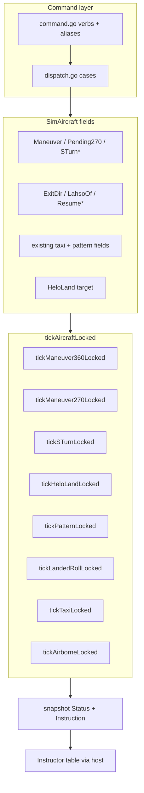
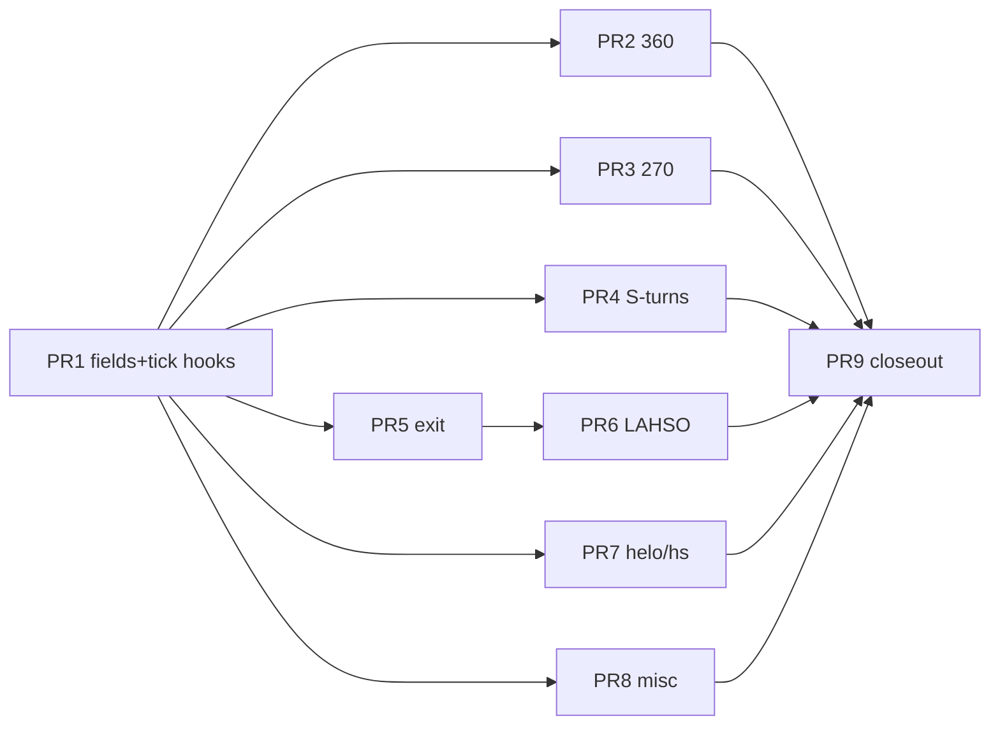

# openfsd Sweatbox — TWRTrainer Command Parity (P2)

| Field | Value |
|-------|--------|
| **Document** | Sweatbox TWRTrainer command parity (P2) |
| **Author** | _(design author / implementer)_ |
| **Date** | 2026-07-27 |
| **Status** | **Approved** (rev 3 — design review consensus; ready for implementation) |
| **Intended permanent home** | `docs/design/sweatbox-twr-parity-p2.md` |
| **Parent design** | `docs/design/sweatbox-integrated-simulator.md` (Status: Implemented, P0+P1) |
| **Target package** | `internal/sweatbox` (pure engine); minimal host/UI if any |
| **Reference (UX + sim only)** | `/Users/rnorris/scratch/openfsd-twrtrainer/` — findings 03/06, official `docs/website/docs/twrtrainer_command_ref.html`, `reconstructed/python_ref/commands.py` |

---

## Overview

openfsd already ships an in-process sweatbox simulator covering spawn, ground taxi/hold/CTO, air vectors, flight plans, and closed-traffic pattern flying (P0+P1). Instructors still lack a set of **pattern spacing**, **runway exit**, **helicopter present-position**, and **misc/debug** commands that TWRTrainer instructors rely on for realistic tower training density.

This design completes **command + motion parity** for the gap inventory against TWRTrainer’s catalog (`reconstructed/python_ref/commands.py`), entirely inside `internal/sweatbox` where possible. Control plane remains `POST /sweatbox/command` text (same as today). No multi-TCP pilot model, no radio-frequency command bridge, no protocol wire changes.

```text
Gap classes (source tags: official = command_ref.html; findings = binary/findings/python_ref):
  A  Pattern spacing: 360 / 270 / S-turns / LAHSO          [official]
  B  Dead verbs:      ctopp, land, hs (registered, no case) [official]
  C  Runway exit:     er/el + auto-exit after FS landing   [official]
  D  Misc/debug:      appmode, setairline, getcoords, moveto [findings-only]
  E  Polish:          status/instruction, cancel, coverage ≥95%
```

**Catalog completeness:** every verb in `python_ref/commands.py` is either already implemented (P0+P1) or planned here. There is no separate `stop` command; `DeleteArrivalsWhenParked` is an engine setting, not an instructor verb. Official debug HTML also documents `fhn` / `sln` (immediate heading / speed); openfsd already has `fhn`, and maps `sln`→`spd` (gradual)—changing `sln` to immediate is **out of P2 scope**.

---

## Background & Motivation

### Current state (code)

| Area | Location | Behavior today |
|------|----------|----------------|
| Verb registry | `command.go` `isAircraftVerb` / `normalizeVerb` | Lists `ctopp`, `land`, `hs`; **missing** P2 verbs (`ml3`, `er`, …) |
| Dispatch | `dispatch.go` `Engine.Command` | No cases for `ctopp`/`land`/`hs` → `"Invalid command: …"` |
| Tick switch | `motion.go` `tickAircraftLocked` | Explicit status cases; unknown → `default` → `tickAirborneLocked` (vector steering only) |
| Pattern motion | `pattern.go`, `motion.go` `tickPatternLocked` | Rectangular circuit; TG/SG/LA/FS at threshold; **no** 360/270/S-turns |
| Full-stop landing | `handlePatternThresholdLocked` FS branch | Caps speed at **40** kt; decelerates in place; **no** taxiway exit |
| Turnoff geometry | `pkg/twrfiles.Surface.TurnoffLeft` | Parsed/formatted; **unused** by sim |
| Taxi holds | `taxi.go` + `tickTaxiLocked` | Hold-shorts by waypoint index — reuse model for LAHSO release |
| Helicopter | `EngineHelicopter`, low rotate speed | CTO still runway-oriented; no present-position TO/land |
| Snapshots / UI | `snapshot.go`, `serviceapi.SweatboxAircraftJSON` | Generic `Status` + `Instruction` already flow to instructor table |
| Host wire | `internal/server/sweatbox_*.go` | Tick updates positions; no per-command host special cases needed for pure engine |

### Pain points

1. **Spacing tools missing** — instructors cannot create pattern separation (360, 270-to-next-leg, S-turns on final) without manual `fh`/`ext` juggling that loses pattern state.
2. **Landing roll dead-end** — full-stop arrivals freeze on the runway; ground scenarios require manual `taxi` from an unnatural “on runway mid-field” state.
3. **Dead verbs** — `ctopp`/`land`/`hs` appear in the aircraft-verb list (prefix targeting works) but always fail, which is worse than unknown commands.
4. **Helicopter training incomplete** — present-position TO/land is a core helo flow in TWRTrainer.
5. **Parent design already named P2** — `sweatbox-integrated-simulator.md` phased catalog: “P2 | Edge cases (`lahso`, s-turns, …)”.

### Authoritative sources (priority)

When findings conflict with the official HTML, **prefer the official command reference**:

1. `openfsd-twrtrainer/docs/website/docs/twrtrainer_command_ref.html` (**official**)
2. `docs/findings/03-COMMANDS.md`, `06-SIMULATION.md` (**findings**)
3. Status string table in `docs/findings/02-ARCHITECTURE.md`
4. openfsd parent design + existing `internal/sweatbox` patterns

**Important correction vs findings 03:** findings list `er`/`el` under pattern as “Extend right/left”. The official ref defines them as **exit runway right/left** overrides. This design implements **exit**, not leg-extend (extend remains `ext`).

**Standalone `hs`:** official ref: *“Cancels a previously issued position-and-hold instruction.”* Taxi sub-token `hs` in `taxi … hs …` already works via `parseTaxiArgs`.

**D-class source:** `appmode`, `setairline`, `getcoords`, `moveto` appear in findings 03 / python_ref / debug form paths but **not** in the official HTML command ref (debug section only has `fhn` / `sln`). They remain in scope for **findings-complete catalog parity** as instructor/debug tools (KD-9).

---

## Goals & Non-Goals

### Goals

1. Implement all gap commands tagged above (official A–C/B + findings-only D) with TWR-themed soft errors and status/instruction strings.
2. Integrate spacing maneuvers with existing pattern tick without breaking TG/SG/LA/FS, `ga`, `ext`, `tc`/`td`/`tb`, `msa`/`mna`.
3. Auto-exit after full-stop landing using runway `turnoff=` and `er`/`el` override.
4. LAHSO stop before a **crossing** runway intersection on the landing roll / post-touchdown path.
5. Helicopter `ctopp` / `land` with sensible motion.
6. Keep `internal/sweatbox` pure (stdlib + `internal/geo` + `pkg/twrfiles` only).
7. Maintain hard coverage floor **≥95%** on `internal/sweatbox`; race-clean tests.
8. Prefer **no host/protocol changes**; Status/Instruction already reach the UI.

### Non-Goals

- Multi-TCP pilot connections
- Radio-frequency instructor command bridge over `#TM`
- Full aero / weather / wake
- Multi-airport concurrent scenarios
- Voice simulation; recording/playback
- SPA instructor UI
- Changing `pkg/protocol` wire bytes
- Perfect binary-identical kinematics vs TWRTrainer (semantics + training usefulness)
- New service-HTTP routes (extend messages on existing `POST /sweatbox/command` only)
- Client-side command authority or new PE frameworks
- Changing `sln` from gradual (`spd` alias) to official immediate-speed debug semantics
- New instructor verbs beyond the python_ref catalog (e.g. no `stop` verb)

---

## Key Decisions

| # | Decision | Rationale |
|---|----------|-----------|
| **KD-1** | **Overlay maneuver state on `SimAircraft` fields**, temporarily set `Status` to TWR vocabulary (`Making 360`, `Making 270`, `Making s-turns`) while storing `ResumeStatus` for return after 360 / 270 | Matches instructor UI strings; preserves leg to resume; avoids inventing parallel UI columns |
| **KD-2** | **360 is heading-accumulation turn**, not a path orbit: integrate `turnRateDegPerSec` (existing 3°/s) L/R until accumulated ≥ 360°, then restore `ResumeHeading` + pattern/air targets | Simple, deterministic; training-visible duration ~120 s at standard rate |
| **KD-3** | **270 turns the long way onto the next-leg heading using the opposite of `patternTurnDir`.** On consume: `DesiredHeading = legHeading(next)`, `TurnDir = opposite(patternTurnDir)`, `Status = Making 270`. Rely on existing forced-direction `turnToward` long arc (optionally track `TurnAccumDeg` for UI/tests). End heading **equals** next leg heading without a corrective snap. | Same-direction 270° ends **180° off** the next leg (math below). Opposite-dir long arc is the training-useful interpretation of “270 instead of 90” that still rejoins the circuit. Official ref does not specify direction. |
| **KD-4** | **S-turns only on Final or OnApproach**; optional complete-turn count; cancel on threshold, `ga`, `fh` family, pattern re-entry | Official: “s-turns on final” |
| **KD-5** | **Runway exit is pure-engine post-FS behavior** using graph **waypoint-snap** intersections (~100 ft, same as taxi—not continuous line-line) + `Surface.TurnoffLeft` (reciprocal inverted); `er`/`el` set `ExitDir` | Turnoff already in `pkg/twrfiles`; reuses taxi path walker |
| **KD-6** | **LAHSO reuses hold-short kinematics** after FS: stop at snap intersection with named crossing runway; status `Holding Short` | Same `StatusHoldingShort` + `HoldShortOf`; `res`/`cross` release |
| **KD-7** | **Standalone `hs` cancels LUAW** (`pos`), not free-form hold-short | Official command ref |
| **KD-8** | **`ctopp`/`land` require `EngineHelicopter`** | Official ref |
| **KD-9** | **Misc commands are findings-only, still in P2**: `appmode` on Engine; `setairline` overrides callsign generator; `getcoords`/`moveto` Message / domain reposition | Catalog parity; cheap; no FSD side effects beyond next tick for `moveto` |
| **KD-10** | **No host/wire DTO expansion required** for instructor table | `serviceapi.SweatboxAircraftJSON` already carries Status/Instruction |
| **KD-11** | **Incremental PRs**; **PR 1 ships tick integration stubs** (`tickAircraftLocked` early maneuver branch + clear helpers), not fields-only | Prevents PR 2/3/4 each reinventing dispatch; 270 does not hard-depend on 360 semantics |
| **KD-12** | **Authoritative doc for er/el is official HTML (exit), not findings “extend”** | Avoid shipping wrong feature |
| **KD-13** | **S-turns final-only** (reject other legs) | Decided product default; no arm-on-downwind |
| **KD-14** | **On short-approach cut / `msa`: do not run a 270 turn; clear `Pending270`** | Short approach is not a square-pattern corner; leaving the flag latent would fire a 270 on a later circuit (e.g. after TG rejoin)—surprising UX. Clear is predictable. |
| **KD-15** | **Exit preferred-side miss → fallback other side** with Instruction noting actual exit; if none → stop on runway | Decided; removes open question |
| **KD-16** | **`appmode` is instructor context only in v1** (ops/snapshot + optional add default FS in approach mode); no student-visible radio change | Closes product ambiguity for implementers |
| **KD-17** | **Single shared `landingRollTargetKt = 45`** used by FS threshold cap and landed-roll target (replaces hard-coded 40 in FS branch) | One magic number aligned with findings 06 |
| **KD-18** | **`inPatternContext` + anchors independent of Status** | Maneuver statuses are not leg names; geometry keys off `LandingRunway` + traffic + `InPattern` |

### KD-3 math (why same-direction 270 fails)

For start heading \(H\) and traffic-side sign \(s \in \{+1,-1\}\) (left traffic \(s=-1\) if positive is right):

| Turn | End heading |
|------|-------------|
| Normal 90° traffic-side | \(H + 90s\) = next leg |
| Same-direction 270° | \(H + 270s = H - 90s\) = **opposite** of next leg (180° error) |
| Opposite-direction 270° | \(H - 270s = H + 90s\) = **next leg** ✓ |

Example: left traffic, upwind \(H=0\), next (crosswind) \(=270\):

- Left 90° → 270 (correct)
- Left 270° → 90 (wrong)
- **Right 270°** → 270 (correct long way)

Unit table (required tests):

| Traffic | startHdg | nextHdg | TurnDir for 270 | expected arc ≥ |
|---------|----------|---------|-----------------|----------------|
| L | 0 | 270 | TurnRight | 250° |
| L | 270 | 180 | TurnRight | 250° |
| R | 0 | 90 | TurnLeft | 250° |
| R | 90 | 180 | TurnLeft | 250° |

---

## Proposed Design

### Architecture



### Tick control flow (`tickAircraftLocked`) — mandatory

Today’s switch has no cases for new maneuver statuses; `default` only runs `tickAirborneLocked`, which steers to `DesiredHeading` and **does not** implement free 360 accumulation or S-turn phases. Implementers must **not** rely on `default`.

Exact order (after existing ClearedTakeoff→Takeoff promotion, before or integrated with the main switch):

```text
func tickAircraftLocked(ac, dtSec):
  // 0. Existing: ClearedTakeoff ground→Takeoff promotion

  // 1. Active air maneuvers — preempt pattern/airborne leg guidance
  if ac.Maneuver == "360L" || ac.Maneuver == "360R" || ac.Status == StatusMaking360:
      return tickManeuver360Locked(ac, dtSec)

  if ac.Maneuver == "270" || ac.Status == StatusMaking270:
      return tickManeuver270Locked(ac, dtSec)

  if ac.Maneuver == "STURN" || ac.Status == StatusMakingSTurns:
      return tickSTurnLocked(ac, dtSec)

  if ac.HeloLand:  // flag set by land command
      return tickHeloLandLocked(ac, dtSec)

  // 2. Existing status switch — ADD explicit cases for new statuses
  //    (defense in depth if Maneuver cleared but Status lag):
  switch ac.Status {
  case StatusParked: ...
  case StatusHolding, StatusHoldingShort, StatusHoldingInPosition: ...
  case StatusTaxiing: tickTaxiLocked
  case StatusTakeoff: tickTakeoffLocked
  case StatusDeparting, StatusAirborne, StatusOnApproach: tickAirborneLocked
  case StatusUpwind, StatusCrosswind, StatusDownwind, StatusBase, StatusFinal:
      tickPatternLocked
  case StatusLanded:
      // SG wait | hasTaxiPath taxi | else tickLandedRollLocked (NEW)
  case StatusMaking360, StatusMaking270, StatusMakingSTurns:
      // Should have been handled above; re-enter maneuver tick or clear
      return tickManeuver* / clearAirManeuverFields fallback
  default:
      tickAirborneLocked if moving/vectors
  }
```

**PR 1 requirement:** ship this early-branch skeleton with no-op or “clear unknown Maneuver” stubs so later PRs only fill tick bodies.

Pattern mermaid for airborne 360 eligibility: 360 tick runs for **any** status once `Maneuver` is set (pattern legs, Airborne, Departing, OnApproach, Takeoff airborne)—not only inside `tickPatternLocked`.

### Status vocabulary additions

```go
const (
    StatusMaking360    = "Making 360"
    StatusMaking270    = "Making 270"
    StatusMakingSTurns = "Making s-turns"
    // Existing StatusLanded / StatusHoldingShort used for exit + LAHSO
    // Helo land uses StatusOnApproach (no new status string)
)
```

Instruction examples:

| Situation | Instruction |
|-----------|-------------|
| 360 L | `Making left 360` |
| 270 executing | `Making 270` |
| S-turns | `Making s-turns` |
| LAHSO armed airborne | pattern/final instruction + `, LAHSO <rwy>` |
| LAHSO stopped | `Holding short of <rwy> (LAHSO)` |
| Landing roll exit | `Exiting runway <rwy> via <twy>` |
| Clear of runway | `Clear of runway <rwy>` |
| Exit fallback side | `Exiting runway <rwy> via <twy> (fallback)` |
| No exit found | `Landed runway <rwy> (no exit)` |
| ctopp | `Cleared for takeoff present position` (+ heading) |
| land PP | `Landing present position` |
| land @P | `Landing @P` |

### SimAircraft field additions

```go
// Pattern spacing maneuvers (P2)
ResumeStatus  string  // pattern leg (or airborne) to restore after 360; next leg after 270
ResumeHeading float64 // heading to resume after 360
Maneuver      string  // "", "360L", "360R", "270", "STURN"
TurnAccumDeg  float64 // degrees turned in current maneuver segment (tests/UI)
Pending270    bool    // m2 set; consumed at next normal pattern corner / tc-family

// S-turns
STurnDir      int     // TurnLeft / TurnRight initial
STurnRemain   int     // complete s-turns remaining; -1 = until final ends
STurnPhase    int     // 0 = first half, 1 = second half of a complete S
STurnBaseHdg  float64 // final/landing heading under the S

// Runway exit / LAHSO
ExitDir       string  // "", "L", "R" — instructor override; empty → apt turnoff
LahsoOf       string  // crossing runway name to hold short of after landing
ExitPlanned   bool    // true once auto-exit path installed this landing

// Helicopter land (P2)
HeloLand      bool    // true while executing land command
HeloLandPark  string  // parking name without @, or "" for present position
```

### Helpers (required)

```go
// inPatternLeg: unchanged — five circuit leg names only.

// inPatternContext: eligibility that includes active pattern work + maneuvers.
func inPatternContext(ac *SimAircraft) bool {
    if ac == nil { return false }
    if ac.InPattern || ac.inPatternLeg() { return true }
    switch ac.Status {
    case StatusMaking360, StatusMaking270, StatusMakingSTurns:
        return true
    }
    return false
}

// anchorsForAircraftLocked MUST remain independent of Status
// (uses LandingRunway / DepRunway + PatternTraffic + size only).
// Document and test: anchors work while Status is Making 360.

func oppositeTurnDir(dir int) int {
    if dir == TurnLeft { return TurnRight }
    if dir == TurnRight { return TurnLeft }
    return TurnShortest
}

func clearAirManeuverFields(ac *SimAircraft) {
    // Clears: Maneuver, TurnAccumDeg, ResumeStatus, ResumeHeading,
    // Pending270, STurn*, and if Status is Making* restore? caller sets Status.
    // Does NOT clear ExitDir, LahsoOf, ExitPlanned, HeloLand*.
}

func clearHeloLandFields(ac *SimAircraft) { HeloLand=false; HeloLandPark="" }
```

**Mandatory call sites for `clearAirManeuverFields`:**

| Handler / path | Also clear |
|----------------|------------|
| `cmdGoAroundLocked` | yes — first lines after requireAircraft |
| `cmdEnterPatternLocked` / `placeOnPatternLegLocked` | yes |
| `cmdFlyHeadingLocked` / `fph` (fh/fhn/tr/tl) | yes — Pending270 included (vector leaves pattern guidance) |
| Threshold TG/SG/LA/FS entry | yes (airborne maneuvers) |
| Starting a new 360 / S-turn | clear prior air maneuver (not ExitDir) |
| `del` | whole aircraft gone |

Clearing rules summary:

| Event | Clears air maneuvers | Clears ExitDir | Clears LahsoOf | Clears HeloLand |
|-------|----------------------|----------------|----------------|-----------------|
| `ml3`/`mr3` | prior 360/S-turn/270-active; not Pending270 unless policy: **keep Pending270** | no | no | yes if any |
| `m2` | active 360/S-turn/270 | no | no | — |
| `no270` | Pending270 only | no | no | — |
| `ga` | all air + Pending270 | no | **yes** | yes |
| pattern enter | all air + Pending270 | no | yes | yes |
| `fh` family | all air + Pending270 | no | no | yes |
| New `taxi` | — | no | no | — |
| `fs` / landing type | no | no | no | — |

### A. Pattern spacing maneuvers

#### A1. `ml3` / `mr3` (aliases `ml360` / `mr360`) — **official**

**Parse:** no args.

**Eligibility:** airborne-ish — pattern legs, `StatusOnApproach`, `StatusAirborne`, `StatusDeparting`, `StatusTakeoff` with `Alt > field+eps`. Reject ground: `"Not airborne."`

**Dispatch:**

```text
ResumeStatus  = current Status if inPatternLeg or air family else StatusAirborne
ResumeHeading = Heading
Maneuver      = "360L" | "360R"
TurnAccumDeg  = 0
Status        = StatusMaking360
InPattern     = keep prior InPattern (true if was pattern)
Instruction   = "Making left 360" | "Making right 360"
// Keep speed/alt targets; do not clear LandingType / PatternTraffic
```

**Tick (`tickManeuver360Locked`)** — entered via early branch for any status:

1. `TurnDir` = Left/Right from Maneuver
2. Each tick: free-turn rotate heading by `turnRateDegPerSec * dt` in that direction (do **not** chase DesiredHeading for completion); `TurnAccumDeg += step`
3. Advance position along current heading; honor DesiredAlt/DesiredSpeed if set (or hold alt)
4. When `TurnAccumDeg >= 360 - hdgEqualEpsDeg`:
   - Snap heading to `ResumeHeading`
   - `Status = ResumeStatus` (empty → `StatusAirborne`)
   - Re-seed `DesiredHeading = ResumeHeading`, pattern TurnDir if still InPattern
   - Clear maneuver fields; refresh Instruction

**Interactions:** second ml3/mr3 restarts; `ga` clears + go-around; `ext`/`tc` fail (not on leg status)—OK; pause freezes.

**Tests:** accumulation timing; mid-downwind resume InPattern; ground reject; tick works when Status was Airborne (not only pattern).

#### A2. `m2` / `m270` and `no270` — **official**

**Parse:** no args. Aliases: `m270`→`m2`.

**Eligibility:** `m2` requires `inPatternContext` or pattern leg (not merely Airborne without pattern): `"Not in the pattern."`  
`no270`: idempotent clear if aircraft exists.

**Dispatch:**

```text
m2:    Pending270 = true
       // Status stays on current leg; Instruction may stay formatPatternInstruction
       // Optional: append nothing until consume (latent flag)
no270: Pending270 = false
```

##### Pending270 state machine (precise)

**Latent phase:** `Pending270==true`, `Maneuver==""`, `Status` = current leg name.  
`tickPatternLocked` behaves normally until a **consume event**.

**Consume events** (must all call the same helper `begin270TurnLocked(ac, nextLeg)`):

| Event | Where | Behavior |
|-------|-------|----------|
| Auto corner `d <= patternCornerEpsM` | `tickPatternLocked` | **Consume** → `begin270TurnLocked` instead of `advancePatternLegLocked` |
| `tc` / `td` / `tb` | `cmdTurnPatternLegLocked` | **Consume** → branch **before** immediate Status=next |
| Short-approach cut downwind→final | `tickPatternLocked` ShortApproach branch | **No 270 turn** (KD-14); **`Pending270 = false`** then normal advance to Final |
| `msa` command | `cmdShortApproachLocked` | **`Pending270 = false`** when arming short approach (same KD-14 predictability) |

**`begin270TurnLocked(ac, next string)`** — do **not** call unmodified `advancePatternLegLocked`:

```text
a := anchorsForAircraftLocked(ac)
targetHdg := a.legHeading(next)
trafficDir := patternTurnDir(a.Traffic)

ac.Pending270     = false          // consumed
ac.Maneuver       = "270"
ac.TurnAccumDeg   = 0
ac.ResumeStatus   = next           // leg to enter when turn completes
ac.ResumeHeading  = targetHdg      // = DesiredHeading
ac.DesiredHeading = targetHdg
ac.HasDesiredHeading = true
ac.TurnDir        = oppositeTurnDir(trafficDir)  // KD-3
ac.ImmediateHeading = false
ac.Status         = StatusMaking270
ac.InPattern      = true
ac.ExtendLeg      = false
ac.Instruction    = "Making 270"
// Alt: set DesiredAlt for next leg (pattern alt, or final glideslope if next==Final)
```

**`tickManeuver270Locked`:**

```text
// Must NOT run tickPatternLocked leg-target rewrite (early branch guarantees this).
// Turn via existing turnToward(ac, DesiredHeading, TurnDir, dt)
// Accumulate |heading change| into TurnAccumDeg for tests
// Position along Heading; alt/speed as airborne/pattern rates
// When |headingDelta(Heading, DesiredHeading)| <= hdgEqualEpsDeg
//   AND TurnAccumDeg >= 250  (guards against accidental short arc):
//     Status = ResumeStatus (next leg)
//     clear Maneuver / TurnAccum / Resume*
//     TurnDir = patternTurnDir(traffic) for subsequent leg flying
//     if next == Final: seed final alt as advancePatternLegLocked would
//     Instruction = formatPatternInstruction(ac)
//     MidfieldReported reset if next == Downwind
```

**`cmdTurnPatternLegLocked` patch:**

```text
want := turnCommandTargetLeg(verb)
needCur := prevLeg(want)
if ac.Status != needCur { error }
if ac.Pending270 {
    return begin270TurnLocked(ac, want)  // soft OK
}
// else existing immediate advance to want
```

**`tickPatternLocked` corner / short-approach patch:**

```text
// Short approach cut (before or instead of normal corner):
if ac.ShortApproach && leg == StatusDownwind && !ac.ExtendLeg && pastMidfield {
    ac.Pending270 = false   // KD-14: clear latent flag — do not fire later
    e.advancePatternLegLocked(ac, a)  // forces Final via existing ShortApproach branch
    return
}

if !ac.ExtendLeg && d <= patternCornerEpsM {
    next := nextLeg(leg)
    if ac.Pending270 {
        begin270TurnLocked(ac, next)
    } else {
        advancePatternLegLocked(ac, a)
    }
}
```

**`cmdShortApproachLocked` (msa true):** also set `Pending270 = false` when enabling short approach.

**Tests:** unit table from KD-3; no270 before corner → normal 90°; m2 then fh clears Pending270; short approach does **not** start Making 270 **and** leaves `Pending270==false`; mid-270 pattern tick does not overwrite TurnDir.

#### A3. `mls` / `mrs` [n] (aliases `sturn`, `sturns` → `mls`) — **official**

**Eligibility:** **Final or OnApproach only** (KD-13). Else `"Not on final."`

**Parse:** optional positive int; invalid → example `"mls 3"`.

**Dispatch:**

```text
Maneuver = "STURN"
STurnDir = Left (mls) / Right (mrs)
STurnRemain = n or -1
STurnPhase = 0
STurnBaseHdg = anchors.LandingHdg (or current final heading)
Status = StatusMakingSTurns
InPattern = true if was
Instruction = "Making s-turns"
```

**Tick (`tickSTurnLocked`)** — early branch preempts `tickPatternLocked`, so **threshold detection must live here** (or a shared helper). Otherwise aircraft never land while `Maneuver=="STURN"` (including unlimited `STurnRemain==-1`).

```text
func tickSTurnLocked(ac, dtSec):
  a, err := anchorsForAircraftLocked(ac)
  if err != "" {
      // fall back to free airborne vectors
      return tickAirborneLocked(ac, dtSec)
  }

  // --- 1. Threshold / overshoot FIRST (shared with Final) ---
  // Same geometry as tickPatternLocked Final block:
  dThr := distToPoint(ac, a.Threshold)
  brgToThr := initialBearingDeg(ac.Lat, ac.Lon, a.Threshold.Lat, a.Threshold.Lon)
  past := abs(headingDelta(brgToThr, a.LandingHdg)) > 90 && dThr < a.SizeNM*metersPerNM
  near := dThr <= patternThreshEpsM
  if near || past {
      // Cancel S-turn, restore Final context for landing-type handler, then land.
      clearAirManeuverFields(ac)  // Maneuver, STurn*, TurnAccum; not ExitDir/LahsoOf
      ac.Status = StatusFinal
      ac.InPattern = true  // keep circuit context for TG/SG/LA defaulting
      // DesiredHeading may be off-final after S; threshold handler snaps placement
      return handlePatternThresholdLocked(ac, a, dtSec)
  }

  // --- 2. S-turn phases (only when still short of threshold) ---
  offset = sTurnOffsetDeg (30)
  phase 0: DesiredHeading = Base + dir*offset
  phase 1: DesiredHeading = Base - dir*offset
  TurnDir = toward phase target (forced)
  turnToward + integrate position on Heading
  Alt: continue approachAltitude(field, distNM) toward threshold (Final glideslope)
  on phase complete: flip phase; if phase wrapped 1→0: STurnRemain--
  if STurnRemain == 0:
      clear STURN maneuver fields only
      Status = StatusFinal  // or OnApproach if was approach
      DesiredHeading = STurnBaseHdg / LandingHdg
      Instruction = formatPatternInstruction
      // subsequent ticks enter tickPatternLocked Final path (early branch off)
  // STurnRemain < 0 (unlimited): keep phases until threshold step 1 fires
```

**Shared helper (recommended):** extract `finalThresholdArrival(ac, a) (nearOrPast bool)` used by both `tickPatternLocked` Final and `tickSTurnLocked` so geometry cannot drift.

**Important:** Counted S-turns that complete **before** threshold return to Final and land on a later tick via normal Final path. Unlimited S-turns land **only** via step 1 above (threshold cancels S-turn mid-maneuver). Neither path requires finishing the S-turn count first.

**Tests:**
- unlimited `mls` still lands (FS/TG/…) when near/past threshold; Status becomes Landed/Takeoff/etc., not stuck Making s-turns
- mid-S-turn at threshold cancels phases and runs TG/SG/LA/FS per LandingType
- `mls 1` completes one S then resumes Final track and can still land
- mrs initial right; ga clears; not on final rejects

#### A4. `lahso` runway — **official**

**Parse:** `lahso <rwy>` required.

**Soft errors:** missing rwy; unknown surface; same as landing runway; **no waypoint-snap intersection** between landing runway surface and LAHSO surface → `"Runways do not intersect."`

**Intersection model:** graph waypoint-snap (~100 ft / `DefaultIntersectionTolM`), **same as taxi**—not continuous segment-segment intersection. Apt files must have near-colocated vertices at crossings (TWR apt convention; KBTV `19/1`↔`33/15` covered in `airport_test.go`).

**Dispatch:** set `LahsoOf`; optionally leave LandingType; Instruction append `, LAHSO <name>`.

**Motion after FS:**

1. Touchdown as C3 (shared `landingRollTargetKt`).
2. Hold point = `FindIntersection(landingSurface, LahsoOf)`; choose pair on landing surface.
3. Along-track distance from aircraft to hold point using landing heading unit vector. If along-track < `−lahsoBehindEpsM` (already past) → stop ASAP, `StatusHoldingShort`, Instruction notes past intersection.
4. Else roll toward hold; stop when **along-track** remaining ≤ `lahsoArriveEpsM` (**25 m**, named constant—not `taxiArriveEpsM` 3 m).
5. `StatusHoldingShort`, `HoldShortOf = LahsoOf`, Instruction `"Holding short of <rwy> (LAHSO)"`.
6. `res` / `cross` reuse ground commands; then auto-exit may run if no taxi plan.

**Constants:**

```go
const (
    lahsoArriveEpsM  = 25.0 // along-track; larger than taxiArriveEpsM (3 m)
    lahsoBehindEpsM  = 15.0 // treat as past if along-track < -this
    landingRollTargetKt = 45.0 // FS cap + roll target (KD-17)
)
```

**Tests:** synthetic crossing runways; non-intersect error; overshoot past intersection; after hold `cross` works.

---

### B. Dead verbs with dispatch — **official**

#### B1. `ctopp` [hdg]

Helicopter only; groundOK statuses; present-position takeoff without DepRunway alignment.

```text
ClearedTakeoff = true; PositionHold = false; HoldShortOf = ""
optional DepHeading; PatternTraffic cleared
Status = StatusTakeoff; Instruction = "Cleared for takeoff present position" [...]
// tickTakeoffLocked existing path → Departing
```

Reject fixed-wing: `"ctopp is for helicopters only."`

#### B2. `land` [@parking] — full tick/status contract

**Eligibility:** `EngineHelicopter` only; must be airborne or at least `Alt > field` or Status in air family. Reject: `"land is for helicopters only."` / `"Not airborne."` as appropriate.

**No new Status string.** Reuse `StatusOnApproach` + `HeloLand` flag.

**Dispatch (`cmdLandLocked`):**

```text
clearAirManeuverFields(ac)
clear taxi path / pattern:
  InPattern = false
  LandingType = ""
  PatternTraffic = ""  // optional keep
  ExtendLeg / ShortApproach / SG* = false
  LandingRunway may clear or keep — clear for PP land

HeloLand = true
if args has @P or parking name:
  resolve parking surface; HeloLandPark = name
  Instruction = "Landing @" + name
else:
  HeloLandPark = ""
  Instruction = "Landing present position"

Status = StatusOnApproach
DesiredAlt = fieldElevFeet(airport)
HasDesiredAlt = true
DesiredSpeed = 0
HasDesiredSpeed = true
// optional: DesiredHeading = present or toward parking bearing
HasDesiredHeading = true if parking set (bearing to park), else false / fph
TurnDir = TurnShortest
ImmediateHeading = false
ClearedTakeoff = false
```

**Tick (`tickHeloLandLocked`)** — early branch when `HeloLand`:

```text
field := fieldElevFeet(apt)
// Speed toward 0 (or min 10 kt until near park then 0)
speedToward(ac, max(0, DesiredSpeed), dt)

if HeloLandPark != "":
  // steer toward parking coords
  park := graph.Surface(HeloLandPark).Points[0]
  brg := initialBearingDeg(ac, park)
  DesiredHeading = brg; turnToward(...)
  // move along heading
  if dist(ac, park) <= heloLandArriveM (15 m) && Alt <= field+altEqualEpsFt && Speed <= spdEqualEpsKt:
      snap to park; finishHeloLand → Parked
else:
  // present position: no lateral target
  // still move if Speed > 0 along heading while decelerating
  if Alt <= field+altEqualEpsFt && Speed <= spdEqualEpsKt:
      finishHeloLand → Parked at current lat/lon

// Altitude: climbTowardRate toward field (or gentle helo descent rate)
// finishHeloLand:
//   Status = StatusParked
//   Alt = field; Speed = 0
//   Parking / CurrentSurface = HeloLandPark or ""
//   Instruction = "Parked" / "Parked "+name
//   clearHeloLandFields; clear air Desired* optional keep
```

**Cancel (in-air only — `ctopp` is ground-only and is NOT a land abort):**

| Command | Effect while HeloLand |
|---------|----------------------|
| `fh` / `fhn` / `tr` / `tl` / `fph` | `clearHeloLandFields`; clear air maneuver; `Status=StatusAirborne`; apply vector as usual |
| `cm` / `spd` | `clearHeloLandFields`; stay/set `StatusAirborne` with alt/speed targets (leave lateral free or present heading) |
| `del` | remove aircraft |
| Second `land` | re-issue: restart land to new/@same target (refresh HeloLand fields) |
| `ctopp` | **soft-fail** (eligibility = groundOK); does not cancel airborne land |

**Tests:** airborne helo land PP → Parked same coords; land @parking moves; non-helo reject; mid-land fh cancels HeloLand → Airborne; ctopp while landing fails with ground eligibility error.

#### B3. `hs` (standalone) — **official**

**Official:** *Cancels a previously issued position-and-hold instruction.*

**Not** a free-form hold-short of an arbitrary surface (taxi sub-token `hs` remains only inside `taxi … hs …` via `parseTaxiArgs`).

**Dispatch (`cmdHSLocked`)** — inverse of `cmdPosLocked` ground recovery (not identical to `cmdCTOCLocked`):

```text
ac, err := requireAircraftLocked(target)
if Status != StatusHoldingInPosition && !PositionHold:
    return OK=false, Message: "Not holding in position."

// Cancel LUAW
PositionHold = false
ClearedTakeoff = false   // line-up cancel implies re-issue cto later (same as pos clearing cto on re-pos)
// Do not clear DepRunway / taxi plan / PatternTraffic

if hasTaxiPath():
    Status = StatusTaxiing
    Instruction = formatTaxiInstruction(from ac.TaxiSteps/Holds/Parking)
    // HoldShortOf already "" or leave; taxi tick resumes path
else if DepRunway != "":
    Status = StatusHoldingShort
    HoldShortOf = DepRunway
    Instruction = "Holding short of " + DepRunway
else:
    Status = StatusHolding
    HoldShortOf = ""
    Instruction = "Hold position"

return OK=true
```

**Contrast with `ctoc`:** `ctoc` requires `ClearedTakeoff` and may return from `StatusTakeoff` roll to hold-short. `hs` requires holding in position / PositionHold and never applies mid-takeoff-roll.

**Tests:**
- `pos` then `hs` → HoldingShort of DepRunway when DepRunway set and no taxi path
- `taxi …` then `pos` then `hs` → StatusTaxiing with path restored
- `hs` without pos → `"Not holding in position."`
- airborne / pattern → same not-holding error

---

### C. Runway exit after landing (`er` / `el` + auto-exit) — **official**

#### C1. Commands

`er` → `ExitDir="R"`; `el` → `ExitDir="L"`. Always OK if aircraft exists.

#### C2. Default turnoff

```go
func exitSideForLanding(s *Surface, landingEnd string) string {
    leftForA := s.TurnoffLeft // true → left for RwyA
    end := normalize landing end to RwyA or RwyB
    if end == s.RwyA {
        if leftForA { return "L" }
        return "R"
    }
    // RwyB: opposite of A
    if leftForA { return "R" }
    return "L"
}
// Instructor ExitDir overrides when non-empty.
```

#### C3. Full-stop + landed roll

**FS threshold** uses `landingRollTargetKt` (45) instead of hard-coded 40:

```text
ac.Speed = min(ac.Speed, landingRollTargetKt)
StatusLanded; InPattern=false; arr++; Instruction = "Landed runway X"
CurrentSurface = landing runway; clear air maneuvers
```

**`tickLandedRollLocked`** (when Landed, not SGWaiting, no taxi path yet):

```text
if LahsoOf != "" && not yet held → roll/stop for LAHSO
else if !ExitPlanned → planRunwayExitLocked(ac)
else if hasTaxiPath → should not be here (outer switch uses taxi)
else decelerate to 0 on runway
```

#### C4. `planRunwayExitLocked` — point-order contract

```go
// planRunwayExitLocked installs a short taxi path off the landing runway.
// Returns false if no candidate (caller leaves aircraft stopping on runway).
func (e *Engine) planRunwayExitLocked(ac *SimAircraft) bool
```

**Algorithm:**

1. **Resolve** landing surface + end via `resolveRunwaySurfaceLocked(ac.LandingRunway)` (same as pattern). If fail → return false.
2. **Side** = `ExitDir` if set, else `exitSideForLanding(s, end)`.
3. **Walk direction:** runway `Points` are ordered RwyA→RwyB (apt convention).  
   - Landing RwyA: walk indices `i = 0 .. n-1` (increasing).  
   - Landing RwyB: walk indices `i = n-1 .. 0` (decreasing).  
   Along-track positive direction = landing heading from `runwayThreshold`.
4. **Aircraft index:** `ClosestWaypoint` on runway; start search at that index going forward along walk direction.
5. **Candidates:** for each runway vertex at/after start, for each `Neighbors(runwayName)`:
   - Skip self, skip pure HOLD surfaces as exit destinations (HOLD may mark hold lines; exit target should be TAXIWAY or other RUNWAY only if needed—**prefer SurfaceTaxiway**).
   - `FindIntersection(runway, neighbor)` must succeed (waypoint-snap).
   - **Along-track** from aircraft to intersection point: require `along >= -exitBehindEpsM` (default 10 m)—slightly behind still allowed (tol), not far behind.
   - **Side classification:**  
     \(\vec{v}\) = unit vector along landing heading; \(\vec{w}\) = aircraft (or runway center) → exit point projected horizontally;  
     `cross = v_e*w_n - v_n*w_e` (east/north components);  
     left if cross > 0 (northern-hemisphere screen math: document using local ENU: east = sin(hdg), north = cos(hdg); left = positive cross of heading × to-point).
6. **Select:** nearest ahead (min along-track ≥ −ε) on **preferred side**. If none: nearest ahead **any side**, set `usedFallback=true` (KD-15). If none at all: Instruction `"Landed runway X (no exit)"`; `ExitPlanned=true` to avoid replan loop; return false.
7. **Path:** waypoints = `[ac position or snap, intersection on runway, stub point]`. Stub = from intersection along taxiway polyline ~`exitStubM` (60 m) away from runway (next vertex direction that increases distance to runway centerline).
8. Install `TaxiWaypoints`, `TaxiWPIndex=0`, `Status=StatusTaxiing`, `ExitPlanned=true`, Instruction `"Exiting runway X via Y"` or with `(fallback)`.

**Instructor taxi during roll:** if `hasTaxiPath()` already, never call planner (outer Landed branch uses taxi tick).

**Clear of runway:** when taxi path finishes or distance to runway > `clearRunwayM` (40 m): Instruction `"Clear of runway X"`; Speed 0; Status Holding unless more path. Honor `NoStop` if further taxi queued.

**Fixture requirements for tests:**

- Synthetic runway ≥4 points, taxiway left-only and right-only neighbors at distinct vertices.
- Landing A and B both tested for walk direction.
- KBTV smoke optional (geometry denser; synthetic is source of truth for side logic).

---

### D. Misc / debug — **findings-only**

#### D1. `appmode` approach|tower

Global verb. Engine `appMode` default `"tower"`. Invalid arg → usage error.

**v1 behavior (KD-16):** store flag; include in `ops` message and optional `EngineSnapshot.AppMode`. In `approach` mode only: new `add` on approach form defaults `LandingType=FS` if empty. No student radio change.

#### D2. `setairline` [prefix]

Global. Engine `airlineOverride`; empty arg clears. Affects `generateCallsignLocked` jet/turbo prefix list (override single prefix).

#### D3. `getcoords`

Aircraft-scoped. `Message: "<CS>: <lat> <lon>"` at 6 decimal places. No state change.

#### D4. `moveto` lat lon [alt] [hdg]

Aircraft-scoped debug. Validate finite ranges. Clear taxi path + `clearAirManeuverFields` + `clearHeloLandFields`. If alt > field+50 → `StatusAirborne`, `InPattern=false`; else keep ground-compatible status, update coords. Host needs no special API (next Tick positions).

---

### E. Behavioral polish matrix

| Existing cmd | vs 360 | vs 270 pending/active | vs S-turn | vs Exit/LAHSO | vs HeloLand |
|--------------|--------|------------------------|-----------|---------------|-------------|
| `ga` | clearAirManeuver + go around | clear | clear | clear LahsoOf | clear |
| `fh`/`tr`/`tl`/`fph` | clearAirManeuver | clear Pending270 + active | clear | keep exit/lahso | clear → Airborne vectors |
| `ext` | fail (not on leg) | keep latent Pending270 | fail | — | — |
| `tc`/`td`/`tb` | fail if not on leg | **begin270** if pending | fail | — | — |
| `msa` / short-approach cut | — | **clear Pending270** (no 270 turn) | — | — | — |
| threshold (Final or STURN tick) | clear then land | — | **clear STURN then `handlePatternThresholdLocked`** | LAHSO if FS | — |
| `tg`/`sg`/`la`/`fs` | keep until threshold | keep | keep | LAHSO if FS | — |
| pattern enter | clearAirManeuver | clear | clear | clear lahso | clear |
| `res`/`cross` | — | — | — | release LAHSO hold | — |
| `pause` | freeze | freeze | freeze | freeze | freeze |
| `ctopp` | — | — | — | — | **no** (ground-only; soft-fail in air) |

---

## API / Interface Changes

### Instructor text API (unchanged transport)

```text
POST /sweatbox/command  { "callsign": "…", "command": "ml3" }
→ { "ok": true, "message": "" }
→ { "ok": true, "message": "N12345: 44.471234 -73.150000" }  // getcoords
→ { "ok": false, "message": "…" }
```

### Verb registration deltas (`command.go`)

```go
// isAircraftVerb additions:
"ml3", "mr3", "m2", "no270", "mls", "mrs",
"lahso", "er", "el",
// already present: "ctopp", "land", "hs"
"getcoords", "moveto",

// isGlobalVerb additions:
"appmode", "setairline",

// normalizeVerb:
"ml360" → "ml3"
"mr360" → "mr3"
"m270" → "m2"
"sturn", "sturns" → "mls"
```

### Snapshot

UI does not require new JSON fields. Optional internal AircraftSnapshot fields for tests: `Pending270`, `ExitDir`, `LahsoOf`, `HeloLand`. Optional `EngineSnapshot.AppMode`.

### Host / serviceapi

**No required changes.**

---

## Data Model Changes

### Runtime only

No SQLite migrations. No `.apt` / `.air` format changes.

### Constants

```go
const (
    sTurnOffsetDeg        = 30.0
    landingRollTargetKt   = 45.0 // KD-17: FS threshold + roll
    exitStubM             = 60.0
    clearRunwayM          = 40.0
    exitBehindEpsM        = 10.0
    lahsoArriveEpsM       = 25.0
    lahsoBehindEpsM       = 15.0
    heloLandArriveM       = 15.0
)
```

---

## Alternatives Considered

### 1. Status stays on pattern leg; maneuver only in Instruction

- **Pros:** simpler resume; `inPatternLeg()` unchanged  
- **Cons:** Status column never shows TWR `Making 360` vocabulary  
- **Rejected** — KD-1 with ResumeStatus

### 2. Same-direction 270° then snap heading to next leg

- **Pros:** “true” 270° in traffic direction  
- **Cons:** requires artificial snap; mid-turn heading does not point at next leg; more complex tests  
- **Rejected** in favor of KD-3 opposite-dir long arc onto next heading (no snap)

### 3. Multi-TCP / external TWRTrainer for missing commands

- **Rejected** — parent design forbids multi-TCP

### 4. Host-side scripting of 360 via repeated `fh`

- **Rejected** — fragile, not pause-safe

### 5. Full curved taxi geometry for exits

- **Rejected** — polyline stub sufficient

### 6. Defer findings-only misc (D-class)

- **Rejected as exclusion** — still ship in PR 8; tagged findings-only for product awareness

---

## Security & Privacy Considerations

| Threat | Mitigation |
|--------|------------|
| Instructor command abuse | Existing admin-only service JWT + web CSRF; no new routes |
| `moveto` teleport abuse | Admin-only control plane |
| Resource exhaustion | MaxAircraft + O(1) maneuver state per AC; exit planner finite vertices |
| Import graph violation | All code in `internal/sweatbox` |

No new PII.

---

## Observability

| Signal | Approach |
|--------|----------|
| Soft command errors | `CommandResult.Message` → UI flash |
| Geometry failures | Soft instructor messages; **no panic**; engine silent (no slog required) |
| Ops | FS increments arr once at threshold; unpaused elapsed unchanged |
| Debug | `getcoords`; Status column for maneuvers |

---

## Rollout Plan

1. Land pure-engine PRs (sweatbox already gated by `SWEATBOX_ENABLED`).
2. Each PR: `go test -race ./internal/sweatbox/...`, coverage floors, hygiene, import graph.
3. PR 5 geometry may need extra synthetic fixtures to hold ≥95%—budget time; do not weaken floor.
4. Optional e2e smoke in PR 9.
5. Rollback: revert PR(s); no DB migration.

---

## Risks

| Risk | Severity | Mitigation |
|------|----------|------------|
| Exit side ENU cross sign inverted | Med | Synthetic left/right fixtures with known headings; visual KBTV smoke |
| LAHSO overshoot at 45 kt / 1 Hz | Med | `lahsoArriveEpsM=25` + along-track stop; overshoot test |
| Coverage dip on exit planner | Med | Table-driven synthetic apts; note PR 5 size in plan |
| `hs` vs taxi `hs` confusion | Low | Document; different parse path |
| Helo land vs pattern Final | Low | land clears InPattern / HeloLand flag |
| Implementer uses default tick for Making* | **High if ignored** | PR 1 mandatory early branch (Issue 2) |

---

## Open Questions

Only residual product questions (decided items promoted to KDs 13–17):

1. **Should `/sweatbox` MPA gain a static collapsible command cheatsheet for P2?** Optional UX; non-blocking for engine. Default: skip unless product asks in PR 9.
2. **Should `setairline` accept multi-prefix CSV or single token only?** Default: **single token** (one airline code); clear with bare `setairline`.

---

## Feature specifications (implementation checklist)

### Shared prerequisites (PR 1)

- [ ] Status constants + fields on `SimAircraft` + HeloLand*
- [ ] `clearAirManeuverFields` / `clearHeloLandFields` / `inPatternContext` / `oppositeTurnDir`
- [ ] `tickAircraftLocked` early maneuver + HeloLand branches (stubs OK)
- [ ] Explicit switch cases for Making* statuses
- [ ] `landingRollTargetKt` constant; FS branch uses it (even before exit PR)
- [ ] Snapshot copy if fields exported
- [ ] Verb registration may wait until feature PRs (or register unused—prefer register with feature)

### Per-command

| Command | Source | Parse/aliases | Fields | Tick path | Tests | Host |
|---------|--------|---------------|--------|-----------|-------|------|
| ml3/mr3 | official | ml360/mr360 | Maneuver 360* | tickManeuver360Locked | yes | no |
| m2/no270 | official | m270 | Pending270 / 270 | begin270 + tickManeuver270 | yes | no |
| mls/mrs | official | sturn(s) | STurn* | tickSTurnLocked (threshold-first → handlePatternThreshold) | yes | no |
| lahso | official | rwy | LahsoOf | landed roll | yes | no |
| er/el | official | — | ExitDir | plan on FS | yes | no |
| auto-exit | official semantics | — | ExitPlanned | planRunwayExitLocked | yes | no |
| ctopp | official | [hdg] | CTO flags | tickTakeoffLocked | yes | no |
| land | official | [@pk] | HeloLand* | tickHeloLandLocked | yes | no |
| hs | official | — | clear pos | none | yes | no |
| appmode | findings | approach\|tower | engine.appMode | none | yes | no |
| setairline | findings | prefix | airlineOverride | none | yes | no |
| getcoords | findings | — | Message | none | yes | no |
| moveto | findings | lat lon… | pos | none | yes | no |

---

## References

- Parent: `docs/design/sweatbox-integrated-simulator.md`
- Engine: `internal/sweatbox/{command,dispatch,motion,pattern,aircraft,taxi,airport,engine,snapshot}.go`
- Tick switch today: `motion.go` `tickAircraftLocked` (explicit cases + default airborne)
- Apt turnoff: `pkg/twrfiles.Surface.TurnoffLeft`
- TWR command ref (official): ctopp, land, hs, er, el, lahso, ml3, mr3, m2, no270, mls, mrs
- TWR findings: 02 status strings; 03 catalog; 06 landing ~45 kt + turnoff exit
- Intersections: `Graph.FindIntersection` waypoint-snap ~100 ft (not line-line)
- Agents.md: sweatbox pure; coverage ≥95%

---

## PR Plan

Each PR: `go test -race ./internal/sweatbox/...` green; coverage floor ≥95%. PR 5 may be large—synthetic fixtures first.

---

### PR 1 — Fields, helpers, tick integration points (not fields-only)

- **Title:** `sweatbox: P2 fields, clear helpers, and tickAircraftLocked maneuver hooks`
- **Files:** `aircraft.go`, `snapshot.go`, `motion.go` (early branch + Making* cases + FS uses `landingRollTargetKt`), new `maneuver.go` stubs (`tickManeuver360Locked` etc. return false / no-op until filled), helpers tests
- **Dependencies:** none
- **Description:** Ship SimAircraft fields, status constants, `clearAirManeuverFields`, `inPatternContext`, `oppositeTurnDir`, **mandatory** early `tickAircraftLocked` routing so PR 2–4/7 only fill bodies. Align FS speed cap to 45 kt constant. No new instructor commands required in this PR (optional).

---

### PR 2 — 360 maneuvers (`ml3` / `mr3`)

- **Title:** `sweatbox: pattern spacing 360 left/right (ml3/mr3)`
- **Files:** `command.go`, dispatch, `maneuver.go` 360 body, tests
- **Dependencies:** PR 1
- **Description:** Aliases, eligibility, free-turn accumulation, resume, clear on ga/fh via shared helper.

---

### PR 3 — 270 pattern turns (`m2` / `m270` / `no270`)

- **Title:** `sweatbox: pending 270-to-next-leg opposite long arc (m2/no270)`
- **Files:** dispatch, `pattern.go` / `cmdTurnPatternLegLocked`, `tickPatternLocked` corner, `tickManeuver270Locked`, KD-3 unit table
- **Dependencies:** **PR 1 hard** (tick hook + oppositeTurnDir). Does **not** require PR 2 (360) semantics.
- **Description:** Latent Pending270; `begin270TurnLocked`; opposite patternTurnDir; short-approach / `msa` **clears** Pending270 without 270 turn (KD-14); never call unmodified `advancePatternLegLocked` while pending.

---

### PR 4 — S-turns on final (`mls` / `mrs`)

- **Title:** `sweatbox: S-turns on final (mls/mrs)`
- **Files:** command aliases, dispatch, `tickSTurnLocked` (**with threshold-first** + shared `finalThresholdArrival` helper), tests
- **Dependencies:** **PR 1 hard**. PR 2 not required (shares tick hook only).
- **Description:** Final/OnApproach only; optional count; ±30° phases. **Must** detect near/past threshold inside `tickSTurnLocked` and call `handlePatternThresholdLocked` so unlimited S-turns still land.

---

### PR 5 — Runway exit after landing (`er`/`el` + auto-exit)

- **Title:** `sweatbox: landing roll runway exit (er/el + turnoff)`
- **Files:** new `exit.go` (`planRunwayExitLocked` full contract), `motion.go` landed roll, command er/el, synthetic two-side fixtures, tests
- **Dependencies:** PR 1 (Landed roll split + speed constant)
- **Description:** Point-order walk by landing end; side via ENU cross; fallback other side; clear-of-runway; instructor taxi wins. Coverage-heavy—budget fixtures. Intersections = waypoint-snap only.

---

### PR 6 — LAHSO

- **Title:** `sweatbox: land and hold short (lahso)`
- **Files:** dispatch, landed-roll LAHSO branch, `lahsoArriveEpsM` along-track, tests
- **Dependencies:** PR 5 (shared landing-roll pipeline)
- **Description:** Crossing runway snap intersection; Holding Short; res/cross release.

---

### PR 7 — Helicopter `ctopp`/`land` + standalone `hs`

- **Title:** `sweatbox: helicopter ctopp/land and cancel LUAW (hs)`
- **Files:** dispatch, `tickHeloLandLocked` (PR 1 stub filled), command, tests
- **Dependencies:** PR 1
- **Description:** Full B2 land contract (cancel = fh/cm/del/re-land only, not ctopp); ctopp present-pos TO (groundOK); full B3 `hs` state machine (taxi resume / hold-short DepRunway / Holding). Soft-merge with PR 8 OK if bandwidth constrained.

---

### PR 8 — Misc `appmode` / `setairline` / `getcoords` / `moveto`

- **Title:** `sweatbox: findings-only appmode, setairline, getcoords, moveto`
- **Files:** command global verbs, engine generateCallsign override, dispatch, tests
- **Dependencies:** PR 1
- **Description:** Tagged findings-only in comments; getcoords Message format stable.

---

### PR 9 — E2E smoke + docs closeout

- **Title:** `sweatbox: P2 parity closeout (e2e smoke + design status)`
- **Files:** optional `e2e_sweatbox_test.go`, parent design P2 status note, this design Status → Implemented; optional non-blocking cheatsheet
- **Dependencies:** PR 2–8 (all feature PRs)
- **Description:** Light service-HTTP smoke (e.g. ml3 → state Status Making 360). No protocol changes.

---

### Dependency graph



PR 2, 3, 4, 5, 7, 8 are parallel after PR 1. PR 6 after 5. PR 9 last.
