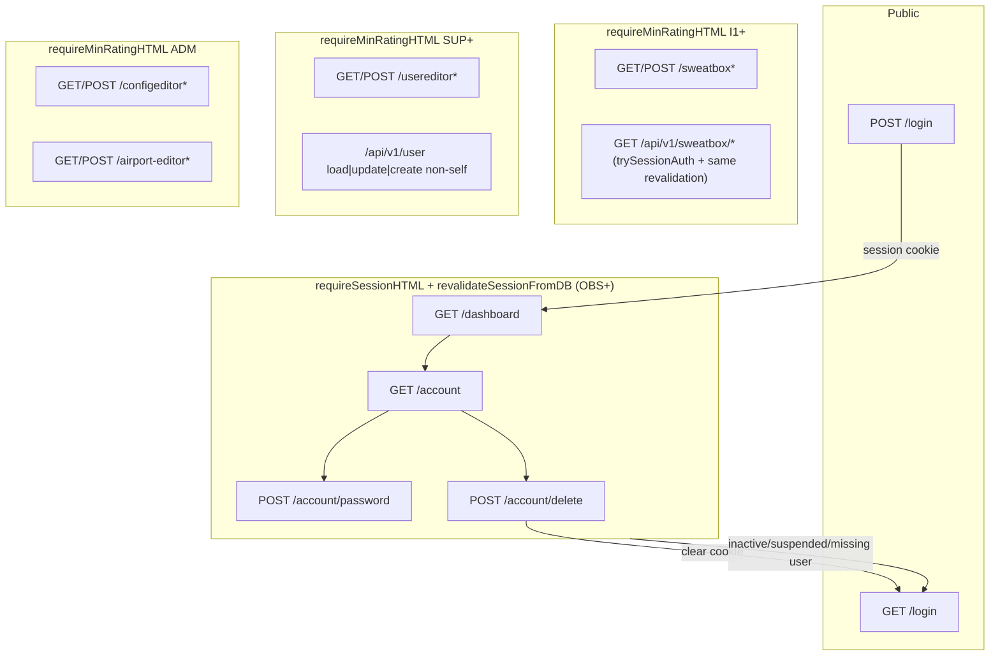

# Web UI Dashboard Revamp & Account Self-Service

| Field | Value |
|-------|-------|
| **Status** | Draft (revision 3 — dual-accept session revalidation + required claims overlay) |
| **Author** | (implementation owner) |
| **Date** | 2026-07-27 |
| **Audience** | Senior engineers working in `internal/web`, `internal/db`, `pkg/protocol` |
| **Related** | `docs/enumerations.md`, `Agents.md` §6 boring-web, `~/.grok/skills/boring-web/` |

---

## Overview

openfsd’s web UI today is an **operator console** that happens to live behind a login: the dashboard is a live map/connection list with links that appear only for elevated ratings, sweatbox and airport tools are **Administrator-only**, and the user editor is reachable by **Instructor1+** (with full create/name/password limited to Supervisor+). There is **no self-service account surface** — normal OBS/S1/… pilots who can log in cannot change their password or close their account from the UI.

This design turns the authenticated web app into a **proper user dashboard for every signed-in certificate**, adds **change-password** and **soft-delete account** self-service (hard-delete optional via config), realigns tool authz (**Sweatbox → I1+**, **User editor → SUP+**), and fixes the user-editor bug where create/edit pilot-rating selects only offer **P0** when the actor’s own pilot rating is P0.

Soft-delete (and live demotion) is made **operationally real** by revalidating the certificate against the database on **every session-cookie authentication path** — HTML (`requireSessionHTML`) and dual-accept API (`trySessionAuth`) — plus token refresh. After a successful DB load, **in-memory claims are overlaid from the DB** (rating + names) before handlers run, so ceilings and nav flags cannot use stale JWT fields. The only residual window is **Bearer access tokens** (15m TTL).

All UI work stays within the **boring progressive-enhancement** house standard: server-rendered MPA, forms + redirect-after-POST, CSRF on mutations, no SPA/client router/global store. `internal/web` continues to talk to FSD only via service HTTP + `serviceapi` DTOs (no new import edges into `server`/`session`/`postoffice`/`sweatbox`).

---

## Background & Motivation

### Current state (code as of design)

| Surface | Path / gate | Notes |
|---------|-------------|--------|
| Landing | `GET /` | Public; “Go to dashboard” if session present (`handleFrontendLanding`) |
| Login | `GET|POST /login` | Form CSRF; rejects `network_rating ≤ Suspended(0)` (`frontend.go`) |
| Dashboard | `GET /dashboard` | Any session (`requireSessionHTML`); connection summary + Leaflet PE |
| User editor | `GET/POST /usereditor*` | **I1+** route group (`routes.go` L123–127); create/full profile **SUP+** in handlers |
| Config | `GET/POST /configeditor*` | **ADM** |
| Sweatbox | `GET/POST /sweatbox*` | **ADM** (same `admin` group as config) |
| Airport editor | `GET/POST /airport-editor*` | **ADM** |
| JSON user API | `/api/v1/user/*` | Bearer or session+CSRF; I1+ for non-self load / rating update |
| Kick | `POST /api/v1/fsdconn/kickuser` | **SUP+** (`fsdconn.go` — unchanged by this design) |
| Session gate | `requireSessionHTML` | Parses session JWT only; **no DB reload** of user rating |
| Template keys | `pageTemplateKeys` in `templates.go` | Explicit allowlist; unknown keys → `writeTemplate` 500 |

Privilege helpers live in `internal/web/user_authz.go` and `pageUserFromClaims` (`pagemodel.go`):

- `canAccessUserEditor` / `CanEditUsers` → `NetworkRatingInstructor1` (8)
- `canFullMutateUsers` → `NetworkRatingSupervisor` (11)
- `CanEditConfig` → `NetworkRatingAdministator` (12) — **also gates Sweatbox nav links** in `layout.html` / `dashboard.html`

Network ratings (`pkg/protocol/types.go`, `docs/enumerations.md`):

| Value | Name | Login allowed? |
|------:|------|----------------|
| −1 | Inactive | No (`≤ Suspended`) |
| 0 | Suspended | No |
| 1…12 | OBS … ADM | Yes |

FSD TCP login (`internal/server/conn.go`) rejects requested rating `< OBS` with certificate suspended/inactive, and rejects password login when requested rating exceeds the certificate’s stored rating. Soft-deleting via **Inactive (−1)** therefore already blocks **new** web sessions, FSD JWT mint (`auth.go` `getFsdJwt` / `getAccessRefreshTokens`), and practical FSD password logons. **Existing session cookies are not revoked today** — this design closes that gap (KD-9 / session revalidation).

### Pain points

1. **Dashboard is not a user home** — no account/profile self-service; tool links are jammed into the welcome footer and only for admins.
2. **No change-password for self** — operators must use the user editor (SUP+) or touch the DB.
3. **No account off-boarding** — no soft-delete path for end users; `UserRepository` has no delete method; soft-setting Inactive via user editor leaves the victim’s session JWT live until TTL.
4. **Authz mismatch with product intent** — instructors cannot run sweatbox (ADM-only); instructors *can* open the user directory (product wants SUP+ only).
5. **Pilot rating select bug** — create/edit options are built with `pilotRatingOptionsUpTo(actorPilotRatingCeiling(actorCID), …)`. `actorPilotRatingCeiling` loads the actor’s **own** `users.pilot_rating`. Most ADM/SUP certs are P0 → select only contains P0. Server POST also rejects `pilotRating > actorPilotMax` (`pages_user.go` create/update, `user.go` JSON API).

### Constraints (non-negotiable)

- Boring PE web (`Agents.md` §6); no Playwright/Cypress.
- Import graph: web ↛ server/session/postoffice/metar/sweatbox.
- Single binary `cmd/openfsd`; web config via env on `web.ServerConfig`.
- Prefer PE route tests in `internal/web` (`pe_test.go`, `pe_admin_test.go` patterns).

---

## Goals & Non-Goals

### Goals

1. **User dashboard for all authenticated users** (any rating that can hold a session: OBS+).
2. **Self-service change password** (must supply current password).
3. **Self-service delete account** — **soft-delete default** (`network_rating = Inactive`); optional **hard-delete** behind config default **false**; both require **current password** + CID confirm.
4. **Effective soft-delete / demotion for live sessions** — shared DB revalidation on `requireSessionHTML` **and** `trySessionAuth` (session dual-accept); overlay claims from DB; reject inactive/suspended (HTML: clear cookie → login; API: 401).
5. **Authz realignment:**
   - Sweatbox HTML + PE JSON proxies: **I1+**
   - User editor HTML + non-self user JSON: **SUP+**
6. **Fix pilot rating options** so SUP+ editors can select the full official pilot scale (P0…FE).
7. **Navigation** consistent with existing `layout.html` + `theme.css` / `theme.js` chrome.
8. **PE tests** covering new forms, authz gates, soft/hard delete, session revalidation, and pilot-rating fix.

### Non-Goals

- SPA dashboard, WebSocket map, or client-side routing.
- Email verification, OAuth, or multi-factor auth.
- Full server-side session store / password-epoch column (stateless residual: **Bearer access** 15m after password change / soft-delete; session cookies revalidate from DB on every use — see KD-9).
- Letting users edit their own network/pilot ratings from the account page.
- Moving airport editor or config editor off Administrator.
- Restoring I1 “rating-only” user directory after the SUP+ gate (explicit product change).
- Cross-user admin hard-delete UI (SUP can already set Inactive via user editor; hard-delete is self-service only when enabled).
- Web-layer rate limiting infrastructure (document as follow-up; FSD already rate-limits TCP auth).
- Changing kick authz (remains SUP+).

---

## Key Decisions

| ID | Decision | Rationale |
|----|----------|-----------|
| **KD-1** | Soft-delete = set `users.network_rating = protocol.NetworkRatingInactive` (−1) | Already in schema; login paths already reject `≤ Suspended`; FSD cannot usefully log in with max rating −1; reversible by SUP setting a positive rating; no migration required. |
| **KD-2** | Hard-delete is **opt-in** via web env `ALLOW_PERMANENT_ACCOUNT_DELETE` (default `false`); only **self-service** | Matches product; avoids accidental irreversible deletes; operators can soft-disable others via user editor. Env lives on web `ServerConfig` (same bool/envconfig style as `COOKIE_SECURE`; FSD’s `SWEATBOX_ENABLED` is the parallel pattern on the FSD process, not web). |
| **KD-3** | Account self-service lives at **`/account`** (GET + POST actions), linked from dashboard + primary nav | Keeps `/dashboard` focused on network situational awareness; forms get a clean page without overloading the map template; PE-friendly. |
| **KD-4** | User editor route + API non-self access raised to **SUP+**; remove I1 rating-only editor access | Product requirement; simplifies authz matrix; I1 gains sweatbox instead. |
| **KD-5** | Sweatbox HTML + `/api/v1/sweatbox/*` min rating **I1+**; airport editor & config remain **ADM** | Product only moves sweatbox; airport editor is a separate heavy tool and stays admin. |
| **KD-6** | SUP+ user create/update may assign **any official pilot rating** (`PilotRatingScale` through FE); drop actor pilot-rating ceiling for editors | Root cause of P0-only bug; pilot rating is a certificate attribute admins grant, not something bounded by the operator’s own flying quals. Network rating ceiling (≤ actor) **retained**. |
| **KD-7** | After successful password change: re-hash, **always re-issue session with `rememberMe=false`** (`sessionDefaultTTL` = 24h), and **rotate CSRF** via `clearCSRFCookie` + `issueCSRFToken` (same pattern as successful login in `frontend.go`) | Password change is a security event; remember-me is **not** preserved. Other devices with unexpired session JWTs remain until TTL or until DB revalidation fails for inactive users (not applicable to password-only change). |
| **KD-8** | After account delete (soft or hard): verify **current password** + CID confirm; **clear session + CSRF**, 303 to `/login?account=deleted` with a **required** login info banner | Destructive action needs step-up beyond CSRF/CID; user must not retain an authenticated cookie; PRG flash must be visible. |
| **KD-9** | **In-scope:** shared session revalidation helper used by **`requireSessionHTML` and `trySessionAuth`**: load user by CID; if missing or `network_rating ≤ Suspended`, reject (HTML: clear session+CSRF → 303 `/login`; session API: return false → 401 unauthorized). On success, **required claims overlay** from DB (`NetworkRating`, `FirstName`, `LastName`) before `setJwtContext`. Also reject inactive/suspended on login, FSD JWT mint, and **refresh**. | Soft-delete and demotion must revoke **session-cookie** HTML **and** PE/JSON dual-accept immediately (session cookies are 24h/30d, not 15m). Handlers and `requireMinRatingHTML` keep reading `claims.NetworkRating` safely only because overlay is mandatory. **True residual only:** Bearer **access** tokens until 15m expiry (Bearer path does not use session revalidation). |
| **KD-10** | Nav flags: `CanAccessSweatbox` (I1+) vs `CanEditConfig` (ADM) vs `CanEditUsers` (SUP+). Drop page-level `CanAdjustRatings` as a distinct capability; keep target-level `canFullMutateTarget` for profile locks inside the editor. | Today sweatbox incorrectly shares `CanEditConfig`. After KD-4, I1 rating-only is gone; three SUP-threshold helpers collapse to two page flags + one target check. |
| **KD-11** | Shared `validateNewPassword(pw string) error` for account + user-editor create/update (HTML). New ≠ current is **required** on self change-password. | Prevents rule drift (≥8, no `:`) between surfaces. |
| **KD-12** | Register `"account"` in `pageTemplateKeys` (`templates.go`) | `writeTemplate` 500s on unknown keys; implementers must not omit this. |

---

## Proposed Design

### Architecture (request flow)



### Session revalidation (normative — KD-9)

**Today:**

| Path | Behavior |
|------|----------|
| `requireSessionHTML` | `parseSessionCookie` only → claims frozen at login |
| `trySessionAuth` (dual-accept for `/api/v1/*`) | Same cookie parse; **no DB check** — session cookies last 24h/30d |
| `tryBearerAuth` | Access JWT only (15m TTL); no DB check |

**Problem if only HTML is revalidated:** soft-deleted users lose `/dashboard` but PE/JSON with the same session cookie (sweatbox poll, user load/update, config) keeps working with elevated frozen claims until session TTL.

#### Shared helper (required)

Introduce one helper used by **both** HTML and session dual-accept (names illustrative):

```go
// revalidateSessionClaims parses is done by caller; this loads DB and overlays.
// Returns overlaid claims + user, or errSessionInactive / errSessionUserMissing.
func (s *Server) revalidateSessionFromDB(claims *auth.CustomClaims) (*auth.CustomClaims, *db.User, error) {
    user, err := s.dbRepo.UserRepo.GetUserByCID(claims.CID)
    if err != nil {
        return nil, nil, errSessionUserMissing // wrap sql.ErrNoRows
    }
    if user.NetworkRating <= int(protocol.NetworkRatingSuspended) {
        return nil, nil, errSessionInactive
    }
    // REQUIRED claims overlay — not optional. Handlers and requireMinRatingHTML
    // continue to read claims.NetworkRating / names; demotions must be visible.
    claims.NetworkRating = protocol.NetworkRating(user.NetworkRating)
    claims.FirstName = safeStr(user.FirstName)
    claims.LastName = safeStr(user.LastName)
    return claims, user, nil
}
```

**Do not** leave “overlay optional; minimum is reject inactive.” Soft-delete alone is insufficient: demotion **ADM → SUP** (still `> Suspended`) must refresh rating so network ceilings and nav flags cannot stay at ADM.

#### `requireSessionHTML`

```go
claims, err := s.parseSessionCookie(c)
if err != nil {
    redirect /login; abort
}
claims, user, err := s.revalidateSessionFromDB(claims)
if err != nil {
    s.clearSessionCookie(c)
    s.clearCSRFCookie(c)
    redirect /login; abort
}
setJwtContext(c, claims)
// optional: c.Set("db_user", user) for account page without second GetUserByCID
c.Next()
```

#### `trySessionAuth` (dual-accept — in scope, same helper)

```go
// Called from jwtBearerMiddleware when Bearer fails.
claims, err := s.parseSessionCookie(c)
if err != nil {
    return false
}
claims, user, err := s.revalidateSessionFromDB(claims)
if err != nil {
    // Do not clear cookies on every API 401 if that races multi-tab HTML;
    // preferred: clear cookies on inactive (same as HTML) so PE stops looping.
    // Spec: clear session+CSRF on inactive/missing so soft-delete is consistent.
    s.clearSessionCookie(c)
    s.clearCSRFCookie(c)
    return false // middleware → 401 unauthorized
}
setJwtContext(c, claims)
// optional stash user
return true
```

#### Bearer access tokens (true residual only)

`tryBearerAuth` is **unchanged** by KD-9 revalidation: pure Bearer **access** tokens remain valid until their **15m** expiry. Refresh rejects inactive (PR3). Do **not** equate session-cookie dual-accept residual with 15m — session cookies are 24h/30d and **must** revalidate.

#### Rating / identity source after revalidation

| Use | Source |
|-----|--------|
| Reject inactive/suspended / missing | DB `users.network_rating` |
| `claims.NetworkRating` after overlay | **DB** (required overlay) |
| `requireMinRatingHTML` | `claims.NetworkRating` (**safe** because overlay ran first) |
| Handler ceilings (`pages_user`, JSON `updateUser`/`createUser`) | `claims.NetworkRating` (**safe** after overlay) |
| `pageUserFromClaims` nav flags | claims after overlay |
| Display names | claims after overlay (= DB first/last) |

No separate “use DB only in middleware, claims elsewhere” split — that was error-prone.

**Implementation notes:**

- Load user once per request in the revalidation helper; stash `*db.User` on gin context if account handlers want it.
- slog unexpected DB errors; fail closed (treat as missing user).
- Cookie clear on API inactive: yes (spec above) so soft-deleted PE clients stop authenticating.

**PE / API tests (required):**

| Test | Asserts |
|------|---------|
| `TestSessionRejectedAfterSoftDelete` | Soft-delete (or set Inactive); old session cookie `GET /dashboard` → 303 `/login`; cookie cleared |
| `TestAPISessionRejectedAfterSoftDelete` | Same cookie `GET /api/v1/sweatbox/state` or `POST /api/v1/user/load` (self) → **401**; not 200 with data |
| `TestClaimsOverlayAfterDemotion` | Login as ADM; DB demote to SUP; `GET /dashboard` nav lacks Config; `POST /usereditor/create` with `network_rating=12` rejected (ceiling uses overlaid SUP claims) |

### Authz matrix (normative)

| Capability | Min network rating | Notes |
|------------|-------------------:|-------|
| Web login / session | OBS (1)+ | `≤ Suspended` rejected with generic error |
| Dashboard | any **DB-valid** session | Map + connections remain for all |
| Account page, change password, delete self | any DB-valid session | Self-only; CSRF; delete also requires current password |
| Sweatbox UI + PE APIs | I1 (8)+ | Was ADM |
| User editor + user JSON mutate / non-self load | SUP (11)+ | Was I1 for access / rating-only |
| Create user | SUP (11)+ | Unchanged threshold |
| Config editor, reset secret, API tokens | ADM (12) | Unchanged |
| Airport editor | ADM (12) | Unchanged |
| Kick active connection (`/api/v1/fsdconn/kickuser`) | **SUP (11)+** | Unchanged; already SUP+ in `fsdconn.go` — **not** ADM |

### Soft-delete semantics

**Mark deleted:**

```text
UPDATE users
SET network_rating = -1   -- protocol.NetworkRatingInactive
WHERE cid = ?
```

**Effects (already true or reinforced):**

| Path | Behavior |
|------|----------|
| `POST /login`, `POST /api/v1/auth/login`, `POST /j` / `fsd-jwt` | Reject if `network_rating ≤ Suspended` — **Inactive included** |
| `POST /api/v1/auth/refresh` | Re-load user; reject if rating ≤ Suspended (**fix — in scope**) |
| `requireSessionHTML` | Shared revalidation + **required** claims overlay; reject if missing or rating ≤ Suspended (**KD-9**) |
| `trySessionAuth` (session dual-accept) | **Same helper** as HTML; reject → 401; clear cookies on inactive (**KD-9**, not optional) |
| Bearer access (`tryBearerAuth`) | Unchanged; **only** residual (15m) until expiry |
| FSD password login | Max rating −1 → any OBS+ request fails “level too high”; requested &lt; OBS fails suspended |
| FSD JWT login | JWT mint blocked; stale FSD JWT still expires in 5 minutes |
| User editor | Soft-deleted users remain listable/filterable as Inactive; SUP may **restore** by setting rating ≥ OBS |
| Display | Directory short code stays `INAC`; account/login copy says “Account deleted” for self-service |

**Do not** scramble the password on soft-delete (allows operator restore without password reset tooling). Optional future: set unusable hash — not in this design.

### Hard-delete semantics

When `ServerConfig.AllowPermanentAccountDelete == true` **and** the user explicitly opts in on the form:

```text
DELETE FROM users WHERE cid = ?
```

- Implemented as `UserRepository.DeleteUser(cid int) error` returning `sql.ErrNoRows` if missing.
- No cascading tables today (users are standalone); no migration.
- Irreversible. Under SQLite **`INTEGER PRIMARY KEY AUTOINCREMENT`**, deleted CIDs are **not** reused; new users receive new CIDs from `sqlite_sequence`. Operators must not assume CID recycling.
- **Self only** via `POST /account/delete`. No admin hard-delete form in v1.
- If config is false: permanent option hidden or non-functional; if client still posts `permanent=1`, **always soft-delete** and PRG with an explicit flash that permanent delete is disabled (never silent hard-delete; never 400-only without user-visible outcome on success path).

### Change-password flow

```mermaid
sequenceDiagram
  participant U as Browser
  participant W as web.Server
  participant DB as UserRepo

  U->>W: GET /account (session + DB revalidation)
  W->>U: HTML form + CSRF
  U->>W: POST /account/password (csrf, current, new, confirm)
  W->>W: validateCSRF
  W->>DB: GetUserByCID(claims.CID)
  W->>W: VerifyPasswordHash(current)
  W->>W: validateNewPassword(new); confirm match; new ≠ current
  alt bad current / validation
    W->>U: 200 re-render field errors
  else ok
    W->>DB: UpdateUser(password=new, other fields unchanged)
    W->>W: setSessionCookie(user, rememberMe=false)
    W->>W: clearCSRFCookie + issueCSRFToken
    W->>U: 303 /account?flash=password_changed
  end
```

**Validation (server authoritative, normative):**

| Rule | Value |
|------|--------|
| Current password | Required; must match bcrypt hash |
| New password | `validateNewPassword`: length ≥ 8; must not contain `:` (same as user editor + `user_sqlite.go`) |
| Confirm | Must equal new |
| New ≠ current | **Required** — reject with clear field error |
| CSRF | Required (`validateCSRF`) |

**Shared helper (KD-11):**

```go
// validateNewPassword returns a user-visible error string, or "" if OK.
// Used by account change-password and user-editor create/update (when password non-empty).
func validateNewPassword(pw string) string {
    if len(pw) < 8 {
        return "Password must be at least 8 characters"
    }
    if strings.Contains(pw, ":") {
        return "Password cannot contain colon characters"
    }
    return ""
}
```

Refactor `pages_user.go` create/update password checks to call this helper (same strings as today).

**Session policy (KD-7 — single rule):**  
On success always `setSessionCookie(user, false)` → **24h** `sessionDefaultTTL`. Rotate CSRF: `clearCSRFCookie` then `issueCSRFToken` (embed new token via redirect target page). Remember-me is **not** preserved across password change.

**Multi-device residual after password change only:** Other browsers keep session cookies until TTL; password change does not kill them. Soft-delete / demotion **does** take effect on next request (KD-9 revalidation + overlay). Document briefly in account page help text: “Changing your password does not sign out other devices until their session expires. Deleting or disabling the account ends other sessions on their next request.”

### Delete-account flow

Form on `GET /account`:

- Section “Delete my account” with strong warning copy
- **Current password** field (required) — step-up authentication
- Confirmation text field: user must type their **CID** (string match) — anti-misclick
- If hard-delete allowed by config: optional checkbox `permanent=1`, default **unchecked**, with strong irreversible warning
- If hard-delete **not** allowed: do not show permanent checkbox (or show disabled with “not enabled on this server”)
- POST fields: `csrf_token`, `current_password`, `confirm_cid`, optional `permanent`

Handler:

1. CSRF + session CID (after `requireSessionHTML` DB revalidation)
2. Load user; if already inactive/missing → clear cookie, 303 login
3. **Verify `current_password`** with `VerifyPasswordHash`; on failure → 200 re-render `DeleteError` (“Incorrect password”); do not delete
4. Verify `confirm_cid` matches `strconv.Itoa(user.CID)`; on failure → 200 re-render
5. If `permanent` requested and config **disallows**:
   - Perform **soft-delete** only
   - Clear session + CSRF
   - `303 /login?account=deleted&permanent=disabled` (or single query that login maps to two sentences: deleted + “Permanent delete is not enabled on this server”)
6. If `permanent` requested and config **allows** → `DeleteUser`
7. Else → set `NetworkRating = Inactive`, `UpdateUser` with empty password (no hash change)
8. `clearSessionCookie` + `clearCSRFCookie`
9. `303 /login?account=deleted` (hard path may use `?account=deleted&mode=hard` if product wants distinct copy; default one banner is enough)

Hard-delete step-up stack: **password + CID confirm + permanent checkbox + config** (four gates).

### Login banner for post-delete (required — not optional)

Extend `loginPage` (`pagemodel.go`):

```go
type loginPage struct {
    basePage
    CID        string
    RememberMe bool
    Error      string
    CIDError   string
    PassError  string
    Info       string // success/info banner (e.g. account deleted)
}
```

In `handleFrontendLogin` (`GET /login`):

- Existing behavior: if valid session cookie → 303 `/dashboard` **unchanged**. Delete path must clear cookie first so the banner is reachable.
- If `c.Query("account") == "deleted"`:
  - `page.Info = "Your account has been deleted."`
  - If `permanent=disabled` query also set: append or second sentence: “Permanent delete is not enabled on this server; the account was deactivated instead.” (only when that query is present)

In `login.html`:

```html
{{ if .Info }}
<div class="alert alert-info" role="status">{{ .Info }}</div>
{{ end }}
```

Use theme-friendly Bootstrap alert classes already available; no new CSS required.

### Dashboard revamp (content model)

`handleFrontendDashboard` keeps:

- Server-rendered connection summary (`fetchOnlineUsers` → service HTTP `/online_users`)
- Leaflet map PE (`dashboard.js`) — unchanged JS budget exception

**Add / restructure (server-rendered):**

1. **Header strip:** welcome, CID, network rating label, pilot rating label from DB user row when available (claims lack pilot_rating).
2. **Tools panel:** links driven by pageUser flags:
   - Always: Account (`/account`)
   - SUP+: Users (`/usereditor`)
   - I1+: Sweatbox (`/sweatbox`)
   - ADM: Config, Airport Editor
3. **Remove** the old dual-button footer that only shows elevated tools without Account.

Template sketch (`dashboard.html`):

```html
<section aria-labelledby="account-summary-heading">
  <h2 id="account-summary-heading" class="h5">Your account</h2>
  <!-- name, CID, network rating, pilot rating -->
  <a class="btn btn-primary" href="/account">Manage account</a>
</section>

<section aria-labelledby="tools-heading">
  <h2 id="tools-heading" class="h5">Tools</h2>
  <ul>
    {{ if .User.CanEditUsers }}…Users…{{ end }}
    {{ if .User.CanAccessSweatbox }}…Sweatbox…{{ end }}
    {{ if .User.CanEditConfig }}…Config… Airport Editor…{{ end }}
  </ul>
</section>

<!-- existing Connections + map -->
```

Keep using Bootstrap utility classes + `theme.css` tokens; no new framework CSS.

### Layout / nav (`layout.html`)

Update primary nav when `.User` present:

| Link | Condition |
|------|-----------|
| Dashboard | always |
| Account | always (new) |
| Users | `CanEditUsers` (SUP+) |
| Sweatbox | `CanAccessSweatbox` (I1+) — **decouple from CanEditConfig** |
| Config | `CanEditConfig` (ADM) |
| Airport Editor | `CanEditConfig` (ADM) |
| Log out | always |

### `pageUser` flags and authz helpers (KD-10)

After SUP+ user editor, page-level “can adjust ratings” is no longer a distinct tier from “can access editor.” **Cleanup in PR1:**

```go
type pageUser struct {
    CID                int
    DisplayName        string
    FirstName          string
    LastName           string
    NetworkRating      int
    NetworkRatingLabel string
    CanEditUsers       bool // SUP+ — Users nav + /usereditor access
    CanFullMutateUsers bool // SUP+ — create form + profile fields; still subject to canFullMutateTarget
    CanAccessSweatbox  bool // I1+
    CanEditConfig      bool // ADM
    // CanAdjustRatings REMOVED from pageUser — was I1-only tier; ratings editability
    // inside user editor is implied by CanEditUsers + RatingsLocked/ProfileLocked.
}
```

Helpers (`user_authz.go`):

```go
func canAccessUserEditor(r protocol.NetworkRating) bool {
    return r >= protocol.NetworkRatingSupervisor
}
func canFullMutateUsers(r protocol.NetworkRating) bool {
    return r >= protocol.NetworkRatingSupervisor
}
// canAdjustUserRatings: keep as alias of canAccessUserEditor for JSON updateUser
// gate, or inline SUP check and delete the helper — do not leave I1 threshold.
func canAdjustUserRatings(r protocol.NetworkRating) bool {
    return r >= protocol.NetworkRatingSupervisor
}
func canAccessSweatbox(r protocol.NetworkRating) bool {
    return r >= protocol.NetworkRatingInstructor1
}
// canFullMutateTarget unchanged: SUP+ and target.network_rating ≤ actor
```

**I1-only branch cleanup (PR1, required — avoid dead code):**

| Location | Action |
|----------|--------|
| `pages_user.go` create path “Only supervisors can create” | Still valid as defense-in-depth if route misconfigured; keep handler check |
| Instructor-only ProfileLocked paths | All editor actors are SUP+; `ProfileLocked` remains for **target rating > actor** (e.g. SUP editing ADM) |
| Comments saying “Instructor1+ directory” | Update to Supervisor+ |
| `TestInstructorCanAdjustRatingsButNotCreate` | Replace with `TestInstructorCannotAccessUserEditor` + sweatbox access tests |
| Templates using `CanAdjustRatings` | Grep and remove; use `CanEditUsers` / lock flags only |

### Route registration (`routes.go`)

```go
authed := frontendGroup.Group("")
authed.Use(s.requireSessionHTML) // includes KD-9 DB revalidation
authed.GET("/dashboard", s.handleFrontendDashboard)

// Account self-service — any DB-valid session
authed.GET("/account", s.handleFrontendAccount)
authed.POST("/account/password", s.handleFrontendAccountPassword)
authed.POST("/account/delete", s.handleFrontendAccountDelete)

// User editor — SUP+
userAdmin := authed.Group("")
userAdmin.Use(s.requireMinRatingHTML(protocol.NetworkRatingSupervisor))
userAdmin.GET("/usereditor", s.handleFrontendUserEditor)
userAdmin.POST("/usereditor/create", s.handleFrontendUserCreate)
userAdmin.POST("/usereditor/update", s.handleFrontendUserUpdate)

// Sweatbox — I1+
instructor := authed.Group("")
instructor.Use(s.requireMinRatingHTML(protocol.NetworkRatingInstructor1))
instructor.GET("/sweatbox", s.handleFrontendSweatbox)
// … all existing sweatbox POST/GET manual routes …

// Config + airport editor — ADM
admin := authed.Group("")
admin.Use(s.requireMinRatingHTML(protocol.NetworkRatingAdministator))
admin.GET("/configeditor", …)
// … config POSTs …
admin.GET("/airport-editor", …)
// … airport POSTs …
```

JSON sweatbox handlers (`api_sweatbox.go`): change rating check from `Administator` → `Instructor1`; update file comments (“Min rating Instructor1+”).

JSON user handlers (`user.go`):

- `getUserByCID`: self **or** `canAccessUserEditor` (SUP+)
- `updateUser` / `createUser`: SUP+ gates; no actor pilot ceiling

### Pilot rating bug — root cause & fix

**Root cause (verified):** ceiling is the **actor’s pilot_rating**, not the full protocol scale.

- `actorPilotRatingCeiling` returns `u.PilotRating` (`pages_user.go`)
- Options use `pilotRatingOptionsUpTo(actorPilotMax, …)` (`user_authz.go`)
- Create/update HTML and JSON reject `pilotRating > actorPilotMax` (`pages_user.go`, `user.go`)
- ADM/SUP with default P0 only get option `0`

**Fix (KD-6):**

1. Add `pilotRatingOptionsAll(selected int) []ratingOption` = `pilotRatingOptionsUpTo(int(protocol.PilotRatingFE), selected)` (FE = 63).
2. In `newUserEditorPage`, `loadUserIntoEditForm`, create/update re-renders: use **all** official options.
3. Remove create/update checks `pilotRating > actorPilotMax` in HTML handlers and JSON `createUser` / `updateUser`.
4. Keep `isValidPilotRating` validation.
5. Delete `actorPilotRatingCeiling` if unused after the change.
6. Update comments on `userEditorPage.PilotRatingOptions` → “full official scale”.
7. Tests: SUP with `PilotRating=0` GET `/usereditor?new=1` HTML contains option values `0,1,3,7,15,31,63`; POST create with `pilot_rating=15` succeeds.

Network rating options remain `ratingOptionsUpTo(actorNetworkRating, …)`.

### Config

`internal/web/env.go` — extend `ServerConfig`:

```go
// AllowPermanentAccountDelete enables the non-default hard-delete checkbox
// on POST /account/delete. Default false (soft-delete only).
// Web process env (go-envconfig), same style as CookieSecure; bool default=false
// matches FSD’s SWEATBOX_ENABLED pattern on the FSD process config.
AllowPermanentAccountDelete bool `env:"ALLOW_PERMANENT_ACCOUNT_DELETE, default=false"`
```

No DB config key. Document in root README / env table when packaging docs are touched. `default=false` is already used successfully for FSD `SWEATBOX_ENABLED`.

Wire into account page model:

```go
type accountPage struct {
    basePage
    FlashSuccess string
    FlashError   string
    // Profile (read-only display)
    CID          int
    FirstName    string
    LastName     string
    NetworkLabel string
    PilotLabel   string
    // Password form field errors
    CurrentPassError string
    NewPassError     string
    ConfirmPassError string
    FormError        string
    // Delete
    DeleteError          string
    DeletePassError      string // wrong current password on delete
    AllowPermanentDelete bool   // from cfg
}
```

### Data layer

`internal/db/user_repository.go`:

```go
// DeleteUser permanently removes the user row by CID.
// Returns sql.ErrNoRows if no row was deleted.
DeleteUser(cid int) error
```

`SQLiteUserRepository.DeleteUser`:

```sql
DELETE FROM users WHERE cid = ?
```

Tests in `user_sqlite_test.go`: create → delete → GetUserByCID ErrNoRows; delete missing → ErrNoRows.

No schema migration for soft-delete. Soft-delete uses existing `UpdateUser` (empty password → no hash change).

### Handler file layout

Prefer new file **`internal/web/pages_account.go`**:

- `handleFrontendAccount`
- `handleFrontendAccountPassword`
- `handleFrontendAccountDelete`
- helpers: `loadAccountPage`, uses shared `validateNewPassword`

Also touch:

| File | Why |
|------|-----|
| `auth.go` | KD-9 shared `revalidateSessionFromDB`; wire `requireSessionHTML` + `trySessionAuth`; refresh inactive check |
| `frontend.go` | GET login `Info` banner from query |
| `templates.go` | **`"account"` in `pageTemplateKeys`** (KD-12) |
| `pagemodel.go` | `accountPage`, `loginPage.Info`, `pageUser` flags |
| `user_authz.go` / `pages_user.go` / `user.go` | authz + pilot fix + shared password helper |
| `routes.go` | route groups |
| Sweatbox templates / comments | I1+ copy (PR1) |

### Templates

| Template | Action |
|----------|--------|
| `templates/account.html` | **New** — profile, change-password form, delete form (password + CID) |
| `templates.go` | Add `"account"` to `pageTemplateKeys` — **required** or GET `/account` 500s |
| `templates/dashboard.html` | Account + tools sections; fix sweatbox flag |
| `templates/layout.html` | Account link; sweatbox on `CanAccessSweatbox` |
| `templates/login.html` | **Required** info banner when `.Info` set (`?account=deleted`) |
| `templates/usereditor.html` | No structural change (options from server) |
| `templates/sweatbox_manual.html` | Replace “Administrator-only” with Instructor1+ / I1+ where describing access |

Forms: `method="post"`, hidden `csrf_token`, PRG redirects with query flash keys.

`account.html` must use the standard layout contract:

```html
{{ define "title" }}Account{{ end }}
{{ define "body" }}
...
{{ end }}
```

### Progressive JS

- **No new required JS** for account forms.
- Optional: disable delete submit until CID confirmation matches (`data-js`) — must work without JS via server validation.
- Do **not** put password change on `dashboard.js`.
- Existing `usereditor.js` password meters unchanged.

### Refresh-token rating check (bugfix in scope)

`refreshAccessToken` (`auth.go`) today loads the user for minting but **does not** reject suspended/inactive.

**Change:** after `GetUserByCID`, if `user.NetworkRating <= Suspended`, return 401 with existing `bad token` / unauthorized pattern (avoid a dedicated “account deleted” oracle if possible).

### Sweatbox copy (PR1)

Update user-facing and comment strings that claim Administrator-only sweatbox:

- `api_sweatbox.go` handler comments
- `sweatbox_manual.html` access / audience wording
- `pagemodel.go` comments on `sweatboxPage` (“Administrator instructor MPA” → “Instructor1+ …”)
- Any dashboard help text if present

---

## API / Interface Changes

### HTML routes (new)

| Method | Path | Handler | Authz |
|--------|------|---------|-------|
| GET | `/account` | `handleFrontendAccount` | session + DB revalidation |
| POST | `/account/password` | `handleFrontendAccountPassword` | session + CSRF |
| POST | `/account/delete` | `handleFrontendAccountDelete` | session + CSRF + current password |

### HTML routes (authz change only)

| Path group | Before | After |
|------------|--------|-------|
| `/usereditor*` | I1+ | **SUP+** |
| `/sweatbox*` | ADM | **I1+** |
| `/configeditor*`, `/airport-editor*` | ADM | ADM (unchanged) |

### JSON API (behavior change)

| Endpoint | Change |
|----------|--------|
| `POST /api/v1/user/load` | Non-self requires SUP+ (was I1+) |
| `PATCH /api/v1/user/update` | Requires SUP+; pilot ceiling removed |
| `POST /api/v1/user/create` | Pilot ceiling removed (still SUP+) |
| `GET /api/v1/sweatbox/state\|ops` | I1+ (was ADM) |
| `POST /api/v1/auth/refresh` | Reject inactive/suspended users |

No new JSON endpoints for account self-service (HTML forms are the product surface).

### DB interface

```go
// Before: CreateUser, GetUserByCID, UpdateUser, ListUsers, CountUsers, VerifyPasswordHash
// After:  + DeleteUser(cid int) error   // hard-delete only (PR5); soft-delete uses UpdateUser
```

---

## Data Model Changes

**Schema:** none for soft-delete.

**Hard-delete:** runtime `DELETE`; no migration; CIDs not reused under SQLite AUTOINCREMENT.

**Config:** process env only (`ALLOW_PERMANENT_ACCOUNT_DELETE` on web `ServerConfig`).

**User row after soft-delete:**

| Column | Value |
|--------|--------|
| `cid` | unchanged |
| `password` | unchanged (bcrypt) |
| `first_name` / `last_name` | unchanged |
| `network_rating` | `-1` (Inactive) |
| `pilot_rating` | unchanged |

---

## Alternatives Considered

### 1. Soft-delete via `Suspended (0)` instead of `Inactive (−1)`

| Pros | Cons |
|------|------|
| Same login rejection band (`≤ 0`) | Collides with temporary admin suspension; harder to filter “banned” vs “deleted” |

**Rejected** for self-service delete; SUP may still set Suspended for bans.

### 2. Put change-password / delete forms on `/dashboard` only

| Pros | Cons |
|------|------|
| Fewer routes | Dashboard already large; poor UX next to map |

**Rejected** in favor of `/account` (KD-3).

### 3. Keep actor pilot-rating ceiling; only raise default admin seed pilot rating

| Pros | Cons |
|------|------|
| “Can’t grant higher than self” story | Does not match product; admins rarely FE-rated |

**Rejected** (KD-6).

### 4. Server-side session version / password epoch column

| Pros | Cons |
|------|------|
| True global logout on password change | Schema + every request version check |

**Deferred** for password change multi-device residual. Soft-delete uses DB rating revalidation instead (cheaper, no schema).

### 5. Keep I1 user-directory rating-only access

| Pros | Cons |
|------|------|
| Less test churn | Contradicts product |

**Rejected** (KD-4).

### 6. Delete without password (CID + CSRF only)

| Pros | Cons |
|------|------|
| Fewer form fields | CID is not a secret on the page; stolen session enables hard-delete |

**Rejected** (KD-8) — require current password.

---

## Security & Privacy Considerations

| Threat | Severity | Mitigation |
|--------|----------|------------|
| CSRF on password change / delete | High | Double-submit cookie + form field; PE tests → 403 |
| Password change without current password | High | bcrypt verify current |
| Account delete with stolen session only | High | **Require current password** + CID confirm; hard-delete also needs config + checkbox |
| Soft-deleted / suspended user keeps old session JWT | High | **KD-9** shared revalidation on HTML **and** `trySessionAuth`; clear cookies |
| Soft-deleted user keeps refresh token | Medium | Refresh rejects inactive (in scope) |
| Soft-deleted user keeps Bearer access token | Low | **Only true residual:** 15m access TTL; session dual-accept is **not** residual |
| Demotion with stale elevated claims | High | **Required** claims overlay from DB before `setJwtContext` |
| Hard-delete irreversible | High | Config default false; password + CID + checkbox |
| User deletes last ADM | Medium | Soft-delete recoverable; UI warning; no hard block in v1 |
| Multi-device residual after password change | Medium | Document; re-issue current browser only (KD-7) |
| Privilege escalation via pilot rating | Low | Full pilot scale intentional for SUP+; network ceiling retained |
| I1 accessing user editor | — | Route 303 `/dashboard` |

**Privacy:** account page shows only the caller’s PII. Hard-delete removes the row; soft-delete retains names for admin recovery.

**Logging:** `slog.Info` on password change and account delete (`cid`, `mode=soft|hard`); failures at debug/warn without password material.

---

## Observability

| Event | Level | Fields |
|-------|-------|--------|
| Password changed | Info | `cid`, `event=account_password_changed` |
| Account soft-deleted | Info | `cid`, `event=account_deleted`, `mode=soft` |
| Account hard-deleted | Info | `cid`, `event=account_deleted`, `mode=hard` |
| Session rejected inactive | Debug | `cid`, `event=session_rejected_inactive` |
| Password change rejected (bad current) | Debug | `cid` only |
| Delete rejected (bad password) | Debug | `cid` only |
| Delete failed DB | Error | `cid`, `err` |
| Refresh rejected inactive | Debug | `cid` |

No new metrics subsystem. Rely on structured logs.

---

## Rollout Plan

1. **Normal deploy** — no feature flag for dashboard/account. Hard-delete remains off until operators set env.
2. **Authz breaking for I1:** loses `/usereditor`, gains `/sweatbox`. Release notes required.
3. **Merge order:** see [PR Plan](#pr-plan). Prefer merging pilot-rating fix with authz if small.
4. **Rollback:** revert deploy; soft-deleted users remain Inactive; hard-deletes cannot roll back.
5. **Hard-delete enablement:** only after operators understand irreversibility; keep default false in compose/examples.

---

## Testing Plan (PE / unit)

### New / updated tests (`internal/web`)

| Test | Asserts |
|------|---------|
| `TestAccountPageRendersForObserver` | OBS GET `/account` 200; forms + CSRF; `pageTemplateKeys` works (not 500) |
| `TestChangePasswordSuccess` | 303 flash; old password fails login; new works; **session Set-Cookie**; **CSRF rotated** (new cookie value) |
| `TestChangePasswordWrongCurrent` | 200 field error; password unchanged |
| `TestChangePasswordSameAsCurrent` | 200 reject new==current |
| `TestChangePasswordShortOrColon` | 200 validation errors via shared helper |
| `TestChangePasswordCSRF` | 403 |
| `TestDeleteAccountSoft` | password + CID → 303 login; `NetworkRating == Inactive`; new login fails |
| `TestDeleteAccountWrongPassword` | 200 error; user still active |
| `TestDeleteAccountConfirmCIDMismatch` | 200 error; user still active |
| `TestDeleteAccountHardWhenEnabled` | cfg true + permanent + password → row gone |
| `TestDeleteAccountHardWhenDisabled` | permanent requested + cfg false → soft-delete; login `Info` mentions permanent disabled (or query flash) |
| `TestSessionRejectedAfterSoftDelete` | pre-delete session cookie GET `/dashboard` → 303 `/login`; cookie cleared |
| `TestAPISessionRejectedAfterSoftDelete` | same session cookie on dual-accept API (e.g. sweatbox state / user load) → 401 |
| `TestClaimsOverlayAfterDemotion` | ADM cookie; DB demote to SUP; nav/config/create ceiling match SUP not ADM |
| `TestLoginShowsAccountDeletedBanner` | GET `/login?account=deleted` contains info banner text |
| `TestInstructorCanAccessSweatbox` | I1 GET `/sweatbox` not redirected to dashboard |
| `TestInstructorCannotAccessUserEditor` | I1 GET `/usereditor` → 303 `/dashboard` |
| `TestSupervisorUserEditorPilotRatingFullScale` | SUP P0; options `0,1,3,7,15,31,63`; POST `pilot_rating=15` OK |
| `TestObserverDashboardHasAccountLink` | dashboard + layout contain `/account` |
| `TestRefreshRejectsInactiveUser` | soft-delete then refresh → 401 |
| Nav flag tests | I1: Sweatbox yes, Users no; SUP: Users; ADM: Config |
| Sweatbox manual | I1 can open; body does not claim Administrator-only access (or updated wording) |

### DB tests

- `DeleteUser` happy path + missing CID.

### Commands (CI bar)

```bash
go test -race ./internal/web/... ./internal/db/...
gofmt -l .
bash scripts/check-import-graph.sh
bash scripts/check-hygiene.sh
```

---

## Open Questions

1. ~~**Per-request DB rating revalidation on `requireSessionHTML`?**~~ **Resolved (KD-9):** **in scope**. Shared helper + required claims overlay.

2. **Last-admin protection?** Block self-delete if the user is the only ADM?  
   - **Recommendation:** UI warning only for v1; no hard block.

3. ~~**Preserve “remember me” across password change?**~~ **Resolved (KD-7):** always 24h re-issue; remember-me not preserved.

4. **Should Suspended users appear differently from self-deleted Inactive in directory?**  
   - Already different labels; no code change.

5. **Airport editor for I1?** Product silent → stay ADM.

6. **JSON self-service password API?** Out of scope unless a client needs it.

7. ~~**DB revalidation on `trySessionAuth` (API cookie path)?**~~ **Resolved (KD-9):** **in scope** — same helper as HTML. Residual is **Bearer access only** (15m), not session dual-accept.
---

## Risks

| Risk | Severity | Mitigation |
|------|----------|------------|
| Breaking I1 workflows that used user editor | Medium | Release notes; sweatbox is the intended I1 tool |
| Hard-delete misuse | High | Default off; password + CID + checkbox; self only |
| Residual session JWT after password change on other devices | Medium | Document; soft-delete/revalidation still works for off-boarding; demotion overlays on next request |
| Extra SQLite read per session-authenticated request (HTML + dual-accept API) | Low | Single-node openfsd; shared helper; acceptable |
| Dashboard/theme merge conflicts | Low | Reuse theme tokens; small nav changes |
| Test suite encodes I1 usereditor | Medium | Rewrite instructor tests in PR1 |
| Forgetting `pageTemplateKeys` | High | Explicit KD-12 + PR4 file list + PE test that renders account |

---

## References

- `internal/web/routes.go` — route groups and rating gates  
- `internal/web/user_authz.go` — privilege helpers + pilot option builders  
- `internal/web/pages_user.go` — user editor create/update + `actorPilotRatingCeiling`  
- `internal/web/pages_dashboard.go` — dashboard handler  
- `internal/web/auth.go` — login/JWT/session gates; `requireSessionHTML`  
- `internal/web/frontend.go` — HTML login  
- `internal/web/templates.go` — `pageTemplateKeys` allowlist  
- `internal/web/session.go` — session TTL 24h / 30d  
- `internal/web/pagemodel.go` — `pageUser`, page models  
- `internal/web/fsdconn.go` — kick SUP+  
- `internal/web/templates/layout.html`, `dashboard.html`, `login.html`, `sweatbox_manual.html`  
- `internal/db/user_repository.go`, `user_sqlite.go`  
- `pkg/protocol/types.go` — `NetworkRating*`, `PilotRating*`, `PilotRatingScale`  
- `docs/enumerations.md` — rating tables  
- `internal/server/conn.go` — FSD certificate inactive/suspended behavior  
- `Agents.md` §6 boring-web; `~/.grok/skills/boring-web/SKILL.md`  

---

## PR Plan

Incremental, independently reviewable PRs. Each keeps `go test -race` on touched packages green.

**Ordering notes:** PR1 should stay free of account templates. Pilot fix (PR2) may merge into PR1 if the diff stays small (avoids shipping SUP-only editor that still only offers P0). Soft-delete session revalidation lands with account work (PR4) or as PR3.5 after refresh fix. `DeleteUser` is **not** required for soft-delete/account v1 — only for hard-delete (PR5).

### PR1 — Authz realignment: User editor SUP+, Sweatbox I1+

- **Title:** `web: gate user editor at SUP+ and sweatbox at I1+`
- **Files:** `routes.go`, `user_authz.go`, `pagemodel.go`, `layout.html`, `dashboard.html`, `api_sweatbox.go`, `user.go`, `pages_user.go` (comments / I1 dead-path cleanup), `sweatbox_manual.html`, sweatbox/page comments, `pe_admin_test.go`, `pages_sweatbox_test.go`, `api_sweatbox_test.go`, related PE tests
- **Dependencies:** none
- **Changes:**
  - Split route groups (SUP user editor, I1 sweatbox, ADM config/airport)
  - Add `CanAccessSweatbox`; `CanEditUsers` → SUP+; remove page-level `CanAdjustRatings`
  - Clean I1-only tests/branches; update sweatbox copy to Instructor1+
  - Nav/dashboard tool links use new flags
  - Kick left SUP+ (no change)

### PR2 — Fix user editor pilot rating full scale

- **Title:** `web: allow full pilot rating scale in user editor`
- **Files:** `user_authz.go`, `pages_user.go`, `user.go`, comments, pilot-scale PE test
- **Dependencies:** ideally after PR1; **may merge into PR1** if small
- **Changes:**
  - Remove actor pilot ceiling from create/update HTML + JSON
  - Always offer full `PilotRatingScale` options
  - Test SUP with P0 own rating can create ATPL (`pilot_rating=15`); HTML options `0,1,3,7,15,31,63`

### PR3 — Refresh rejects inactive/suspended

- **Title:** `web: reject inactive or suspended users on token refresh`
- **Files:** `internal/web/auth.go`, API/auth tests (`api_v1_test.go` / pe tests as appropriate)
- **Dependencies:** none (parallelizable with PR1/2)
- **Changes:**
  - `refreshAccessToken`: after `GetUserByCID`, if `network_rating ≤ Suspended` → 401
  - Tests: active refresh OK; inactive refresh fails
- **Note:** Soft-delete account UI depends on this for refresh residual, **not** on `DeleteUser`.

### PR3b / PR5 prerequisite — `DeleteUser` repository method

- **Title:** `db: add UserRepository.DeleteUser`
- **Files:** `user_repository.go`, `user_sqlite.go`, `user_sqlite_test.go`
- **Dependencies:** none
- **Changes:** permanent row delete only
- **Shipping:** may land alone or **with PR5**; **not** required for PR4 soft-delete

### PR4 — Account self-service (password + soft-delete) + session revalidation

- **Title:** `web: account page, change password, soft-delete, session DB revalidation`
- **Files:** `pages_account.go` (new), `templates/account.html` (new), **`templates.go` (`pageTemplateKeys` + `"account"`)**, `routes.go`, `pagemodel.go`, `auth.go` (`revalidateSessionFromDB`, `requireSessionHTML`, **`trySessionAuth`**), `frontend.go` (login `Info`), `login.html`, `layout.html`, `dashboard.html`, shared `validateNewPassword` (may live in `user_authz.go` or `util.go`), `pages_user.go` (call shared helper), `pe_test.go` / account + session PE/API tests
- **Dependencies:** **PR3** (refresh inactive check) recommended before or with this PR. **Does not depend on DeleteUser.**
- **Changes:**
  - GET `/account`, POST password, POST delete (**soft only**; password + CID)
  - KD-9 **shared** session revalidation on HTML **and** dual-accept `trySessionAuth` + **required claims overlay**
  - PE tests: HTML soft-delete reject; **API session soft-delete → 401**; demotion overlay ceilings/nav
  - Login banner `?account=deleted` (**required**)
  - KD-7 session re-issue 24h + CSRF rotation tests
  - Dashboard/layout Account links
  - Shared password validation helper

### PR5 — Optional hard-delete config

- **Title:** `web: optional permanent account delete behind ALLOW_PERMANENT_ACCOUNT_DELETE`
- **Files:** `env.go`, `pages_account.go`, `templates/account.html`, tests with cfg override; **PR3b `DeleteUser` if not already merged**
- **Dependencies:** PR4 (account delete form); `DeleteUser` (PR3b)
- **Changes:**
  - Env flag default false
  - Checkbox when enabled; server branch `DeleteUser`
  - When permanent requested but disabled: soft-delete + **visible** login/info flash (`permanent=disabled`)
  - Tests: enabled hard path; disabled force-soft with user-visible message; wrong password

### PR6 — Docs packaging

- **Title:** `docs: user dashboard self-service design and env notes`
- **Files:** `docs/design/user-dashboard-self-service.md`, README env table if present
- **Dependencies:** after PR4/5 land or alongside final merge
- **Changes:** durable design doc; operator-facing hard-delete warning

---

## Implementation checklist (for execute-plan)

- [ ] PR1 authz + nav flags + sweatbox copy + I1 test cleanup
- [ ] PR2 pilot rating full scale (or folded into PR1)
- [ ] PR3 refresh rejects inactive
- [ ] PR3b `DeleteUser` (with PR5 if preferred)
- [ ] PR4 `/account` + soft-delete + **session revalidation (HTML + trySessionAuth) + claims overlay** + login banner + `pageTemplateKeys`
- [ ] PR5 hard-delete flag + force-soft flash when disabled
- [ ] `go test -race ./internal/web/... ./internal/db/...`
- [ ] `gofmt -l .` clean
- [ ] `bash scripts/check-import-graph.sh`
- [ ] `bash scripts/check-hygiene.sh`
- [ ] Manual smoke: OBS login → change password → soft-delete → other browser/session rejected → cannot login; I1 sweatbox + manual copy; SUP usereditor full pilot scale; ADM config unchanged

---

*End of design document.*
